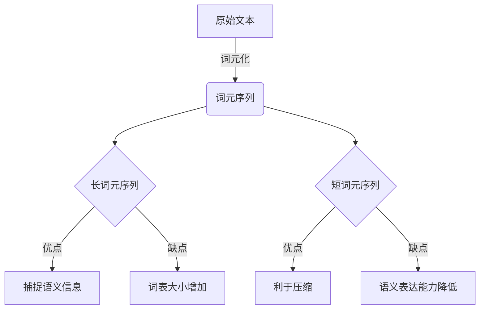
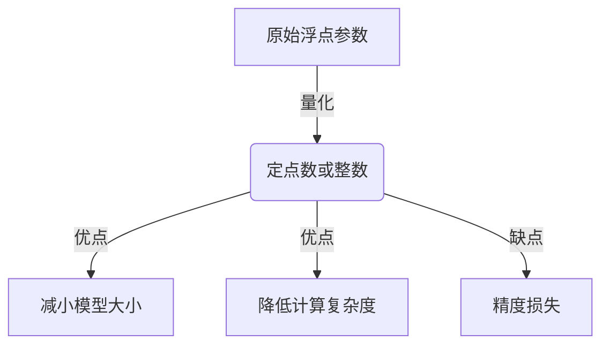
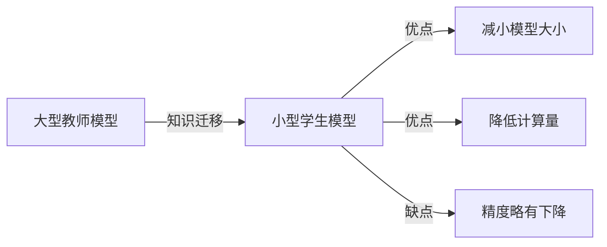
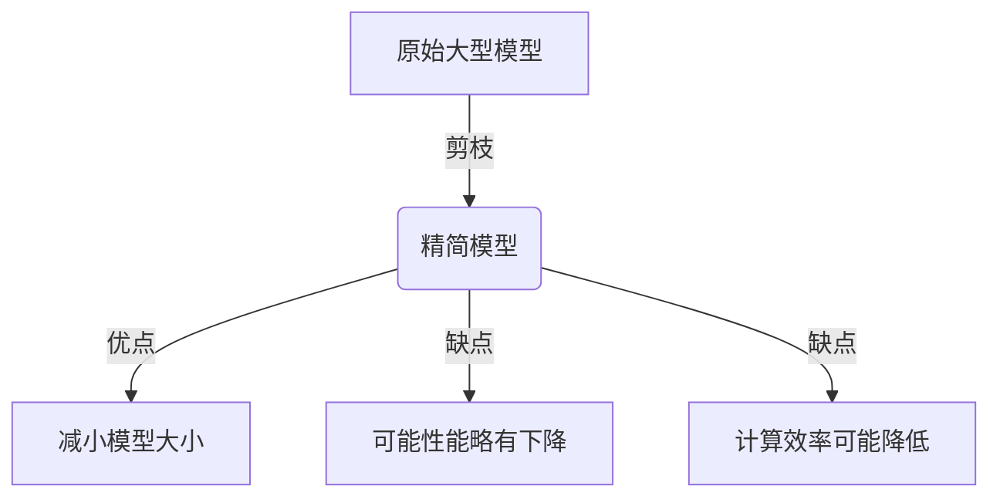
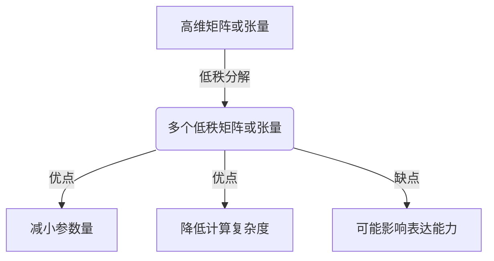

# 大语言模型应用指南：编码与无损压缩

## 1.背景介绍

### 1.1 大语言模型的兴起

近年来,大型语言模型(Large Language Models,LLMs)在自然语言处理(NLP)领域取得了令人瞩目的进展。这些模型通过在海量文本数据上进行预训练,学习了丰富的语言知识和上下文信息,从而在下游任务中展现出强大的泛化能力。

代表性的大语言模型包括GPT(Generative Pre-trained Transformer)系列、BERT(Bidirectional Encoder Representations from Transformers)、XLNet、RoBERTa等。其中,GPT-3拥有惊人的1750亿个参数,是目前最大的语言模型。这些模型在机器翻译、文本摘要、问答系统、内容生成等多个领域均取得了突破性的成果。

### 1.2 编码与无损压缩的重要性

虽然大语言模型展现出了卓越的性能,但其庞大的模型规模也带来了诸多挑战,如高昂的计算和存储成本、环境影响等。因此,如何高效地编码和压缩这些大型模型,在保证性能的同时降低资源占用,成为了一个亟待解决的问题。

有效的编码和无损压缩技术不仅可以减小模型的存储空间需求,还能加速模型的传输和部署,从而促进大语言模型在移动设备、边缘计算等资源受限环境中的应用。此外,压缩后的模型还有助于提高隐私保护和模型安全性。

## 2.核心概念与联系

### 2.1 词元化(Tokenization)

词元化是自然语言处理中一个基本而关键的步骤。它将原始文本序列分割为一系列有意义的词元(token),作为语言模型的输入。常见的词元化方法包括基于规则的方法(如空格分词)、基于词典的方法(查找预定义词表)和基于模型的子词(Subword)方法(如BytePair Encoding、WordPiece、Unigram等)。

适当的词元化方式对于语言模型的性能和压缩率都有重要影响。一般来说,较长的词元序列可以更好地捕捉语义信息,但也会增加词表大小;较短的词元序列则更利于压缩,但可能无法很好地表达复杂语义。因此,需要在这两者之间权衡。

### 2.2 参数量化(Quantization)

参数量化是一种广泛应用于神经网络压缩的技术,通过将原始的32位或16位浮点数参数量化为较低比特宽度的定点数或整数值,从而降低模型大小和计算复杂度。

对于大型语言模型,参数量化可以极大地减小模型大小,但也会带来一定的精度损失。常见的量化方法包括对称量化、非对称量化、自动量化等。此外,还可以采用层级量化(每层使用不同的量化方式)或混合量化(同层内部分通道量化,部分通道不量化)等策略,在压缩率和精度之间寻求平衡。

### 2.3 知识蒸馏(Knowledge Distillation)

知识蒸馏是一种模型压缩技术,通过将大型教师模型(teacher model)的知识迁移到小型学生模型(student model),使得学生模型在保持较高精度的同时,大幅减小了模型大小和计算量。

在语言模型领域,教师模型通常是一个大型的预训练语言模型,而学生模型则是一个相对精简的模型结构。通过设计合理的知识迁移策略(如注意力映射、隐藏状态对齐等),教师模型中蕴含的语言知识可以有效地转移到学生模型中。

### 2.4 模型剪枝(Model Pruning)

模型剪枝的目标是从原始模型中移除冗余的权重或神经元,从而得到一个精简的模型。常见的剪枝方法包括权重剪枝(如通过阈值将小权重设为0)、神经元剪枝(如根据激活值移除部分神经元)、滤波器剪枝(如移除部分卷积核)等。

对于大型语言模型,剪枝可以有效地减小模型大小,同时保持较高的性能。但过度剪枝也可能导致性能下降,因此需要合理控制剪枝率。此外,还需要注意剪枝后模型的不规则性,以避免计算效率降低。

### 2.5 低秩分解(Low-Rank Decomposition)

低秩分解是一种将高维矩阵或张量分解为多个低秩矩阵或张量的乘积的技术,从而减小参数量和计算复杂度。常见的低秩分解方法包括奇异值分解(SVD)、张量分解(如CP分解、Tucker分解等)。

在大型语言模型中,低秩分解可以应用于Transformer的注意力机制、前馈网络等模块,降低计算和存储开销。但同时也需要注意分解后模型的表达能力是否受到影响。

上述几种核心概念相互关联、互为补充,通过有机结合,可以实现大型语言模型的高效编码和无损压缩,在保持较高精度的同时,显著降低模型的存储和计算开销。

## 3.核心算法原理具体操作步骤

### 3.1 词元化算法

#### 3.1.1 BytePair Encoding (BPE)

BPE是一种基于数据驱动的子词分词算法,通过迭代地合并出现频率最高的连续字节对,最终得到一个有限的子词词表。具体步骤如下:

1. 初始化词表为字符集合
2. 在语料库中统计所有连续字节对的出现频率
3. 选择出现频率最高的字节对,将其合并为新的子词,加入词表
4. 用新的子词替换语料库中的相应字节对
5. 重复步骤2-4,直到达到预设的词表大小或其他终止条件

BPE算法可以自动发现常见的子词模式,避免了基于空格或字典的分词方法的局限性。同时,它也可以通过控制词表大小来权衡语义表达能力和压缩率。

#### 3.1.2 Unigram

Unigram是另一种基于数据驱动的子词分词算法。不同于BPE按字节对合并,Unigram是基于字符的统计语言模型,将句子分割成具有最高概率的子词序列。具体步骤如下:

1. 统计语料库中所有字符的单字符和多字符序列的出现频率
2. 根据频率估计每个子词序列的概率分布
3. 对于每个句子,使用动态规划或贪心算法找到最大化整体概率的子词分割方式

Unigram算法可以自动发现任意长度的子词模式,而不受字节对长度的限制。但它也需要更多的计算开销,尤其是在处理长句子时。

无论采用BPE还是Unigram,都需要在语料库上预先训练得到子词词表,然后将文本转换为对应的子词序列。在实践中,通常会结合其他技术(如词缓存、数据并行等)来加速分词过程。

### 3.2 参数量化算法

#### 3.2.1 对称量化

对称量化是一种简单而有效的量化方法,它将浮点数参数线性映射到一个对称的定点数或整数范围内。具体步骤如下:

1. 计算模型参数的最大绝对值$S$
2. 选择一个量化比特宽度$N$,确定量化间隔$\Delta = 2^{-N}S$
3. 对每个参数$x$,计算其量化值$\hat{x} = \text{round}(\frac{x}{S}2^{N-1})$

其中,round表示最邻近取整操作。量化后的参数$\hat{x}$是一个$N$比特的整数,可以用$N$比特来存储和计算。

对称量化的优点是简单高效,但缺点是对大小值参数的量化精度较低。此外,它还需要存储一个额外的量化尺度因子$S$。

#### 3.2.2 非对称量化

非对称量化通过分别量化参数的正、负部分,可以提高大小值参数的量化精度。具体步骤如下:

1. 计算参数的最大正值$S_p$和最大负值$S_n$
2. 选择两个量化比特宽度$N_p$和$N_n$,确定量化间隔$\Delta_p = 2^{-N_p}S_p$和$\Delta_n = 2^{-N_n}S_n$
3. 对每个正参数$x>0$,计算其量化值$\hat{x} = \text{round}(\frac{x}{S_p}2^{N_p})$
4. 对每个负参数$x<0$,计算其量化值$\hat{x} = -\text{round}(\frac{-x}{S_n}2^{N_n})$

非对称量化需要存储两个量化尺度因子$S_p$和$S_n$,以及正负参数的比特宽度信息。它可以提高量化精度,但也增加了一些开销。

#### 3.2.3 自动量化

自动量化是一种基于优化的量化方法,它通过最小化量化误差来自动确定最优的量化参数。具体步骤如下:

1. 定义量化误差损失函数$\mathcal{L}(W, \hat{W})$,其中$W$为原始参数,$\hat{W}$为量化参数
2. 初始化量化参数$\hat{W}$,包括量化比特宽度、量化间隔等
3. 通过优化算法(如随机梯度下降)最小化损失函数$\mathcal{L}(W, \hat{W})$,得到最优的量化参数$\hat{W}^*$

自动量化可以根据实际参数分布自动确定量化策略,从而获得更高的量化精度。但它也需要更多的计算开销,尤其是在大型模型中。

在实践中,常常会结合上述多种量化方法,采用层级量化或混合量化等策略,在压缩率和精度之间寻求平衡。此外,还需要注意量化后的数值表示、计算核高效实现等细节问题。

### 3.3 知识蒸馏算法

知识蒸馏的核心思想是在训练学生模型时,除了使用硬标签(one-hot编码的真实标签),还利用教师模型的软标签(logits输出的分布)作为额外的知识来指导学生模型。具体步骤如下:

1. 对于每个训练样本$x$,使用教师模型计算logits输出$z_t = f_t(x)$
2. 使用温度参数$T$对logits进行缩放,得到软标签分布$q_t = \text{softmax}(\frac{z_t}{T})$
3. 使用学生模型计算logits输出$z_s = f_s(x)$
4. 定义知识蒸馏损失函数$\mathcal{L}_{KD} =