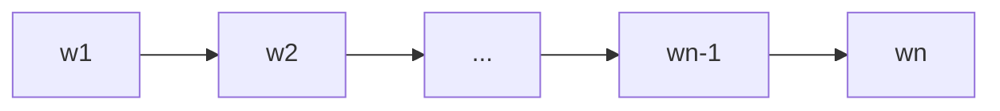

# 大语言模型应用指南：自回归与无损压缩

## 1. 背景介绍

### 1.1 大语言模型的兴起

近年来,随着深度学习技术的快速发展,大语言模型(Large Language Models, LLMs)在自然语言处理(Natural Language Processing, NLP)领域取得了突破性进展。从GPT系列到BERT,再到最新的GPT-4,LLMs展现出了惊人的语言理解和生成能力,引发了学术界和工业界的广泛关注。

### 1.2 LLMs面临的挑战

尽管LLMs取得了瞩目的成就,但仍面临着诸多挑战:

- 模型参数量巨大,训练和推理成本高昂
- 对大规模高质量语料的依赖
- 可解释性和可控性有待提高
- 缺乏常识推理和因果推理能力
- 隐私和安全风险

### 1.3 自回归与无损压缩的重要性

为了应对上述挑战,学者们提出了各种改进方案。其中,**自回归(Autoregressive)**和**无损压缩(Lossless Compression)**被认为是提升LLMs性能和效率的两大关键技术:

- 自回归赋予了LLMs强大的语言生成能力,使其能够根据上下文生成连贯、通顺的文本。
- 无损压缩则可以在不损失信息的前提下,大幅减小模型参数量和存储空间,降低计算开销。

本文将深入探讨自回归和无损压缩在LLMs中的应用,阐述其核心原理、关键算法、实践案例以及未来趋势,为LLMs的研究和应用提供参考与指导。

## 2. 核心概念与联系

### 2.1 语言模型

语言模型是一种对语言规律进行建模的方法,旨在学习单词序列的概率分布。给定一个单词序列 $S=(w_1,w_2,...,w_n)$,语言模型的目标是估计该序列出现的概率 $P(S)$。

### 2.2 自回归语言模型

自回归语言模型(Autoregressive Language Models)是一类重要的语言模型,其核心思想是利用单词的上下文信息来预测下一个单词。形式化地,给定上下文 $C=(w_1,w_2,...,w_{t-1})$,自回归语言模型的目标是估计条件概率 $P(w_t|C)$。

自回归语言模型的生成过程可以用如下的Mermaid流程图表示:

### 2.3 无损压缩

无损压缩是一种数据压缩技术,可以在不丢失原始信息的前提下减小数据的存储空间。常见的无损压缩算法有霍夫曼编码、算术编码、LZW等。将无损压缩应用于语言模型,可以显著降低模型的参数量和存储开销。

### 2.4 自回归与无损压缩的关系

自回归语言模型和无损压缩看似是两个独立的概念,但实际上有着紧密的联系:

- 自回归语言模型学习到的是单词序列的概率分布,而概率分布恰好是无损压缩的基础。
- 利用自回归语言模型对单词序列进行建模,可以得到单词的概率估计,进而指导无损压缩算法的设计。
- 通过无损压缩技术,可以在保证模型性能的同时,大幅减小自回归语言模型的参数量和存储开销。

综上,自回归和无损压缩是LLMs的两大支柱技术,二者相辅相成,协同发力,共同推动LLMs的进步与发展。

## 3. 核心算法原理与操作步骤

本节将重点介绍自回归语言模型和无损压缩的几种核心算法,并给出详细的操作步骤。

### 3.1 N-gram语言模型

N-gram语言模型是一种基于统计的自回归语言模型,其核心思想是利用单词的前N-1个单词来预测当前单词。以Bigram(N=2)为例,模型的预测公式为:

$$P(w_t|w_{t-1}) = \frac{Count(w_{t-1},w_t)}{Count(w_{t-1})}$$

其中,$Count(w_{t-1},w_t)$表示单词$w_{t-1}$和$w_t$在训练语料中共同出现的次数,$Count(w_{t-1})$表示单词$w_{t-1}$在训练语料中出现的次数。

N-gram语言模型的训练步骤如下:

1. 对训练语料进行预处理,如分词、去除停用词等。
2. 统计N-gram的频次,即$Count(w_{t-N+1},...,w_{t-1},w_t)$。
3. 计算N-gram的条件概率,即$P(w_t|w_{t-N+1},...,w_{t-1})$。
4. 使用平滑技术(如拉普拉斯平滑)来处理未登录词。

N-gram语言模型的生成步骤如下:

1. 给定初始单词序列$(w_1,w_2,...,w_{N-1})$。
2. 利用模型计算$P(w_t|w_{t-N+1},...,w_{t-1})$,生成下一个单词$w_t$。
3. 滑动窗口,更新单词序列为$(w_2,w_3,...,w_t)$。
4. 重复步骤2-3,直到生成结束。

### 3.2 RNN语言模型

RNN(Recurrent Neural Network)语言模型是一种基于神经网络的自回归语言模型,可以建模任意长度的上下文信息。以Elman RNN为例,模型的前向传播公式为:

$$h_t = \sigma(W_{hh}h_{t-1} + W_{xh}x_t + b_h)$$
$$y_t = softmax(W_{hy}h_t + b_y)$$

其中,$x_t$是第t个单词的词向量,$h_t$是t时刻的隐藏状态,$y_t$是t时刻的输出概率分布。$W$和$b$是可学习的参数矩阵和偏置项。$\sigma$是非线性激活函数(如tanh)。

RNN语言模型的训练步骤如下:

1. 随机初始化模型参数。
2. 将训练语料划分为若干个Batch。
3. 对每个Batch:
   - 前向传播,计算输出概率分布。
   - 计算损失函数(如交叉熵损失)。
   - 反向传播,计算梯度。
   - 更新模型参数。
4. 重复步骤3,直到模型收敛。

RNN语言模型的生成步骤与N-gram类似,区别在于使用RNN来计算条件概率$P(w_t|w_1,...,w_{t-1})$。

### 3.3 Transformer语言模型

Transformer语言模型(如GPT系列)是当前最先进的自回归语言模型,其核心是自注意力机制(Self-Attention)和位置编码(Positional Encoding)。

Transformer的编码器由多个自注意力层和前馈神经网络组成。自注意力的计算公式为:

$$Attention(Q,K,V) = softmax(\frac{QK^T}{\sqrt{d_k}})V$$

其中,$Q$,$K$,$V$分别是查询向量、键向量和值向量,$d_k$是键向量的维度。

Transformer语言模型的训练和生成步骤与RNN类似,区别在于使用自注意力机制来建模上下文信息。

### 3.4 霍夫曼编码

霍夫曼编码(Huffman Coding)是一种经典的无损压缩算法,其核心思想是给出现频率高的字符分配短的编码,给出现频率低的字符分配长的编码。

霍夫曼编码的操作步骤如下:

1. 统计字符的出现频率。
2. 将每个字符视为一个节点,构建Huffman树:
   - 选择频率最小的两个节点,合并为一个新节点,新节点的频率为两个子节点的频率之和。
   - 重复上一步,直到只剩一个根节点。
3. 从根节点出发,给左边的分支分配0,右边的分支分配1,得到每个字符的编码。

在LLMs中,可以利用自回归语言模型学习到的单词概率分布来构建Huffman树,从而得到单词的最优编码。

### 3.5 算术编码

算术编码(Arithmetic Coding)是另一种常用的无损压缩算法,相比霍夫曼编码,它能够以任意精度逼近信源的熵。

算术编码的核心思想是将字符序列映射到[0,1)区间内的一个实数。编码过程如下:

1. 初始化区间为[0,1)。
2. 对于每个字符:
   - 将当前区间划分为与字符概率成比例的子区间。
   - 选择与当前字符对应的子区间作为新的区间。
3. 输出最终区间内的任意一个实数作为编码结果。

解码过程则是根据编码值和字符概率反推出原始字符序列。

在LLMs中,可以利用自回归语言模型预测的单词概率来指导算术编码,实现高效的无损压缩。

## 4. 数学模型与公式推导

本节将介绍LLMs中常用的几个数学模型,并给出相关公式的推导过程。

### 4.1 Softmax函数

Softmax函数是LLMs中最常用的激活函数之一,用于将一组实数转化为概率分布。其数学定义为:

$$softmax(z_i) = \frac{e^{z_i}}{\sum_{j=1}^{K}e^{z_j}}$$

其中,$z_i$是第i个元素的值,$K$是向量的维度。

Softmax函数有如下性质:

- 单调性:$\frac{\partial softmax(z_i)}{\partial z_i} > 0$
- 归一性:$\sum_{i=1}^{K}softmax(z_i) = 1$
- 最大值敏感性:$\lim_{z_i \to +\infty}softmax(z_i)=1$

在LLMs中,Softmax函数常用于计算单词的概率分布。例如,在RNN语言模型中:

$$P(w_t|w_1,...,w_{t-1}) = softmax(W_{hy}h_t + b_y)$$

### 4.2 交叉熵损失

交叉熵损失(Cross-Entropy Loss)是LLMs中常用的损失函数,用于衡量模型预测的概率分布与真实概率分布之间的差异。其数学定义为:

$$H(p,q) = -\sum_{x}p(x)\log q(x)$$

其中,$p$是真实概率分布,$q$是模型预测的概率分布。

在LLMs的训练过程中,交叉熵损失可以写作:

$$L = -\frac{1}{N}\sum_{i=1}^{N}\sum_{t=1}^{T}\log P(w_t^{(i)}|w_1^{(i)},...,w_{t-1}^{(i)})$$

其中,$N$是训练样本数,$T$是单词序列长度,$w_t^{(i)}$是第i个样本的第t个单词。

最小化交叉熵损失等价于最大化对数似然函数:

$$\arg\max_{\theta} \frac{1}{N}\sum_{i=1}^{N}\sum_{t=1}^{T}\log P(w_t^{(i)}|w_1^{(i)},...,w_{t-1}^{(i)};\theta)$$

其中,$\theta$是模型参数。

### 4.3 注意力机制

注意力机制(Attention Mechanism)是一种用于聚焦关键信息的技术,在LLMs(尤其是Transformer)中得到广泛应用。

以自注意力为例,其数学定义为:

$$Attention(Q,K,V) = softmax(\frac{QK^T}{\sqrt{d_k}})V$$

其中,$Q$,$K$,$V$分别是查询矩阵、键矩阵和值矩阵,$d_k$是键向量的维度。

自注意力的计算过程可以解释为:

1. 计算查询向量和所有键向量之间的相似度(点积)。
2. 将相似度归一化为权重(Softmax)。
3. 将值向量按权重加权求和。

直观地说,自注意力机制可以学习到单词之间的依赖关系,捕捉长距离的上下文信息。

多头自注意力(Multi-Head Self-Attention)则是将自注意力计算多次,并将结果拼接起来:

$$MultiHead(Q,K,V) = Concat(head_1,...,head_