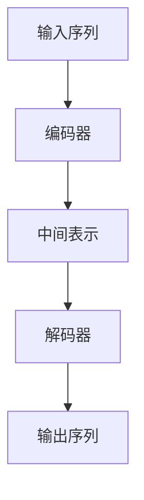
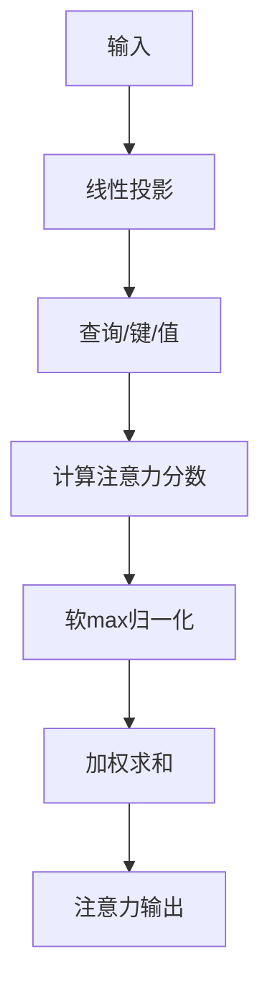
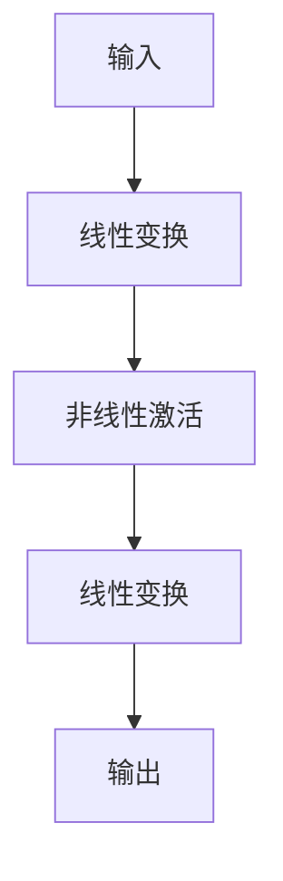

# 大语言模型进阶原理与代码实战案例讲解

## 1. 背景介绍

### 1.1 什么是大语言模型?

大语言模型(Large Language Model, LLM)是一种利用深度学习技术训练出的具有广泛知识和语言理解能力的人工智能模型。它们可以根据输入的文本,生成高度相关、语义连贯、语法正确的文本输出。

大语言模型的出现源于两个关键技术进步:

1. **海量语料训练**: 利用互联网上的大规模文本语料(如网页、书籍、维基百科等)作为训练数据源。
2. **transformer架构**: 一种革命性的注意力机制神经网络架构,能够更好地捕捉长距离依赖关系。

代表性的大语言模型包括GPT(Generative Pre-trained Transformer)系列、BERT(Bidirectional Encoder Representations from Transformers)、T5(Text-to-Text Transfer Transformer)等。

### 1.2 大语言模型的重要性

大语言模型在自然语言处理领域具有里程碑式的意义,它们展现出惊人的语言理解和生成能力,在多个任务上超越了人类水平。大语言模型的出现,推动了人工智能在自然语言处理领域的飞速发展,为众多应用场景带来了革命性的变化,例如:

- 智能对话系统
- 文本生成和摘要
- 机器翻译
- 问答系统
- 语义理解和推理
- 写作辅助和内容创作
- 代码生成等

## 2. 核心概念与联系

### 2.1 自监督预训练

大语言模型的核心思想是利用自监督学习(Self-Supervised Learning)的方式,从海量无标注语料中学习通用的语言表示。这种预训练方式不需要人工标注的数据,可以利用互联网上的大量文本资源。

常见的自监督预训练任务包括:

- **掩码语言模型(Masked Language Modeling, MLM)**: 随机掩蔽部分词,模型需要预测被掩蔽的词。
- **下一句预测(Next Sentence Prediction, NSP)**: 判断两个句子是否连贯。
- **因果语言模型(Causal Language Modeling, CLM)**: 给定前文,预测下一个词或句子。

通过这些任务,模型可以学习到丰富的语义和语法知识,形成通用的语言表示能力。

### 2.2 迁移学习与微调

预训练后的大语言模型可以通过迁移学习(Transfer Learning)的方式,在特定的下游任务上进行微调(Fine-tuning),从而获得出色的性能表现。

微调过程中,模型的大部分参数保持不变,只对最后几层的参数进行调整,使其适应特定的任务。由于大语言模型已经学习了通用的语言表示,只需要少量的任务相关数据就可以取得很好的效果。

迁移学习大大减少了数据需求和训练成本,使得大语言模型可以广泛应用于各种自然语言处理任务。

### 2.3 注意力机制

注意力机制(Attention Mechanism)是transformer架构的核心,它允许模型在处理序列数据时,动态地关注不同位置的信息。

具体来说,注意力机制通过计算查询(Query)、键(Key)和值(Value)之间的相似性分数,对序列中的每个位置赋予不同的权重。这种机制使得模型可以捕捉长距离依赖关系,有效地处理长序列输入。

注意力机制的引入极大地提高了模型的表现力,是大语言模型取得卓越成绩的关键所在。

## 3. 核心算法原理具体操作步骤

### 3.1 Transformer架构

Transformer是大语言模型的核心架构,由编码器(Encoder)和解码器(Decoder)组成。编码器将输入序列映射为中间表示,解码器则基于中间表示生成输出序列。

编码器和解码器都由多个相同的层组成,每层包含两个子层:多头注意力机制(Multi-Head Attention)和前馈神经网络(Feed-Forward Neural Network)。

#### 3.1.1 多头注意力机制

多头注意力机制是注意力机制的扩展版本,它将注意力分成多个"头"(Head),每个头对输入序列进行不同的注意力计算,然后将结果拼接起来。

具体步骤如下:

1. 线性投影: 将输入分别映射到查询(Query)、键(Key)和值(Value)空间。
2. 计算注意力分数: 对每个头,计算查询和所有键的点积,除以缩放因子,得到注意力分数。
3. 软max归一化: 对注意力分数进行softmax操作,得到注意力权重。
4. 加权求和: 将注意力权重与值相乘,再对所有头进行拼接和线性变换,得到注意力输出。

多头注意力机制可以从不同的子空间捕捉不同的相关性,提高了模型的表现力。

#### 3.1.2 前馈神经网络

前馈神经网络是transformer的另一个核心组件,它对序列的每个位置进行独立的非线性变换。

具体步骤如下:

1. 线性变换: 将输入映射到一个更高维的空间。
2. 非线性激活: 对线性变换的结果应用非线性激活函数(如ReLU)。
3. 另一个线性变换: 将激活后的结果映射回输入的维度。

前馈神经网络为transformer增加了非线性变换能力,有助于捕捉更复杂的特征。

#### 3.1.3 残差连接和层归一化

为了加速训练并提高模型性能,transformer还采用了残差连接(Residual Connection)和层归一化(Layer Normalization)。

残差连接将子层的输入直接加到输出上,有助于梯度传播和避免梯度消失。层归一化则对每一层的输出进行归一化,加速收敛并提高泛化能力。

### 3.2 自监督预训练

大语言模型通常采用自监督的方式进行预训练,利用海量无标注语料学习通用的语言表示。常见的预训练任务包括:

#### 3.2.1 掩码语言模型(MLM)

MLM任务的目标是预测被随机掩蔽的词。具体步骤如下:

1. 随机选择输入序列中的一些词,并用特殊的[MASK]标记替换。
2. 将带有掩码的序列输入transformer模型。
3. 模型需要预测被掩码位置的原始词。
4. 使用交叉熵损失函数优化模型参数。

通过MLM任务,模型可以学习到双向的语境信息,捕捉词与词之间的关系。

#### 3.2.2 下一句预测(NSP)

NSP任务的目标是判断两个句子是否为连续的句子对。具体步骤如下:

1. 将两个句子拼接为一个序列,中间用特殊的[SEP]标记分隔。
2. 在序列开头添加一个[CLS]标记,用于分类任务。
3. 将序列输入transformer模型。
4. 模型需要预测[CLS]标记处的输出,判断两个句子是否连贯。
5. 使用二分类损失函数优化模型参数。

NSP任务有助于模型学习句子之间的逻辑关系和语义连贯性。

#### 3.2.3 因果语言模型(CLM)

CLM任务的目标是给定前文,预测下一个词或句子。具体步骤如下:

1. 将输入序列输入transformer的解码器。
2. 对于每个位置,模型需要预测下一个词或句子。
3. 使用交叉熵损失函数优化模型参数。

CLM任务可以让模型学习到单向的语言模式,常用于文本生成等任务。

通过上述自监督预训练任务,大语言模型可以从海量语料中学习到丰富的语义和语法知识,形成通用的语言表示能力。

### 3.3 迁移学习与微调

预训练后的大语言模型可以通过迁移学习的方式,在特定的下游任务上进行微调,从而获得出色的性能表现。

微调过程中,模型的大部分参数保持不变,只对最后几层或者特定的层进行调整,使其适应特定的任务。由于大语言模型已经学习了通用的语言表示,只需要少量的任务相关数据就可以取得很好的效果。

以文本分类任务为例,微调步骤如下:

1. 准备标注好的文本分类数据集。
2. 将输入文本序列化,并添加特殊标记([CLS]和[SEP])。
3. 将序列输入预训练的transformer模型。
4. 使用[CLS]标记处的输出,通过一个分类头(Classification Head)进行分类预测。
5. 使用分类损失函数(如交叉熵损失)优化模型参数。
6. 在验证集上评估模型性能,选择最优模型。

通过迁移学习和微调,大语言模型可以在各种自然语言处理任务上发挥出色的性能,同时大大减少了数据需求和训练成本。

## 4. 数学模型和公式详细讲解举例说明

### 4.1 注意力机制

注意力机制是transformer的核心,它允许模型在处理序列数据时,动态地关注不同位置的信息。

给定一个查询(Query) $q$、一组键(Key) $K=\{k_1, k_2, \dots, k_n\}$和一组值(Value) $V=\{v_1, v_2, \dots, v_n\}$,注意力机制的计算过程如下:

1. 计算查询和每个键的相似性分数:

$$\text{score}(q, k_i) = \frac{q \cdot k_i}{\sqrt{d_k}}$$

其中 $d_k$ 是键的维度,用于缩放点积的值,防止过大或过小。

2. 对相似性分数进行softmax归一化,得到注意力权重:

$$\alpha_i = \text{softmax}(\text{score}(q, k_i)) = \frac{\exp(\text{score}(q, k_i))}{\sum_{j=1}^n \exp(\text{score}(q, k_j))}$$

3. 将注意力权重与值相乘,得到加权和作为注意力输出:

$$\text{attn}(q, K, V) = \sum_{i=1}^n \alpha_i v_i$$

注意力机制通过计算查询和键的相似性,动态地为每个值赋予不同的权重,从而捕捉序列中不同位置的相关信息。

### 4.2 多头注意力机制

多头注意力机制是注意力机制的扩展版本,它将注意力分成多个"头"(Head),每个头对输入序列进行不同的注意力计算,然后将结果拼接起来。

具体来说,给定查询(Query) $Q$、键(Key) $K$和值(Value) $V$,以及头数 $h$,多头注意力机制的计算过程如下:

1. 线性投影:

$$\begin{aligned}
Q_i &= QW_i^Q & \text{for } i=1, \dots, h \\
K_i &= KW_i^K & \text{for } i=1, \dots, h \\
V_i &= VW_i^V & \text{for } i=1, \dots, h
\end{aligned}$$

其中 $W_i^Q$、$W_i^K$、$W_i^V$ 是可学习的线性变换矩阵。

2. 对每个头进行注意力计算:

$$\text{head}_i = \text{attn}(Q_i, K_i, V_i)$$

3. 拼接所有头的输出:

$$\text{MultiHead}(Q, K, V) = \text{Concat}(\text{head}_1, \dots, \text{head}_h)W^O$$

其中 $W^O$ 是另一个可学习的线性变换矩阵,用于将拼接后的向量映射回模型的维度。

多头注意力机制允许模型从不同的子空间捕