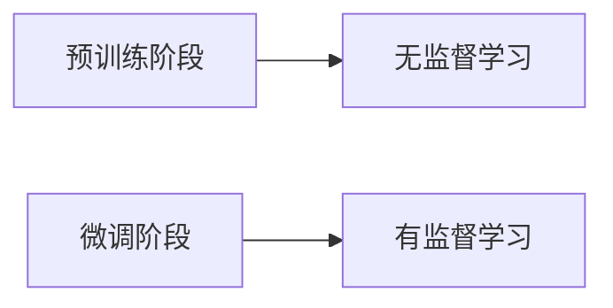

## 1.背景介绍

随着人工智能的快速发展，自然语言处理（NLP）已经成为了AI领域的重要分支。NLP的目标是让计算机能够理解、处理和生成人类语言，这对于提高人机交互的效率和质量具有重要意义。然而，传统的NLP方法主要依赖于规则和模板，这在一定程度上限制了其处理复杂语言问题的能力。近年来，大规模预训练模型（LLM）的出现，为NLP的发展带来了新的可能。

## 2.核心概念与联系

LLM是一种基于深度学习的模型，通过在大规模语料库上进行无监督学习，可以学习到丰富的语言知识，从而在各种NLP任务上取得了显著的效果。其中，BERT、GPT等模型就是LLM的代表。LLM的关键在于其能够学习到词语之间的深层次关系，这对于理解和生成自然语言至关重要。

## 3.核心算法原理具体操作步骤

LLM的训练过程主要包括两个步骤：预训练和微调。预训练阶段，模型在大规模语料库上进行无监督学习，学习到语言的基本知识；微调阶段，模型在特定任务的数据上进行有监督学习，使其能够更好地完成该任务。



## 4.数学模型和公式详细讲解举例说明

LLM的数学模型主要包括词嵌入和Transformer结构。词嵌入是将词语映射到高维空间的方法，其中相似的词语会被映射到相近的位置。Transformer结构则是一种自注意力机制，可以捕捉到句子中的长距离依赖关系。

词嵌入的数学模型可以表示为：

$$ E = f(W, C) $$

其中，$E$表示词嵌入，$W$表示词语，$C$表示上下文。

Transformer的数学模型可以表示为：

$$ H = Attention(Q, K, V) $$

其中，$H$表示输出，$Q$、$K$、$V$分别表示查询、键和值。

## 5.项目实践：代码实例和详细解释说明

以下是使用BERT进行文本分类的代码示例：

```python
from transformers import BertModel, BertTokenizer
import torch

# 初始化
tokenizer = BertTokenizer.from_pretrained('bert-base-uncased')
model = BertModel.from_pretrained('bert-base-uncased')

# 输入处理
inputs = tokenizer("Hello, my dog is cute", return_tensors="pt")
outputs = model(**inputs)

# 输出处理
logits = outputs.last_hidden_state
```

## 6.实际应用场景

LLM在许多NLP任务中都有广泛的应用，包括但不限于：文本分类、情感分析、命名实体识别、问答系统、机器翻译等。

## 7.工具和资源推荐

- Hugging Face Transformers：提供了丰富的预训练模型和相关工具，是进行NLP任务的重要资源。
- TensorFlow和PyTorch：这两个深度学习框架都提供了对LLM的支持，可以根据自己的需求选择使用。

## 8.总结：未来发展趋势与挑战

LLM为NLP的发展带来了新的可能，但同时也面临着一些挑战，包括模型的可解释性、训练成本、数据安全等问题。未来，我们期待有更多的研究能够解决这些问题，推动NLP的进一步发展。

## 9.附录：常见问题与解答

Q: LLM的训练需要多少数据？
A: LLM的训练需要大量的数据，通常是数十亿甚至数百亿的词语。

Q: LLM的训练需要多少时间？
A: LLM的训练需要大量的时间和计算资源，通常需要数周甚至数月的时间。

作者：禅与计算机程序设计艺术 / Zen and the Art of Computer Programming