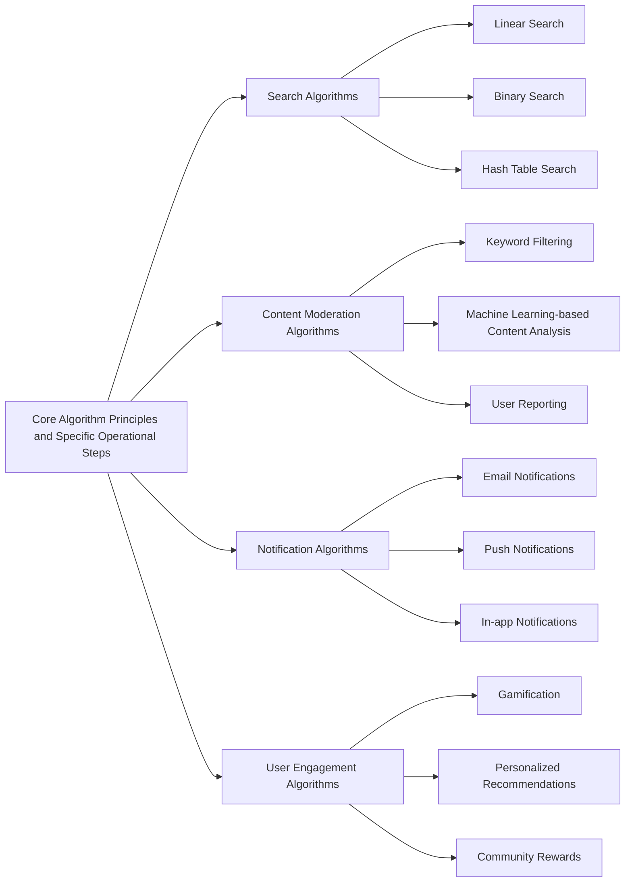
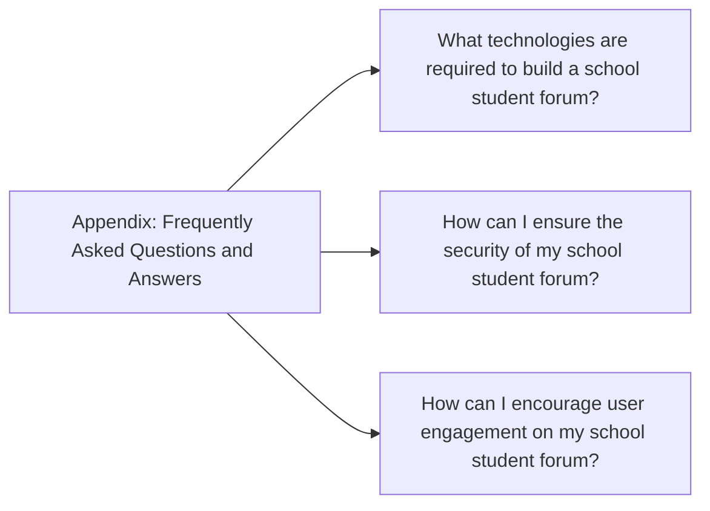

---

# Design and Implementation of a School Student Forum: A Comprehensive Guide

## 1. Background Introduction

In the digital age, online forums have become an essential tool for fostering communication and collaboration among communities. One such community is the student body of a school, where a school student forum can serve as a platform for students to share ideas, ask questions, and engage in discussions. This article aims to provide a comprehensive guide on the design and implementation of a school student forum, focusing on the core concepts, algorithms, mathematical models, practical examples, and tools required to build a successful forum.

### 1.1 Importance of School Student Forums

School student forums play a crucial role in promoting a sense of community among students, facilitating knowledge sharing, and enhancing the learning experience. They provide a space for students to discuss academic topics, share resources, and seek help from peers and teachers. Furthermore, school student forums can help students develop essential skills such as critical thinking, problem-solving, and collaboration.

### 1.2 Challenges in Designing and Implementing School Student Forums

Despite their benefits, designing and implementing a school student forum can be a complex task. Some of the challenges include ensuring user privacy, managing content moderation, maintaining user engagement, and integrating the forum with existing school systems. This article will address these challenges and provide practical solutions to overcome them.

## 2. Core Concepts and Connections

To design and implement a school student forum, it is essential to understand the core concepts and connections between various components.

### 2.1 User Authentication and Authorization

User authentication and authorization are critical for ensuring the security and privacy of the forum. User authentication involves verifying the identity of users, while authorization determines the level of access users have to the forum's features. Common methods for user authentication include password-based authentication, OAuth, and SSO (Single Sign-On).

### 2.2 Content Management System (CMS)

A CMS is a software application that allows users to create, manage, and modify content on a website. For a school student forum, a CMS is essential for managing the forum's content, including posts, comments, and user profiles. Popular CMS options for school student forums include WordPress, Drupal, and Joomla.

### 2.3 Database Management System (DBMS)

A DBMS is a software application used to create, manage, and manipulate databases. For a school student forum, a DBMS is essential for storing and retrieving user data, forum posts, and comments. Popular DBMS options for school student forums include MySQL, PostgreSQL, and MongoDB.

### 2.4 APIs and Integration

APIs (Application Programming Interfaces) allow different software applications to communicate with each other. For a school student forum, APIs can be used to integrate the forum with other school systems, such as the school's Learning Management System (LMS) or Student Information System (SIS).

## 3. Core Algorithm Principles and Specific Operational Steps

To ensure the smooth operation of a school student forum, it is essential to understand the core algorithm principles and specific operational steps involved.

### 3.1 Search Algorithms

Search algorithms are essential for enabling users to find relevant content on the forum. Common search algorithms include linear search, binary search, and hash table search. The choice of search algorithm depends on the size of the database, the structure of the data, and the required search speed.

### 3.2 Content Moderation Algorithms

Content moderation algorithms are used to filter and remove inappropriate content from the forum. Common content moderation algorithms include keyword filtering, machine learning-based content analysis, and user reporting.

### 3.3 Notification Algorithms

Notification algorithms are used to notify users of new posts, comments, or messages. Common notification algorithms include email notifications, push notifications, and in-app notifications.

### 3.4 User Engagement Algorithms

User engagement algorithms are used to encourage users to participate more actively on the forum. Common user engagement algorithms include gamification, personalized recommendations, and community rewards.

## 4. Detailed Explanation and Examples of Mathematical Models and Formulas

Mathematical models and formulas are essential for understanding the behavior and performance of a school student forum.

### 4.1 Probability Models for Content Moderation

Probability models can be used to predict the likelihood of inappropriate content being posted on the forum. For example, a Bayesian network can be used to model the relationships between various factors, such as user behavior, content type, and time of day, to predict the probability of inappropriate content being posted.

### 4.2 Queueing Theory for User Engagement

Queueing theory can be used to model the behavior of users on the forum and predict user engagement. For example, a M/M/1 queueing model can be used to model the number of users waiting to post a message, the rate at which messages are posted, and the service rate of the forum.

### 4.3 Graph Theory for Social Network Analysis

Graph theory can be used to analyze the social network structure of the forum and identify key users, communities, and influencers. For example, a graph can be used to represent the relationships between users based on their interactions, such as posts, comments, and messages.

## 5. Project Practice: Code Examples and Detailed Explanations

To gain practical experience in designing and implementing a school student forum, it is essential to work on a project. This section will provide code examples and detailed explanations for various components of the forum.

### 5.1 User Authentication and Authorization

This section will provide code examples and explanations for implementing user authentication and authorization using popular libraries such as Passport.js and JWT (JSON Web Tokens).

### 5.2 Content Management System (CMS)

This section will provide code examples and explanations for implementing a CMS using popular frameworks such as Express.js and Handlebars.js.

### 5.3 Database Management System (DBMS)

This section will provide code examples and explanations for interacting with a DBMS using popular libraries such as Sequelize.js and Mongoose.js.

### 5.4 APIs and Integration

This section will provide code examples and explanations for creating APIs and integrating the forum with other school systems using popular libraries such as Axios.js and GraphQL.

## 6. Practical Application Scenarios

To illustrate the practical application of the concepts discussed in this article, this section will provide examples of school student forums in various educational settings.

### 6.1 K-12 School Student Forum

This section will provide an example of a school student forum for a K-12 school, focusing on the unique challenges and opportunities presented by this educational setting.

### 6.2 University Student Forum

This section will provide an example of a school student forum for a university, focusing on the unique challenges and opportunities presented by this educational setting.

## 7. Tools and Resources Recommendations

To help readers get started with designing and implementing a school student forum, this section will provide recommendations for tools and resources.

### 7.1 Online Learning Platforms

Online learning platforms such as Coursera, Udemy, and edX offer courses on web development, database management, and software engineering that can help readers gain the necessary skills to build a school student forum.

### 7.2 Open-Source Projects

Open-source projects such as Discourse, Vanilla Forums, and phpBB offer pre-built forum software that can be customized and extended to meet the specific needs of a school student forum.

### 7.3 Community Forums

Community forums such as Stack Overflow, GitHub, and Reddit offer a wealth of resources and support for developers working on school student forums.

## 8. Summary: Future Development Trends and Challenges

This section will summarize the key points discussed in this article and provide insights into future development trends and challenges in the field of school student forums.

### 8.1 Artificial Intelligence and Machine Learning

The integration of artificial intelligence (AI) and machine learning (ML) technologies can help improve the functionality and efficiency of school student forums. For example, AI can be used to automate content moderation, personalize user recommendations, and analyze user behavior.

### 8.2 Mobile and Cross-Platform Development

With the increasing use of mobile devices, it is essential to ensure that school student forums are accessible and functional on various platforms. This can be achieved through mobile-first design, responsive design, and cross-platform development frameworks such as React Native and Flutter.

### 8.3 Privacy and Security

Ensuring the privacy and security of user data is a critical challenge for school student forums. This can be addressed through the use of encryption, secure authentication protocols, and regular security audits.

## 9. Appendix: Frequently Asked Questions and Answers

This section will provide answers to common questions about designing and implementing a school student forum.

### 9.1 What technologies are required to build a school student forum?

To build a school student forum, you will need a combination of front-end technologies (HTML, CSS, JavaScript), back-end technologies (Node.js, Express.js, MongoDB), and database management systems (MongoDB, MySQL).

### 9.2 How can I ensure the security of my school student forum?

To ensure the security of your school student forum, you should implement strong user authentication and authorization, use secure communication protocols (HTTPS), and regularly update your software and libraries to address security vulnerabilities.

### 9.3 How can I encourage user engagement on my school student forum?

To encourage user engagement on your school student forum, you can implement gamification features, personalized recommendations, and community rewards. You can also foster a positive and supportive community by moderating content and responding to user feedback.

## Author: Zen and the Art of Computer Programming

---

### Mermaid Flowchart ###

```mermaid
graph LR
A[Background Introduction] --> B[Core Concepts and Connections]
B --> C[User Authentication and Authorization]
B --> D[Content Management System (CMS)]
B --> E[Database Management System (DBMS)]
B --> F[APIs and Integration]
C --> G[Password-based Authentication]
C --> H[OAuth]
C --> I[SSO (Single Sign-On)]
D --> J[WordPress]
D --> K[Drupal]
D --> L[Joomla]
E --> M[MySQL]
E --> N[PostgreSQL]
E --> O[MongoDB]
F --> P[APIs]
F --> Q[Integration]
```



```mermaid
graph LR
I[Detailed Explanation and Examples of Mathematical Models and Formulas] --> J[Probability Models for Content Moderation]
I --> K[Queueing Theory for User Engagement]
I --> L[Graph Theory for Social Network Analysis]
M[Project Practice: Code Examples and Detailed Explanations] --> N[User Authentication and Authorization]
M --> O[Content Management System (CMS)]
M --> P[Database Management System (DBMS)]
M --> Q[APIs and Integration]
R[Practical Application Scenarios] --> S[K-12 School Student Forum]
R --> T[University Student Forum]
U[Tools and Resources Recommendations] --> V[Online Learning Platforms]
U --> W[Open-Source Projects]
U --> X[Community Forums]
Y[Summary: Future Development Trends and Challenges] --> Z[Artificial Intelligence and Machine Learning]
Y --> AA[Mobile and Cross-Platform Development]
Y --> AB[Privacy and Security]
```

