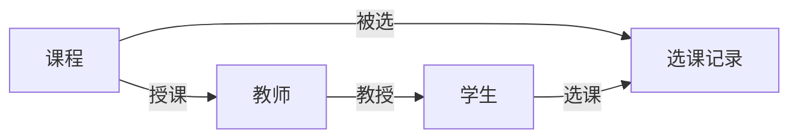

## 1.背景介绍

在现代教育环境中，学生在线选课系统的需求日益增长。这种系统能够为学生提供更高效、更方便的课程选择服务。随着技术的发展，我们有机会构建一个更强大、更灵活的在线选课系统，以满足各种学习需求。

## 2.核心概念与联系

在线选课系统的核心概念包括课程、学生、教师、选课记录等。这些概念之间的联系形成了系统的基本框架。

- 课程：课程是在线选课系统的核心。每个课程都有一个唯一的课程编号、课程名称、教师、上课时间等信息。
- 学生：学生是在线选课系统的用户。每个学生都有一个唯一的学号、姓名、所选课程等信息。
- 教师：教师是课程的授课者。每个教师都有一个唯一的教师编号、姓名、所授课程等信息。
- 选课记录：选课记录是学生选课的记录。每个选课记录都有一个唯一的记录编号、学号、课程编号等信息。

这些核心概念之间的联系可以通过 Mermaid 流程图来展示：



## 3.核心算法原理具体操作步骤

在线选课系统的核心算法主要包括课程搜索算法、选课算法和冲突检测算法。

- 课程搜索算法：学生可以通过课程名称、教师名称、上课时间等信息来搜索课程。这需要一个高效的搜索算法来快速返回搜索结果。
- 选课算法：学生选课时，系统需要检查选课记录，确保学生没有重复选课，同时检查课程容量，确保课程没有超额。
- 冲突检测算法：学生选课时，系统需要检查学生的课程表，确保新选的课程不会与已选的课程时间冲突。

## 4.数学模型和公式详细讲解举例说明

在设计在线选课系统时，我们可以使用图论来建立数学模型。

假设我们有一个课程集合 $C = \{c_1, c_2, ..., c_n\}$，学生集合 $S = \{s_1, s_2, ..., s_m\}$，我们可以构建一个二分图 $G = (C \cup S, E)$，其中边集 $E = \{(c_i, s_j) | 学生s_j选择了课程c_i\}$。

在这个模型中，选课算法可以转化为在二分图中找增广路径的问题，冲突检测算法可以转化为在二分图中检查是否存在环的问题。

## 5.项目实践：代码实例和详细解释说明

在实际项目中，我们可以使用 Python 的 Django 框架来实现在线选课系统。以下是一些核心代码示例：

```python
# models.py
from django.db import models

class Course(models.Model):
    name = models.CharField(max_length=100)
    teacher = models.ForeignKey(Teacher, on_delete=models.CASCADE)
    # ...

class Student(models.Model):
    name = models.CharField(max_length=100)
    courses = models.ManyToManyField(Course, through='Enrollment')
    # ...

class Enrollment(models.Model):
    student = models.ForeignKey(Student, on_delete=models.CASCADE)
    course = models.ForeignKey(Course, on_delete=models.CASCADE)
    # ...

# views.py
from django.shortcuts import render
from .models import Course, Student, Enrollment

def enroll(request, student_id, course_id):
    student = Student.objects.get(pk=student_id)
    course = Course.objects.get(pk=course_id)
    Enrollment.objects.create(student=student, course=course)
    return render(request, 'enroll.html')
```

## 6.实际应用场景

在线选课系统可以应用于各种教育场景，如大学、高中、职业培训等。它可以帮助学生更方便地选择课程，帮助教师更方便地管理课程，提高教育效率。

## 7.工具和资源推荐

- Python：一种广泛用于Web开发的编程语言。
- Django：一个强大的Python Web框架。
- MySQL：一个开源的关系型数据库管理系统。

## 8.总结：未来发展趋势与挑战

随着技术的发展，未来的在线选课系统将会更加智能化。例如，系统可以根据学生的学习记录和兴趣推荐课程，可以自动调整课程表以避免时间冲突。然而，这也带来了新的挑战，如如何保护学生的隐私，如何处理大量的数据。

## 9.附录：常见问题与解答

1. Q：如何处理选课冲突？
   A：在学生选课时，系统会检查新选的课程与已选的课程是否有时间冲突。如果有冲突，系统会提示学生并拒绝选课。

2. Q：如何保证课程质量？
   A：课程的质量主要由教师保证。系统可以提供课程评价功能，让学生对课程和教师进行评价，以提高课程质量。

作者：禅与计算机程序设计艺术 / Zen and the Art of Computer Programming