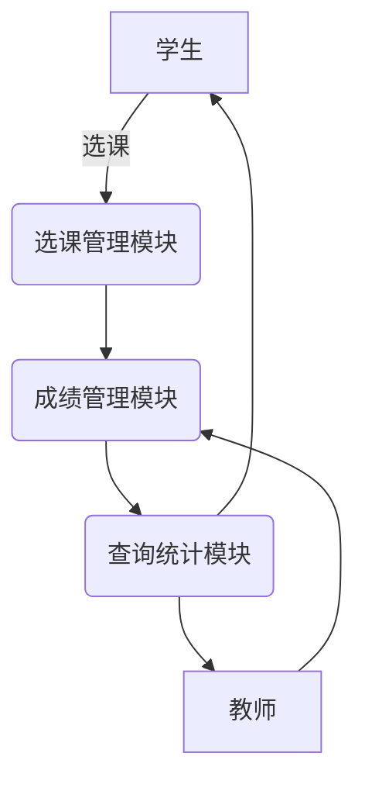

# 学生课程与成绩管理系统详细设计与具体代码实现

## 1. 背景介绍

### 1.1 系统概述

随着教育事业的不断发展,高校教学管理工作日益繁重,传统的手工管理方式已经无法满足现代化教学管理的需求。为了提高教学管理的效率,实现教学资源的合理利用,构建一套完善的学生课程与成绩管理系统势在必行。该系统旨在为学校的教务管理部门提供一个高效、方便、安全的平台,用于管理学生的课程选课、成绩录入等工作,同时也为学生提供了查询个人课程和成绩的渠道。

### 1.2 系统重要性

学生课程与成绩管理系统是现代高校教务管理工作的重要组成部分,对于规范教学管理流程、提高工作效率、减轻工作人员负担具有重要意义。同时,该系统也为学生提供了便捷的自助服务,有利于加强学生对自身学习情况的了解,促进学生的自我管理能力。

### 1.3 系统功能模块

学生课程与成绩管理系统主要包括以下几个功能模块:

- 课程管理模块:用于管理学校开设的所有课程信息,包括课程编号、课程名称、学分、任课教师等。
- 学生管理模块:用于管理在校学生的基本信息,如学号、姓名、所属院系等。
- 选课管理模块:允许学生在规定时间内根据自身情况选择修读课程,并对选课结果进行审核。
- 成绩管理模块:任课教师可以在此模块录入学生的课程成绩,并对成绩进行修改和查询。
- 查询统计模块:提供多种查询方式,如按学号、课程名称等条件查询学生的课程和成绩信息,并可以生成相关统计报表。

## 2. 核心概念与联系

### 2.1 实体关系模型

实体关系模型(Entity-Relationship Model)是数据库设计中常用的概念模型,用于描述现实世界中的实体类型及其之间的联系。在学生课程与成绩管理系统中,主要涉及以下几个核心实体:

- 学生(Student)实体:描述学生的基本信息,如学号、姓名、性别、所属院系等。
- 课程(Course)实体:描述课程的详细信息,如课程编号、课程名称、学分、任课教师等。
- 选课(Selection)实体:记录学生选择修读的课程情况。
- 成绩(Score)实体:记录学生在特定课程上的成绩信息。

这些实体之间存在以下关联关系:

- 学生与选课之间是一对多关系,一个学生可以选择多门课程。
- 课程与选课之间也是一对多关系,一门课程可以被多个学生选择。
- 选课与成绩之间是一对一关系,每个选课记录对应一个成绩记录。

实体关系模型有助于清晰地描述系统中的数据结构,为后续数据库设计和系统实现奠定基础。

### 2.2 数据流程图

数据流程图(Data Flow Diagram)是结构化分析与设计方法中常用的工具,用于描述系统的数据流动过程。在学生课程与成绩管理系统中,主要的数据流程如下:



1. 学生通过选课管理模块进行选课操作,将选课数据流向该模块。
2. 选课管理模块将审核通过的选课数据传递给成绩管理模块。
3. 教师通过成绩管理模块录入学生的课程成绩。
4. 成绩管理模块将成绩数据传递给查询统计模块。
5. 查询统计模块可以为学生和教师提供课程、成绩查询和统计报表服务。

数据流程图清晰地展示了系统中数据的流动路径,有助于理解系统的整体运作过程。

## 3. 核心算法原理具体操作步骤

### 3.1 选课算法

选课算法是选课管理模块的核心部分,用于处理学生的选课请求,并根据一定规则进行审核。常见的选课算法包括:

1. **先到先得算法**:按照学生提交选课请求的时间顺序,在课程余量允许的情况下,依次满足学生的选课需求。
2. **优先级算法**:根据预先设定的优先级规则(如学生年级、绩点等),按优先级从高到低的顺序满足学生的选课需求。
3. **随机算法**:在课程余量有限的情况下,随机选取部分学生满足其选课需求。

无论采用何种算法,都需要考虑课程余量、学生已修学分数、选课时间窗口等因素,以确保选课过程的公平性和合理性。

以先到先得算法为例,其具体操作步骤如下:

1. 获取学生的选课请求,包括学生ID和所选课程ID。
2. 检查该生是否已经修读过该门课程,若是则拒绝选课请求。
3. 检查该门课程的余量是否足够,若足够则执行步骤4,否则拒绝选课请求。
4. 更新该门课程的余量,减去1个名额。
5. 在选课表中插入一条新记录,记录该生选择该门课程的情况。
6. 返回选课结果(成功或失败)给学生。

### 3.2 成绩计算算法

成绩计算算法用于根据学生在不同课程环节的表现,计算出最终的课程成绩。常见的成绩计算方式包括:

1. **加权平均算法**:根据课程各个环节(如平时成绩、期中考试、期末考试等)的权重,计算加权平均值作为最终成绩。
2. **满分制算法**:将各个环节的分数换算到满分制下,取最高分作为最终成绩。
3. **等级分数算法**:根据学生在各个环节的表现,给予相应的等级分数,最后将等级分数换算为最终成绩。

以加权平均算法为例,其具体操作步骤如下:

1. 获取课程各个环节的权重,如平时成绩权重20%、期中考试权重30%、期末考试权重50%。
2. 获取学生在各个环节的原始分数。
3. 将各个环节的原始分数乘以相应的权重,得到加权分数。
4. 将所有加权分数相加,得到总加权分数。
5. 根据总加权分数和满分值,换算得到最终成绩。

例如,若一门课程满分为100分,某生平时成绩为80分、期中考试为75分、期末考试为90分,则最终成绩计算过程如下:

$$
\begin{aligned}
\text{平时成绩加权分数} &= 80 \times 0.2 = 16 \\
\text{期中考试加权分数} &= 75 \times 0.3 = 22.5 \\
\text{期末考试加权分数} &= 90 \times 0.5 = 45 \\
\text{总加权分数} &= 16 + 22.5 + 45 = 83.5 \\
\text{最终成绩} &= \frac{83.5}{100} \times 100 = 83.5
\end{aligned}
$$

因此,该生在该门课程的最终成绩为83.5分。

## 4. 数学模型和公式详细讲解举例说明

在学生课程与成绩管理系统中,数学模型和公式主要应用于成绩计算和统计分析等方面。

### 4.1 成绩计算公式

如前所述,加权平均算法是一种常见的成绩计算方法,其公式如下:

$$
\text{最终成绩} = \sum_{i=1}^{n} w_i \times s_i
$$

其中,
- $n$ 表示课程环节的总数;
- $w_i$ 表示第 $i$ 个环节的权重,且 $\sum_{i=1}^{n} w_i = 1$;
- $s_i$ 表示学生在第 $i$ 个环节的原始分数。

例如,若一门课程共有三个环节,权重分别为20%、30%和50%,某生在这三个环节的原始分数分别为80、75和90,则该生的最终成绩计算过程如下:

$$
\begin{aligned}
\text{最终成绩} &= 0.2 \times 80 + 0.3 \times 75 + 0.5 \times 90 \\
                &= 16 + 22.5 + 45 \\
                &= 83.5
\end{aligned}
$$

### 4.2 绩点计算公式

绩点(Grade Point)是衡量学生学习质量的一种重要指标,通常采用加权平均的方式计算。其公式如下:

$$
\text{绩点} = \frac{\sum_{i=1}^{n} g_i \times c_i}{\sum_{i=1}^{n} c_i}
$$

其中,
- $n$ 表示学生修读课程的总数;
- $g_i$ 表示第 $i$ 门课程的绩点,通常根据成绩等级确定;
- $c_i$ 表示第 $i$ 门课程的学分数。

例如,某生修读了三门课程,分别获得了4.0、3.5和2.5的绩点,对应的学分数分别为3、2和4,则该生的绩点计算过程如下:

$$
\begin{aligned}
\text{绩点} &= \frac{4.0 \times 3 + 3.5 \times 2 + 2.5 \times 4}{3 + 2 + 4} \\
            &= \frac{12 + 7 + 10}{9} \\
            &= \frac{29}{9} \\
            &= 3.22
\end{aligned}
$$

### 4.3 统计分析公式

在查询统计模块中,常常需要对学生的成绩数据进行统计分析,以了解整体学习情况。常见的统计指标包括平均分、标准差、最高分、最低分等。

1. **平均分**

平均分的计算公式如下:

$$
\overline{x} = \frac{\sum_{i=1}^{n} x_i}{n}
$$

其中,
- $n$ 表示样本数量;
- $x_i$ 表示第 $i$ 个样本的值。

2. **标准差**

标准差用于衡量数据的离散程度,计算公式如下:

$$
\sigma = \sqrt{\frac{\sum_{i=1}^{n} (x_i - \overline{x})^2}{n}}
$$

其中,
- $n$ 表示样本数量;
- $x_i$ 表示第 $i$ 个样本的值;
- $\overline{x}$ 表示样本的平均值。

3. **最高分和最低分**

最高分和最低分是直观反映成绩分布的重要指标,可以通过简单的比较操作获得。

例如,对某门课程的所有学生成绩进行统计分析,样本数据如下:

```
85, 92, 78, 66, 90, 75, 88, 72, 81, 95
```

则平均分、标准差、最高分和最低分分别为:

$$
\begin{aligned}
\overline{x} &= \frac{85 + 92 + 78 + 66 + 90 + 75 + 88 + 72 + 81 + 95}{10} = 82.2 \\
\sigma &= \sqrt{\frac{(85 - 82.2)^2 + (92 - 82.2)^2 + \cdots + (95 - 82.2)^2}{10}} \approx 8.76 \\
\text{最高分} &= 95 \\
\text{最低分} &= 66
\end{aligned}
$$

通过这些统计指标,教师可以全面了解学生的学习情况,并针对性地采取相应的教学措施。

## 5. 项目实践:代码实例和详细解释说明

在本节中,我们将提供一些核心代码实例,并对其进行详细的解释说明,以帮助读者更好地理解学生课程与成绩管理系统的实现细节。

### 5.1 数据库设计

首先,我们需要设计系统所需的数据库表结构。以下是一个简化的示例:

```sql
-- 学生表
CREATE TABLE Student (
    StudentID INT PRIMARY KEY,
    Name VARCHAR(50) NOT NULL,
    Gender CHAR(1) NOT NULL,
    Department VARCHAR(50) NOT NULL
);

-- 课程表
CREATE TABLE Course (
    CourseID INT PRIMARY KEY,