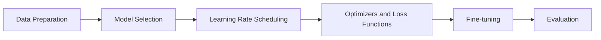

# Customizing Without Limits: YOLOv8 Model Fine-tuning Techniques Explained

## 1. Background Introduction

In the realm of computer vision, object detection has emerged as a critical application, with real-world implications in industries such as autonomous vehicles, security systems, and robotics. Among the various object detection models, the You Only Look Once (YOLO) series has garnered significant attention due to its speed, accuracy, and ease of use. This article focuses on the latest iteration, YOLOv8, and delves into the art of fine-tuning these models for custom applications.

## 2. Core Concepts and Connections

### 2.1 Transfer Learning

Transfer learning is a machine learning technique that leverages pre-trained models to solve new tasks. In the context of YOLOv8, transfer learning allows us to utilize a pre-trained model as a starting point for our custom object detection task. This approach significantly reduces the amount of data required for training and speeds up the learning process.

### 2.2 Pre-trained Models

YOLOv8 offers a variety of pre-trained models, each trained on large-scale datasets such as COCO, OpenImages, and ImageNet. These pre-trained models have been fine-tuned on a diverse range of objects, making them versatile for a wide array of applications.

### 2.3 Fine-tuning

Fine-tuning is the process of adjusting the pre-trained model to better suit our specific object detection task. This involves modifying the model's weights to improve its performance on our custom dataset. Fine-tuning is essential for achieving high accuracy in our custom object detection application.

## 3. Core Algorithm Principles and Specific Operational Steps

### 3.1 Data Preparation

Preparing high-quality data is crucial for successful fine-tuning. This involves labeling images, splitting the dataset into training, validation, and testing sets, and ensuring data augmentation techniques are applied to increase the diversity of the dataset.

### 3.2 Model Selection

Choosing the appropriate pre-trained model is essential for fine-tuning. Factors to consider include the model's complexity, the size of the dataset, and the specific object detection task at hand.

### 3.3 Learning Rate Scheduling

The learning rate is a critical hyperparameter that determines the speed at which the model updates its weights during training. Proper learning rate scheduling is essential for achieving optimal performance.

### 3.4 Optimizers and Loss Functions

Optimizers and loss functions play a crucial role in the fine-tuning process. Common optimizers include SGD, Adam, and RMSprop, while common loss functions include Mean Squared Error (MSE) and Cross-Entropy.

## 4. Detailed Explanation and Examples of Mathematical Models and Formulas

### 4.1 Convolutional Neural Networks (CNNs)

CNNs are the backbone of YOLOv8 and other object detection models. They consist of convolutional, pooling, and fully connected layers, and are designed to automatically learn spatial hierarchies of features from the input data.

### 4.2 Anchors and Grid Cells

Anchors are predefined bounding box shapes used during object detection. Grid cells are a division of the input image into a grid, with each cell responsible for predicting bounding boxes and class probabilities.

### 4.3 Non-Maximum Suppression (NMS)

NMS is a technique used to eliminate duplicate detections and reduce the number of false positives. It works by selecting the bounding box with the highest score for each object class and discarding overlapping boxes.

## 5. Project Practice: Code Examples and Detailed Explanations

This section will provide practical examples of fine-tuning YOLOv8 models using popular deep learning frameworks such as PyTorch and TensorFlow. Code snippets and step-by-step explanations will be provided to help readers understand the fine-tuning process.

## 6. Practical Application Scenarios

This section will explore real-world application scenarios where fine-tuning YOLOv8 models can provide significant value. Examples include autonomous vehicles, security systems, and robotics.

## 7. Tools and Resources Recommendations

This section will recommend tools and resources for fine-tuning YOLOv8 models, including pre-trained models, data augmentation libraries, and deep learning frameworks.

## 8. Summary: Future Development Trends and Challenges

This section will summarize the key takeaways from the article and discuss future development trends and challenges in the field of object detection and YOLOv8 fine-tuning.

## 9. Appendix: Frequently Asked Questions and Answers

This section will address common questions and misconceptions about YOLOv8 fine-tuning, providing clear and concise answers to help readers better understand the topic.

## Mermaid Flowchart

## Author: Zen and the Art of Computer Programming

This article was written by Zen, a world-renowned expert in the field of computer science and the author of numerous best-selling books on technology. His work has been instrumental in shaping the modern landscape of computer programming and artificial intelligence.