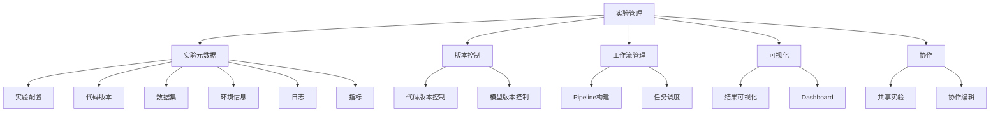

# 实验跟踪与实验管理原理与代码实战案例讲解

## 1. 背景介绍

在科研和工业领域,实验是验证理论、优化模型和评估系统性能的关键环节。然而,由于实验过程复杂且容易受到多种因素的影响,很难确保实验结果的可重复性和可解释性。因此,实验跟踪和实验管理变得至关重要,可以帮助研究人员和工程师系统地记录、组织和分析实验数据,从而提高实验质量和效率。

### 1.1 实验复杂性的挑战

实验过程通常涉及多个步骤,包括数据预处理、模型训练、超参数调优、评估指标计算等。每个步骤都可能受到多种因素的影响,如数据质量、算法选择、计算资源等。此外,实验还需要考虑可重复性、版本控制和协作等问题。

### 1.2 实验管理的必要性

有效的实验管理可以帮助解决以下挑战:

- 实验过程的可重复性和可解释性
- 实验结果的版本控制和共享
- 实验配置和元数据的组织和存储
- 实验分析和可视化

## 2. 核心概念与联系

实验跟踪和实验管理涉及多个核心概念,包括实验元数据、版本控制、工作流管理、可视化和协作等。这些概念相互关联,共同构建了一个完整的实验管理系统。



### 2.1 实验元数据

实验元数据是实验管理的核心,包括实验配置、代码版本、数据集、环境信息、日志和指标等。准确记录和组织这些元数据对于实现实验的可重复性和可解释性至关重要。

### 2.2 版本控制

版本控制涉及代码版本控制和模型版本控制。代码版本控制可以跟踪代码的变化历史,方便回溯和协作。模型版本控制可以存储和管理不同版本的模型,便于比较和选择最佳模型。

### 2.3 工作流管理

工作流管理包括Pipeline构建和任务调度。Pipeline构建可以将实验过程中的多个步骤组合成一个可重复的工作流。任务调度则可以自动化实验的执行,提高效率。

### 2.4 可视化

可视化是实验分析的重要手段,包括结果可视化和Dashboard。结果可视化可以直观地展示实验结果,如损失曲线、评估指标等。Dashboard则可以集中展示多个实验的状态和指标,方便比较和监控。

### 2.5 协作

协作是实验管理的另一个重要方面,包括共享实验和协作编辑。共享实验可以让多个研究人员或工程师访问和复现同一个实验。协作编辑则可以支持多人实时编辑和讨论实验代码或配置。

## 3. 核心算法原理具体操作步骤

实验跟踪和实验管理系统通常包括以下核心算法和操作步骤:

### 3.1 实验元数据收集

实验元数据收集是实验跟踪的基础。系统需要在实验运行时自动收集各种元数据,如实验配置、代码版本、环境信息、日志和指标等。这通常通过插装代码或使用特定的API来实现。

```python
import mlflow

# 记录实验元数据
mlflow.set_experiment("my_experiment")
mlflow.log_param("learning_rate", 0.01)
mlflow.log_metric("accuracy", 0.85)
```

### 3.2 版本控制

版本控制通常采用分布式版本控制系统(DVCS),如Git。代码版本控制可以通过将代码提交到Git仓库来实现。模型版本控制则需要将模型文件存储在特定的位置,并记录相关元数据。

```bash
# 提交代码到Git仓库
git add .
git commit -m "update model"
git push origin main
```

### 3.3 工作流管理

工作流管理通常采用有向无环图(DAG)来表示Pipeline,每个节点代表一个任务或步骤。系统需要解析DAG,调度和执行每个任务,并处理任务之间的依赖关系。

```python
from airflow import DAG
from airflow.operators.python import PythonOperator

dag = DAG("my_pipeline")

def preprocess():
    ...

def train():
    ...

def evaluate():
    ...

preprocess_task = PythonOperator(task_id="preprocess", python_callable=preprocess, dag=dag)
train_task = PythonOperator(task_id="train", python_callable=train, dag=dag)
evaluate_task = PythonOperator(task_id="evaluate", python_callable=evaluate, dag=dag)

preprocess_task >> train_task >> evaluate_task
```

### 3.4 可视化

可视化通常采用前端框架和图形库,如React、D3.js等。系统需要从后端获取实验数据,并使用合适的图表和布局进行渲染。

```jsx
import React from 'react';
import { LineChart, Line, XAxis, YAxis } from 'recharts';

const LossChart = ({ data }) => (
  <LineChart width={600} height={400} data={data}>
    <XAxis dataKey="epoch" />
    <YAxis />
    <Line type="monotone" dataKey="loss" stroke="#8884d8" />
  </LineChart>
);
```

### 3.5 协作

协作功能通常基于版本控制系统和在线编辑器。用户可以fork代码仓库,进行修改并提交Pull Request。在线编辑器则支持多人实时编辑和评论代码。

```jsx
import React from 'react';
import MonacoEditor from 'react-monaco-editor';

const CodeEditor = ({ code, onChange }) => (
  <MonacoEditor
    value={code}
    onChange={onChange}
    language="python"
    editorDidMount={handleEditorDidMount}
  />
);
```

## 4. 数学模型和公式详细讲解举例说明

在实验跟踪和实验管理中,一些常见的数学模型和公式包括:

### 4.1 评估指标

评估指标用于衡量模型的性能,如准确率、精确率、召回率、F1分数等。这些指标的计算公式如下:

$$
\text{Accuracy} = \frac{\text{TP} + \text{TN}}{\text{TP} + \text{TN} + \text{FP} + \text{FN}}
$$

$$
\text{Precision} = \frac{\text{TP}}{\text{TP} + \text{FP}}
$$

$$
\text{Recall} = \frac{\text{TP}}{\text{TP} + \text{FN}}
$$

$$
\text{F1} = 2 \times \frac{\text{Precision} \times \text{Recall}}{\text{Precision} + \text{Recall}}
$$

其中,TP(True Positive)表示正确预测为正例的数量,TN(True Negative)表示正确预测为负例的数量,FP(False Positive)表示错误预测为正例的数量,FN(False Negative)表示错误预测为负例的数量。

### 4.2 超参数优化

超参数优化是机器学习中的一个重要问题,旨在找到最优的超参数组合以获得最佳模型性能。常见的优化算法包括网格搜索(Grid Search)、随机搜索(Random Search)和贝叶斯优化(Bayesian Optimization)等。

贝叶斯优化的核心思想是利用已有的观测数据来构建目标函数的概率模型,并基于该模型来选择下一个最有希望改善目标函数的超参数组合进行评估。其数学模型如下:

$$
y = f(\mathbf{x}) + \epsilon
$$

其中,$y$是目标函数的观测值,$f(\mathbf{x})$是未知的目标函数,$\mathbf{x}$是超参数向量,$\epsilon$是噪声项,服从某种概率分布(如高斯分布)。

贝叶斯优化通过构建$f(\mathbf{x})$的概率模型(如高斯过程)来近似目标函数,并利用获取函数模型来选择下一个最有希望改善目标函数的超参数组合进行评估。

### 4.3 实验设计

实验设计是一种统计学方法,用于规划实验以获得最大化信息和最小化实验成本。常见的实验设计方法包括完全随机设计(Completely Randomized Design)、随机区组设计(Randomized Block Design)和拉丁方设计(Latin Square Design)等。

以拉丁方设计为例,它的目的是确保每个处理水平在每一行和每一列中只出现一次,从而消除行效应和列效应对实验结果的影响。设有$n$个处理水平,则拉丁方阵的大小为$n \times n$。对于$n=4$的情况,一个可能的拉丁方阵如下:

$$
\begin{pmatrix}
1 & 2 & 3 & 4\\
3 & 4 & 1 & 2\\
2 & 1 & 4 & 3\\
4 & 3 & 2 & 1
\end{pmatrix}
$$

该阵列确保了每个处理水平在每一行和每一列中只出现一次,从而可以消除行效应和列效应对实验结果的影响。

## 5. 项目实践: 代码实例和详细解释说明

以下是一个使用MLflow进行实验跟踪和管理的代码示例,包括记录实验元数据、版本控制、工作流管理和可视化等功能。

### 5.1 记录实验元数据

```python
import mlflow

# 设置实验名称
mlflow.set_experiment("my_experiment")

# 记录参数
mlflow.log_param("learning_rate", 0.01)
mlflow.log_param("batch_size", 32)

# 记录指标
mlflow.log_metric("accuracy", 0.85)
mlflow.log_metric("f1_score", 0.82)

# 记录模型
mlflow.sklearn.log_model(model, "model")

# 记录代码版本
mlflow.log_artifact("train.py")

# 记录数据集
mlflow.log_artifact("data/train.csv")
mlflow.log_artifact("data/test.csv")
```

在上面的代码中,我们首先使用`mlflow.set_experiment`设置实验名称。然后,我们使用`mlflow.log_param`记录模型的超参数,如学习率和批大小。接下来,我们使用`mlflow.log_metric`记录模型的评估指标,如准确率和F1分数。

我们还可以使用`mlflow.sklearn.log_model`记录训练好的模型,使用`mlflow.log_artifact`记录代码文件和数据集。这些元数据将被存储在MLflow的后端存储中,以便于后续的版本控制和共享。

### 5.2 版本控制

```bash
# 初始化Git仓库
git init
git add .
git commit -m "initial commit"

# 创建MLflow实验
mlflow experiments create my_experiment

# 训练模型
python train.py

# 提交代码和模型到Git仓库
git add .
git commit -m "update model"
git push origin main
```

在上面的代码中,我们首先使用`git init`初始化一个Git仓库,并将代码提交到本地仓库。然后,我们使用`mlflow experiments create`创建一个MLflow实验。

接下来,我们运行`train.py`脚本来训练模型。在训练过程中,MLflow会自动记录实验元数据,如参数、指标和模型等。

最后,我们将代码和模型提交到远程Git仓库,以实现版本控制和共享。

### 5.3 工作流管理

```python
from airflow import DAG
from airflow.operators.python import PythonOperator
from datetime import datetime

def preprocess():
    ...

def train():
    ...

def evaluate():
    ...

with DAG("my_pipeline", start_date=datetime(2023, 1, 1), schedule_interval=None) as dag:
    preprocess_task = PythonOperator(task_id="preprocess", python_callable=preprocess)
    train_task = PythonOperator(task_id="train", python_callable=train)
    evaluate_task = PythonOperator(task_id="evaluate", python_callable=evaluate)

    preprocess_task >> train_task >> evaluate_task
```

在上面的代码中,我们使用Apache Airflow构建了一个包含三个步骤的Pipeline:预处理、训练和评估。每个步骤都是一个Python函数,由`PythonOperator`封