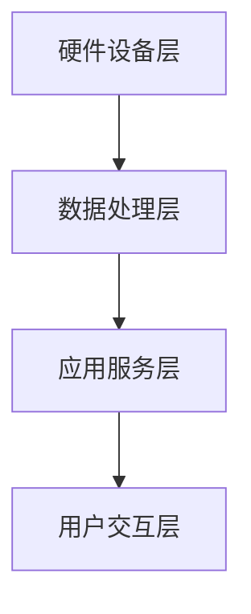

# 家庭管家系统详细设计与具体代码实现

## 1. 背景介绍
### 1.1 智能家居的兴起
随着物联网、人工智能等技术的快速发展,智能家居已经成为现代生活中不可或缺的一部分。智能家居通过互联网将家中的各种设备连接起来,实现远程控制、自动化等功能,为人们的生活带来了极大的便利。
### 1.2 家庭管家系统的需求
在智能家居的大背景下,人们对家庭管理提出了更高的要求。传统的家庭管理模式已经无法满足现代家庭的需求,因此,开发一套智能化的家庭管家系统成为了当务之急。家庭管家系统需要具备家电控制、家庭安防、日程管理、家庭财务等多方面的功能,为家庭成员提供全方位的服务。
### 1.3 本文的主要内容
本文将详细阐述家庭管家系统的设计思路和具体实现方法。首先,我们将分析家庭管家系统的核心概念和模块之间的联系;其次,介绍系统的核心算法原理和操作步骤;再次,给出系统的数学模型和关键公式的详细讲解;然后,通过代码实例和应用场景来展示系统的实际运行情况;最后,总结家庭管家系统的未来发展趋势和面临的挑战,并提供常见问题的解答。

## 2. 核心概念与联系
### 2.1 家庭管家系统的定义
家庭管家系统是一个基于物联网和人工智能技术,对家庭生活进行全方位管理和服务的智能化平台。它通过连接家中的各种智能设备,收集家庭数据,进行智能分析和决策,从而实现家电控制、家庭安防、日程管理、家庭财务等一系列功能,为家庭成员提供便捷、舒适、安全的生活环境。
### 2.2 系统的核心模块
家庭管家系统主要由以下几个核心模块组成:

1. 硬件设备层:包括各种智能家电、传感器、网关等物联网设备,负责采集家庭环境数据和执行控制命令。

2. 数据处理层:对采集到的家庭数据进行清洗、存储、分析和挖掘,为上层应用提供数据支持。

3. 应用服务层:提供家电控制、家庭安防、日程管理、家庭财务等各种具体的应用服务。

4. 用户交互层:为用户提供友好的人机交互界面,如语音交互、手机 App、Web 网页等。

### 2.3 模块之间的关系
下图展示了家庭管家系统各个核心模块之间的关系:



从图中可以看出,家庭管家系统采用分层架构设计,自底向上依次为硬件设备层、数据处理层、应用服务层和用户交互层。其中,硬件设备层负责采集原始数据,数据处理层对原始数据进行加工处理,应用服务层调用处理后的数据实现各种智能服务,用户交互层为用户提供交互入口。各层之间通过接口进行通信,共同完成家庭管家的各项功能。

## 3. 核心算法原理与操作步骤
### 3.1 数据采集与预处理
家庭管家系统的第一步是通过各种传感器和智能设备采集家庭环境的原始数据,如温度、湿度、电器状态等。由于原始数据通常存在噪声、缺失、不一致等问题,需要进行数据预处理。常用的数据预处理方法包括:

1. 数据清洗:去除噪声数据,修复缺失值,处理异常值。

2. 数据集成:将来自不同来源、格式的数据进行整合,形成一致的数据视图。

3. 数据变换:对数据进行归一化、标准化等转换操作,使其适合后续的分析挖掘。

### 3.2 数据分析与挖掘
数据预处理完成后,需要对数据进行分析和挖掘,发现隐藏在数据背后的规律和模式。常用的数据分析与挖掘算法包括:

1. 分类算法:如决策树、支持向量机、朴素贝叶斯等,用于对数据进行分类。

2. 聚类算法:如 K-Means、DBSCAN 等,用于将相似的数据聚合成簇。

3. 关联规则挖掘:如 Apriori、FP-Growth 等,用于发现数据之间的关联关系。

4. 时间序列分析:如 ARIMA、Prophet 等,用于分析、预测时间序列数据。

### 3.3 智能控制与优化
根据数据分析的结果,家庭管家系统可以进行智能控制和优化,如自动调节空调温度、优化能源使用等。智能控制的核心是建立家庭环境与设备状态之间的映射模型,即控制规则。常见的控制方法有:

1. 基于规则的控制:根据预先设定的规则(如 IF-THEN)进行控制决策。

2. 基于模型的控制:根据环境与设备间的数学模型进行最优控制,如 PID 控制。

3. 强化学习控制:通过不断试错和反馈,学习最优的控制策略。

除了控制,家庭管家系统还需要对能源、资源等进行优化配置,以节约成本,提高效率。常用的优化算法有:

1. 线性规划:用于求解线性约束下的最优化问题。

2. 动态规划:将优化问题分解为互相重叠的子问题,逐步求解。

3. 智能优化算法:如遗传算法、粒子群算法等启发式搜索算法。

### 3.4 算法的操作步骤

以温度控制为例,家庭管家系统的核心算法操作步骤如下:

1. 数据采集:通过温度传感器采集房间温度数据。

2. 数据预处理:对温度数据进行清洗,去除异常值。

3. 数据分析:分析温度数据的变化趋势,建立温度预测模型。

4. 控制决策:根据预测的温度变化,结合用户设定的温度范围,确定空调的控制策略(如制冷、制热)。

5. 执行控制:下发控制命令给空调设备,调节房间温度。

6. 优化配置:根据房间面积、设备能效等因素,优化空调的运行配置,在满足温度需求的同时,尽可能节能。

7. 评估反馈:对控制效果进行评估,收集用户反馈,不断改进控制算法。

## 4. 数学模型与公式讲解
### 4.1 温度预测模型
温度预测是温度控制的基础,常用的温度预测模型有:

1. 移动平均模型:利用温度数据的历史平均值作为未来预测值,公式为:

$$\hat{y}_{t+1} = \frac{1}{n} \sum_{i=t-n+1}^{t} y_i$$

其中,$\hat{y}_{t+1}$为预测值,$y_i$为第$i$个时刻的实际温度值,$n$为历史数据的长度。

2. 自回归模型:利用温度数据的历史值和噪声值进行线性组合,预测未来温度,公式为:

$$\hat{y}_t = \sum_{i=1}^{p} \varphi_i y_{t-i} + \varepsilon_t$$

其中,$\varphi_i$为自回归系数,$p$为历史数据的阶数,$\varepsilon_t$为噪声项。

3. 神经网络模型:利用神经网络的非线性拟合能力,建立温度与影响因素(如时间、湿度等)之间的复杂映射关系,公式为:

$$\hat{y}_t = f(\mathbf{x}_t, \mathbf{w}) + \varepsilon_t$$

其中,$\mathbf{x}_t$为$t$时刻的影响因素向量,$\mathbf{w}$为神经网络的权重向量,$f$为网络映射函数。

### 4.2 PID 控制模型
PID 是一种常用的反馈控制算法,通过对误差的比例(P)、积分(I)、微分(D)进行计算,输出控制量。其控制公式为:

$$u(t) = K_p e(t) + K_i \int_{0}^{t} e(\tau) d\tau + K_d \frac{de(t)}{dt}$$

其中,$u(t)$为控制量,$e(t)$为目标值与实际值的误差,$K_p$、$K_i$、$K_d$分别为比例、积分、微分系数。

在温度控制中,可以将室内温度作为被控对象,目标温度作为设定值,根据温度误差计算空调的控制量(如制冷量),从而达到恒温控制的目的。

### 4.3 动态规划模型
动态规划是一种将复杂问题分解为简单子问题,通过递推求解的优化算法。在家庭能源优化中,可以用动态规划求解最优的能源调度策略。

假设有$n$个家电设备,每个设备有$m$种工作模式,能耗分别为$c_{ij}$,家庭总能耗限制为$W$。我们的目标是最小化总能耗,同时满足用户对设备的使用需求。这可以表示为如下的动态规划模型:

$$\min \sum_{i=1}^{n} \sum_{j=1}^{m} c_{ij} x_{ij}$$

$$s.t. \sum_{i=1}^{n} \sum_{j=1}^{m} c_{ij} x_{ij} \leq W$$

$$\sum_{j=1}^{m} x_{ij} = 1, \forall i$$

$$x_{ij} \in \{0, 1\}, \forall i,j$$

其中,$x_{ij}$为0-1决策变量,表示设备$i$是否选择工作模式$j$。求解该动态规划模型,可以得到在能耗限制下,满足用户需求的最优设备工作模式组合。

## 5. 项目实践:代码实例与详解
下面我们通过一个简单的温度控制案例,来展示家庭管家系统的核心代码实现。

### 5.1 温度数据采集
首先,我们需要通过温度传感器采集房间温度数据。这里我们使用 Python 的 `requests` 库模拟从传感器 API 获取数据。

```python
import requests
import json

def get_temperature():
    url = "http://sensor.api.com/temperature"
    response = requests.get(url)
    data = json.loads(response.text)
    temperature = data["temperature"]
    return temperature
```

### 5.2 温度数据预处理
获取到温度数据后,我们需要对其进行预处理,去除可能存在的异常值。这里我们使用中位数过滤的方法。

```python
def preprocess_temperature(data, window=5):
    n = len(data)
    filtered_data = []
    for i in range(n):
        if i < window:
            filtered_data.append(data[i])
        else:
            window_data = data[i-window+1:i+1]
            median = sorted(window_data)[window//2]
            if abs(data[i] - median) > 10:
                filtered_data.append(median)
            else:
                filtered_data.append(data[i])
    return filtered_data
```

### 5.3 温度预测模型训练
接下来,我们使用简单的自回归模型对温度进行预测。我们使用 `statsmodels` 库来训练模型。

```python
import statsmodels.api as sm

def train_temperature_model(data, order=3):
    model = sm.tsa.AutoReg(data, lags=order)
    result = model.fit()
    return result

def predict_temperature(model, history):
    return model.forecast(history)[-1]
```

### 5.4 温度控制决策
根据预测的温度,我们可以确定空调的控制策略。这里我们使用简单的阈值规则。

```python
def get_ac_strategy(predicted_temp, target_temp, threshold=1):
    if predicted_temp > target_temp + threshold:
        return "cool"
    elif predicted_temp < target_temp - threshold:
        return "heat"
    else:
        return "off"
```

### 5.5 执行温度控制
确定控制策略后,我们需要下发控制命令给空调设备。这里我们使用 `requests` 库模拟控制 API 的调用。

```python
def control_ac(strategy):
    url = "http://ac.api.com/control"
    data = {"strategy": strategy}
    response = requests.post(url