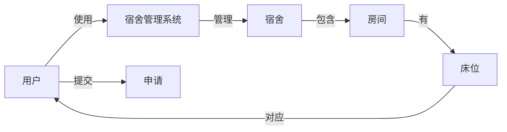

## 1.背景介绍

随着科技的发展，人们的生活方式也在发生着翻天覆地的改变。在校大学生的宿舍管理也不例外，传统的手工管理方式已经无法满足现代化宿舍管理的需求。因此，一个高效、便捷的宿舍管理系统就显得尤为重要。本文将详细介绍宿舍管理系统的设计与实现方法。

## 2.核心概念与联系

在设计宿舍管理系统时，我们需要理解几个核心概念：

- **用户**：系统的使用者，包括学生、宿舍管理员等。
- **宿舍**：实体，包含多个房间，每个房间可以有多个床位。
- **床位**：实体，每个床位对应一个学生。
- **申请**：学生可以提交申请，比如换床位、换宿舍等。

这些核心概念之间的关系如下：



## 3.核心算法原理具体操作步骤

宿舍管理系统的核心算法包括用户管理、宿舍管理、申请处理等。下面以申请处理为例，详细介绍其操作步骤：

1. 学生提交申请。
2. 系统自动检查申请的合理性，比如是否有空床位、是否符合换宿舍的条件等。
3. 如果申请合理，系统自动将申请转发给宿舍管理员。
4. 宿舍管理员审核申请，做出决定。
5. 系统自动更新宿舍和床位的状态，通知学生结果。

## 4.数学模型和公式详细讲解举例说明

在设计宿舍管理系统时，我们需要考虑如何优化宿舍的使用。这可以用数学模型来描述。假设我们有$n$个宿舍，每个宿舍有$m$个床位，我们的目标是最大化床位的使用率。

我们可以定义床位使用率为：

$$
使用率 = \frac{已使用的床位数}{总床位数} = \frac{\sum_{i=1}^{n}已使用的床位数_i}{n \times m}
$$

在处理申请时，我们可以通过调整学生的床位分配，来尽可能提高床位的使用率。

## 5.项目实践：代码实例和详细解释说明

下面以Python为例，展示一个简单的宿舍管理系统的实现。这只是一个基础版本，实际的系统可能需要更复杂的功能和更强大的数据库支持。

```python
class Dormitory:
    def __init__(self, dorm_id, room_num, bed_num):
        self.dorm_id = dorm_id
        self.room_num = room_num
        self.bed_num = bed_num
        self.students = []

    def add_student(self, student):
        if len(self.students) < self.room_num * self.bed_num:
            self.students.append(student)
            return True
        else:
            return False

class Student:
    def __init__(self, stu_id, name):
        self.stu_id = stu_id
        self.name = name
        self.dorm = None

    def apply_for_dorm(self, dorm):
        if dorm.add_student(self):
            self.dorm = dorm
            return True
        else:
            return False
```

## 6.实际应用场景

宿舍管理系统可以广泛应用于各类学校的宿舍管理。它可以帮助学校提高宿舍管理的效率和准确性，减少人工错误，提高学生的满意度。

## 7.工具和资源推荐

在开发宿舍管理系统时，可以使用以下工具和资源：

- **开发语言**：Python、Java、C#等
- **数据库**：MySQL、Oracle、SQL Server等
- **开发工具**：PyCharm、Eclipse、Visual Studio等
- **版本控制**：Git、SVN等

## 8.总结：未来发展趋势与挑战

随着科技的发展，宿舍管理系统将会越来越智能化、个性化。例如，通过人工智能技术，系统可以自动分析学生的习惯，提供更个性化的服务。然而，这也带来了挑战，如何保护学生的隐私，如何确保系统的安全稳定等。

## 9.附录：常见问题与解答

1. **问**：如何处理学生的换宿舍申请？
   **答**：系统会自动检查申请的合理性，如果合理，将申请转发给宿舍管理员，由管理员做出决定。

2. **问**：如何优化宿舍的使用？
   **答**：我们可以通过数学模型，调整学生的床位分配，以提高床位的使用率。

作者：禅与计算机程序设计艺术 / Zen and the Art of Computer Programming