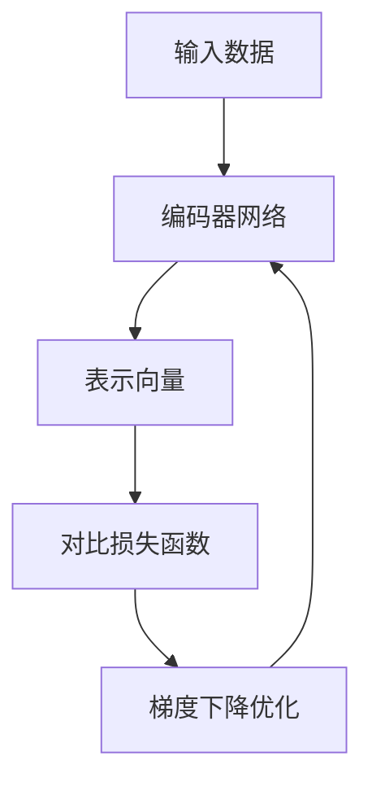
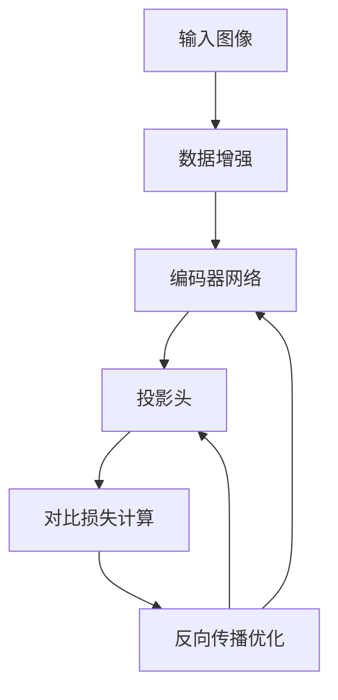

# 对比学习原理与代码实战案例讲解

## 1.背景介绍

### 1.1 什么是对比学习

对比学习(Contrastive Learning)是一种自监督表示学习范式,旨在从大量未标记数据中学习数据的潜在表示。与传统的监督学习不同,对比学习不需要大量的人工标注数据,而是通过构建特定的对比损失函数,使得相似样本的表示向量更接近,而不相似样本的表示向量更远离。

对比学习的核心思想是"相似的样本应该具有相似的表示,而不相似的样本应该具有不同的表示"。通过这种方式,模型可以从数据中自动挖掘出有用的特征表示,而无需人工标注,从而降低了数据准备的成本和工作量。

### 1.2 对比学习的发展历程

虽然对比学习的概念可以追溯到20世纪90年代,但直到2018年,由OpenAI提出的对比预测编码(Contrastive Predictive Coding, CPC)算法才引发了对比学习在深度学习领域的广泛关注。随后,各种对比学习方法如Word2Vec、MoCo、SimCLR等相继被提出并取得了显著的成功。

2020年,SimCLR算法在ImageNet数据集上取得了当时最好的性能,证明了对比学习在计算机视觉领域的巨大潜力。同年,MoCo被提出,通过动量编码器和队列的方式,进一步提高了对比学习的性能和训练效率。

如今,对比学习已经成为自监督表示学习的主流范式之一,并被广泛应用于计算机视觉、自然语言处理、推荐系统等多个领域。

## 2.核心概念与联系

### 2.1 对比损失函数

对比损失函数(Contrastive Loss)是对比学习的核心。它通过最大化正样本对(positive pair)的相似度,最小化负样本对(negative pair)的相似度,来学习数据的有效表示。

常见的对比损失函数包括NT-Xent Loss(Normalized Temperature-scaled Cross Entropy Loss)和InfoNCE Loss(Noise Contrastive Estimation based Mutual Information Maximization)等。

例如,NT-Xent Loss可以表示为:

$$\mathcal{L}_i = -\log\frac{\exp(\text{sim}(z_i, z_{j}^{+}) / \tau)}{\sum_{k=1}^{2N}\mathbb{1}_{[k\neq i]}\exp(\text{sim}(z_i, z_k) / \tau)}$$

其中,$z_i$和$z_j^+$分别表示正样本对的表示向量,$z_k$表示其他样本的表示向量,$\tau$是温度超参数,用于控制相似度的尺度,$\text{sim}(\cdot,\cdot)$是相似度函数(如点积或余弦相似度)。

通过最小化该损失函数,模型可以学习到能够最大化正样本相似度,最小化负样本相似度的表示向量。



### 2.2 数据增强

数据增强(Data Augmentation)是对比学习的另一个关键组成部分。由于对比学习需要构建正样本对和负样本对,因此需要对输入数据进行适当的增强变换,以生成相似样本和不相似样本。

常见的数据增强操作包括:

- 对于图像数据:随机裁剪、翻转、旋转、调整亮度/对比度等。
- 对于文本数据:随机遮蔽、同义词替换、词序打乱等。

通过数据增强,可以为模型提供更丰富的训练样本,从而提高模型的泛化能力和鲁棒性。

### 2.3 内存银行和动量编码器

为了提高对比学习的效率和性能,研究人员提出了内存银行(Memory Bank)和动量编码器(Momentum Encoder)等技术。

内存银行是一种存储编码器输出的表示向量的缓存机制,它允许在一个批次中构建更多的正负样本对,从而提高了对比学习的效率。

动量编码器则是一种特殊的编码器更新策略。它通过使用动量更新的方式来平滑编码器的参数变化,从而提高了模型的稳定性和泛化能力。

## 3.核心算法原理具体操作步骤

以SimCLR算法为例,其核心步骤如下:

1. **数据增强**: 对输入数据(如图像)进行两次不同的数据增强变换,生成两个增强视图。
2. **编码器网络**: 将两个增强视图分别输入到相同的编码器网络中,得到两个表示向量。
3. **投影头**: 将编码器输出的表示向量输入到一个非线性投影头(Projection Head)中,得到最终的投影向量。
4. **对比损失计算**: 将一个投影向量作为查询向量(query),另一个投影向量作为正样本键值(key/value),其余投影向量作为负样本键值。计算NT-Xent损失函数。
5. **反向传播**: 计算损失函数对编码器网络和投影头的梯度,并进行反向传播优化。



在训练过程中,SimCLR通过最小化对比损失函数,使得同一个图像的两个增强视图的投影向量彼此靠近,而不同图像的投影向量相互远离,从而学习到有效的图像表示。

## 4.数学模型和公式详细讲解举例说明

### 4.1 NT-Xent损失函数

NT-Xent损失函数(Normalized Temperature-scaled Cross Entropy Loss)是对比学习中常用的对比损失函数之一。它基于交叉熵损失,并引入了温度缩放(Temperature Scaling)和归一化(Normalization)操作,以改善对比损失的性能。

对于一个批次中的第$i$个样本$x_i$,其NT-Xent损失函数可以表示为:

$$\mathcal{L}_i = -\log\frac{\exp(\text{sim}(z_i, z_{j}^{+}) / \tau)}{\sum_{k=1}^{2N}\mathbb{1}_{[k\neq i]}\exp(\text{sim}(z_i, z_k) / \tau)}$$

其中:

- $z_i$和$z_j^+$分别表示$x_i$和其增强视图$x_j^+$的表示向量。
- $z_k$表示批次中其他样本的表示向量。
- $\tau$是温度超参数,用于控制相似度的尺度。
- $\text{sim}(\cdot,\cdot)$是相似度函数,通常使用点积或余弦相似度。
- $\mathbb{1}_{[k\neq i]}$是指示函数,用于排除$z_i$本身。

该损失函数的目标是最大化正样本对$(z_i, z_j^+)$的相似度,同时最小化负样本对$(z_i, z_k)$的相似度。通过最小化该损失函数,模型可以学习到能够捕捉数据内在结构的有效表示。

让我们以一个简单的例子来说明NT-Xent损失函数的计算过程。假设我们有一个批次,包含两个样本$x_1$和$x_2$,每个样本都有两个增强视图,即$x_1^+$和$x_1^-$、$x_2^+$和$x_2^-$。我们将$x_1$和$x_1^+$视为正样本对,其余视图视为负样本。

假设经过编码器和投影头后,我们得到以下表示向量:

- $z_1 = [0.5, 0.2]$
- $z_1^+ = [0.6, 0.1]$
- $z_1^- = [-0.3, 0.7]$
- $z_2^+ = [0.1, -0.4]$
- $z_2^- = [-0.2, 0.6]$

我们计算正样本对$(z_1, z_1^+)$的相似度(假设使用点积相似度):

$$\text{sim}(z_1, z_1^+) = 0.5 \times 0.6 + 0.2 \times 0.1 = 0.32$$

然后计算负样本对$(z_1, z_1^-)$、$(z_1, z_2^+)$和$(z_1, z_2^-)$的相似度:

$$\text{sim}(z_1, z_1^-) = 0.5 \times (-0.3) + 0.2 \times 0.7 = -0.05$$
$$\text{sim}(z_1, z_2^+) = 0.5 \times 0.1 + 0.2 \times (-0.4) = -0.03$$
$$\text{sim}(z_1, z_2^-) = 0.5 \times (-0.2) + 0.2 \times 0.6 = 0.02$$

假设温度超参数$\tau=0.1$,我们可以计算$x_1$的NT-Xent损失:

$$\mathcal{L}_1 = -\log\frac{\exp(0.32 / 0.1)}{\exp(0.32 / 0.1) + \exp(-0.05 / 0.1) + \exp(-0.03 / 0.1) + \exp(0.02 / 0.1)}$$

通过最小化该损失函数,模型可以学习到使正样本对的相似度最大化,负样本对的相似度最小化的表示向量。

### 4.2 InfoNCE损失函数

InfoNCE损失函数(Noise Contrastive Estimation based Mutual Information Maximization)是另一种常用的对比损失函数,它基于互信息(Mutual Information)的最大化原则。

对于一个批次中的第$i$个样本$x_i$,其InfoNCE损失函数可以表示为:

$$\mathcal{L}_i = -\mathbb{E}_{x_j^+ \sim P_\text{pos}}\left[\log\frac{\exp(\text{sim}(z_i, z_j^+) / \tau)}{\sum_{x_k \sim P_\text{data}}\exp(\text{sim}(z_i, z_k) / \tau)}\right]$$

其中:

- $z_i$和$z_j^+$分别表示$x_i$和其正样本$x_j^+$的表示向量。
- $z_k$表示批次中所有样本(包括正样本和负样本)的表示向量。
- $\tau$是温度超参数,用于控制相似度的尺度。
- $\text{sim}(\cdot,\cdot)$是相似度函数,通常使用点积或余弦相似度。
- $P_\text{pos}$是正样本分布,$P_\text{data}$是数据分布。

InfoNCE损失函数的目标是最大化正样本对$(z_i, z_j^+)$的相似度,同时最小化负样本对$(z_i, z_k)$的相似度,从而最大化$z_i$和$z_j^+$之间的互信息。

与NT-Xent损失函数类似,InfoNCE损失函数也可以通过构建正负样本对,并计算相似度来优化模型的表示向量。不同之处在于,InfoNCE损失函数考虑了所有样本(包括正样本和负样本)的相似度,而NT-Xent损失函数只考虑了正样本和其他样本的相似度。

## 5.项目实践:代码实例和详细解释说明

在本节中,我们将提供一个使用PyTorch实现的对比学习示例代码,并对关键步骤进行详细解释。

### 5.1 数据增强

首先,我们定义一个数据增强函数,用于对输入图像进行随机裁剪和颜色抖动:

```python
import torchvision.transforms as transforms

def get_augmentation():
    return transforms.Compose([
        transforms.RandomResizedCrop(224),
        transforms.RandomHorizontalFlip(),
        transforms.RandomApply([transforms.ColorJitter(0.8, 0.8, 0.8, 0.2)], p=0.8),
        transforms.RandomGrayscale(p=0.2),
        transforms.ToTensor(),
        transforms.Normalize(mean=[0.485, 0.456, 0.406], std=[0.229, 0.224, 0.225])
    ])
```

这个函数将输入图像随机裁剪为224x224大小,随机水平翻转,随机调整颜色,并将像素值归一化到[-1, 1]范围内。

### 5.2 编码器网络和投影头

接下来,我们定义编码器网络和投影头:

```python
import torch.nn as nn

class Encoder(nn.Module):
    def __init__(self):
        super(