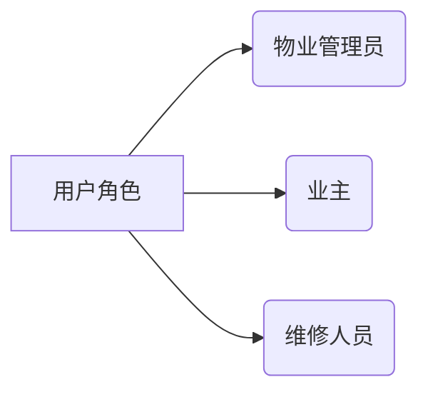
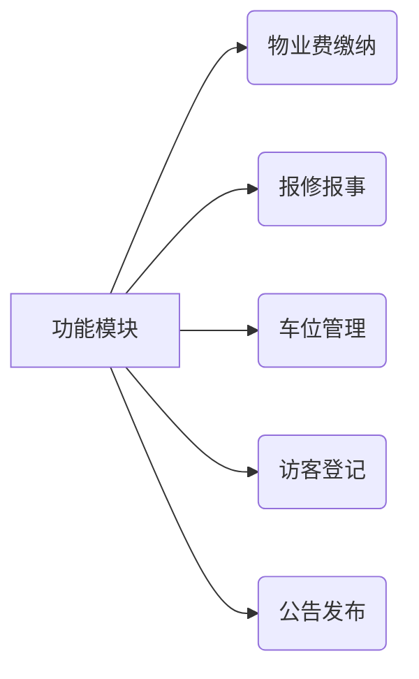
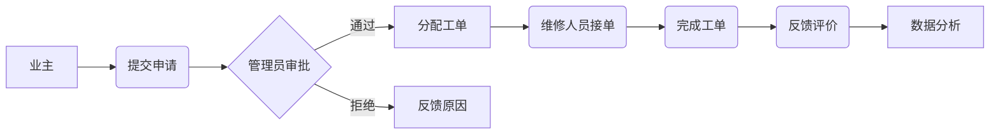

# 小区物业管理系统详细设计与具体代码实现

## 1. 背景介绍

随着城市化进程的加快和人们生活水平的不断提高,小区物业管理系统已经成为现代社区生活中不可或缺的一部分。作为一个集中式的管理平台,它可以有效地管理小区内的各种资源和服务,提高居民的生活质量和社区的运营效率。

小区物业管理系统通常包括多个模块,如物业费缴纳、报修报事、车位管理、访客登记、公告发布等。它将各种业务流程数字化,实现了信息的高效传递和资源的合理调配。同时,该系统还可以收集和分析居民的反馈,为物业公司提供决策依据,持续优化服务质量。

### 1.1 系统设计目标

小区物业管理系统的设计目标是构建一个安全、高效、易用的综合管理平台,满足物业公司和业主的各种需求。具体目标包括:

- 实现物业管理流程的自动化和信息化,提高工作效率
- 为业主提供便捷的在线服务,如缴费、报修等
- 加强小区安全管理,如访客登记、车辆出入管控等
- 优化资源调配,如车位分配、公共设施预约等
- 收集居民反馈,持续改进服务质量
- 降低物业公司的运营成本

## 2. 核心概念与联系

在深入探讨系统设计之前,我们先来了解一些核心概念及它们之间的关系。

### 2.1 用户角色

系统中存在三种主要的用户角色:

- **物业管理员**: 负责系统的日常运营和维护,包括审批报修单、分配工单、管理公告等。
- **业主**: 可以通过系统缴纳物业费、报修报事、预约公共设施等。
- **维修人员**: 接收分配的工单,并在现场完成维修工作。



### 2.2 功能模块

系统包含以下核心功能模块:

- **物业费缴纳**: 业主可以在线缴纳物业费,管理员可以查看缴费记录。
- **报修报事**: 业主可以提交报修申请,管理员负责审批和分配工单。
- **车位管理**: 管理员可以分配车位给业主,业主可以查看自己的车位信息。
- **访客登记**: 业主可以为访客预约登记,管理员可以审核访客信息。
- **公告发布**: 管理员可以发布公告,业主可以查看公告内容。



### 2.3 数据流程

系统的数据流程如下所示:



1. 业主提交申请,如报修、缴费等。
2. 管理员审批申请,可以通过或拒绝。
3. 如果通过,管理员会分配工单给维修人员。
4. 维修人员接单并完成工作。
5. 业主对工作进行评价反馈。
6. 系统收集反馈数据进行分析,为优化服务提供依据。

## 3. 核心算法原理具体操作步骤

### 3.1 工单分配算法

工单分配算法是系统的核心算法之一,它决定了如何将报修工单合理分配给维修人员。算法的目标是实现工作量的均衡分配,缩短等待时间,提高响应效率。

算法的具体步骤如下:

1. **获取所有待分配工单和在线维修人员列表**
2. **计算每个维修人员的工作量得分**
   - 新工单得分高于旧工单
   - 紧急程度高的工单得分更高
3. **根据得分,为每个工单指定一个最佳维修人员**
   - 选择当前工作量最小的维修人员
   - 如果存在多个候选人,则随机选择一个
4. **将工单分配给对应的维修人员**
5. **更新维修人员的工作量得分**

该算法的时间复杂度为 O(n*m),其中 n 为工单数量,m 为维修人员数量。在实际应用中,工单和维修人员数量通常较小,因此该算法具有良好的性能表现。

### 3.2 缴费流程

缴费流程算法负责处理业主的缴费请求,并正确更新相关数据。算法步骤如下:

1. **获取业主的缴费信息,包括金额和缴费期数**
2. **验证业主的身份和缴费信息的合法性**
3. **从业主账户中扣除相应的费用**
4. **更新业主的缴费记录**
5. **生成缴费凭证**
6. **发送缴费成功的通知给业主**

该算法的时间复杂度为 O(1),因为无论缴费金额多少,操作步骤数量保持不变。

### 3.3 访客预约流程

访客预约流程算法负责处理业主的访客预约申请,并进行审核。算法步骤如下:

1. **获取访客预约信息,包括访客姓名、到访时间等**
2. **验证业主身份和预约信息的合法性**
3. **将预约信息存入待审核列表**
4. **管理员审核预约信息**
   - 如果通过,将信息存入已审核列表
   - 如果拒绝,需提供拒绝原因
5. **发送审核结果通知给业主**

该算法的时间复杂度为 O(1),因为无论预约信息的数量如何,操作步骤数量保持不变。

## 4. 数学模型和公式详细讲解举例说明

在小区物业管理系统中,我们可以使用一些数学模型来优化资源分配和决策过程。下面将详细介绍两个常用的模型。

### 4.1 车位分配模型

车位分配是一个典型的资源分配问题,我们可以使用匈牙利算法(Hungarian algorithm)来求解。该算法能够找到一种最优分配方案,使得资源的总体利用率最大化。

假设有 n 个业主和 m 个车位,我们构建一个 n*m 的代价矩阵 C,其中 C[i,j] 表示将第 i 个业主分配到第 j 个车位的代价。我们的目标是找到一种分配方案,使得总代价最小。

匈牙利算法的步骤如下:

1. 构建代价矩阵 C
2. 对每一行,减去该行的最小值
3. 对每一列,减去该列的最小值
4. 用直线划分矩阵,使得被直线覆盖的0尽可能多
5. 如果0的个数等于n,则找到最优解;否则给未被覆盖的0赋予一个最小代价,返回步骤2

该算法的时间复杂度为 O(n^3),适用于中小规模的车位分配问题。

### 4.2 工单优先级模型

对于报修工单,我们需要根据其紧急程度来确定优先级,以便合理安排维修人员。我们可以使用多准则决策模型(Multi-criteria decision making, MCDM)来解决这个问题。

假设有 n 个工单,每个工单有 m 个评估指标,如影响范围、损坏程度等。我们构建一个 n*m 的决策矩阵 D,其中 D[i,j] 表示第 i 个工单在第 j 个指标上的评分。

我们的目标是为每个工单计算一个综合得分,作为其优先级的依据。一种常用的计算方法是加权求和:

$$
综合得分_i = \sum_{j=1}^{m}w_j \times D[i,j]
$$

其中 $w_j$ 表示第 j 个指标的权重,需要根据实际情况进行设置。

通过对所有工单的综合得分进行排序,我们就可以得到一个优先级列表,用于指导维修人员的工作安排。

该模型的优点是可以灵活地调整指标权重,以适应不同的场景需求。但是,权重的设置也需要一定的主观判断,可能会影响结果的准确性。

## 5. 项目实践:代码实例和详细解释说明

在上一节中,我们介绍了一些核心算法的原理。现在,我们将通过代码实例来展示如何在实际项目中应用这些算法。

### 5.1 工单分配算法实现

下面是使用 Python 实现工单分配算法的代码示例:

```python
from collections import defaultdict
from random import choice

class RepairOrder:
    def __init__(self, id, urgency_score):
        self.id = id
        self.urgency_score = urgency_score

class Technician:
    def __init__(self, id):
        self.id = id
        self.workload_score = 0

def assign_orders(orders, technicians):
    # 初始化工作量得分
    workload_scores = defaultdict(int)
    for tech in technicians:
        workload_scores[tech.id] = tech.workload_score

    # 分配工单
    assignments = {}
    for order in orders:
        best_tech = min(workload_scores, key=workload_scores.get)
        assignments[order.id] = best_tech
        workload_scores[best_tech] += order.urgency_score

    # 更新技师的工作量得分
    for tech in technicians:
        tech.workload_score = workload_scores[tech.id]

    return assignments

# 使用示例
orders = [RepairOrder(1, 10), RepairOrder(2, 5), RepairOrder(3, 8)]
technicians = [Technician(1), Technician(2), Technician(3)]
assignments = assign_orders(orders, technicians)
print(assignments)
```

在这个示例中,我们定义了 `RepairOrder` 和 `Technician` 两个类,分别表示报修工单和维修人员。`assign_orders` 函数实现了工单分配算法的核心逻辑。

1. 首先,我们初始化一个字典 `workload_scores`,用于存储每个维修人员的工作量得分。
2. 然后,我们遍历所有待分配的工单。对于每个工单,我们找到当前工作量得分最小的维修人员,并将该工单分配给他。如果存在多个候选人,我们会随机选择一个。
3. 在分配完成后,我们更新每个维修人员的工作量得分。
4. 最后,我们返回一个字典 `assignments`,其中键为工单 ID,值为分配的维修人员。

### 5.2 缴费流程实现

下面是使用 Python 实现缴费流程的代码示例:

```python
class PaymentError(Exception):
    pass

class Resident:
    def __init__(self, id, balance):
        self.id = id
        self.balance = balance

    def pay_fee(self, amount, period):
        if amount > self.balance:
            raise PaymentError("余额不足")

        self.balance -= amount
        # 更新缴费记录
        print(f"业主 {self.id} 缴纳了 {period} 期的物业费 {amount} 元")

# 使用示例
resident = Resident(1, 1000)
try:
    resident.pay_fee(500, "2023年第二季度")
except PaymentError as e:
    print(e)
else:
    print(f"业主 {resident.id} 当前余额为 {resident.balance} 元")
```

在这个示例中,我们定义了 `Resident` 类,表示小区的业主。`pay_fee` 方法实现了缴费流程的核心逻辑。

1. 首先,我们检查业主的余额是否足够支付本次物业费。如果余额不足,我们会抛出 `PaymentError` 异常。
2. 如果余额充足,我们从业主的账户中扣除相应的费用,并更新缴费记录。
3. 在示例的使用部分,我们创建了一个 `Resident` 对象,并尝试为其缴纳物业费。如果缴费成功,我们会打印业主的当前余额;如果失败,我们会捕获并打印异常信息。

### 5.3 访客预约流程实现

下面是使用 Python 实现访客预约流程的代码示例:

```python
from collections import