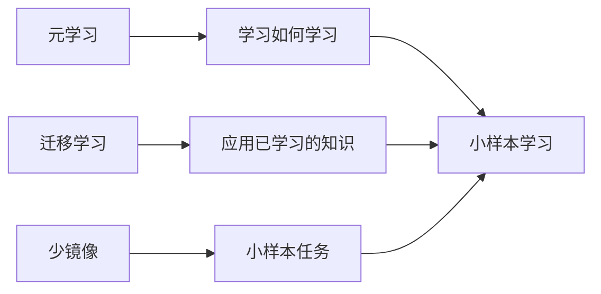

## 1.背景介绍

在我们的日常生活中，人类经常需要在有限的样本中学习并理解新的概念。这种能力被称为小样本学习，是人类智能的一个重要方面。然而，对于机器来说，这是一个巨大的挑战。在许多现实世界的应用中，例如医疗诊断、目标检测等，我们可能只有少量的标注样本可以用于训练。在这种情况下，如何设计能够有效地从少量样本中学习的算法，已经成为了人工智能领域的一项重要任务。

## 2.核心概念与联系

小样本学习的核心概念主要包括以下几个部分：

- **元学习（Meta-learning）**：元学习是一种学习策略，它试图设计一种学习机制，使得模型能够在看到新任务时，快速地适应并学习新任务的能力。元学习的关键是学习如何学习。

- **迁移学习（Transfer Learning）**：迁移学习试图将在一个任务上学到的知识，应用到另一个任务上。在小样本学习的背景下，迁移学习通常用于将大样本任务中学习到的知识，迁移到小样本任务中。

- **少镜像（Few-shot Learning）**：少镜像是小样本学习的一个子领域，它特指在只有很少的样本（如1-5个）的情况下，如何设计模型来学习新任务。

这些概念之间的联系可以用下面的Mermaid流程图来表示：



## 3.核心算法原理具体操作步骤

在小样本学习中，有几种主要的算法可以用于处理这个问题。其中最著名的可能是模型无关的元学习（MAML）算法。MAML的核心思想是，通过优化模型的参数，使得模型在看到新任务的少量样本后，能够通过少量的梯度更新步骤，快速地适应新任务。

MAML算法的操作步骤可以概括为以下几步：

1. 初始化模型参数。
2. 对于每一个任务，使用当前的模型参数，计算任务的损失函数，并对模型参数进行一次或多次梯度更新。
3. 计算所有任务更新后的模型参数的平均损失函数。
4. 使用这个平均损失函数，更新原始的模型参数。
5. 重复步骤2-4，直到模型参数收敛。

## 4.数学模型和公式详细讲解举例说明

MAML算法的数学模型可以表示为以下的公式：

假设我们有一个任务集合$\mathcal{T}$，每个任务$i$都有一个对应的损失函数$L_i(\theta)$。MAML的目标是找到一个模型参数$\theta$，使得对于每个任务$i$，在进行一次梯度更新后，任务的损失函数可以被最小化。这可以表示为以下的优化问题：

$$
\min_{\theta} \sum_{i \in \mathcal{T}} L_i(\theta - \alpha \nabla_{\theta} L_i(\theta))
$$

其中，$\alpha$是学习率，$\nabla_{\theta} L_i(\theta)$是损失函数关于模型参数的梯度。

## 5.项目实践：代码实例和详细解释说明

在实际的项目实践中，我们可以使用PyTorch等深度学习框架来实现MAML算法。下面是一个简单的代码实例：

```python
class MAML(nn.Module):
    def __init__(self, model, lr):
        super(MAML, self).__init__()
        self.model = model
        self.lr = lr

    def forward(self, data, target):
        # Compute loss
        loss = F.cross_entropy(self.model(data), target)

        # Create a new model with the same parameters
        model_copy = copy.deepcopy(self.model)

        # Update the parameters of the copy
        for param in model_copy.parameters():
            param.data -= self.lr * param.grad.data

        return model_copy
```

这个代码实例中，我们首先定义了一个MAML类，它包含一个模型和一个学习率。在前向传播函数中，我们首先计算损失函数，然后创建一个模型的副本，并对副本的参数进行更新。

## 6.实际应用场景

小样本学习在许多实际应用中都有广泛的应用，例如：

- **医疗诊断**：在医疗诊断中，我们可能只有少量的病例可以用于训练。在这种情况下，小样本学习可以帮助我们从这些少量的病例中学习并预测新的病例。

- **目标检测**：在目标检测中，我们可能需要检测的目标种类非常多，但是每种目标的样本数量都非常少。小样本学习可以帮助我们从这些少量的样本中学习并检测新的目标。

- **人脸识别**：在人脸识别中，我们可能需要识别的人脸种类非常多，但是每种人脸的样本数量都非常少。小样本学习可以帮助我们从这些少量的样本中学习并识别新的人脸。

## 7.工具和资源推荐

在进行小样本学习的研究和实践时，以下工具和资源可能会非常有用：

- **PyTorch**：PyTorch是一个非常强大的深度学习框架，它提供了丰富的API和灵活的计算图，非常适合进行小样本学习的研究和实践。

- **learn2learn**：learn2learn是一个专门为元学习和小样本学习设计的PyTorch库，它提供了许多预定义的元学习算法和小样本学习任务，可以大大加快研究和实践的速度。

## 8.总结：未来发展趋势与挑战

小样本学习是人工智能领域的一个重要研究方向。尽管已经有许多算法被提出来解决这个问题，但是仍然存在许多挑战需要我们去解决。例如，如何设计更有效的学习策略，如何处理样本不平衡问题，如何在少量样本中学习复杂的概念等。

在未来，随着人工智能技术的发展，我们相信小样本学习将会得到更多的关注，并在许多实际应用中发挥重要的作用。

## 9.附录：常见问题与解答

1. **问：小样本学习和元学习有什么区别？**

答：小样本学习是指在只有少量样本的情况下，如何设计模型来学习新任务。元学习是一种学习策略，它试图设计一种学习机制，使得模型能够在看到新任务时，快速地适应并学习新任务的能力。在某种程度上，元学习可以看作是小样本学习的一种策略。

2. **问：小样本学习有哪些应用？**

答：小样本学习在许多实际应用中都有广泛的应用，例如医疗诊断、目标检测、人脸识别等。

3. **问：如何评估小样本学习的性能？**

答：小样本学习的性能通常通过在新任务上的泛化能力来评估。具体来说，我们通常会在一个大的任务集合上训练模型，然后在一个新的任务集合上测试模型的性能。

作者：禅与计算机程序设计艺术 / Zen and the Art of Computer Programming