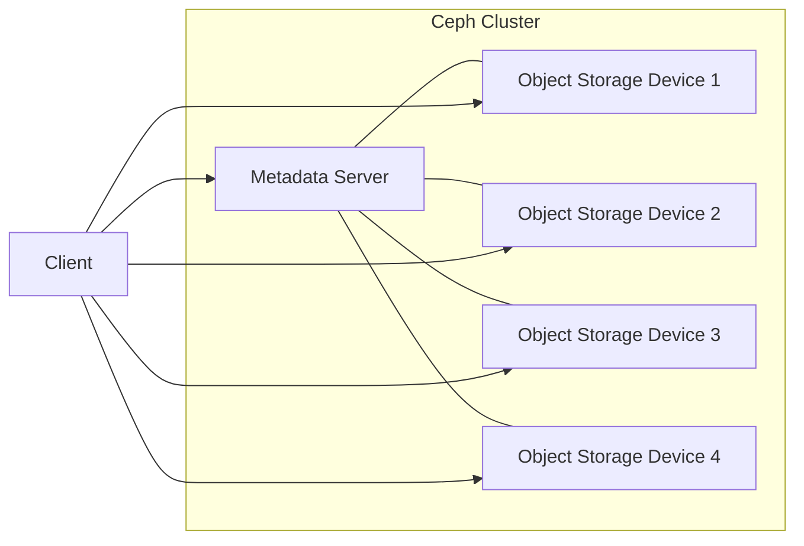
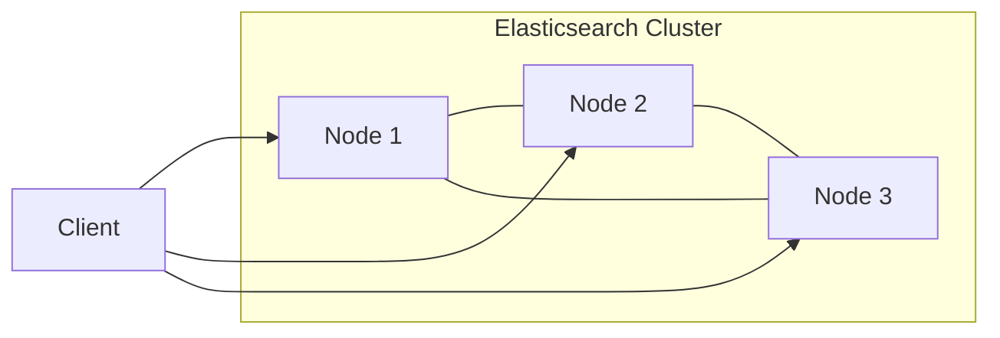
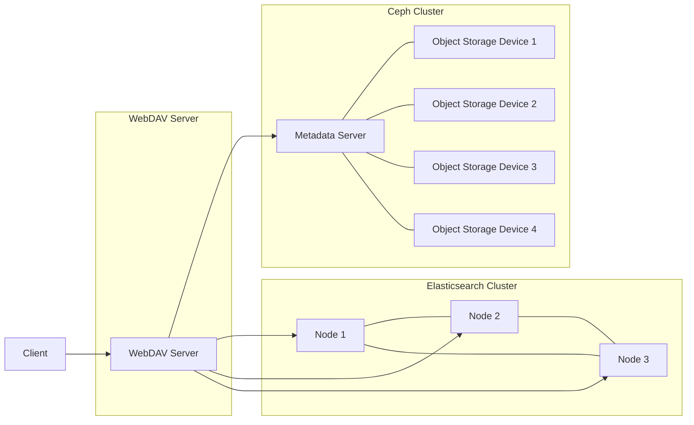

# 局域网文件共享及检索系统详细设计与具体代码实现

## 1.背景介绍

在现代办公和家庭环境中,局域网文件共享和检索系统扮演着至关重要的角色。随着数字化时代的到来,文件数据的存储和管理变得越来越复杂。无论是办公文档、图像、视频还是其他类型的文件,它们都需要被高效地存储、共享和检索。传统的文件存储方式已经无法满足现代需求,因此需要一个高效、安全和易于使用的局域网文件共享及检索系统。

### 1.1 文件共享的重要性

文件共享使得团队成员之间能够轻松地协作和交换信息。在办公环境中,同事之间需要共享文档、报告和其他相关文件。在家庭环境中,家人之间也需要共享照片、视频和其他媒体文件。有效的文件共享可以提高工作效率,加强团队协作,并促进信息交流。

### 1.2 文件检索的必要性

随着时间的推移,文件数量会不断增加,导致查找特定文件变得越来越困难。高效的文件检索系统可以帮助用户快速定位所需的文件,节省宝贵的时间和精力。无论是在办公环境中查找重要文档,还是在家庭环境中查找特定照片或视频,文件检索系统都可以提供便利。

### 1.3 局域网环境的优势

局域网环境为文件共享和检索提供了理想的平台。相比于基于互联网的解决方案,局域网环境具有更高的安全性、更低的延迟和更好的可控性。在局域网环境中,文件共享和检索可以在受控的网络环境下进行,降低了数据泄露和网络攻击的风险。同时,局域网环境也提供了更高的传输速度和更低的延迟,确保文件共享和检索的高效性。

## 2.核心概念与联系

在设计和实现局域网文件共享及检索系统时,需要考虑一些核心概念和它们之间的关系。下面是一些关键概念:

### 2.1 文件存储

文件存储是整个系统的基础。它决定了文件如何被组织、存储和管理。常见的文件存储方式包括本地文件系统、网络文件系统(NFS)和分布式文件系统。选择合适的文件存储方式对于系统的性能、可扩展性和可靠性至关重要。

### 2.2 文件元数据

文件元数据提供了关于文件的重要信息,如文件名、大小、创建时间、修改时间等。有效管理和利用文件元数据对于文件共享和检索至关重要。元数据可以用于文件索引、搜索和排序等操作。

### 2.3 文件索引

文件索引是实现高效文件检索的关键。它通过建立文件内容和元数据的索引,使得用户可以快速查找所需的文件。常见的文件索引技术包括倒排索引、全文索引和元数据索引。选择合适的索引技术和算法对于系统的检索性能至关重要。

### 2.4 用户认证和授权

在局域网环境中,用户认证和授权是确保文件共享和检索安全性的关键。系统需要实现有效的用户身份验证机制,并根据用户的权限控制对文件的访问。常见的用户认证方式包括用户名/密码、双因素认证和单点登录(SSO)等。

### 2.5 文件传输

文件传输是实现文件共享的核心。它决定了文件如何在网络中传输和复制。常见的文件传输协议包括FTP、HTTP、SMB等。选择合适的传输协议和优化传输性能对于系统的共享效率至关重要。

### 2.6 用户界面

用户界面是系统与用户交互的桥梁。一个直观、易用的用户界面可以极大地提高系统的可用性和用户体验。设计良好的用户界面应该包括文件浏览、搜索、上传、下载和共享等功能。

这些核心概念相互关联,共同构建了一个完整的局域网文件共享及检索系统。下面将详细介绍系统的设计和实现细节。

## 3.核心算法原理具体操作步骤

### 3.1 文件存储

文件存储是整个系统的基础。在本系统中,我们采用了分布式文件系统作为文件存储方案。分布式文件系统可以提供高可用性、可扩展性和容错性,非常适合局域网环境。

具体来说,我们使用了开源的Ceph分布式存储系统。Ceph是一个统一的分布式存储系统,它提供了对象存储、块存储和文件存储服务。在我们的系统中,我们使用了Ceph的文件存储服务(CephFS)来存储用户的文件。

CephFS的工作原理如下:

1. **Metadata Server (MDS)**: MDS负责管理文件系统的元数据,包括目录结构、文件属性等。MDS会将元数据存储在高可用的Ceph对象存储池中。

2. **Object Storage Device (OSD)**: OSD是Ceph的底层存储设备,用于存储实际的文件数据。文件数据会被分割成多个对象,并分布式地存储在多个OSD上,以实现数据冗余和高可用性。

3. **CRUSH算法**: CRUSH是Ceph用于数据分布的算法。它根据集群的拓扑结构和配置,计算出每个对象应该存储在哪些OSD上。CRUSH算法可以实现数据的均匀分布,提高存储效率。

4. **客户端**: 客户端通过Ceph的文件系统客户端(CephFS Client)与MDS和OSD进行交互,实现文件的读写操作。

在文件写入过程中,客户端首先与MDS交互,获取文件的元数据信息。然后,客户端将文件数据分割成多个对象,并通过CRUSH算法计算出每个对象应该存储在哪些OSD上。最后,客户端将对象数据写入相应的OSD。读取文件时,过程是相反的。

通过使用Ceph分布式文件系统,我们的系统可以实现高可用性、可扩展性和容错性,同时还提供了一致的文件系统视图,方便用户访问和管理文件。

### 3.2 文件元数据管理

文件元数据是实现高效文件共享和检索的关键。在我们的系统中,我们使用了基于Elasticsearch的元数据索引和搜索解决方案。

Elasticsearch是一个分布式、RESTful风格的搜索和分析引擎,它基于Apache Lucene构建。Elasticsearch提供了强大的全文搜索、结构化搜索和分析功能,非常适合用于文件元数据的索引和搜索。

我们的元数据管理流程如下:

1. **元数据提取**: 当用户上传或修改文件时,系统会自动提取文件的元数据,包括文件名、大小、创建时间、修改时间、MIME类型、作者等信息。对于特定类型的文件(如PDF、Office文档等),系统还会提取文件内容,以支持全文搜索。

2. **元数据索引**: 提取的元数据将被发送到Elasticsearch集群进行索引。Elasticsearch会将元数据分词、建立倒排索引,以支持快速搜索。

3. **搜索查询**: 当用户需要搜索文件时,他们可以在系统的搜索界面输入关键词或构建复杂的查询。查询将被发送到Elasticsearch集群,并返回匹配的文件元数据结果。

4. **结果展示**: 搜索结果将以用户友好的方式展示,包括文件名、大小、修改时间等关键信息。用户可以根据需要对结果进行排序、过滤和分页。

5. **实时更新**: 当有新文件上传或现有文件被修改时,系统会自动更新Elasticsearch中的索引,确保搜索结果的实时性。

通过利用Elasticsearch的强大搜索和分析功能,我们的系统可以提供高效的文件元数据索引和搜索服务,极大地提高了文件检索的效率和用户体验。

### 3.3 文件传输

文件传输是实现文件共享的核心功能。在我们的系统中,我们采用了基于HTTP的文件传输方案,结合使用WebDAV协议。

WebDAV(Web-based Distributed Authoring and Versioning)是一种基于HTTP协议的文件共享和协作协议。它允许客户端通过标准的HTTP方法(GET、PUT、DELETE等)操作远程服务器上的文件和目录,就像操作本地文件系统一样。

我们的文件传输流程如下:

1. **WebDAV服务器**: 系统中包含一个WebDAV服务器,它提供了文件上传、下载、移动、复制、删除等操作的RESTful API。WebDAV服务器与Ceph文件系统集成,实现了对底层文件系统的访问和管理。

2. **WebDAV客户端**: 用户可以使用支持WebDAV协议的客户端软件(如Windows资源管理器、macOS Finder等)连接到WebDAV服务器。客户端会将WebDAV服务器上的文件系统映射为本地文件系统,用户可以像操作本地文件一样操作远程文件。

3. **文件上传**: 当用户需要上传文件时,客户端会将文件数据通过HTTP PUT请求发送到WebDAV服务器。服务器会将文件数据写入Ceph文件系统,并更新相应的元数据索引。

4. **文件下载**: 当用户需要下载文件时,客户端会向WebDAV服务器发送HTTP GET请求。服务器会从Ceph文件系统读取文件数据,并通过HTTP响应将文件数据传输给客户端。

5. **其他操作**: 用户还可以通过WebDAV客户端执行文件移动、复制、删除等操作。客户端会将相应的HTTP请求发送给WebDAV服务器,服务器会在Ceph文件系统上执行相应的操作,并更新元数据索引。

通过使用WebDAV协议,我们的系统提供了一种标准化的文件共享方式,用户可以使用熟悉的客户端软件轻松访问和管理文件。同时,基于HTTP的传输方式也确保了系统的安全性和可扩展性。

### 3.4 用户认证和授权

为了确保文件共享和检索的安全性,我们的系统实现了基于LDAP的用户认证和授权机制。

LDAP(Lightweight Directory Access Protocol)是一种开放的、中立的、行业标准的应用协议,用于访问和维护分布式目录信息服务。LDAP目录可以存储用户信息、组信息、权限信息等,非常适合用于用户认证和授权管理。

我们的用户认证和授权流程如下:

1. **LDAP目录服务**: 系统中包含一个LDAP目录服务,用于存储和管理用户信息、组信息和权限信息。LDAP目录服务可以与现有的企业目录服务集成,也可以独立部署。

2. **用户认证**: 当用户尝试访问系统时,系统会要求用户提供用户名和密码。系统会将用户凭据与LD