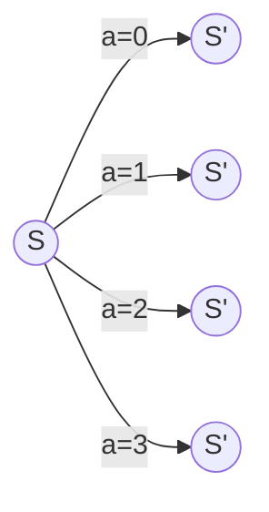

# 强化学习(Reinforcement Learning) - 原理与代码实例讲解

## 1. 背景介绍

### 1.1 强化学习的起源与发展
强化学习(Reinforcement Learning, RL)是机器学习的一个重要分支,其灵感来源于心理学中的"强化"概念。早在20世纪50年代,Richard Sutton和Andrew Barto等先驱就开始了对强化学习的研究。近年来,随着深度学习的兴起,深度强化学习(Deep Reinforcement Learning, DRL)取得了突破性进展,在AlphaGo、自动驾驶、机器人控制等领域展现出了巨大的应用前景。

### 1.2 强化学习的定义与特点  
强化学习是一种让智能体(agent)通过与环境的交互来学习最优策略的机器学习方法。与监督学习和非监督学习不同,强化学习没有预先给定的标签数据,而是通过最大化累积奖励来不断优化策略。强化学习具有以下特点:

- 通过试错学习:智能体通过探索不同的动作,观察环境反馈,不断调整策略
- 延迟奖励:当前动作可能影响未来的状态和奖励,需要考虑长期回报  
- 序列决策:每个决策都要考虑对后续状态和奖励的影响

### 1.3 强化学习的应用场景
强化学习在很多领域都有广泛应用,例如:

- 游戏AI:AlphaGo、Dota2 AI等
- 自动驾驶:让智能体学习驾驶策略
- 机器人控制:机械臂操作、四足机器人运动控制等
- 推荐系统:根据用户反馈动态调整推荐策略
- 智能电网:优化电力调度与能源管理

## 2. 核心概念与联系

### 2.1 马尔可夫决策过程(MDP) 
马尔可夫决策过程是强化学习的理论基础。一个MDP由以下要素构成:

- 状态空间 $\mathcal{S}$:所有可能的环境状态集合
- 动作空间 $\mathcal{A}$:智能体在每个状态下可以采取的动作集合
- 状态转移概率 $\mathcal{P}$:从状态 $s$ 采取动作 $a$ 后转移到状态 $s'$ 的概率,即 $p(s'|s,a)$
- 奖励函数 $\mathcal{R}$:在状态 $s$ 采取动作 $a$ 后获得的即时奖励,即 $r(s,a)$
- 折扣因子 $\gamma$:用于平衡即时奖励和未来奖励的权重

MDP的目标是寻找一个最优策略 $\pi^*$,使得在该策略下智能体获得的累积期望奖励最大化:

$$\pi^* = \arg\max_{\pi} \mathbb{E}_{\pi}[\sum_{t=0}^{\infty} \gamma^t r_t]$$

### 2.2 价值函数与贝尔曼方程
价值函数用于评估某个状态或状态-动作对的长期累积奖励。常见的价值函数有:

- 状态价值函数 $V^{\pi}(s)$:在策略 $\pi$ 下状态 $s$ 的期望累积奖励
- 动作价值函数 $Q^{\pi}(s,a)$:在策略 $\pi$ 下状态 $s$ 采取动作 $a$ 的期望累积奖励

状态价值函数和动作价值函数满足贝尔曼方程:

$$V^{\pi}(s) = \sum_{a} \pi(a|s) \sum_{s',r} p(s',r|s,a) [r + \gamma V^{\pi}(s')]$$

$$Q^{\pi}(s,a) = \sum_{s',r} p(s',r|s,a) [r + \gamma \sum_{a'} \pi(a'|s') Q^{\pi}(s',a')]$$

最优价值函数 $V^*(s)$ 和 $Q^*(s,a)$ 满足最优贝尔曼方程:

$$V^*(s) = \max_{a} \sum_{s',r} p(s',r|s,a) [r + \gamma V^*(s')]$$  

$$Q^*(s,a) = \sum_{s',r} p(s',r|s,a) [r + \gamma \max_{a'} Q^*(s',a')]$$

### 2.3 探索与利用的权衡
在强化学习中,智能体需要在探索(exploration)和利用(exploitation)之间权衡:

- 探索:尝试新的动作,收集更多信息,发现可能更优的策略
- 利用:采取当前已知的最优动作,获得更多奖励

常见的探索策略有:

- $\epsilon$-贪婪($\epsilon$-greedy):以 $\epsilon$ 的概率随机探索,以 $1-\epsilon$ 的概率采取当前最优动作
- 软性最大值(Softmax):根据动作的价值函数计算采取每个动作的概率

## 3. 核心算法原理与具体操作步骤

### 3.1 值迭代(Value Iteration)

值迭代是一种基于动态规划的强化学习算法,通过迭代更新状态价值函数来寻找最优策略。具体步骤如下:

1. 初始化状态价值函数 $V(s)$,通常设为0
2. 重复以下步骤直到收敛:
   - 对每个状态 $s \in \mathcal{S}$,更新状态价值:
   
     $$V(s) \leftarrow \max_{a} \sum_{s',r} p(s',r|s,a) [r + \gamma V(s')]$$
     
3. 根据收敛后的状态价值函数得到最优策略:

   $$\pi^*(s) = \arg\max_{a} \sum_{s',r} p(s',r|s,a) [r + \gamma V^*(s')]$$

### 3.2 策略迭代(Policy Iteration)

策略迭代通过交替执行策略评估(policy evaluation)和策略提升(policy improvement)来寻找最优策略。具体步骤如下:

1. 初始化一个随机策略 $\pi$
2. 重复以下步骤直到策略收敛:
   - 策略评估:固定当前策略,通过解贝尔曼方程计算 $V^{\pi}(s)$
   - 策略提升:根据 $V^{\pi}(s)$ 更新策略:
   
     $$\pi'(s) = \arg\max_{a} \sum_{s',r} p(s',r|s,a) [r + \gamma V^{\pi}(s')]$$
     
   - 如果 $\pi'=\pi$,则算法收敛,否则令 $\pi \leftarrow \pi'$

### 3.3 蒙特卡洛方法(Monte Carlo Methods)

蒙特卡洛方法通过采样完整的状态-动作序列来估计动作价值函数。具体步骤如下:

1. 初始化动作价值函数 $Q(s,a)$,通常设为0
2. 重复以下步骤多个回合(episode):
   - 根据当前策略 $\pi$ 生成一个状态-动作序列 $\{s_0,a_0,r_1,s_1,a_1,\dots,s_{T-1},a_{T-1},r_T\}$
   - 对每个时间步 $t=0,1,\dots,T-1$:
     - 计算回报 $G_t = \sum_{k=t+1}^{T} \gamma^{k-t-1} r_k$
     - 更新动作价值函数:
     
       $$Q(s_t,a_t) \leftarrow Q(s_t,a_t) + \alpha [G_t - Q(s_t,a_t)]$$
       
       其中 $\alpha$ 是学习率
       
3. 根据最终的动作价值函数得到最优策略:

   $$\pi^*(s) = \arg\max_{a} Q(s,a)$$

### 3.4 时序差分学习(Temporal Difference Learning)

时序差分学习结合了动态规划和蒙特卡洛方法的思想,通过引导(bootstrap)的方式更新价值函数。常见的算法有:

- Sarsa:基于状态-动作对的 TD(0) 算法
- Q-learning:基于状态-动作对的离策略 TD(0) 算法
- TD($\lambda$):使用资格迹(eligibility trace)的 TD 算法

以 Q-learning 为例,其具体步骤如下:

1. 初始化动作价值函数 $Q(s,a)$,通常设为0
2. 重复以下步骤多个回合:
   - 初始化状态 $s$
   - 重复以下步骤直到回合结束:
     - 根据当前的 $Q(s,a)$ 选择动作 $a$,通常使用 $\epsilon$-贪婪策略
     - 执行动作 $a$,观察奖励 $r$ 和下一个状态 $s'$
     - 更新动作价值函数:
     
       $$Q(s,a) \leftarrow Q(s,a) + \alpha [r + \gamma \max_{a'} Q(s',a') - Q(s,a)]$$
       
     - 令 $s \leftarrow s'$

3. 根据最终的动作价值函数得到最优策略:

   $$\pi^*(s) = \arg\max_{a} Q(s,a)$$

## 4. 数学模型和公式详细讲解举例说明

### 4.1 马尔可夫决策过程(MDP)举例

考虑一个简单的网格世界环境,如下图所示:



- 状态空间 $\mathcal{S}=\{(i,j)|1 \leq i,j \leq 3\}$,共9个状态
- 动作空间 $\mathcal{A}=\{0,1,2,3\}$,分别表示上、右、下、左
- 状态转移:执行动作后,有 $80\%$ 的概率按照预期方向移动,有 $20\%$ 的概率随机移动到其他相邻状态
- 奖励函数:到达目标状态 $(3,3)$ 时得到 $+1$ 的奖励,其余状态奖励为 $0$
- 折扣因子 $\gamma=0.9$

求解这个MDP的目标是寻找一个最优策略,使得智能体能够以最少的步数到达目标状态。

### 4.2 贝尔曼方程与价值函数举例

以上述网格世界为例,假设我们有一个策略 $\pi$,在每个状态下以相同的概率选择四个动作。那么,状态 $(1,1)$ 的状态价值函数可以表示为:

$$V^{\pi}(1,1) = \sum_{a} \pi(a|1,1) \sum_{s',r} p(s',r|1,1,a) [r + \gamma V^{\pi}(s')]$$

$$= 0.25 \times (0.8 \times [0 + 0.9V^{\pi}(1,2)] + 0.1 \times [0 + 0.9V^{\pi}(2,1)] + 0.1 \times [0 + 0.9V^{\pi}(1,1)])$$
$$+ 0.25 \times (0.8 \times [0 + 0.9V^{\pi}(2,1)] + 0.1 \times [0 + 0.9V^{\pi}(1,2)] + 0.1 \times [0 + 0.9V^{\pi}(1,1)])$$
$$+ 0.25 \times (0.8 \times [0 + 0.9V^{\pi}(1,1)] + 0.1 \times [0 + 0.9V^{\pi}(1,2)] + 0.1 \times [0 + 0.9V^{\pi}(2,1)])$$
$$+ 0.25 \times (0.8 \times [0 + 0.9V^{\pi}(1,1)] + 0.1 \times [0 + 0.9V^{\pi}(2,1)] + 0.1 \times [0 + 0.9V^{\pi}(1,2)])$$

化简后得到:

$$V^{\pi}(1,1) = 0.18V^{\pi}(1,2) + 0.18V^{\pi}(2,1) + 0.64V^{\pi}(1,1)$$

类似地,我们可以写出其他状态的贝尔曼方程,形成一个线性方程组。求解该方程组即可得到在策略 $\pi$ 下每个状态的价值函数。

## 5. 项目实践:代码实例和详细解释说明

下面我们以 Q-learning 算法为例,用 Python 实现在网格世界环境中寻找最优策略的过程。

```python
import numpy as np

# 定义网格世界环境
class GridWorld:
    def __init__(self, n=3, gamma=0.9):
        self.n = n  # 网格大小
        self.gamma = gamma