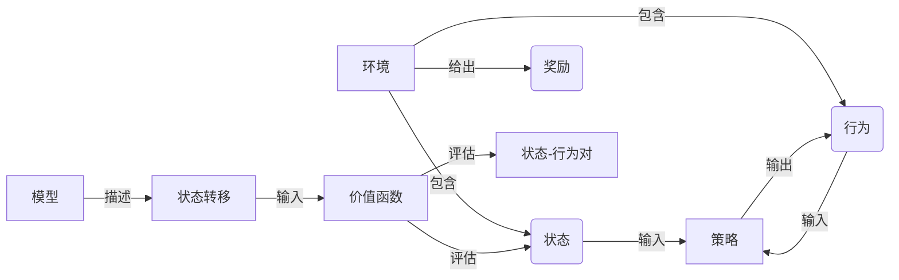

# 强化学习RL原理与代码实例讲解

## 1.背景介绍

### 1.1 什么是强化学习

强化学习(Reinforcement Learning, RL)是机器学习的一个重要分支,它关注于如何基于环境反馈来学习采取最优策略或行为序列,以最大化某种累积奖励。与监督学习不同,强化学习没有给定正确输入/输出对的训练数据,而是通过与环境的互动来学习,这种范式更接近于人类和动物的学习方式。

强化学习的核心思想是让智能体(Agent)通过在环境中尝试各种行为,并根据行为产生的结果获得奖励或惩罚,从而逐步优化其策略,使其能够在未来获得更大的累积奖励。这种以奖励为导向的学习过程使得强化学习能够解决复杂的序列决策问题,如机器人控制、游戏AI、自动驾驶等。

### 1.2 强化学习的重要性

近年来,强化学习在人工智能领域取得了突破性进展,成为推动人工智能发展的重要动力之一。以下是强化学习在实际应用中的一些重要意义:

1. **决策优化**: 强化学习可以帮助智能体学习最优决策序列,从而优化复杂系统的控制和决策过程,提高效率和收益。
2. **自主学习**: 强化学习使智能体能够通过与环境的互动自主学习,无需人工标注的训练数据,这种自主学习能力是通向通用人工智能的关键一步。
3. **复杂环境适应**: 强化学习擅长处理连续状态和行为空间的复杂问题,可以应用于诸如机器人控制、自动驾驶等复杂环境中。
4. **跨领域应用**: 强化学习的思想和方法可以应用于多个领域,如游戏AI、自然语言处理、计算机系统优化等,促进了人工智能的跨领域发展。

## 2.核心概念与联系

强化学习包含了一些核心概念,理解这些概念及其相互关系对于掌握强化学习至关重要。

### 2.1 核心要素

强化学习问题通常由以下几个核心要素构成:

1. **环境(Environment)**: 指智能体所处的外部世界,智能体通过与环境交互来学习。环境会根据智能体的行为给出相应的反馈。

2. **状态(State)**: 描述环境当前的情况,包含了足够的信息来指导智能体做出决策。

3. **行为(Action)**: 智能体在当前状态下可以执行的操作。

4. **奖励(Reward)**: 环境对智能体当前行为的反馈,指导智能体朝着正确的方向学习。

5. **策略(Policy)**: 智能体根据当前状态选择行为的策略或映射函数。

6. **价值函数(Value Function)**: 评估当前状态或状态-行为对在后续获得的累积奖励的期望值。

7. **模型(Model)**: 描述环境的转移规律,即在当前状态执行某个行为后,将转移到新状态并获得奖励的概率分布。

### 2.2 核心概念关系

上述核心概念之间存在紧密的关系,如下所示:

- 环境包含了当前状态和可执行的行为集合,并给出相应的奖励反馈。
- 策略根据当前状态和可执行行为来选择下一步的行为。
- 价值函数评估当前状态或状态-行为对的长期累积奖励期望值。
- 环境模型描述了在执行某个行为后,状态如何转移以及对应的奖励分布,为学习价值函数提供了基础。

理解这些核心概念及其关系,对于掌握强化学习的本质至关重要。接下来,我们将详细介绍强化学习的核心算法原理和数学模型。

## 3.核心算法原理具体操作步骤

强化学习算法的目标是找到一个最优策略,使得在该策略指导下,智能体能够获得最大的期望累积奖励。主要的算法思路包括价值迭代和策略迭代两大类。

### 3.1 价值迭代

价值迭代的核心思想是首先评估出每个状态的价值函数(状态价值函数或状态-行为价值函数),然后根据价值函数导出相应的最优策略。具体步骤如下:

1. 初始化价值函数,通常将所有状态的价值函数设置为0或其他适当的初始值。

2. 更新价值函数,使用贝尔曼方程(Bellman Equation)迭代更新每个状态的价值函数,直到收敛。贝尔曼方程描述了当前状态的价值函数与下一状态的价值函数之间的递推关系。

3. 根据更新后的价值函数,对每个状态选择具有最大价值的行为,构建出最优策略。

常见的基于价值迭代的算法包括时序差分学习(Temporal Difference Learning, TD)和Q-Learning等。

#### 3.1.1 时序差分学习(TD)

时序差分学习的核心思想是通过估计当前状态价值函数与实际获得的奖励加上下一状态价值函数之间的差值(时序差分误差),来更新当前状态的价值函数。具体步骤如下:

1. 初始化状态价值函数 $V(s)$,通常将所有状态的价值函数设置为0或其他适当的初始值。

2. 选择一个行为策略 $\pi$,可以是任意策略,包括贪婪策略或探索策略。

3. 在每个时间步,智能体根据策略 $\pi$ 选择一个行为 $a$,执行该行为并观察到下一个状态 $s'$ 和即时奖励 $r$。

4. 计算时序差分误差:

   $$\delta = r + \gamma V(s') - V(s)$$

   其中 $\gamma$ 是折现因子,用于权衡未来奖励的重要性。

5. 使用时序差分误差更新当前状态的价值函数:

   $$V(s) \leftarrow V(s) + \alpha \delta$$

   其中 $\alpha$ 是学习率,控制更新的幅度。

6. 将当前状态设置为下一状态 $s \leftarrow s'$,重复步骤3-5,直到价值函数收敛或达到终止条件。

7. 根据收敛后的状态价值函数,对每个状态选择具有最大价值的行为,构建出最优策略。

时序差分学习的优点是能够有效利用连续经验进行增量式学习,无需等待完整序列结束即可更新价值函数,从而提高了学习效率。

#### 3.1.2 Q-Learning

Q-Learning是一种著名的基于价值迭代的强化学习算法,它直接学习状态-行为价值函数 $Q(s, a)$,而不是先学习状态价值函数 $V(s)$。具体步骤如下:

1. 初始化状态-行为价值函数 $Q(s, a)$,通常将所有状态-行为对的价值函数设置为0或其他适当的初始值。

2. 对于每个时间步:
   - 观察当前状态 $s$
   - 选择一个行为 $a$,可以使用 $\epsilon$-贪婪策略或其他探索策略
   - 执行行为 $a$,观察到下一个状态 $s'$ 和即时奖励 $r$
   - 更新状态-行为价值函数:

     $$Q(s, a) \leftarrow Q(s, a) + \alpha \left[r + \gamma \max_{a'} Q(s', a') - Q(s, a)\right]$$

     其中 $\alpha$ 是学习率, $\gamma$ 是折现因子。

3. 将当前状态设置为下一状态 $s \leftarrow s'$,重复步骤2,直到收敛或达到终止条件。

4. 根据收敛后的状态-行为价值函数,对每个状态选择具有最大价值的行为,构建出最优策略:

   $$\pi(s) = \arg\max_a Q(s, a)$$

Q-Learning的优点是直接学习状态-行为价值函数,无需先估计状态价值函数,从而简化了学习过程。它也具有时序差分学习的优点,能够有效利用连续经验进行增量式学习。

### 3.2 策略迭代

策略迭代的核心思想是先假设一个策略,然后评估该策略的价值函数,再根据评估结果对策略进行改进,重复这个过程直到收敛到最优策略。具体步骤如下:

1. 初始化一个策略 $\pi_0$,可以是任意策略。

2. 对当前策略 $\pi_i$ 进行策略评估,计算出每个状态的价值函数 $V^{\pi_i}(s)$。常用的评估方法包括迭代策略评估和时序差分评估等。

3. 根据评估得到的价值函数 $V^{\pi_i}(s)$,对策略进行改进,得到新的策略 $\pi_{i+1}$:

   $$\pi_{i+1}(s) = \arg\max_a \sum_{s'} P_{ss'}^a \left[R_{ss'}^a + \gamma V^{\pi_i}(s')\right]$$

   其中 $P_{ss'}^a$ 是在状态 $s$ 执行行为 $a$ 后转移到状态 $s'$ 的概率, $R_{ss'}^a$ 是对应的期望即时奖励。

4. 重复步骤2-3,直到策略收敛到最优策略 $\pi^*$。

常见的基于策略迭代的算法包括策略梯度算法等。

#### 3.2.1 策略梯度算法

策略梯度算法是一种直接对策略进行参数化,并通过梯度上升来优化策略参数的方法。具体步骤如下:

1. 参数化策略 $\pi_\theta(a|s)$,其中 $\theta$ 是策略的参数向量。常用的参数化方法包括软最大值(Softmax)策略等。

2. 定义目标函数 $J(\theta)$,通常是期望累积奖励的函数:

   $$J(\theta) = \mathbb{E}_{\tau \sim \pi_\theta}\left[\sum_{t=0}^{T} \gamma^t r_t\right]$$

   其中 $\tau$ 是一个由策略 $\pi_\theta$ 生成的轨迹序列,包含了状态、行为和奖励等信息。

3. 计算目标函数 $J(\theta)$ 相对于策略参数 $\theta$ 的梯度:

   $$\nabla_\theta J(\theta) = \mathbb{E}_{\tau \sim \pi_\theta}\left[\sum_{t=0}^{T} \nabla_\theta \log \pi_\theta(a_t|s_t) Q^{\pi_\theta}(s_t, a_t)\right]$$

   其中 $Q^{\pi_\theta}(s_t, a_t)$ 是在策略 $\pi_\theta$ 下,状态-行为对 $(s_t, a_t)$ 的价值函数。

4. 使用梯度上升法更新策略参数:

   $$\theta \leftarrow \theta + \alpha \nabla_\theta J(\theta)$$

   其中 $\alpha$ 是学习率。

5. 重复步骤3-4,直到策略收敛或达到终止条件。

策略梯度算法的优点是能够直接优化策略参数,无需先学习价值函数。它也适用于连续行为空间的问题。但是,策略梯度算法通常收敛速度较慢,并且需要估计价值函数或者使用重要性采样等技术来减小方差。

除了上述算法,近年来还出现了一些新的强化学习算法,如深度Q网络(Deep Q-Network, DQN)、策略梯度算法的改进版本(如TRPO、PPO等)、基于模型的算法(如世界模型控制等)等,这些算法结合了深度学习技术,显著提高了强化学习在复杂环境下的性能。

## 4.数学模型和公式详细讲解举例说明

强化学习中有许多重要的数学模型和公式,理解这些模型和公式对于掌握强化学习的