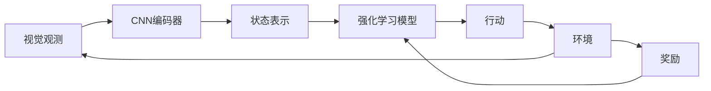

# 强化学习Reinforcement Learning与计算机视觉结合的趋势分析

## 1. 背景介绍
### 1.1 强化学习的定义与特点
强化学习(Reinforcement Learning, RL)是机器学习的一个重要分支,其目标是让智能体(Agent)在与环境的交互过程中学习最优策略,从而获得最大的累积奖励。与监督学习和非监督学习不同,强化学习不需要预先准备好标注数据,而是通过不断试错和反馈来优化策略。

强化学习的核心要素包括:
- 智能体(Agent):可以感知环境状态并采取行动的实体
- 环境(Environment):智能体所处的环境,提供状态信息和奖励反馈
- 状态(State):环境的完整描述,或者环境的部分观测
- 行动(Action):智能体能够采取的动作
- 策略(Policy):将状态映射到行动的函数,决定智能体的行为
- 奖励(Reward):环境对智能体行为的即时反馈
- 价值函数(Value Function):衡量某个状态或状态-行动对的长期累积奖励期望

强化学习的优势在于能够自主学习,适应复杂多变的环境。但其也面临一些挑战,如探索-利用困境、信用分配问题、维数灾难等。近年来,深度强化学习(Deep RL)的兴起为解决这些问题提供了新思路。

### 1.2 计算机视觉的发展与应用
计算机视觉(Computer Vision, CV)是人工智能的另一个重要分支,旨在让计算机像人一样"看"和理解视觉世界。传统的计算机视觉方法主要依赖手工设计的特征和算法,如SIFT、HOG等。近年来,以卷积神经网络(CNN)为代表的深度学习方法在图像分类、目标检测、语义分割等任务上取得了突破性进展。

计算机视觉在工业、医疗、安防、自动驾驶等诸多领域有广泛应用。如工业视觉检测、医学影像分析、人脸识别、无人驾驶等。然而,大多数计算机视觉系统仍然是静态的、被动的,缺乏主动探索和适应环境的能力。

### 1.3 强化学习与计算机视觉结合的意义
将强化学习引入计算机视觉,可以让视觉系统具备主动感知、主动探索的能力,更好地适应复杂多变的真实环境。另一方面,视觉信息也可以作为状态输入,帮助强化学习智能体更好地感知和理解环境。二者的结合有望突破传统方法的局限,开创智能视觉系统的新范式。

## 2. 核心概念与联系
### 2.1 马尔可夫决策过程
马尔可夫决策过程(Markov Decision Process, MDP)是描述强化学习问题的经典数学框架。MDP由状态空间S、行动空间A、状态转移概率P、奖励函数R和折扣因子γ组成。在视觉强化学习中,状态通常是图像或图像序列,行动可以是离散的(如前进、后退)或连续的(如机械臂的关节角度)。

### 2.2 卷积神经网络
卷积神经网络(Convolutional Neural Network, CNN)是深度学习中处理图像、视频等网格化数据的主力模型。CNN通过局部连接、权值共享、池化等操作,能够自动提取多尺度、多层次的视觉特征。在视觉强化学习中,CNN通常用于将原始图像编码为紧凑的特征表示,作为强化学习模型的输入。

### 2.3 端到端学习范式
传统的视觉系统通常包含多个独立模块(如特征提取、决策规划等),每个模块需要单独优化。端到端(End-to-End)学习范式则将原始输入直接映射到最终输出,中间过程由神经网络自动学习。将端到端学习应用于视觉强化学习,可以让智能体直接从图像中学习策略,避免了人工设计和调参的繁琐。

### 2.4 Mermaid流程图
下图展示了视觉强化学习系统的典型流程:

## 3. 核心算法原理具体操作步骤
### 3.1 Deep Q-Network (DQN)
DQN是将深度学习与Q学习相结合的经典算法。其核心思想是用深度神经网络(如CNN)近似Q函数,即Q(s,a)。

DQN的主要步骤如下:
1. 初始化Q网络参数θ,目标网络参数θ'=θ
2. 初始化经验回放池D
3. for episode = 1 to M do
4. 初始化初始状态s1
5. for t = 1 to T do
6. 根据ε-greedy策略选择行动at
7. 执行行动at,观测奖励rt和下一状态st+1
8. 将转移样本(st,at,rt,st+1)存入D 
9. 从D中随机采样一批转移样本(sj,aj,rj,sj+1)
10. 计算目标值yj=rj+γ*max(Q(sj+1,a';θ'))
11. 最小化均方误差Loss=(yj-Q(sj,aj;θ))^2,更新Q网络参数θ
12. 每C步将θ'=θ
13. end for
14. end for

### 3.2 Asynchronous Advantage Actor-Critic (A3C)
A3C是一种基于策略梯度的强化学习算法,引入了异步更新和优势函数(Advantage)的思想。A3C在多个并行环境中同时训练多个智能体,并定期同步它们的梯度,以提高训练效率和稳定性。

A3C的主要步骤如下:
1. 初始化全局策略网络参数θ和全局价值网络参数θv
2. 设置并行环境数N,并行智能体数W
3. for w = 1 to W do
4. 初始化本地策略网络参数θ'=θ,本地价值网络参数θv'=θv
5. 设置本地时间步tstart=1
6. while 全局时间步T<=Tmax do
7. 获取初始状态st
8. for t = tstart to tstart+tmax do
9. 根据本地策略网络π(at|st;θ')选择行动at
10. 执行行动at,观测奖励rt和下一状态st+1
11. 计算TD误差δt=rt+γV(st+1;θv')-V(st;θv')
12. 计算优势函数At=δt+γλAt+1
13. 计算策略梯度∇θ'logπ(at|st;θ')At和价值函数梯度∇θv'(At)^2
14. end for
15. 累加梯度并异步更新全局参数θ和θv
16. 每C步将θ'=θ,θv'=θv
17. tstart=t+1
18. end while
19. end for

### 3.3 Deep Deterministic Policy Gradient (DDPG)
DDPG是一种适用于连续动作空间的强化学习算法,结合了DQN和确定性策略梯度(DPG)的思想。DDPG引入了Actor-Critic架构,其中Actor网络输出确定性策略(动作),Critic网络估计状态-动作值函数Q(s,a)。

DDPG的主要步骤如下:
1. 初始化Actor网络μ(s)和Critic网络Q(s,a)的参数θμ和θQ
2. 初始化目标网络μ'和Q'的参数θμ'=θμ,θQ'=θQ
3. 初始化经验回放池R
4. for episode = 1 to M do
5. 初始化初始状态s1和噪声过程N
6. for t = 1 to T do
7. 根据Actor网络和噪声选择行动at=μ(st|θμ)+Nt
8. 执行行动at,观测奖励rt和下一状态st+1
9. 将转移样本(st,at,rt,st+1)存入R
10. 从R中随机采样一批转移样本(si,ai,ri,si+1) 
11. 计算目标值yi=ri+γQ'(si+1,μ'(si+1|θμ')|θQ')
12. 最小化Critic网络损失L=(yi-Q(si,ai|θQ))^2,更新θQ
13. 计算Actor网络梯度∇θμJ=1/N*Σ∇aQ(s,a|θQ)|s=si,a=μ(si)∇θμμ(s|θμ)|si
14. 根据梯度∇θμJ更新Actor网络参数θμ
15. 软更新目标网络参数θμ'←τθμ+(1-τ)θμ',θQ'←τθQ+(1-τ)θQ'
16. end for
17. end for

## 4. 数学模型和公式详细讲解举例说明
### 4.1 Q学习的Bellman方程
Q学习的核心是学习最优的状态-行动值函数Q*(s,a),它满足Bellman最优方程:

$$Q^*(s,a)=\mathbb{E}[r+\gamma \max_{a'}Q^*(s',a')|s,a]$$

其中,$s'$是在状态$s$下执行行动$a$后转移到的下一个状态,$r$是获得的奖励,$\gamma$是折扣因子。这个方程表明,最优Q值等于即时奖励和下一状态最优Q值的折扣和的期望。

在DQN算法中,我们用函数逼近器$Q(s,a;\theta)$来近似$Q^*(s,a)$,其中$\theta$是可学习的参数。DQN的损失函数为:

$$L(\theta)=\mathbb{E}_{(s,a,r,s')\sim D}[(r+\gamma \max_{a'}Q(s',a';\theta^-)-Q(s,a;\theta))^2]$$

其中,$D$是经验回放池,$(s,a,r,s')$是从$D$中采样的转移样本,$\theta^-$是目标网络的参数。这个损失函数鼓励Q网络的预测值与目标值接近。

### 4.2 策略梯度定理
策略梯度定理给出了期望累积奖励(目标函数)对策略参数的梯度:

$$\nabla_\theta J(\theta)=\mathbb{E}_{\tau\sim p_\theta(\tau)}[\sum_{t=0}^{T-1}\nabla_\theta \log \pi_\theta(a_t|s_t)Q^{\pi_\theta}(s_t,a_t)]$$

其中,$\tau$是一条轨迹$(s_0,a_0,r_0,s_1,a_1,r_1,...,s_T)$,$p_\theta(\tau)$是轨迹的概率密度函数,$\pi_\theta(a|s)$是随机性策略,$Q^{\pi_\theta}(s,a)$是在策略$\pi_\theta$下状态-行动对$(s,a)$的价值。

在A3C算法中,我们用优势函数$A^{\pi_\theta}(s,a)$来替代$Q^{\pi_\theta}(s,a)$,以减少方差:

$$A^{\pi_\theta}(s_t,a_t)=\sum_{t'=t}^{T-1}\gamma^{t'-t}r_{t'}-V^{\pi_\theta}(s_t)$$

其中,$V^{\pi_\theta}(s)$是状态价值函数。优势函数度量了在状态$s_t$下采取行动$a_t$相对于平均而言有多好。

### 4.3 确定性策略梯度定理
确定性策略梯度定理类似于策略梯度定理,但适用于确定性策略$\mu_\theta(s)$:

$$\nabla_\theta J(\theta)=\mathbb{E}_{s\sim \rho^{\mu_\theta}}[\nabla_\theta \mu_\theta(s)\nabla_a Q^{\mu_\theta}(s,a)|_{a=\mu_\theta(s)}]$$

其中,$\rho^{\mu_\theta}$是策略$\mu_\theta$诱导的状态边缘分布。这个定理表明,策略梯度等于状态值函数对动作的梯度在策略动作处的值,再对状态求期望。

在DDPG算法中,我们用Critic网络$Q(s,a;\theta_Q)$来近似$Q^{\mu_\theta}(s,a)$,用Actor网络$\mu(s;\theta_\mu)$来表示确定性策略。Actor网络的更新梯度为:

$$\nabla_{\theta_\mu}J\approx \frac{1}{N}\sum_{i=1}^N \nabla_a Q(s,a;\theta_Q)|_{s=s_