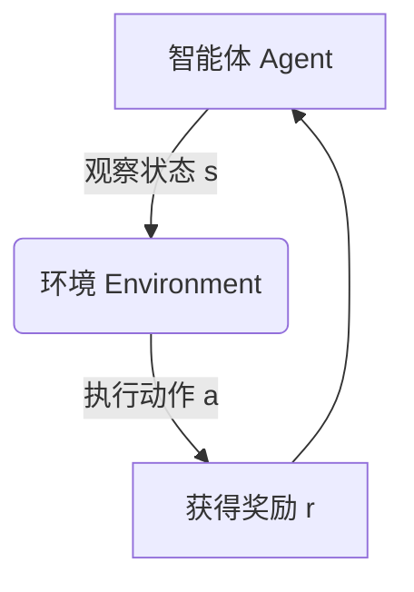
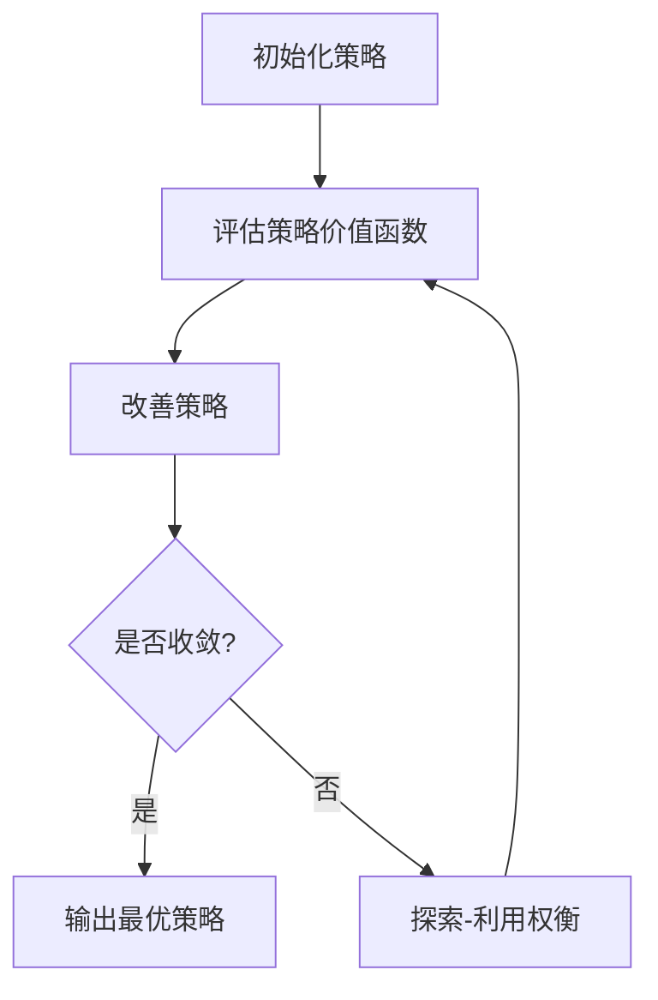

# 强化学习Reinforcement Learning在智慧交通系统中的创新应用

## 1.背景介绍

### 1.1 智慧交通系统概述

随着城市化进程的加快,交通拥堵、环境污染等问题日益严重,亟需建立一种高效、绿色、智能的交通管理系统来应对这些挑战。智慧交通系统(Intelligent Transportation System,ITS)应运而生,它是一种利用先进的信息技术、数据通信传输技术、电子传感器技术、计算机技术、控制技术以及其他现代化技术,对整个交通运行系统进行指挥、控制和管理的综合交通运输管理系统。

智慧交通系统的主要目标包括:

1. 提高交通运输效率,缓解交通拥堵
2. 增强交通运输安全性,减少交通事故
3. 节约能源,减少环境污染
4. 提高交通运输的舒适性和便利性
5. 实现交通资源的优化配置

### 1.2 智慧交通系统中的关键技术

实现智慧交通系统需要多种先进技术的融合,其中人工智能技术扮演着重要角色。传统的交通控制系统主要依赖于预设的规则和固定的策略,难以处理复杂多变的实际交通情况。而人工智能技术,特别是强化学习(Reinforcement Learning),能够通过与环境的互动来自主学习最优策略,从而实现更加智能化的交通管理和决策。

## 2.核心概念与联系  

### 2.1 强化学习概述

强化学习是机器学习的一个重要分支,它研究如何基于环境反馈来学习行为策略,以最大化长期累积奖励。在强化学习中,智能体(Agent)通过与环境(Environment)进行交互,观察当前状态(State),执行动作(Action),并获得奖励(Reward)。智能体的目标是学习一个最优策略(Policy),使得在给定状态下采取相应动作,能够获得最大的累积奖励。

强化学习的核心思想是"试错学习",通过不断尝试不同的行为,并根据获得的反馈来调整策略,最终找到最优解决方案。与监督学习不同,强化学习没有提供正确答案的训练数据,而是需要智能体自主探索环境,从经验中学习。



### 2.2 强化学习在智慧交通系统中的应用

在智慧交通系统中,可以将交通参与者(如车辆、行人等)视为智能体,将道路网络视为环境。智能体的目标是学习一个最优策略,以实现高效、安全、绿色的出行。具体来说,强化学习可以应用于以下几个方面:

1. **交通信号控制**: 根据实时交通流量,动态调整路口信号灯的时长和相位,以减少拥堵和等待时间。
2. **车辆路径规划**: 为车辆提供最优路径,避开拥堵路段,缩短出行时间。
3. **车辆调度优化**: 优化公交、物流等车辆的调度,提高运营效率。
4. **自动驾驶决策**: 训练自动驾驶系统在复杂交通场景下做出正确决策。
5. **交通需求管理**: 通过激励措施引导交通参与者改变出行模式,缓解交通压力。

## 3.核心算法原理具体操作步骤

强化学习算法通常可分为三个核心模块:策略评估(Policy Evaluation)、策略改善(Policy Improvement)和探索-利用权衡(Exploration-Exploitation Trade-off)。

### 3.1 策略评估

策略评估的目标是评估当前策略的价值函数(Value Function),即在遵循该策略时,每个状态能获得的预期累积奖励。常用的策略评估方法有:

1. **蒙特卡罗评估**(Monte Carlo Evaluation):通过采样模拟,计算实际获得的回报的均值作为价值函数的估计。
2. **时序差分学习**(Temporal Difference Learning):利用贝尔曼方程,递推估计价值函数。

### 3.2 策略改善

基于评估得到的价值函数,策略改善旨在生成一个比当前策略更优的新策略。常用的策略改善方法有:

1. **贪婪策略改善**(Greedy Policy Improvement):对于每个状态,选择能获得最大预期回报的动作作为新策略。
2. **策略梯度方法**(Policy Gradient Methods):直接对策略进行参数化建模,并通过梯度上升等优化算法来更新策略参数。

### 3.3 探索-利用权衡

在学习过程中,智能体需要在"探索"(Exploration)和"利用"(Exploitation)之间寻求平衡。探索是指尝试新的行为,以发现更优的策略;而利用是指基于当前已学习的知识采取最优行为,以获得最大回报。常用的探索-利用策略有:

1. **ε-贪婪策略**(ε-Greedy):以一定概率ε随机选择动作(探索),以概率1-ε选择当前已知的最优动作(利用)。
2. **软更新规则**(Softmax Rule):根据动作价值的软最大化原则,将更高价值的动作分配更高的选择概率。

强化学习算法通常采用迭代的方式,反复执行策略评估、策略改善和探索-利用,直至收敛到最优策略。具体操作步骤如下:



1. 初始化一个随机或预设的策略。
2. 评估当前策略的价值函数。
3. 基于价值函数,改善策略。
4. 判断策略是否收敛(如价值函数收敛到稳定值)。若收敛,输出最优策略;否则进入下一步。
5. 根据探索-利用策略,选择下一步的动作。
6. 重复步骤2-5,直至收敛。

## 4.数学模型和公式详细讲解举例说明  

### 4.1 马尔可夫决策过程(MDP)

强化学习问题通常建模为马尔可夫决策过程(Markov Decision Process, MDP)。MDP是一种数学框架,用于描述一个完全可观测的、随机的、有序的决策过程。

MDP由以下五元组组成:

$$\langle \mathcal{S}, \mathcal{A}, \mathcal{P}, \mathcal{R}, \gamma \rangle$$

- $\mathcal{S}$是有限的状态集合
- $\mathcal{A}$是有限的动作集合
- $\mathcal{P}$是状态转移概率函数,定义为$\mathcal{P}_{ss'}^a = \mathbb{P}(S_{t+1}=s'|S_t=s, A_t=a)$,表示在状态$s$执行动作$a$后,转移到状态$s'$的概率
- $\mathcal{R}$是奖励函数,定义为$\mathcal{R}_s^a = \mathbb{E}[R_{t+1}|S_t=s, A_t=a]$,表示在状态$s$执行动作$a$后,获得的预期奖励
- $\gamma \in [0, 1)$是折现因子,用于权衡未来奖励的重要性

在智慧交通系统中,可以将交通网络建模为MDP:

- 状态$s$可以表示交通参与者的位置、速度等信息
- 动作$a$可以表示交通参与者的行为,如加速、减速、改变车道等
- 状态转移概率$\mathcal{P}$描述了交通参与者从一个状态转移到另一个状态的概率
- 奖励函数$\mathcal{R}$可以根据出行时间、能耗、安全性等指标设计
- 折现因子$\gamma$控制了对未来奖励的权重

智能体的目标是学习一个最优策略$\pi^*$,使得在任意初始状态$s_0$下,按照该策略执行动作序列,能够获得最大化的预期累积折现奖励:

$$\pi^* = \arg\max_\pi \mathbb{E}_\pi \left[ \sum_{t=0}^\infty \gamma^t R_{t+1} | S_0 = s_0 \right]$$

### 4.2 价值函数和贝尔曼方程

在强化学习中,我们通常使用价值函数(Value Function)来评估一个策略的好坏。价值函数定义为在当前状态下遵循某一策略,能够获得的预期累积折现奖励。

对于策略$\pi$,状态$s$的价值函数$V^\pi(s)$定义为:

$$V^\pi(s) = \mathbb{E}_\pi \left[ \sum_{t=0}^\infty \gamma^t R_{t+1} | S_0 = s \right]$$

同样,我们可以定义状态-动作对$(s, a)$的价值函数$Q^\pi(s, a)$,表示在状态$s$执行动作$a$,之后遵循策略$\pi$所能获得的预期累积折现奖励:

$$Q^\pi(s, a) = \mathbb{E}_\pi \left[ \sum_{t=0}^\infty \gamma^t R_{t+1} | S_0 = s, A_0 = a \right]$$

价值函数满足一组重要的递推方程,称为贝尔曼方程(Bellman Equations):

$$\begin{aligned}
V^\pi(s) &= \sum_{a \in \mathcal{A}} \pi(a|s) \left( \mathcal{R}_s^a + \gamma \sum_{s' \in \mathcal{S}} \mathcal{P}_{ss'}^a V^\pi(s') \right) \\
Q^\pi(s, a) &= \mathcal{R}_s^a + \gamma \sum_{s' \in \mathcal{S}} \mathcal{P}_{ss'}^a V^\pi(s')
\end{aligned}$$

贝尔曼方程为我们提供了一种计算价值函数的方法,即通过当前奖励加上折现的未来状态价值的期望值。这种递推关系使得我们可以基于样本经验,而不是完整的模型,来估计价值函数。

### 4.3 Q-Learning算法

Q-Learning是强化学习中一种著名的无模型算法,它不需要事先了解环境的转移概率和奖励函数,而是通过与环境的互动来直接学习最优策略。

Q-Learning的核心思想是,使用一个参数化的函数$Q(s, a; \theta)$来近似真实的Q函数$Q^\pi(s, a)$,并通过不断更新参数$\theta$来最小化两者之间的差异。更新规则如下:

$$Q(S_t, A_t; \theta) \leftarrow Q(S_t, A_t; \theta) + \alpha \left[ R_{t+1} + \gamma \max_{a'} Q(S_{t+1}, a'; \theta) - Q(S_t, A_t; \theta) \right]$$

其中$\alpha$是学习率,控制着每次更新的步长。

可以证明,在适当的条件下,Q-Learning算法将converge到最优Q函数$Q^*(s, a)$,并且最优策略$\pi^*$可以简单地通过在每个状态$s$选择具有最大Q值的动作$a$来获得:

$$\pi^*(s) = \arg\max_a Q^*(s, a)$$

Q-Learning算法的伪代码如下:

```
初始化 Q(s, a) 为任意值
for each episode:
    初始化状态 s
    while s 不是终止状态:
        从 s 中选择动作 a,使用 epsilon-greedy 策略
        执行动作 a,观察奖励 r 和新状态 s'
        Q(s, a) = Q(s, a) + alpha * (r + gamma * max(Q(s', a')) - Q(s, a))
        s = s'
```

Q-Learning广泛应用于智能体在复杂环境中的决策和控制问题,包括智慧交通系统中的交通信号控制、车辆路径规划等场景。

## 5.项目实践:代码实例和详细解释说明

为了更好地理解强化学习在智慧交通系统中的应用,我们将通过一个简单的交通信号控制示例,演示如何使用Q-Learning算法来优化信号灯时长。

### 5.1 问题描述

假设有一个单车道路口,车辆按照泊松分布到达。我