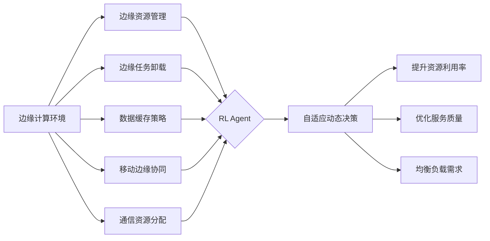

# 强化学习Reinforcement Learning在边缘计算中的应用前景

## 1.背景介绍
### 1.1 边缘计算的兴起
随着物联网、5G通信、人工智能等技术的快速发展,海量的数据在网络边缘侧产生。传统的云计算模式难以满足实时性、隐私安全等需求。边缘计算应运而生,其将计算、存储、网络资源部署在靠近数据源或用户的网络边缘,提供低时延、高带宽、隐私保护的分布式计算模式。

### 1.2 强化学习的发展
强化学习(Reinforcement Learning,RL)是一种重要的机器学习范式。不同于监督学习需要标注数据,RL智能体(Agent)通过与环境的交互,根据反馈的奖励信号不断优化策略,最大化长期累积奖励。近年来,RL在AlphaGo、自动驾驶、机器人控制等领域取得重大突破,展现出广阔的应用前景。

### 1.3 RL与边缘计算的结合
将RL引入边缘计算,可充分利用边缘设备的计算与存储资源,实现自适应、自优化的智能决策。在动态变化的网络环境中,RL可根据实时的状态反馈动态调整策略,提高资源利用率,改善服务质量。本文将探讨RL在边缘计算中的应用,阐述核心概念、算法原理、实践案例,展望其未来发展。

## 2.核心概念与联系
### 2.1 边缘计算的关键特征
- 靠近数据源:数据在边缘侧产生与处理,减少数据传输
- 分布式部署:计算任务分散到多个边缘节点协同完成  
- 异构性:边缘设备计算能力、通信条件差异大
- 资源受限:边缘节点计算、存储、能量资源有限
- 动态性:网络拓扑、负载需求、无线信道状况动态变化

### 2.2 强化学习的核心要素  
- 智能体(Agent):做出决策和执行动作的主体
- 环境(Environment):智能体所处的环境,接收动作、反馈状态和奖励
- 状态(State):环境在某一时刻的表征
- 动作(Action):智能体根据策略做出的决策
- 策略(Policy):状态到动作的映射,即给定状态下应采取的动作
- 奖励(Reward):环境对智能体动作的即时反馈
- 价值函数(Value Function):衡量状态或状态-动作对的长期累积奖励

### 2.3 RL在边缘计算中的应用形式
- 边缘资源管理:通过RL动态调度计算、存储资源,优化资源利用率
- 边缘任务卸载:RL智能体根据任务特征、负载状况、通信条件等决策任务卸载
- 数据缓存策略:利用RL根据内容流行度、用户偏好等制定缓存策略,提高缓存命中率  
- 移动边缘协同:多智能体RL协调多个边缘节点,实现负载均衡、能效优化
- 通信资源分配:RL动态分配无线信道、功率等通信资源,保障服务质量

下图展示了RL在边缘计算中的应用形式及其相互关系:



## 3.核心算法原理具体操作步骤
RL算法主要包括基于值(Value-based)、基于策略(Policy-based)和基于模型(Model-based)三大类。本节重点介绍Q-learning和策略梯度两种经典算法在边缘计算中的应用。

### 3.1 Q-learning
Q-learning是一种值迭代型无模型RL算法。其核心是学习动作-价值函数(Action-Value Function) $Q(s,a)$,表示在状态 $s$ 下选择动作 $a$ 的长期累积奖励期望。

#### Q-learning的更新过程:
1. 初始化Q表格 $Q(s,a)$
2. 重复迭代直到收敛:
   1) 根据 $\varepsilon$-贪婪策略选择动作 $a_t$,即以 $\varepsilon$ 的概率随机探索,否则选择Q值最大的动作
   2) 执行动作 $a_t$ ,观察奖励 $r_{t+1}$ 和下一状态 $s_{t+1}$
   3) 更新Q值:
      $Q(s_t,a_t) \leftarrow Q(s_t,a_t) + \alpha [r_{t+1} + \gamma \max_a Q(s_{t+1},a) - Q(s_t,a_t)]$
      其中 $\alpha$ 为学习率, $\gamma$ 为折扣因子
   4) $s_t \leftarrow s_{t+1}$
3. 输出最优策略 $\pi^*(s) = \arg\max_a Q^*(s,a)$

在边缘计算场景下,状态可以表示为各边缘节点的资源利用率、任务队列长度等,动作可以是任务卸载决策或资源分配方案。通过Q-learning,智能体可学习到最优的任务调度策略。

### 3.2 策略梯度 Policy Gradient
策略梯度直接对策略函数 $\pi_\theta(a|s)$ 的参数 $\theta$ 进行优化,其目标是最大化期望累积奖励 $J(\theta) = \mathbb{E}_{\pi_\theta}[\sum_{t=0}^{\infty} \gamma^t r_t]$。

#### 策略梯度的更新过程:
1. 随机初始化策略网络参数 $\theta$
2. 重复迭代直到收敛:
   1) 根据当前策略 $\pi_\theta$ 与环境交互,收集一批轨迹数据 $\{(s_t,a_t,r_t)\}$
   2) 计算每个时间步的回报 $G_t = \sum_{k=0}^{\infty} \gamma^k r_{t+k}$
   3) 计算策略梯度:
      $\nabla_\theta J(\theta) = \mathbb{E}_{\pi_\theta}[G_t \nabla_\theta \log \pi_\theta(a_t|s_t)]$
   4) 通过梯度上升更新策略网络参数:
      $\theta \leftarrow \theta + \alpha \nabla_\theta J(\theta)$
3. 输出优化后的策略网络 $\pi_\theta^*$

在边缘计算中,策略网络可根据边缘节点状态、任务属性等特征,输出任务卸载、资源分配的概率分布。通过策略梯度算法,可不断优化策略网络,使其生成更优的决策。

## 4.数学模型和公式详细讲解举例说明
本节以边缘任务卸载为例,详细阐述如何建立RL数学模型,并给出相关公式推导。

### 4.1 系统模型
考虑一个多用户移动边缘计算场景,包含一个基站和多个移动用户。每个用户有一个计算任务需要处理,可以选择在本地执行或卸载到基站。用户的目标是在时延和能耗约束下,最小化任务处理成本。

### 4.2 RL建模
- 状态空间 $\mathcal{S}$:表示所有用户任务的特征(如任务大小、运算量等)和基站的计算资源状态。
- 动作空间 $\mathcal{A}$:每个用户的动作 $a_i \in \{0,1\}$ 表示在本地处理或卸载到基站,联合动作 $\boldsymbol{a} = (a_1,\ldots,a_N) \in \mathcal{A}$。
- 状态转移概率 $P(s'|s,\boldsymbol{a})$:表示在状态 $s$ 下选择动作 $\boldsymbol{a}$ 后转移到状态 $s'$ 的概率。
- 奖励函数 $R(s,\boldsymbol{a})$:反映所有用户的任务处理成本,包括时延和能耗。

### 4.3 问题公式化
定义用户 $i$ 的任务卸载决策变量 $a_i \in \{0,1\}$,其中 $a_i=1$ 表示卸载, $a_i=0$ 表示本地处理。

用户 $i$ 在本地处理任务的时延为:
$$
T_i^{loc} = \frac{F_i}{f_i}, \forall i \in \mathcal{N}
$$
其中 $F_i$ 为任务运算量, $f_i$ 为用户 $i$ 的本地计算能力。

用户 $i$ 卸载任务到基站的时延包括上行传输时延和基站处理时延:
$$
T_i^{off} = \frac{D_i}{r_i} + \frac{F_i}{f^{bs}}, \forall i \in \mathcal{N}
$$
其中 $D_i$ 为任务数据量, $r_i$ 为上行传输速率, $f^{bs}$ 为基站的计算能力。

用户 $i$ 的任务处理能耗为:
$$
E_i = a_i \cdot E_i^{off} + (1-a_i) \cdot E_i^{loc}, \forall i \in \mathcal{N}
$$
其中 $E_i^{off}$ 和 $E_i^{loc}$ 分别为卸载和本地处理的能耗。

定义奖励函数为所有用户任务处理成本的加权和:
$$
R(s,\boldsymbol{a}) = -\sum_{i=1}^N (\alpha T_i + \beta E_i)
$$
其中 $\alpha$ 和 $\beta$ 为时延和能耗的权重系数, $T_i = a_i \cdot T_i^{off} + (1-a_i) \cdot T_i^{loc}$。

RL的目标是找到最优策略 $\pi^*$ 以最大化长期累积奖励:
$$
\pi^* = \arg\max_{\pi} \mathbb{E}_{\pi} [\sum_{t=0}^{\infty} \gamma^t R(s_t,\boldsymbol{a}_t)]
$$
其中 $\gamma \in [0,1]$ 为折扣因子。

### 4.4 算法求解
可以使用Q-learning或DQN等值迭代算法求解该RL问题,得到最优的任务卸载策略。

Q-learning的更新公式为:
$$
Q(s,\boldsymbol{a}) \leftarrow Q(s,\boldsymbol{a}) + \alpha [R(s,\boldsymbol{a}) + \gamma \max_{\boldsymbol{a}'} Q(s',\boldsymbol{a}') - Q(s,\boldsymbol{a})]
$$

DQN使用神经网络 $Q_\phi(s,\boldsymbol{a})$ 逼近Q函数,其损失函数为:
$$
\mathcal{L}(\phi) = \mathbb{E}_{(s,\boldsymbol{a},r,s') \sim \mathcal{D}} [(r + \gamma \max_{\boldsymbol{a}'} Q_{\phi^-}(s',\boldsymbol{a}') - Q_\phi(s,\boldsymbol{a}))^2]
$$
其中 $\phi^-$ 为目标网络参数, $\mathcal{D}$ 为经验回放缓冲区。

## 5.项目实践：代码实例和详细解释说明
下面给出一个使用PyTorch实现DQN解决边缘任务卸载问题的代码示例。

```python
import torch
import torch.nn as nn
import torch.optim as optim
import numpy as np
import random
from collections import deque

# 定义Q网络
class QNetwork(nn.Module):
    def __init__(self, state_size, action_size):
        super(QNetwork, self).__init__()
        self.fc1 = nn.Linear(state_size, 64)
        self.fc2 = nn.Linear(64, 64)
        self.fc3 = nn.Linear(64, action_size)
        
    def forward(self, state):
        x = torch.relu(self.fc1(state))
        x = torch.relu(self.fc2(x))
        return self.fc3(x)

# 定义DQN Agent
class DQNAgent:
    def __init__(self, state_size, action_size):
        self.state_size = state_size
        self.action_size = action_size
        self.memory = deque(maxlen=2000)
        self.gamma = 0.95  # 折扣因子
        self.epsilon = 1.0  # 探索率
        self.epsilon_