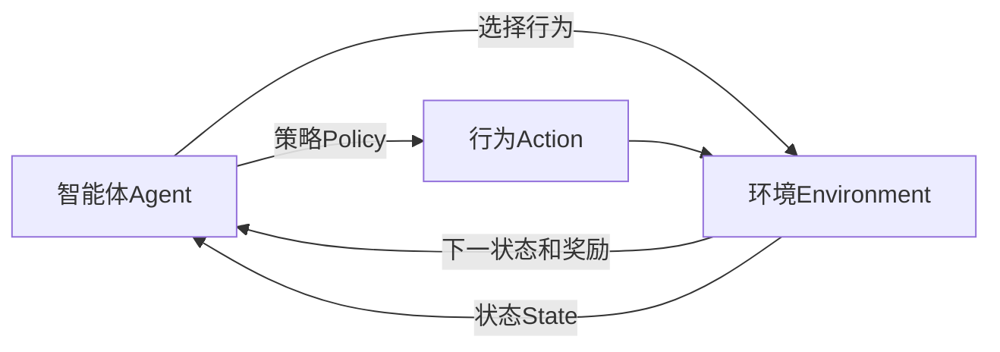
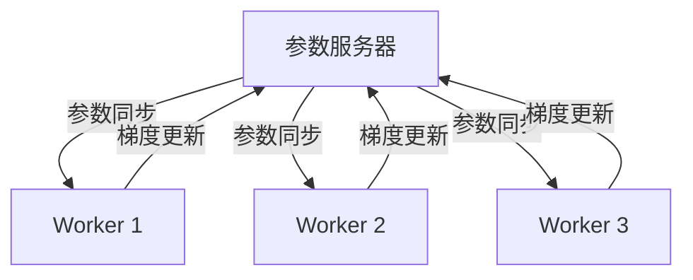

# 强化学习Reinforcement Learning的并行与分布式实现方案

## 1. 背景介绍

### 1.1 强化学习概述

强化学习(Reinforcement Learning, RL)是机器学习的一个重要分支,它关注于如何基于环境反馈来学习一个最优策略,以获得最大的累积奖励。与监督学习和无监督学习不同,强化学习没有提供明确的输入-输出样本对,而是通过与环境的持续交互来学习。

强化学习的核心思想是让智能体(Agent)与环境(Environment)进行交互,在每个时间步,智能体根据当前状态选择一个动作,环境会根据这个动作转移到下一个状态,并给出对应的奖励信号。智能体的目标是学习一个策略,使得在给定的环境中获得的长期累积奖励最大化。

### 1.2 并行与分布式强化学习的重要性

随着强化学习在robotics、游戏、推荐系统等领域的广泛应用,训练强化学习模型的计算需求也呈指数级增长。单机训练已经无法满足实际需求,因此并行化和分布式化训练成为了解决这一瓶颈的关键。

并行化和分布式化训练可以将计算任务分散到多个计算节点上,充分利用多核CPU和GPU等硬件资源,从而显著提高训练效率。此外,分布式训练还能够处理大规模的数据,提高模型的泛化能力。

## 2. 核心概念与联系

### 2.1 强化学习核心要素

强化学习系统通常由以下几个核心要素组成:

- **智能体(Agent)**: 也称为决策者,它根据当前状态选择行为。
- **环境(Environment)**: 智能体所处的外部世界,它根据智能体的行为产生下一个状态和奖励信号。
- **状态(State)**: 描述环境当前的情况。
- **行为(Action)**: 智能体在当前状态下可以采取的操作。
- **奖励(Reward)**: 环境对智能体当前行为的评价,用于指导智能体朝着正确方向学习。
- **策略(Policy)**: 智能体在每个状态下选择行为的策略,是强化学习要学习的最终目标。



### 2.2 并行与分布式强化学习架构

为了提高强化学习系统的训练效率,通常采用并行和分布式的架构:

- **数据并行**: 将训练数据划分到多个计算节点,每个节点在本地数据上并行训练模型。
- **模型并行**: 将模型划分到多个计算节点,每个节点只需要训练模型的一部分。
- **参数服务器**: 引入参数服务器来集中存储和更新模型参数,各计算节点从参数服务器获取最新参数。



## 3. 核心算法原理具体操作步骤  

### 3.1 策略梯度算法

策略梯度(Policy Gradient)是强化学习中一种重要的算法范式,它直接对策略进行参数化,通过梯度上升的方式优化策略参数,使得期望的累积奖励最大化。

1. 初始化策略参数 $\theta$
2. 对于每一个episode:
    - 初始化状态 $s_0$
    - 对于每个时间步 $t$:
        - 根据当前策略 $\pi_\theta(a|s_t)$ 选择行为 $a_t$
        - 执行行为 $a_t$,获得奖励 $r_t$ 和下一状态 $s_{t+1}$
        - 计算累积奖励 $G_t = \sum_{k=t}^{T} \gamma^{k-t}r_k$
    - 计算策略梯度 $\nabla_\theta J(\theta) = \mathbb{E}_{\pi_\theta}[\sum_t \nabla_\theta \log \pi_\theta(a_t|s_t)G_t]$
    - 使用梯度上升法更新策略参数 $\theta \leftarrow \theta + \alpha \nabla_\theta J(\theta)$

其中 $\gamma$ 是折现因子, $\alpha$ 是学习率。策略梯度算法的关键在于估计期望累积奖励对策略参数的梯度,并沿着梯度方向更新参数。

### 3.2 深度Q网络算法

深度Q网络(Deep Q-Network, DQN)是结合深度神经网络和Q学习的一种强化学习算法,它可以直接从原始输入(如像素数据)中学习出优秀的策略。DQN算法的核心步骤如下:

1. 初始化Q网络参数 $\theta$,以及经验回放池 $D$
2. 对于每一个episode:
    - 初始化状态 $s_0$
    - 对于每个时间步 $t$:
        - 根据 $\epsilon$-贪婪策略选择行为 $a_t = \mathrm{argmax}_a Q(s_t, a; \theta)$
        - 执行行为 $a_t$,获得奖励 $r_t$ 和下一状态 $s_{t+1}$
        - 存储转换 $(s_t, a_t, r_t, s_{t+1})$ 到经验回放池 $D$
        - 从 $D$ 中采样一个批次的转换 $(s_j, a_j, r_j, s_{j+1})$
        - 计算目标值 $y_j = r_j + \gamma \max_{a'} Q(s_{j+1}, a'; \theta^-)$
        - 优化损失函数 $L(\theta) = \mathbb{E}_{(s, a, r, s')\sim D}[(y - Q(s, a; \theta))^2]$
        - 每隔一定步骤将 $\theta^-$ 更新为 $\theta$

其中 $\epsilon$ 是探索率, $\gamma$ 是折现因子, $\theta^-$ 是目标网络参数。DQN算法的关键在于使用经验回放池和目标网络来提高训练稳定性。

## 4. 数学模型和公式详细讲解举例说明

### 4.1 马尔可夫决策过程

强化学习问题通常被建模为马尔可夫决策过程(Markov Decision Process, MDP),它是一个离散时间的随机控制过程,由一个五元组 $\langle \mathcal{S}, \mathcal{A}, \mathcal{P}, \mathcal{R}, \gamma \rangle$ 定义:

- $\mathcal{S}$ 是状态空间的集合
- $\mathcal{A}$ 是行为空间的集合
- $\mathcal{P}: \mathcal{S} \times \mathcal{A} \times \mathcal{S} \rightarrow [0, 1]$ 是状态转移概率函数
- $\mathcal{R}: \mathcal{S} \times \mathcal{A} \rightarrow \mathbb{R}$ 是奖励函数
- $\gamma \in [0, 1)$ 是折现因子

在时间步 $t$,智能体处于状态 $s_t \in \mathcal{S}$,选择行为 $a_t \in \mathcal{A}$,然后转移到下一状态 $s_{t+1}$ 的概率为 $\mathcal{P}(s_{t+1}|s_t, a_t)$,并获得即时奖励 $r_t = \mathcal{R}(s_t, a_t)$。智能体的目标是学习一个策略 $\pi: \mathcal{S} \rightarrow \mathcal{A}$,使得期望的累积折现奖励最大化:

$$
J(\pi) = \mathbb{E}_\pi \left[ \sum_{t=0}^\infty \gamma^t r_t \right]
$$

### 4.2 价值函数和Bellman方程

在强化学习中,我们通常使用价值函数来评估一个策略的好坏。状态价值函数 $V^\pi(s)$ 定义为在状态 $s$ 下,按照策略 $\pi$ 执行后获得的期望累积奖励:

$$
V^\pi(s) = \mathbb{E}_\pi \left[ \sum_{t=0}^\infty \gamma^t r_t | s_0 = s \right]
$$

同理,状态-行为价值函数 $Q^\pi(s, a)$ 定义为在状态 $s$ 下执行行为 $a$,之后按照策略 $\pi$ 执行后获得的期望累积奖励:

$$
Q^\pi(s, a) = \mathbb{E}_\pi \left[ \sum_{t=0}^\infty \gamma^t r_t | s_0 = s, a_0 = a \right]
$$

价值函数满足著名的Bellman方程:

$$
\begin{aligned}
V^\pi(s) &= \sum_{a \in \mathcal{A}} \pi(a|s) \left( \mathcal{R}(s, a) + \gamma \sum_{s' \in \mathcal{S}} \mathcal{P}(s'|s, a) V^\pi(s') \right) \\
Q^\pi(s, a) &= \mathcal{R}(s, a) + \gamma \sum_{s' \in \mathcal{S}} \mathcal{P}(s'|s, a) \sum_{a' \in \mathcal{A}} \pi(a'|s') Q^\pi(s', a')
\end{aligned}
$$

这些方程为求解价值函数提供了理论基础,也为设计强化学习算法奠定了基础。

## 5. 项目实践:代码实例和详细解释说明

在本节中,我们将通过一个简单的网格世界(Gridworld)示例,演示如何使用Python实现一个基于策略梯度的强化学习算法。

### 5.1 环境设置

我们首先定义网格世界的环境,包括状态空间、行为空间、奖励函数和状态转移函数。

```python
import numpy as np

# 定义网格世界的大小
GRID_SIZE = 4

# 定义状态空间和行为空间
STATE_SPACE = np.arange(GRID_SIZE * GRID_SIZE)
ACTION_SPACE = ['U', 'D', 'L', 'R']  # 上下左右

# 定义奖励函数
def reward_func(state, action):
    x, y = state // GRID_SIZE, state % GRID_SIZE
    next_x, next_y = x, y
    if action == 'U':
        next_x = max(x - 1, 0)
    elif action == 'D':
        next_x = min(x + 1, GRID_SIZE - 1)
    elif action == 'L':
        next_y = max(y - 1, 0)
    elif action == 'R':
        next_y = min(y + 1, GRID_SIZE - 1)
    next_state = next_x * GRID_SIZE + next_y
    if next_state == GRID_SIZE * GRID_SIZE - 1:
        return 1  # 到达终点奖励为1
    else:
        return 0  # 其他情况奖励为0

# 定义状态转移函数
def transition_func(state, action):
    x, y = state // GRID_SIZE, state % GRID_SIZE
    next_x, next_y = x, y
    if action == 'U':
        next_x = max(x - 1, 0)
    elif action == 'D':
        next_x = min(x + 1, GRID_SIZE - 1)
    elif action == 'L':
        next_y = max(y - 1, 0)
    elif action == 'R':
        next_y = min(y + 1, GRID_SIZE - 1)
    next_state = next_x * GRID_SIZE + next_y
    return next_state
```

### 5.2 策略梯度算法实现

接下来,我们实现一个基于策略梯度的强化学习算法,用于学习网格世界的最优策略。

```python
import torch
import torch.nn as nn
import torch.optim as optim

# 定义策略网络
class PolicyNetwork(nn.Module):
    def __init__(self, state_dim, action_dim):
        super(PolicyNetwork, self).__init__()
        self.fc1 = nn.Linear(state_dim, 64)
        self.fc2 = nn.Linear(64, action_dim)

    def forward(self, x):
        x = torch.relu(self.fc1(x))
        x = self.fc2(x)
        return x

# 定义策略梯度算法
def policy_gradient(env, policy_net, num_episodes, gamma=0.99):
    optimizer = optim.Adam(policy_net.parameters(), lr=0.001)
    for episode in range(num_episodes):
        log_probs = []
        rewards = []
        state = env.