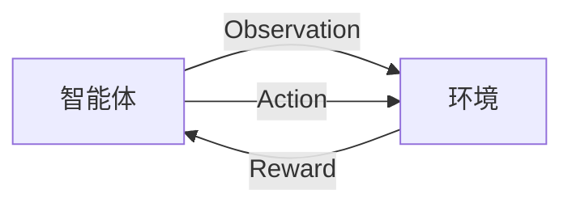

# 强化学习Reinforcement Learning算法的验证与测试

## 1.背景介绍

### 1.1 什么是强化学习

强化学习(Reinforcement Learning, RL)是机器学习的一个重要分支,它关注智能体(Agent)如何在与环境(Environment)的交互过程中学习获取最大化累积奖励(Reward)的策略(Policy)。与监督学习不同,强化学习没有给定正确的输入/输出对,智能体需要通过不断试错和从环境反馈中学习,逐步优化自身的决策策略。

强化学习的理论基础可以追溯到马尔可夫决策过程(Markov Decision Process, MDP),它为序列决策问题建立了数学框架。近年来,结合深度学习等技术的发展,强化学习取得了突破性进展,在游戏、机器人控制、资源调度等领域展现出巨大潜力。

### 1.2 强化学习算法的验证与测试重要性

由于强化学习系统需要在复杂、动态的环境中运行,其决策质量和稳定性对应用系统的安全性和可靠性至关重要。因此,对强化学习算法进行全面的验证和测试是保证系统质量的关键环节。

合理的验证和测试不仅能发现算法实现中的潜在缺陷和错误,更重要的是评估算法在各种情况下的性能表现,识别其优缺点和适用范围。这为算法的选择、优化和部署提供了依据,从而提高了系统的可靠性和鲁棒性。

## 2.核心概念与联系  

### 2.1 强化学习核心要素

强化学习系统由以下四个核心要素组成:

- 智能体(Agent):做出观察和决策的主体
- 环境(Environment):智能体与之交互的外部世界
- 状态(State):描述环境当前情况的数据
- 奖励(Reward):环境给予智能体的反馈信号

智能体和环境通过观察(Observation)和动作(Action)交互,智能体根据当前状态选择动作,环境则根据这个动作并结合当前状态产生新的状态和奖励。智能体的目标是学习一个策略,使得在长期内获得的累积奖励最大化。



### 2.2 强化学习算法分类

根据算法使用的技术和理论基础,强化学习算法可分为以下几类:

- 基于价值函数的算法:如Q-Learning、Sarsa等,通过估计状态或状态-动作对的价值函数来优化策略
- 基于策略的算法:如策略梯度(Policy Gradient)算法,直接对策略进行参数化,通过梯度下降等方法优化策略参数
- 基于模型的算法:显式建模环境的转移概率和奖励函数,基于模型进行规划和决策
- 无模型算法:不建模环境,直接与环境交互并从经验中学习,如Q-Learning等
- 值基础和策略搭配的Actor-Critic算法:结合价值函数估计和策略搜索的优点

不同算法在样本效率、收敛性、可解释性等方面有不同的权衡取舍,需要根据具体问题特点选择合适的算法。

## 3.核心算法原理具体操作步骤

本节将以Q-Learning和策略梯度(REINFORCE)这两种经典且具有代表性的算法为例,介绍它们的核心原理和操作步骤。

### 3.1 Q-Learning算法

Q-Learning是一种基于价值函数的无模型算法,通过不断与环境交互并更新Q值函数来逐步优化策略。其核心思想是:

对于每个状态-动作对$(s, a)$,维护一个Q值$Q(s, a)$,表示从状态$s$执行动作$a$后,按照最优策略继续执行可获得的期望累积奖励。通过不断更新Q值函数,最终可以得到最优的Q函数,对应的贪心策略就是最优策略。

Q-Learning算法的操作步骤如下:

1. 初始化Q函数,如全部置为0
2. 重复以下步骤直到收敛:
    - 从当前状态$s$选取动作$a$(如$\epsilon$-贪心策略)
    - 执行动作$a$,获得奖励$r$和新状态$s'$
    - 根据下式更新$Q(s, a)$:
        $$Q(s, a) \leftarrow Q(s, a) + \alpha[r + \gamma\max_{a'}Q(s', a') - Q(s, a)]$$
        其中$\alpha$为学习率,$\gamma$为折扣因子
    - 将$s'$置为新的当前状态

通过不断与环境交互并更新Q值,算法将逐步收敛到最优的Q函数和策略。

### 3.2 策略梯度算法(REINFORCE)

策略梯度算法是一种基于策略的算法,通过梯度上升直接优化策略函数的参数。其核心思想是:

将策略$\pi_\theta$参数化为$\theta$,目标是最大化该策略的期望回报$J(\theta)$。根据策略梯度定理:
$$\nabla_\theta J(\theta) = \mathbb{E}_{\tau \sim \pi_\theta}[\sum_{t=0}^{T}\nabla_\theta\log\pi_\theta(a_t|s_t)Q^{\pi_\theta}(s_t, a_t)]$$
其中$\tau = (s_0, a_0, r_0, s_1, a_1, r_1, \ldots)$为一个轨迹序列,$Q^{\pi_\theta}(s_t, a_t)$为在状态$s_t$执行动作$a_t$后按$\pi_\theta$继续执行可获得的期望累积奖励。

REINFORCE算法的操作步骤如下:

1. 初始化策略参数$\theta$
2. 重复以下步骤直到收敛:
    - 生成一个完整的轨迹$\tau$,记录每个时刻的$\nabla_\theta\log\pi_\theta(a_t|s_t)$
    - 计算每个时刻的累积奖励$Q^{\pi_\theta}(s_t, a_t)$
    - 根据上式计算策略梯度$\nabla_\theta J(\theta)$的估计值
    - 使用梯度上升法更新$\theta$

通过不断采样轨迹并优化策略参数,算法将逐步收敛到一个能获得最大期望回报的最优策略。

## 4.数学模型和公式详细讲解举例说明

### 4.1 马尔可夫决策过程(MDP)

马尔可夫决策过程为强化学习提供了数学框架,一个MDP通常定义为一个五元组$\langle\mathcal{S}, \mathcal{A}, \mathcal{P}, \mathcal{R}, \gamma\rangle$:

- $\mathcal{S}$是状态集合
- $\mathcal{A}$是动作集合  
- $\mathcal{P}$是转移概率函数,定义为$\mathcal{P}_{ss'}^a = \mathbb{P}(s_{t+1}=s'|s_t=s, a_t=a)$,表示在状态$s$执行动作$a$后转移到状态$s'$的概率
- $\mathcal{R}$是奖励函数,定义为$\mathcal{R}_s^a = \mathbb{E}[r_{t+1}|s_t=s, a_t=a]$,表示在状态$s$执行动作$a$后获得的期望奖励
- $\gamma \in [0, 1)$是折扣因子,用于权衡未来奖励的重要性

在MDP中,智能体的目标是学习一个策略$\pi: \mathcal{S} \rightarrow \mathcal{A}$,使得期望累积奖励最大化:
$$J(\pi) = \mathbb{E}_\pi[\sum_{t=0}^\infty \gamma^t r_{t+1}]$$

其中$r_{t+1}$是在时刻$t$执行动作后获得的奖励。

### 4.2 Q-Learning的贝尔曼方程

Q-Learning算法通过不断更新Q值函数,使其满足贝尔曼最优方程:

$$Q^*(s, a) = \mathbb{E}_{s' \sim \mathcal{P}(\cdot|s, a)}[r + \gamma \max_{a'} Q^*(s', a')]$$

其中$Q^*(s, a)$表示在状态$s$执行动作$a$后,按最优策略继续执行可获得的最大期望累积奖励。

一旦Q函数收敛到最优Q函数$Q^*$,那么对应的贪心策略$\pi^*(s) = \arg\max_a Q^*(s, a)$就是最优策略。

Q-Learning通过下面的迭代式不断逼近最优Q函数:

$$Q(s, a) \leftarrow Q(s, a) + \alpha[r + \gamma\max_{a'}Q(s', a') - Q(s, a)]$$

其中$\alpha$为学习率,控制着更新的幅度。

### 4.3 策略梯度算法推导

我们将策略$\pi_\theta$参数化为$\theta$,目标是最大化该策略的期望回报:

$$J(\theta) = \mathbb{E}_{\tau \sim \pi_\theta}[\sum_{t=0}^{T}r(s_t, a_t)]$$

其中$\tau = (s_0, a_0, r_0, s_1, a_1, r_1, \ldots)$为一个轨迹序列。

根据策略梯度定理,可以得到:

$$\nabla_\theta J(\theta) = \mathbb{E}_{\tau \sim \pi_\theta}[\sum_{t=0}^{T}\nabla_\theta\log\pi_\theta(a_t|s_t)Q^{\pi_\theta}(s_t, a_t)]$$

其中$Q^{\pi_\theta}(s_t, a_t)$为在状态$s_t$执行动作$a_t$后按$\pi_\theta$继续执行可获得的期望累积奖励。

通过对上式进行采样估计,我们可以得到策略梯度的无偏估计:

$$\hat{g} = \sum_{t=0}^{T}\nabla_\theta\log\pi_\theta(a_t|s_t)\hat{Q}_t$$

其中$\hat{Q}_t$为$Q^{\pi_\theta}(s_t, a_t)$的估计值,可以通过各种方式计算,如蒙特卡罗回报、时序差分等。

根据梯度估计$\hat{g}$,我们可以使用梯度上升法不断优化策略参数$\theta$,最终收敛到一个能获得最大期望回报的最优策略。

## 5.项目实践:代码实例和详细解释说明

为了更好地理解强化学习算法的实现细节,我们将基于Python和PyTorch提供Q-Learning和REINFORCE算法在经典控制问题FrozenLake环境中的代码实例。

### 5.1 FrozenLake环境介绍

FrozenLake是OpenAI Gym中的一个经典环境,它模拟了一个智能体在一个冰湖中行走的场景。环境由一个$N\times N$的网格组成,其中有冰洞(H)、起点(S)和终点(G),智能体的目标是从起点出发,找到一条安全的路径到达终点。

环境的观察空间为当前的状态(网格位置),动作空间包括上下左右四个基本动作。每一步,智能体获得的奖励为0,除非到达终点(获得1的奖励)或掉入冰洞(获得0的奖励,并重置环境)。

```python
import numpy as np
import gym
import time
from gym.envs.toy_text import frozen_lake

# 创建一个4x4的FrozenLake环境
env = gym.make("FrozenLake-v1", desc=frozen_lake.generate_random_map(size=4))

# 环境初始化
env.reset()

# 打印环境信息
print("观察空间:", env.observation_space)
print("动作空间:", env.action_space)
```

### 5.2 Q-Learning算法实现

```python
import numpy as np

# Q-Learning算法
def q_learning(env, num_episodes, discount_factor=1.0, alpha=0.6, epsilon=0.1):
    # 初始化Q表格
    q_table = np.zeros([env.observation_space.n, env.action_space.n])
    
    # 训练循环
    for i in range(num_episodes):
        # 环境初始化
        state = env.reset()
        
        while True:
            # 选择动作(epsilon-贪心策略)
            if np.random.uniform() < epsilon:
                action = env.action_space.sample()
            else:
                action = np.argmax(q_table[state])
                
            # 执行动作
            next_state, reward, done, _ = env.step(action)
            
            # 更新Q值
            q_table[state,