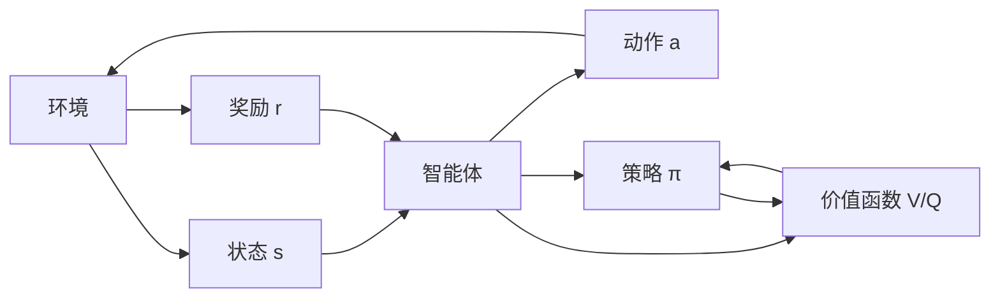

# 强化学习算法：策略梯度 (Policy Gradient) 原理与代码实例讲解

## 1. 背景介绍

### 1.1 强化学习概述

强化学习（Reinforcement Learning，RL）是机器学习的一个重要分支，它研究如何让智能体（Agent）通过与环境的交互来学习最优策略，以获得最大的累积奖励。与监督学习和非监督学习不同，强化学习不需要预先准备好标注数据，而是通过探索和利用的方式，不断尝试不同的动作，根据环境的反馈来优化策略。

### 1.2 策略梯度方法的优势

策略梯度（Policy Gradient）是强化学习中一类重要的算法，它直接对策略函数进行优化，而不是像值函数方法那样先估计状态价值或动作价值函数，再通过价值函数来得到策略。策略梯度方法有以下优点：

1. 可以直接处理连续动作空间问题，而值函数方法通常难以应对高维连续动作空间。
2. 更新方向与最优策略一致，不易陷入局部最优。
3. 可以应用于部分可观察马尔可夫决策过程（POMDP）问题。

### 1.3 本文结构安排

本文将深入探讨策略梯度算法的原理与实践，内容安排如下：

- 第2部分：介绍强化学习的核心概念，包括马尔可夫决策过程、策略、价值函数等，并阐述它们之间的联系。
- 第3部分：详细推导策略梯度定理，给出策略梯度算法的具体操作步骤。 
- 第4部分：讲解策略梯度算法涉及的数学模型与公式，并举例说明。
- 第5部分：通过代码实例，演示如何用PyTorch实现REINFORCE算法。
- 第6部分：介绍策略梯度算法在游戏AI、机器人控制等领域的应用场景。
- 第7部分：推荐相关的开源工具和学习资源。
- 第8部分：总结全文，展望策略梯度算法的未来发展趋势与面临的挑战。
- 第9部分：附录，解答一些常见问题。

## 2. 核心概念与联系

### 2.1 马尔可夫决策过程

马尔可夫决策过程（Markov Decision Process，MDP）为描述强化学习问题提供了数学框架。一个MDP由以下元素组成：

- 状态空间 $\mathcal{S}$：智能体所处环境的状态集合。
- 动作空间 $\mathcal{A}$：智能体可执行的动作集合。
- 转移概率 $\mathcal{P}$：$\mathcal{P}(s'|s,a)$ 表示在状态 $s$ 下执行动作 $a$ 后转移到状态 $s'$ 的概率。
- 奖励函数 $\mathcal{R}$：$\mathcal{R}(s,a)$ 表示在状态 $s$ 下执行动作 $a$ 获得的即时奖励。
- 折扣因子 $\gamma \in [0,1]$：用于平衡即时奖励和未来奖励的相对重要性。

MDP的目标是寻找一个最优策略 $\pi^*$，使得智能体能够获得最大化的期望累积奖励。

### 2.2 策略与价值函数

- 策略 $\pi(a|s)$：在状态 $s$ 下选择动作 $a$ 的概率分布。分为确定性策略和随机性策略。 
- 状态价值函数 $V^{\pi}(s)$：在策略 $\pi$ 下，从状态 $s$ 开始的期望累积奖励。
  $$V^{\pi}(s) = \mathbb{E}_{a_t \sim \pi(\cdot|s_t)} \left[\sum_{t=0}^{\infty} \gamma^t \mathcal{R}(s_t, a_t) \right]$$
- 动作价值函数 $Q^{\pi}(s,a)$：在策略 $\pi$ 下，从状态 $s$ 开始执行动作 $a$ 的期望累积奖励。
  $$Q^{\pi}(s,a) = \mathbb{E}_{a_t \sim \pi(\cdot|s_t)} \left[\sum_{t=0}^{\infty} \gamma^t \mathcal{R}(s_t, a_t) | s_0=s, a_0=a \right]$$

策略和价值函数满足如下关系：

$$V^{\pi}(s) = \sum_{a} \pi(a|s) Q^{\pi}(s,a)$$

$$Q^{\pi}(s,a) = \mathcal{R}(s,a) + \gamma \sum_{s'} \mathcal{P}(s'|s,a) V^{\pi}(s')$$

上述两个等式分别称为策略评估（Policy Evaluation）和策略改进（Policy Improvement）。

### 2.3 探索与利用

强化学习的一个核心问题是平衡探索（Exploration）和利用（Exploitation）。探索是指尝试新的动作以发现可能更优的策略，利用是指基于当前已知的信息选择最优动作以获得更多奖励。常见的探索策略有：

- $\epsilon$-贪婪（$\epsilon$-greedy）：以 $\epsilon$ 的概率随机选择动作，以 $1-\epsilon$ 的概率选择当前最优动作。
- 软性最大值（Softmax）：根据动作的价值函数计算选择概率，价值越高的动作被选中的概率越大。

下图展示了强化学习中核心概念之间的关系：

## 3. 核心算法原理具体操作步骤

### 3.1 策略梯度定理

策略梯度定理给出了期望累积奖励 $J(\theta)$ 关于策略参数 $\theta$ 的梯度表达式：

$$\nabla_{\theta} J(\theta) = \mathbb{E}_{\tau \sim p_{\theta}(\tau)} \left[ \sum_{t=0}^{T} \nabla_{\theta} \log \pi_{\theta}(a_t|s_t) Q^{\pi_{\theta}}(s_t,a_t) \right]$$

其中，$\tau$ 表示一条轨迹 $(s_0,a_0,r_0,s_1,a_1,r_1,\dots,s_T,a_T,r_T)$，$p_{\theta}(\tau)$ 是在策略 $\pi_{\theta}$ 下生成轨迹 $\tau$ 的概率。

直观地理解，策略梯度定理告诉我们：要想提高期望累积奖励，就应该增加能带来高Q值的动作的概率，减少导致低Q值的动作的概率。

### 3.2 REINFORCE算法

REINFORCE算法是基于策略梯度定理的蒙特卡洛策略梯度方法，具体步骤如下：

1. 初始化策略网络参数 $\theta$。
2. 对于每个episode：
   1. 根据策略 $\pi_{\theta}$ 与环境交互，生成一条完整的轨迹 $\tau$。
   2. 对于轨迹中的每个时间步 $t=0,1,\dots,T$：
      1. 计算从当前时间步 $t$ 到终止状态的累积奖励 $G_t=\sum_{k=t}^{T} \gamma^{k-t} r_k$。
      2. 计算策略梯度 $\nabla_{\theta} \log \pi_{\theta}(a_t|s_t) G_t$。
   3. 计算整条轨迹的策略梯度 $\nabla_{\theta} J(\theta) \approx \frac{1}{N} \sum_{n=1}^{N} \sum_{t=0}^{T} \nabla_{\theta} \log \pi_{\theta}(a_t^n|s_t^n) G_t^n$，其中 $N$ 为采样轨迹数。
   4. 用梯度上升法更新策略参数：$\theta \leftarrow \theta + \alpha \nabla_{\theta} J(\theta)$，其中 $\alpha$ 为学习率。
3. 重复第2步，直到策略收敛或达到预设的训练轮数。

REINFORCE算法的一个缺点是方差较大，因为它使用蒙特卡洛方法估计Q值。为了降低方差，可以引入基线（Baseline）$b(s_t)$，将梯度估计改为：

$$\nabla_{\theta} J(\theta) \approx \frac{1}{N} \sum_{n=1}^{N} \sum_{t=0}^{T} \nabla_{\theta} \log \pi_{\theta}(a_t^n|s_t^n) (G_t^n - b(s_t^n))$$

常见的基线选择有：状态价值函数 $V^{\pi}(s_t)$，时间步 $t$ 之前的平均回报，或者一个可学习的参数化函数 $b_{\phi}(s_t)$。

## 4. 数学模型和公式详细讲解举例说明

本节我们详细讲解策略梯度定理的推导过程，并举例说明如何计算策略梯度。

### 4.1 策略梯度定理推导

我们的目标是最大化期望累积奖励 $J(\theta)$：

$$J(\theta) = \mathbb{E}_{\tau \sim p_{\theta}(\tau)} \left[ r(\tau) \right] = \int_{\tau} p_{\theta}(\tau) r(\tau) d\tau$$

其中，$r(\tau) = \sum_{t=0}^{T} \gamma^t r_t$ 表示轨迹 $\tau$ 的累积奖励。

根据对数导数技巧（log-derivative trick），我们有：

$$\nabla_{\theta} J(\theta) = \int_{\tau} \nabla_{\theta} p_{\theta}(\tau) r(\tau) d\tau = \int_{\tau} p_{\theta}(\tau) \frac{\nabla_{\theta} p_{\theta}(\tau)}{p_{\theta}(\tau)} r(\tau) d\tau$$

$$= \int_{\tau} p_{\theta}(\tau) \nabla_{\theta} \log p_{\theta}(\tau) r(\tau) d\tau = \mathbb{E}_{\tau \sim p_{\theta}(\tau)} \left[ \nabla_{\theta} \log p_{\theta}(\tau) r(\tau) \right]$$

接下来，我们将轨迹概率 $p_{\theta}(\tau)$ 分解为状态转移概率和策略概率的乘积：

$$p_{\theta}(\tau) = p(s_0) \prod_{t=0}^{T} \pi_{\theta}(a_t|s_t) p(s_{t+1}|s_t,a_t)$$

对 $\log p_{\theta}(\tau)$ 求导，可得：

$$\nabla_{\theta} \log p_{\theta}(\tau) = \sum_{t=0}^{T} \nabla_{\theta} \log \pi_{\theta}(a_t|s_t)$$

将上式代入策略梯度表达式，得到：

$$\nabla_{\theta} J(\theta) = \mathbb{E}_{\tau \sim p_{\theta}(\tau)} \left[ \left( \sum_{t=0}^{T} \nabla_{\theta} \log \pi_{\theta}(a_t|s_t) \right) \left( \sum_{t=0}^{T} \gamma^t r_t \right) \right]$$

$$= \mathbb{E}_{\tau \sim p_{\theta}(\tau)} \left[ \sum_{t=0}^{T} \nabla_{\theta} \log \pi_{\theta}(a_t|s_t) \sum_{t'=t}^{T} \gamma^{t'-t} r_{t'} \right]$$

$$= \mathbb{E}_{\tau \sim p_{\theta}(\tau)} \left[ \sum_{t=0}^{T} \nabla_{\theta} \log \pi_{\theta}(a_t|s_t) Q^{\pi_{\theta}}(s_t,a_t) \right]$$

这就是策略梯度定理的结果。

### 4.2 策略梯度计算举例

考虑一个简单的离散动作空间问题，状态空间为 $\mathcal{S}=\{s_1,s_2\}$，动作空间为 $\mathcal{A}=\{a_1,a_2\}$。我们使用 Softmax 策略：

$$\pi_{\theta}(a_1|s) = \frac{e^{\theta_s^T \phi(a_1)}}{e^{\theta_s^T \phi(a_1)} + e^{\theta_s^T \phi(a_2)}}$$

$$\pi_{\theta}(a_2|s) = \frac{e^{\theta_s^T \phi(a_2)}}{e^{\theta_s^T \phi(a_1)} + e^{\theta_s^T \phi(a_2)}}$$

其中，$\theta_s$ 是状态 $s$ 对应的参数向量，$\phi(a)$ 是动作 