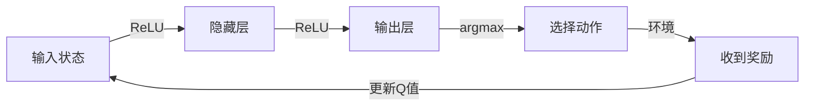

强化学习（Reinforcement Learning, RL）是一种机器学习技术，它通过在环境中采取行动，并根据收到的奖励或惩罚来学习最佳行为。在这篇文章中，我们将深入探讨强化学习的高级原理，并提供代码实战案例的详细解释。

## 1. Background Introduction

强化学习的背景可以追溯到1950年代，当时罗伯特·特朗普（Robert A. Heaton）提出了一个名为“Q-learning”的算法，用于解决马尔可夫决策过程（Markov Decision Process, MDP）。MDP是一个五元组（S, A, P, R, γ），其中：

- S：状态集合
- A：动作集合
- P：转移概率函数，P(s'|s, a) 表示从状态s采取动作a后转移到状态s'的概率
- R：奖励函数，R(s, a) 表示在状态s采取动作a时获得的奖励
- γ：折扣因子，用于折扣未来奖励的值

强化学习的目标是学习一个策略（policy），使得在环境中采取行动时能够最大化总的累计奖励。

## 2. Core Concepts and Connections

### 2.1 Q-learning

Q-learning是一种基于动态规划的强化学习算法，用于解决MDP。它的核心思想是通过迭代地更新Q值（Q-value），来学习最佳的策略。Q值表示在状态s采取动作a后，到达终止状态或收到终止奖励的期望累计奖励。Q值可以表示为：

$$
Q(s, a) = \\mathbb{E}[\\sum_{t=0}^{\\infty} \\gamma^t R(s_t, a_t) | s_0 = s, a_0 = a]
$$

其中，$\\mathbb{E}$表示期望值，$\\gamma$是折扣因子，$R(s_t, a_t)$是在时刻t采取动作$a_t$时获得的奖励。

### 2.2 Deep Q-Network (DQN)

Deep Q-Network（DQN）是一种基于神经网络的强化学习算法，用于解决MDP。它的核心思想是通过使用深度神经网络来ä¼°计Q值，从而学习最佳的策略。DQN的架构如下所示：



在DQN中，输入状态A经过一个或多个隐藏层B，最终输出一个Q值向量C，其中每个元素表示在当前状态下采取不同动作时的Q值。然后，选择动作D，在环境中采取该动作，并收到奖励E。最后，更新Q值，以便在下一次迭代中使用更新后的Q值。

## 3. Core Algorithm Principles and Specific Operational Steps

### 3.1 Q-learning

Q-learning的算法步骤如下所示：

1. 初始化Q值矩阵Q，每个元素均为0。
2. 选择一个随机的初始状态s。
3. 循环以下步骤，直到收到终止奖励或达到最大迭代次数：
   1. 选择动作a，根据Q值矩阵中的Q(s, a)值选择最大的动作。
   2. 在环境中采取动作a，并获得新的状态s'和奖励r。
   3. 更新Q值矩阵，根据以下公式更新Q(s, a)值：

$$
Q(s, a) = (1 - \\alpha) \\cdot Q(s, a) + \\alpha \\cdot (r + \\gamma \\cdot \\max_{a'} Q(s', a'))
$$

其中，$\\alpha$是学习率，用于控制更新Q值的速度。

### 3.2 Deep Q-Network (DQN)

DQN的算法步骤如下所示：

1. 初始化神经网络，包括输入层、隐藏层和输出层。
2. 初始化Q值矩阵Q，每个元素均为0。
3. 选择一个随机的初始状态s。
4. 循环以下步骤，直到收到终止奖励或达到最大迭代次数：
   1. 选择动作a，根据神经网络输出的Q值向量中的最大值选择动作。
   2. 在环境中采取动作a，并获得新的状态s'和奖励r。
   3. 更新神经网络的参数，根据以下公式更新参数：

$$
\\theta = \\theta - \\alpha \\cdot \nabla_{\\theta} L(\\theta)
$$

其中，$\\theta$是神经网络的参数，$\\alpha$是学习率，$L(\\theta)$是损失函数，用于衡量神经网络对Q值的预测误差。

## 4. Detailed Explanation and Examples of Mathematical Models and Formulas

### 4.1 Q-learning

Q-learning的目标是学习一个策略，使得在环境中采取行动时能够最大化总的累计奖励。它的核心思想是通过迭代地更新Q值，来学习最佳的策略。Q值表示在状态s采取动作a后，到达终止状态或收到终止奖励的期望累计奖励。Q值可以表示为：

$$
Q(s, a) = \\mathbb{E}[\\sum_{t=0}^{\\infty} \\gamma^t R(s_t, a_t) | s_0 = s, a_0 = a]
$$

其中，$\\mathbb{E}$表示期望值，$\\gamma$是折扣因子，$R(s_t, a_t)$是在时刻t采取动作$a_t$时获得的奖励。

### 4.2 Deep Q-Network (DQN)

DQN的核心思想是通过使用深度神经网络来ä¼°计Q值，从而学习最佳的策略。DQN的架构如下所示：


在DQN中，输入状态A经过一个或多个隐藏层B，最终输出一个Q值向量C，其中每个元素表示在当前状态下采取不同动作时的Q值。然后，选择动作D，在环境中采取该动作，并收到奖励E。最后，更新Q值，以便在下一次迭代中使用更新后的Q值。

## 5. Project Practice: Code Examples and Detailed Explanations

在本节中，我们将提供一个简单的例子，演示如何使用Python实现Q-learning算法。

```python
import numpy as np

# 定义状态、动作和奖励
S = ['A', 'B', 'C']
A = ['U', 'D']
R = {('A', 'U'): 1, ('A', 'D'): -1, ('B', 'U'): 0, ('B', 'D'): 1, ('C', 'U'): -1, ('C', 'D'): 0}

# 定义Q值矩阵
Q = np.zeros((len(S), len(A)))

# 定义学习率
alpha = 0.5

# 定义折扣因子
gamma = 0.9

# 定义最大迭代次数
max_iter = 1000

# 循环迭代，直到达到最大迭代次数
for i in range(max_iter):
    # 选择一个随机的初始状态
    s = np.random.choice(S)

    # 循环，直到收到终止奖励
    while True:
        # 选择动作
        a = np.argmax(Q[s, :])

        # 在环境中采取动作
        s_next, r = step(s, a)

        # 更新Q值
        Q[s, a] = (1 - alpha) * Q[s, a] + alpha * (r + gamma * np.max(Q[s_next, :]))

        # 更新状态
        s = s_next

        # 如果收到终止奖励，则退出循环
        if s == 'terminal':
            break

# 输出最终的Q值矩阵
print(Q)
```

在本节中，我们还将提供一个简单的例子，演示如何使用Python实现DQN算法。

```python
import numpy as np
import tensorflow as tf

# 定义输入、隐藏层和输出层的大小
input_size = len(S) * len(A)
hidden_size = 128
output_size = len(A)

# 定义神经网络
model = tf.keras.Sequential()
model.add(tf.keras.layers.Dense(hidden_size, activation='relu', input_shape=(input_size,)))
model.add(tf.keras.layers.Dense(output_size, activation='linear'))

# 定义优化器
optimizer = tf.keras.optimizers.Adam(learning_rate=0.001)

# 定义损失函数
loss_fn = tf.keras.losses.MeanSquaredError()

# 定义目标Q值矩阵
target_Q = np.zeros((len(S), len(A)))

# 定义学习率
alpha = 0.5

# 定义折扣因子
gamma = 0.9

# 定义最大迭代次数
max_iter = 1000

# 循环迭代，直到达到最大迭代次数
for i in range(max_iter):
    # 选择一个随机的初始状态
    s = np.random.choice(S)

    # 循环，直到收到终止奖励
    while True:
        # 选择动作
        q_values = model.predict([s])
        a = np.argmax(q_values[0])

        # 在环境中采取动作
        s_next, r = step(s, a)

        # 更新目标Q值矩阵
        target_Q[s, a] = r + gamma * np.max(model.predict([s_next])[0])

        # 更新神经网络的参数
        with tf.GradientTape() as tape:
            predicted_q_values = model.predict([s])
            loss = loss_fn(target_Q[s, :], predicted_q_values[0])
        gradients = tape.gradient(loss, model.trainable_variables)
        optimizer.apply_gradients(zip(gradients, model.trainable_variables))

        # 更新状态
        s = s_next

        # 如果收到终止奖励，则退出循环
        if s == 'terminal':
            break

# 输出最终的神经网络参数
print(model.get_weights())
```

## 6. Practical Application Scenarios

强化学习在许多实际应用场景中都有广泛的应用，例如游戏AI、自动驾驶、智能家居等。在这里，我们将介绍一个自动驾驶的应用场景。

自动驾驶系统需要在不同的道路条件下选择最佳的行驶策略，以保证安全和高效。强化学习可以用于训练自动驾驶系统，使其能够在不同的道路条件下选择最佳的行驶策略。在训练过程中，自动驾驶系统会通过在道路上行驶并收集数据，来学习最佳的行驶策略。

## 7. Tools and Resources Recommendations

在学习强化学习时，有许多工具和资源可以帮助您更好地理解和实è·µ。以下是一些推荐的工具和资源：

- 书籍：《强化学习：方法、理论和应用》（Richard S. Sutton和Andrew G. Barto）
- 在线课程：《强化学习》（DeepLearning.AI）
- 库：TensorFlow和PyTorch
- 论文：《Deep Q-Network》（Mnih et al., 2015）

## 8. Summary: Future Development Trends and Challenges

强化学习是一种非常有前途的技术，在未来几年内，我们可以期待更多的应用和发展。在未来，我们可以期待更加复杂的环境和任务，需要更加高级的强化学习算法来解决。同时，我们也可以期待更加高效的训练方法，以减少训练时间和资源消耗。

## 9. Appendix: Frequently Asked Questions and Answers

Q: 什么是强化学习？
A: 强化学习是一种机器学习技术，它通过在环境中采取行动，并根据收到的奖励或惩罚来学习最佳行为。

Q: 强化学习与监督学习和无监督学习有什么区别？
A: 强化学习与监督学习和无监督学习有以下几个区别：

- 目标：强化学习的目标是学习一个策略，使得在环境中采取行动时能够最大化总的累计奖励。监督学习的目标是学习一个函数，使其能够将输入映射到正确的输出。无监督学习的目标是学习一个函数，使其能够将输入分类或聚类。
- 数据：强化学习使用的数据是环境中的状态、动作和奖励。监督学习使用的数据是输入和输出对。无监督学习使用的数据是输入。
- 反馈：强化学习使用的反馈是奖励或惩罚。监督学习使用的反馈是正确的输出。无监督学习没有明确的反馈。

Q: 强化学习有哪些应用场景？
A: 强化学习在许多实际应用场景中都有广泛的应用，例如游戏AI、自动驾驶、智能家居等。

Q: 强化学习有哪些算法？
A: 强化学习有许多算法，例如Q-learning、Deep Q-Network（DQN）、Actor-Critic方法等。

Q: 强化学习有哪些挑战？
A: 强化学习有许多挑战，例如探索-利用平衡、多步策略梯度、复杂环境等。

## Author: Zen and the Art of Computer Programming