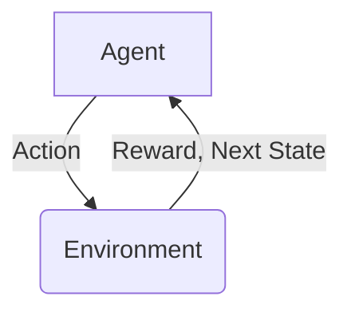

# 强化学习：优化算法的使用

## 1.背景介绍

强化学习是机器学习的一个重要分支,它关注基于环境反馈来学习行为策略的问题。与监督学习不同,强化学习没有提供正确的输入/输出对,而是通过与环境的交互来学习。强化学习代理通过执行动作并观察结果来学习,目标是找到一个策略,使累积奖励最大化。

强化学习在许多领域都有应用,如机器人控制、自动驾驶、游戏AI、资源管理等。它的关键思想是试错学习,通过在环境中探索并从奖励信号中学习,逐步改进策略。

### 1.1 强化学习基本概念

强化学习涉及以下几个基本概念:

- **环境(Environment)**: 代理与之交互的外部世界。
- **状态(State)**: 环境的当前情况。
- **动作(Action)**: 代理可以在给定状态下执行的操作。
- **奖励(Reward)**: 环境对代理动作的评价反馈。
- **策略(Policy)**: 代理在给定状态下选择动作的规则或映射。
- **价值函数(Value Function)**: 评估状态或状态-动作对的长期价值。

### 1.2 强化学习框架

强化学习过程可以概括为以下交互循环:

代理根据当前状态选择一个动作,环境接收该动作并转移到下一个状态,同时返回一个奖励信号给代理。代理的目标是通过这种交互来学习一个最优策略,使得累积奖励最大化。

## 2.核心概念与联系

强化学习中有几个核心概念密切相关:

### 2.1 马尔可夫决策过程(MDP)

马尔可夫决策过程是强化学习问题的数学框架。它由一组状态、一组动作、状态转移概率和奖励函数组成。MDP满足马尔可夫性质,即下一状态只依赖于当前状态和动作,与过去状态和动作无关。

### 2.2 价值函数

价值函数用于评估一个状态或状态-动作对的长期价值。有两种主要的价值函数:

- **状态价值函数(State-Value Function)** $V(s)$: 表示从状态 $s$ 开始,按照某策略 $\pi$ 执行后的预期累积奖励。
- **动作价值函数(Action-Value Function)** $Q(s,a)$: 表示从状态 $s$ 开始,先执行动作 $a$,后按策略 $\pi$ 执行后的预期累积奖励。

价值函数是许多强化学习算法的核心,用于评估和改进策略。

### 2.3 贝尔曼方程

贝尔曼方程定义了状态价值函数和动作价值函数应该满足的一致性条件,是强化学习算法的基础。它们将价值函数与环境动态和奖励联系起来。

$$
\begin{aligned}
V(s) &= \mathbb{E}_\pi \left[ R_{t+1} + \gamma V(S_{t+1}) | S_t = s \right] \\
Q(s,a) &= \mathbb{E}_\pi \left[ R_{t+1} + \gamma \max_{a'} Q(S_{t+1}, a') | S_t = s, A_t = a \right]
\end{aligned}
$$

其中 $\gamma$ 是折扣因子,用于权衡当前奖励和未来奖励的重要性。

### 2.4 策略迭代和价值迭代

策略迭代和价值迭代是两种基本的强化学习算法思路:

- **策略迭代**: 先评估当前策略的价值函数,再基于价值函数改进策略,重复该过程直到收敛。
- **价值迭代**: 直接计算最优价值函数,然后从最优价值函数导出最优策略。

这两种思路是许多强化学习算法的基础,如Q-Learning、Sarsa、策略梯度等。

## 3.核心算法原理具体操作步骤

接下来,我们将介绍几种核心的强化学习算法及其原理和具体操作步骤。

### 3.1 Q-Learning

Q-Learning是一种基于价值迭代的强化学习算法,它直接学习动作价值函数 $Q(s,a)$。算法步骤如下:

1. 初始化 $Q(s,a)$ 为任意值。
2. 对于每个状态-动作对 $(s,a)$:
    - 执行动作 $a$,观察奖励 $r$ 和下一状态 $s'$。
    - 更新 $Q(s,a)$ 值:
        $$Q(s,a) \leftarrow Q(s,a) + \alpha \left[ r + \gamma \max_{a'} Q(s',a') - Q(s,a) \right]$$
    其中 $\alpha$ 是学习率,控制更新幅度。
3. 重复步骤2,直到收敛。

Q-Learning的优点是无需模型,可以直接从环境交互中学习。但它也存在过估计问题,需要仔细选择学习率和探索策略。

### 3.2 Sarsa

Sarsa是一种基于策略迭代的算法,它学习的是按照当前策略 $\pi$ 的动作价值函数 $Q^\pi(s,a)$。算法步骤如下:

1. 初始化 $Q(s,a)$ 为任意值,选择一个初始策略 $\pi$。
2. 对于每个状态-动作对 $(s,a)$:
    - 执行动作 $a$,观察奖励 $r$、下一状态 $s'$ 和下一动作 $a'$(由策略 $\pi$ 选择)。
    - 更新 $Q(s,a)$ 值:
        $$Q(s,a) \leftarrow Q(s,a) + \alpha \left[ r + \gamma Q(s',a') - Q(s,a) \right]$$
3. 在一定条件下(如一定步数或收敛),根据新的 $Q(s,a)$ 更新策略 $\pi$。
4. 重复步骤2和3,直至收敛。

Sarsa相比Q-Learning更加稳定,不存在过估计问题。但它需要在策略更新后重新学习,效率较低。

### 3.3 深度强化学习

传统的强化学习算法使用表格或函数近似来表示价值函数或策略,在面对高维状态空间时会遇到维数灾难问题。深度强化学习将深度神经网络引入强化学习,用于近似价值函数或策略,从而能够处理高维状态空间。

一种常见的深度强化学习算法是Deep Q-Network(DQN),它使用深度神经网络来近似Q函数。算法步骤如下:

1. 初始化一个神经网络 $Q(s,a;\theta)$ 及其目标网络 $Q'(s,a;\theta')$,其中 $\theta$ 和 $\theta'$ 分别是网络参数。
2. 初始化经验回放池 $D$。
3. 对于每个状态 $s$:
    - 使用 $\epsilon$-贪婪策略选择动作 $a$。
    - 执行动作 $a$,观察奖励 $r$ 和下一状态 $s'$,将 $(s,a,r,s')$ 存入 $D$。
    - 从 $D$ 中采样一批数据,计算目标值 $y = r + \gamma \max_{a'} Q'(s',a';\theta')$。
    - 优化网络参数 $\theta$ 使得 $Q(s,a;\theta)$ 逼近 $y$。
    - 每隔一定步骤将 $\theta'$ 更新为 $\theta$。
4. 重复步骤3,直至收敛。

DQN引入了经验回放池和目标网络,提高了算法的稳定性和收敛性。此外,还可以结合其他技术如优先经验回放、双重Q-Learning等进一步提升性能。

## 4.数学模型和公式详细讲解举例说明

强化学习中有一些重要的数学模型和公式,我们将详细讲解并给出示例说明。

### 4.1 马尔可夫决策过程(MDP)

马尔可夫决策过程是强化学习问题的数学框架,由以下组件组成:

- 状态集合 $\mathcal{S}$
- 动作集合 $\mathcal{A}$
- 状态转移概率 $\mathcal{P}_{ss'}^a = \Pr(S_{t+1}=s'|S_t=s,A_t=a)$
- 奖励函数 $\mathcal{R}_s^a = \mathbb{E}[R_{t+1}|S_t=s,A_t=a]$
- 折扣因子 $\gamma \in [0,1)$

MDP满足马尔可夫性质,即状态转移概率只依赖于当前状态和动作,与过去状态和动作无关:

$$
\Pr(S_{t+1}=s'|S_t,A_t,S_{t-1},A_{t-1},...) = \Pr(S_{t+1}=s'|S_t,A_t)
$$

**示例**:

考虑一个简单的网格世界,代理需要从起点到达终点。每个状态 $s$ 是代理在网格中的位置,动作 $a$ 是上下左右四个方向。状态转移概率 $\mathcal{P}_{ss'}^a$ 表示从状态 $s$ 执行动作 $a$ 到达状态 $s'$ 的概率,奖励函数 $\mathcal{R}_s^a$ 可以设置为到达终点时获得正奖励,其他情况为0或负奖励。

### 4.2 价值函数和贝尔曼方程

价值函数用于评估状态或状态-动作对的长期价值,包括状态价值函数 $V(s)$ 和动作价值函数 $Q(s,a)$。它们满足以下贝尔曼方程:

$$
\begin{aligned}
V(s) &= \sum_{a \in \mathcal{A}} \pi(a|s) \left( \mathcal{R}_s^a + \gamma \sum_{s' \in \mathcal{S}} \mathcal{P}_{ss'}^a V(s') \right) \\
Q(s,a) &= \mathcal{R}_s^a + \gamma \sum_{s' \in \mathcal{S}} \mathcal{P}_{ss'}^a \max_{a' \in \mathcal{A}} Q(s',a')
\end{aligned}
$$

其中 $\pi(a|s)$ 是在状态 $s$ 下选择动作 $a$ 的概率。

**示例**:

在网格世界示例中,假设代理位于状态 $s$,执行动作 $a$ 会获得奖励 $\mathcal{R}_s^a$,并以概率 $\mathcal{P}_{ss'}^a$ 转移到状态 $s'$。那么 $Q(s,a)$ 就表示从状态 $s$ 执行动作 $a$,之后按最优策略执行所能获得的预期累积奖励。

### 4.3 策略迭代和价值迭代

策略迭代和价值迭代是两种求解MDP的基本算法思路。

**策略迭代**包括以下两个步骤,重复执行直至收敛:

1. **策略评估**: 对于当前策略 $\pi$,求解其状态价值函数 $V^\pi$,使其满足:
   $$V^\pi(s) = \sum_{a \in \mathcal{A}} \pi(a|s) \left( \mathcal{R}_s^a + \gamma \sum_{s' \in \mathcal{S}} \mathcal{P}_{ss'}^a V^\pi(s') \right)$$
2. **策略改进**: 对于每个状态 $s$,更新策略 $\pi'(s)$ 为:
   $$\pi'(s) = \arg\max_{a \in \mathcal{A}} \left( \mathcal{R}_s^a + \gamma \sum_{s' \in \mathcal{S}} \mathcal{P}_{ss'}^a V^\pi(s') \right)$$

**价值迭代**则直接求解最优状态价值函数 $V^*(s)$,使其满足:

$$V^*(s) = \max_{a \in \mathcal{A}} \left( \mathcal{R}_s^a + \gamma \sum_{s' \in \mathcal{S}} \mathcal{P}_{ss'}^a V^*(s') \right)$$

一旦得到最优状态价值函数 $V^*(s)$,最优策略 $\pi^*(s)$ 就可以从中导出:

$$\pi^*(s) = \arg\max_{a \in \mathcal{A}} \left( \mathcal{R}_s^a + \gamma \sum_{s' \in \mathcal{S}} \mathcal{P}_{ss'}^a V^*(s') \right)$$

## 5.项目实践：代