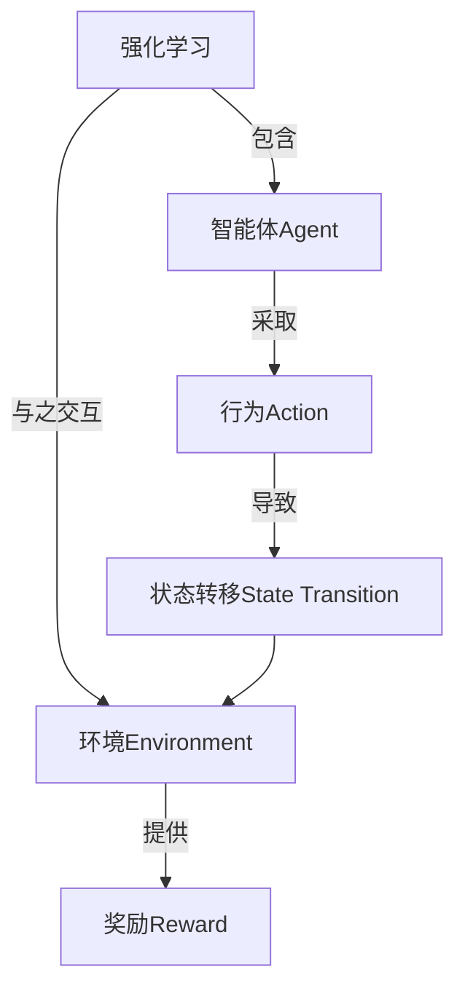

# 强化学习：在云计算资源调度中的应用

## 1. 背景介绍

### 1.1 云计算的兴起

随着互联网技术的快速发展,云计算已经成为当今IT行业的一股重要力量。云计算为用户提供了按需获取计算资源的灵活性,避免了昂贵的硬件投资和运维开销。然而,有效地管理和调度云资源仍然是一个巨大的挑战。

### 1.2 资源调度的重要性

在云计算环境中,资源调度决定了系统的性能、可用性和成本效率。合理的调度策略可以最大限度地利用资源,提高资源利用率,降低能耗,并确保服务质量满足用户需求。反之,糟糕的调度可能导致资源浪费、性能下降、能源消耗增加等问题。

### 1.3 传统调度方法的局限性

传统的资源调度方法通常基于规则或启发式算法,但这些方法往往难以适应动态、复杂的云环境。它们缺乏自适应能力,无法充分利用历史数据,并且难以处理具有多个矛盾目标的优化问题。

## 2. 核心概念与联系

### 2.1 强化学习概述

强化学习(Reinforcement Learning, RL)是机器学习的一个重要分支,它致力于让智能体(Agent)通过与环境的交互来学习如何采取最优策略,以最大化长期累积奖励。



### 2.2 马尔可夫决策过程

强化学习问题通常建模为马尔可夫决策过程(Markov Decision Process, MDP),它是一种离散时间的随机控制过程。在MDP中,智能体的当前状态只取决于前一个状态和采取的行为,与更早的历史无关。

$$
\begin{aligned}
    P(s_{t+1}|s_t,a_t,s_{t-1},a_{t-1},...,s_0,a_0) &= P(s_{t+1}|s_t,a_t) \\
    R(s_t,a_t,s_{t+1}) &= E[r_{t+1}|s_t,a_t,s_{t+1}]
\end{aligned}
$$

其中:
- $s_t$是时刻t的状态
- $a_t$是时刻t采取的行为
- $P(s_{t+1}|s_t,a_t)$是状态转移概率
- $R(s_t,a_t,s_{t+1})$是期望奖励

### 2.3 策略与价值函数

智能体的目标是学习一个最优策略$\pi^*$,使得在该策略下的期望累积奖励最大化。策略$\pi$定义了智能体在每个状态下采取行为的概率分布。价值函数$V^\pi(s)$表示在策略$\pi$下从状态$s$开始后续累积奖励的期望值。

$$
V^\pi(s) = E_\pi\left[\sum_{t=0}^\infty \gamma^t r_{t+1} | s_0 = s\right]
$$

其中$\gamma \in [0,1]$是折现因子,用于权衡即时奖励和长期奖励。

## 3. 核心算法原理具体操作步骤  

强化学习算法可分为基于价值函数(Value-based)、基于策略(Policy-based)和Actor-Critic两大类。以下将介绍其中的经典算法。

### 3.1 Q-Learning

Q-Learning是一种基于价值函数的无模型算法,它直接学习状态-行为对的价值函数Q(s,a),而不需要了解环境的转移概率和奖励函数。算法步骤如下:

1. 初始化Q(s,a)为任意值
2. 对每个episode:
    - 初始化状态s
    - 对每个时间步:
        - 选择行为a(基于ε-greedy或其他策略)
        - 执行行为a,观察奖励r和新状态s'
        - 更新Q(s,a):
        
        $$Q(s,a) \leftarrow Q(s,a) + \alpha[r + \gamma\max_{a'}Q(s',a') - Q(s,a)]$$
        
        - s = s'
3. 直到convergence

其中$\alpha$是学习率。Q-Learning可以证明在适当条件下收敛于最优Q函数。

### 3.2 Sarsa

Sarsa也是一种基于价值函数的算法,但与Q-Learning不同,它直接学习策略$\pi$对应的Q函数。算法步骤与Q-Learning类似,不同之处在于Q值的更新:

$$Q(s,a) \leftarrow Q(s,a) + \alpha[r + \gamma Q(s',a') - Q(s,a)]$$

其中$a'$是根据策略$\pi$在状态$s'$选择的行为。

### 3.3 Policy Gradient

Policy Gradient是一种基于策略的算法,它直接学习参数化策略$\pi_\theta$,使期望累积奖励最大化:

$$J(\theta) = E_{\tau \sim \pi_\theta}[R(\tau)]$$

其中$\tau$表示一个episode的状态-行为轨迹序列。算法通过计算梯度$\nabla_\theta J(\theta)$并沿梯度方向更新参数$\theta$:

$$\theta \leftarrow \theta + \alpha \nabla_\theta J(\theta)$$

梯度估计通常使用策略梯度定理:

$$\nabla_\theta J(\theta) = E_{\tau \sim \pi_\theta}\left[\sum_{t=0}^\infty \nabla_\theta \log\pi_\theta(a_t|s_t)Q^{\pi_\theta}(s_t,a_t)\right]$$

### 3.4 Actor-Critic

Actor-Critic算法同时结合了价值函数(Critic)和策略(Actor)的优点。Critic学习评估当前策略的价值函数,而Actor根据Critic提供的评估来更新策略参数。这种方法可以有效地解决策略梯度算法的高方差问题。

Actor-Critic算法的一般框架为:

1. 初始化Actor(策略$\pi_\theta$)和Critic(价值函数$V_w$)
2. 对每个episode:
    - 生成episode的轨迹$\tau$
    - 更新Critic(例如TD-error):
        
        $$\delta_t = r_t + \gamma V_w(s_{t+1}) - V_w(s_t)$$
        
        $$w \leftarrow w + \alpha_w \delta_t \nabla_w V_w(s_t)$$
        
    - 更新Actor(例如有利于增加$Q^{\pi_\theta}$的梯度):
        
        $$\theta \leftarrow \theta + \alpha_\theta \sum_{t=0}^\infty \nabla_\theta \log\pi_\theta(a_t|s_t)V_w(s_t)$$

## 4. 数学模型和公式详细讲解举例说明

在强化学习中,数学模型和公式扮演着重要角色,用于形式化问题、推导算法以及分析收敛性和性能。以下将详细讲解一些核心公式。

### 4.1 贝尔曼方程

贝尔曼方程(Bellman Equation)是强化学习中的基础方程,描述了在一个MDP中,状态价值函数与后继状态价值函数之间的关系。

对于任意策略$\pi$,状态价值函数$V^\pi(s)$满足:

$$V^\pi(s) = E_\pi[r_t + \gamma V^\pi(s_{t+1}) | s_t = s]$$

对于最优策略$\pi^*$,最优状态价值函数$V^*(s)$满足:

$$V^*(s) = \max_a E[r_t + \gamma V^*(s_{t+1}) | s_t = s, a_t = a]$$

类似地,对于任意策略$\pi$,状态-行为价值函数$Q^\pi(s,a)$满足:

$$Q^\pi(s,a) = E_\pi[r_t + \gamma Q^\pi(s_{t+1}, a_{t+1}) | s_t = s, a_t = a]$$

对于最优策略$\pi^*$,最优状态-行为价值函数$Q^*(s,a)$满足:

$$Q^*(s,a) = E[r_t + \gamma \max_{a'} Q^*(s_{t+1}, a') | s_t = s, a_t = a]$$

贝尔曼方程为许多强化学习算法的基础,如价值迭代、策略迭代和Q-Learning等。

### 4.2 策略梯度定理

策略梯度定理(Policy Gradient Theorem)为基于策略的强化学习算法提供了理论基础。它给出了期望累积奖励$J(\theta)$对策略参数$\theta$的梯度:

$$\nabla_\theta J(\theta) = E_{\tau \sim \pi_\theta}\left[\sum_{t=0}^\infty \nabla_\theta \log\pi_\theta(a_t|s_t)Q^{\pi_\theta}(s_t,a_t)\right]$$

其中$\tau$表示一个episode的状态-行为轨迹序列,而$Q^{\pi_\theta}(s_t,a_t)$是在策略$\pi_\theta$下从状态$s_t$执行行为$a_t$后的期望累积奖励。

策略梯度定理告诉我们,为了最大化$J(\theta)$,我们需要增加那些具有较大$Q^{\pi_\theta}(s_t,a_t)$值的行为$a_t$在状态$s_t$下被选择的概率。

### 4.3 时序差分误差

时序差分(Temporal Difference, TD)是强化学习中常用的一种技术,用于估计价值函数。TD误差衡量了估计值与真实值之间的差异:

$$\delta_t = r_t + \gamma V(s_{t+1}) - V(s_t)$$

其中$V(s_t)$是对状态$s_t$的估计价值,而$r_t + \gamma V(s_{t+1})$是基于后继状态$s_{t+1}$的真实价值。

TD误差被广泛应用于各种强化学习算法中,如Q-Learning、Sarsa和Actor-Critic等,用于更新价值函数或策略参数。

### 4.4 探索与利用权衡

在强化学习中,智能体需要在探索(exploration)和利用(exploitation)之间进行权衡。探索意味着尝试新的行为,以发现潜在的更好策略;而利用则是利用当前已知的最佳行为来获取最大化即时奖励。

一种常见的探索策略是$\epsilon$-greedy,即以$\epsilon$的概率随机选择行为(探索),以$1-\epsilon$的概率选择当前已知的最优行为(利用)。另一种方法是软更新(soft update),即给最优行为以较高的选择概率,但也给其他行为以一定的选择概率。

合理的探索与利用权衡对于强化学习算法的性能至关重要。过多的探索可能导致收敛缓慢,而过多的利用则可能陷入次优解。

## 5. 项目实践:代码实例和详细解释说明

为了更好地理解强化学习在云计算资源调度中的应用,我们将通过一个简单的示例项目来演示。这个项目使用Q-Learning算法训练一个智能体,以最优方式调度云资源,满足任务需求并最小化成本。

### 5.1 问题描述

假设我们有一个云计算集群,由多个虚拟机(VM)实例组成。每个VM实例都有不同的CPU、内存和GPU配置,并且按小时计费。我们的目标是为到达的任务分配合适的VM实例,以满足任务的资源需求,同时尽可能降低总体成本。

我们将这个问题建模为一个MDP:

- 状态(State): 当前可用的VM实例及其配置
- 行为(Action): 为到达的任务分配一个VM实例
- 奖励(Reward): 如果成功分配,则获得与任务持续时间成正比的奖励;如果分配失败(资源不足),则获得负奖励

### 5.2 环境实现

我们首先定义环境类`CloudEnv`,它模拟了云计算集群及任务到达过程。

```python
import random

class CloudEnv:
    def __init__(self, vm_configs, task_configs):
        self.vm_configs = vm_configs
        self.task_configs = task_configs
        self.available_vms = {config: 5 for config in vm_configs}  # 初始可用VM实例数
        self.reset()

    def reset(self):
        self.current_task = None
        self.task_duration = 0
        self.total_reward = 0
        return self.get_state()

    def get_state(self):
        return tuple(self.available_vms.items())

    def step(self, action