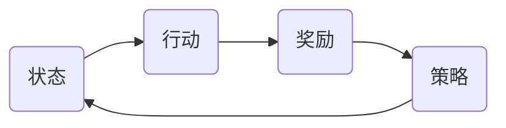
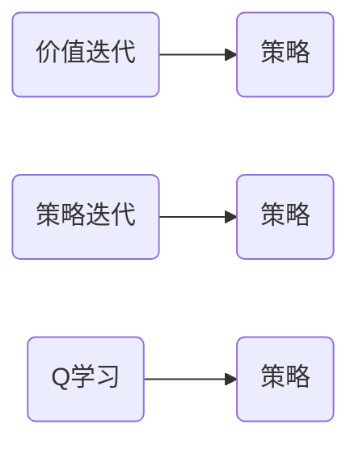

## 1.背景介绍

在过去的几年中，人工智能已经在各个领域取得了显著的进步，教育领域也不例外。其中，强化学习作为人工智能的一个重要分支，正逐渐引起教育领域的关注。强化学习是一种通过学习和实践来优化决策过程的方法，其目标是在给定的环境中找到最佳的行动策略。在教育领域，强化学习可以用来优化教学策略，提高学生的学习效果。

## 2.核心概念与联系

强化学习的核心概念包括状态、行动、奖励和策略。状态是描述环境的信息，行动是在给定状态下可以采取的行为，奖励则是行动的结果，策略是在给定状态下选择行动的方法。在教育领域，状态可以是学生的知识水平和学习进度，行动可以是教师的教学方法，奖励可以是学生的学习效果，策略则是教师根据学生的状态选择教学方法的规则。



## 3.核心算法原理具体操作步骤

强化学习的核心算法包括价值迭代、策略迭代和Q学习。价值迭代是通过迭代更新状态价值，直到达到稳定状态，然后根据状态价值得到最优策略。策略迭代是先随机选择一个策略，然后通过迭代更新策略，直到策略稳定。Q学习是通过学习行动价值函数Q，然后根据Q函数得到最优策略。



## 4.数学模型和公式详细讲解举例说明

价值迭代的数学模型是贝尔曼方程，其公式为：

$$ V(s) = max_a \sum_{s'} P(s'|s,a)(R(s,a,s') + \gamma V(s')) $$

其中，$V(s)$是状态$s$的价值，$P(s'|s,a)$是在状态$s$下采取行动$a$后转移到状态$s'$的概率，$R(s,a,s')$是在状态$s$下采取行动$a$后转移到状态$s'$的奖励，$\gamma$是折扣因子。

策略迭代的数学模型也是贝尔曼方程，其公式为：

$$ V(s) = \sum_{a} \pi(a|s) \sum_{s'} P(s'|s,a)(R(s,a,s') + \gamma V(s')) $$

其中，$\pi(a|s)$是在状态$s$下采取行动$a$的概率。

Q学习的数学模型是Q函数，其公式为：

$$ Q(s,a) = Q(s,a) + \alpha (r + \gamma max_{a'} Q(s',a') - Q(s,a)) $$

其中，$Q(s,a)$是在状态$s$下采取行动$a$的价值，$r$是奖励，$\alpha$是学习率。

## 5.项目实践：代码实例和详细解释说明

下面是一个使用Q学习算法进行教学策略优化的代码实例：

```python
import numpy as np

# 初始化Q表
Q = np.zeros((n_states, n_actions))

# 学习过程
for episode in range(n_episodes):
    state = env.reset()
    done = False

    while not done:
        # 选择行动
        action = np.argmax(Q[state, :])

        # 执行行动
        next_state, reward, done, _ = env.step(action)

        # 更新Q表
        Q[state, action] = Q[state, action] + alpha * (reward + gamma * np.max(Q[next_state, :]) - Q[state, action])

        # 更新状态
        state = next_state
```

在这个代码中，首先初始化Q表，然后通过迭代学习过程来更新Q表。在每个学习过程中，首先选择行动，然后执行行动，接着更新Q表，最后更新状态。通过这个过程，可以得到优化的教学策略。

## 6.实际应用场景

强化学习在教育领域的应用包括个性化教学、智能教学系统和教学策略优化等。个性化教学是根据每个学生的学习状态和学习能力，提供个性化的教学内容和教学方法。智能教学系统是通过人工智能技术，实现自动化的教学过程。教学策略优化是通过优化教学策略，提高学生的学习效果。

## 7.工具和资源推荐

强化学习的工具和资源包括OpenAI Gym、TensorFlow、PyTorch和强化学习教程等。OpenAI Gym是一个强化学习的环境库，提供了许多预定义的环境。TensorFlow和PyTorch是深度学习框架，可以用来实现强化学习算法。强化学习教程包括书籍、网站和在线课程等，可以帮助你深入理解和学习强化学习。

## 8.总结：未来发展趋势与挑战

强化学习在教育领域的应用有着广阔的前景，但也面临着一些挑战。一方面，强化学习可以帮助优化教学策略，提高学生的学习效果，但是如何将强化学习有效地应用到实际的教学过程中，还需要进一步的研究。另一方面，强化学习的学习过程需要大量的数据和计算资源，如何在有限的资源下实现有效的学习，也是一个挑战。

## 9.附录：常见问题与解答

1. 问题：强化学习和监督学习有什么区别？

答：强化学习和监督学习都是机器学习的方法，但是他们的学习目标和学习过程有所不同。监督学习是通过学习输入和输出的对应关系来进行预测，而强化学习则是通过学习和实践来优化决策过程。

2. 问题：强化学习的学习过程是怎样的？

答：强化学习的学习过程是通过与环境的交互来进行的。在每一步，强化学习算法根据当前的状态选择一个行动，然后执行这个行动，接着得到一个奖励和新的状态，最后更新其策略。

3. 问题：强化学习在教育领域有哪些应用？

答：强化学习在教育领域的应用包括个性化教学、智能教学系统和教学策略优化等。

作者：禅与计算机程序设计艺术 / Zen and the Art of Computer Programming
