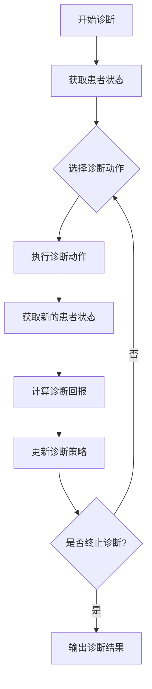

# 强化学习：在智能医疗诊断中的应用

## 1.背景介绍

### 1.1 医疗诊断的重要性和挑战

医疗诊断是医疗保健系统中最关键的环节之一。准确及时的诊断对于患者的治疗和预后至关重要。然而,医疗诊断过程存在着诸多挑战:

- 疾病症状的复杂性和多样性
- 医生的主观经验和认知偏差
- 医疗数据的高维度和异构性
- 罕见疾病的低发病率和难以识别

传统的医疗诊断过程主要依赖于医生的专业知识和经验,存在一定的主观性和不确定性。随着人工智能技术的发展,智能医疗诊断系统有望提供更加客观、准确的诊断支持。

### 1.2 人工智能在医疗诊断中的应用

人工智能技术在医疗诊断领域展现出巨大的潜力,主要体现在以下几个方面:

- 医学影像分析:利用深度学习等技术对医学影像(如CT、MRI等)进行智能分析,辅助疾病检测和诊断。
- 电子病历挖掘:通过自然语言处理和知识图谱技术,从海量电子病历中提取有价值的信息,支持诊断决策。
- 智能辅助诊断:基于机器学习算法构建智能诊断模型,为医生提供辅助诊断建议。

其中,强化学习作为一种重要的机器学习范式,在医疗诊断领域也有着广阔的应用前景。

### 1.3 强化学习在医疗诊断中的优势

相比于监督学习和无监督学习,强化学习在医疗诊断领域具有以下优势:

- 决策序列优化:强化学习能够优化诊断过程中的一系列决策,模拟医生的临床实践。
- 探索与利用权衡:强化学习可以在探索新的诊断策略和利用已知经验之间达到平衡。
- 动态环境适应:强化学习能够适应医疗诊断过程中的动态变化,如病情进展、新的检查结果等。

因此,将强化学习应用于智能医疗诊断具有重要的理论意义和应用价值。

## 2.核心概念与联系

### 2.1 强化学习基本概念

强化学习是一种基于环境交互的机器学习范式,其核心思想是通过试错学习,获取最大化长期回报的策略。强化学习系统由以下几个基本要素组成:

- 环境(Environment):系统所处的外部世界,包括状态、动作和回报。
- 智能体(Agent):与环境进行交互的决策实体,根据当前状态选择动作。
- 状态(State):环境的instantaneous状况。
- 动作(Action):智能体对环境的操作。
- 回报(Reward):环境对智能体动作的反馈,指导智能体朝着目标优化。
- 策略(Policy):智能体根据状态选择动作的映射规则。

强化学习的目标是找到一个最优策略,使得在环境中获得的累积回报最大化。

### 2.2 强化学习在医疗诊断中的形式化

将强化学习应用于医疗诊断时,可以将诊断过程形式化为一个马尔可夫决策过程(MDP):

- 状态(State):患者的症状、体征、检查结果等临床信息。
- 动作(Action):医生可以采取的诊断措施,如询问病史、体格检查、实验室检查等。
- 回报(Reward):根据诊断结果的准确性和及时性设计的奖惩机制。
- 策略(Policy):医生根据当前状态选择下一步诊断措施的决策规则。

智能体(Agent)的目标是学习一个最优诊断策略,通过与环境(患者)的交互,最大化累积诊断回报。

### 2.3 强化学习算法类型

常见的强化学习算法可分为以下几类:

1. 基于价值函数的算法:
   - Q-Learning
   - SARSA
   - Deep Q-Network (DQN)

2. 基于策略的算法:
   - Policy Gradient
   - Actor-Critic
   - Proximal Policy Optimization (PPO)

3. 基于模型的算法:
   - Dyna-Q
   - prioritized sweeping

4. 多智能体强化学习算法:
   - 独立学习
   - 联合行为学习
   - 多智能体演化策略

不同算法适用于不同的医疗诊断场景,需要根据具体问题进行选择和调整。

### 2.4 Mermaid流程图

以下是强化学习在医疗诊断中的核心流程:

该流程图描述了强化学习智能体与患者环境的交互过程:

1. 获取患者当前状态信息
2. 根据当前状态选择诊断动作
3. 执行诊断动作,获取新的患者状态
4. 计算当前诊断动作的回报
5. 根据回报更新诊断策略
6. 重复上述过程,直至满足终止条件
7. 输出最终诊断结果

## 3.核心算法原理具体操作步骤

在强化学习应用于医疗诊断中,常见的算法有Q-Learning、Deep Q-Network (DQN)、Policy Gradient等。以下以Q-Learning为例,介绍其核心算法原理和具体操作步骤。

### 3.1 Q-Learning算法原理

Q-Learning是一种基于价值函数的强化学习算法,其核心思想是学习一个Q函数,用于评估在某个状态下采取某个动作的价值。Q函数的定义如下:

$$Q(s, a) = \mathbb{E}_\pi[R_t + \gamma R_{t+1} + \gamma^2 R_{t+2} + \cdots | s_t = s, a_t = a, \pi]$$

其中:
- $s$表示当前状态
- $a$表示选择的动作
- $R_t$表示时刻$t$获得的即时回报
- $\gamma$是折现因子,用于权衡即时回报和长期回报
- $\pi$是当前策略

Q-Learning算法的目标是找到一个最优Q函数$Q^*(s, a)$,使得在任意状态下选择的动作都是最优的。

### 3.2 Q-Learning算法步骤

Q-Learning算法的具体步骤如下:

1. 初始化Q表格,所有状态-动作对的Q值初始化为0或随机值。
2. 对于每个时刻$t$:
   a. 根据当前状态$s_t$和策略$\pi$选择动作$a_t$。
   b. 执行动作$a_t$,观察到新的状态$s_{t+1}$和即时回报$r_{t+1}$。
   c. 更新Q表格中$(s_t, a_t)$的Q值:
      $$Q(s_t, a_t) \leftarrow Q(s_t, a_t) + \alpha \left[ r_{t+1} + \gamma \max_a Q(s_{t+1}, a) - Q(s_t, a_t) \right]$$
      其中$\alpha$是学习率,用于控制更新幅度。
3. 重复步骤2,直至收敛或达到最大迭代次数。

在医疗诊断场景中,Q-Learning算法的状态可以是患者的症状、体征和检查结果;动作可以是医生可以采取的诊断措施;回报可以根据诊断结果的准确性和及时性设计。通过不断与患者环境交互,算法可以学习到一个最优诊断策略。

### 3.3 Q-Learning算法优缺点

Q-Learning算法的优点包括:

- 无需建模环境的转移概率,只需要通过与环境交互获取数据。
- 算法相对简单,易于理解和实现。
- 可以处理连续状态和动作空间。

缺点包括:

- 存在维数灾难问题,当状态和动作空间很大时,Q表格将变得难以存储和更新。
- 无法处理部分可观测环境(Partially Observable MDPs)。
- 收敛性能受到探索策略的影响。

为了解决Q-Learning算法的缺陷,研究人员提出了基于深度神经网络的Deep Q-Network (DQN)算法,能够有效处理高维状态空间,同时提高算法的泛化能力和收敛性能。

## 4.数学模型和公式详细讲解举例说明

### 4.1 马尔可夫决策过程(MDP)

马尔可夫决策过程(Markov Decision Process, MDP)是强化学习问题的数学模型,用于描述智能体与环境的交互过程。一个MDP可以用一个五元组$(S, A, P, R, \gamma)$来表示:

- $S$是状态空间的集合
- $A$是动作空间的集合
- $P(s'|s, a)$是状态转移概率,表示在状态$s$下执行动作$a$后,转移到状态$s'$的概率
- $R(s, a, s')$是回报函数,表示在状态$s$下执行动作$a$后,转移到状态$s'$获得的即时回报
- $\gamma \in [0, 1)$是折现因子,用于权衡即时回报和长期回报

在医疗诊断场景中,MDP可以用于建模诊断过程:

- 状态$s$可以表示患者的症状、体征和检查结果
- 动作$a$可以表示医生可以采取的诊断措施,如询问病史、体格检查、实验室检查等
- 状态转移概率$P(s'|s, a)$可以表示在当前状态下采取某个诊断措施后,患者状态转移的概率
- 回报函数$R(s, a, s')$可以根据诊断结果的准确性和及时性设计

智能体(Agent)的目标是找到一个最优策略$\pi^*$,使得在MDP中获得的累积折现回报最大化:

$$\max_\pi \mathbb{E}_\pi \left[ \sum_{t=0}^\infty \gamma^t R(s_t, a_t, s_{t+1}) \right]$$

### 4.2 Q-Learning算法公式推导

Q-Learning算法的核心思想是学习一个Q函数,用于评估在某个状态下采取某个动作的价值。Q函数的定义如下:

$$Q(s, a) = \mathbb{E}_\pi[R_t + \gamma R_{t+1} + \gamma^2 R_{t+2} + \cdots | s_t = s, a_t = a, \pi]$$

其中:
- $s$表示当前状态
- $a$表示选择的动作
- $R_t$表示时刻$t$获得的即时回报
- $\gamma$是折现因子,用于权衡即时回报和长期回报
- $\pi$是当前策略

根据贝尔曼方程(Bellman Equation),Q函数可以通过如下迭代式进行更新:

$$Q(s_t, a_t) \leftarrow Q(s_t, a_t) + \alpha \left[ r_{t+1} + \gamma \max_a Q(s_{t+1}, a) - Q(s_t, a_t) \right]$$

其中$\alpha$是学习率,用于控制更新幅度。

该更新规则的推导过程如下:

1. 根据Q函数的定义,有:
   $$Q(s_t, a_t) = \mathbb{E}_\pi[R_t + \gamma R_{t+1} + \gamma^2 R_{t+2} + \cdots | s_t, a_t, \pi]$$

2. 将右侧展开,有:
   $$Q(s_t, a_t) = \mathbb{E}_\pi[R_t + \gamma (R_{t+1} + \gamma R_{t+2} + \cdots) | s_t, a_t, \pi]$$
   $$= \mathbb{E}_\pi[R_t + \gamma Q(s_{t+1}, a_{t+1}) | s_t, a_t, \pi]$$

3. 将$Q(s_{t+1}, a_{t+1})$替换为$\max_a Q(s_{t+1}, a)$,得到:
   $$Q(s_t, a_t) = \mathbb{E}_\pi[R_t + \gamma \max_a Q(s_{t+1}, a) | s_t, a_t, \pi]$$

4. 将期望值替换为样本值,并引入学习率$\alpha$,得到Q-Learning算法的更