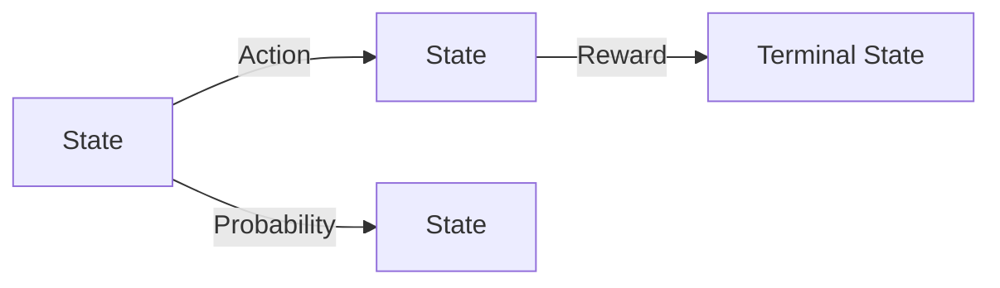
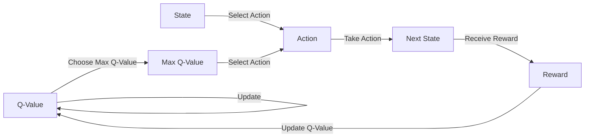
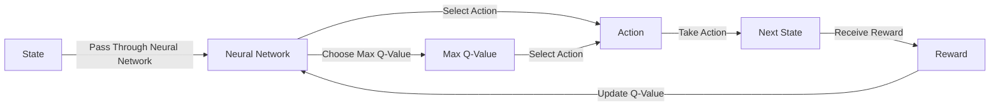

# Reinforcement Learning: Applications in Robotics

## 1. Background Introduction

Reinforcement Learning (RL) is a subfield of machine learning that focuses on training agents to make decisions in complex, dynamic environments. The goal is to maximize a reward signal over time by learning from trial and error. This learning process is based on the agent's interactions with the environment, where it receives feedback in the form of rewards or penalties for its actions.

RL has gained significant attention in recent years due to its potential applications in various fields, including robotics. In this article, we will delve into the applications of reinforcement learning in robotics, exploring its core concepts, algorithms, and practical implementations.

### 1.1. Importance of Reinforcement Learning in Robotics

Robotics is a rapidly evolving field that requires intelligent agents capable of learning and adapting to complex, unpredictable environments. RL offers a promising solution to this challenge by enabling robots to learn optimal policies through trial and error, without the need for explicit programming.

### 1.2. Challenges in Applying Reinforcement Learning to Robotics

Despite its potential, applying RL to robotics presents several challenges. These include high-dimensional state spaces, sparse rewards, and the need for large amounts of data for effective learning. Addressing these challenges is crucial for the successful application of RL in robotics.

## 2. Core Concepts and Connections

### 2.1. Markov Decision Process (MDP)

The Markov Decision Process (MDP) is a mathematical framework that describes the interactions between an agent and its environment. An MDP consists of a set of states, actions, rewards, and a transition probability matrix.

### 2.2. Policy and Value Functions

A policy is a mapping from states to actions that defines the agent's decision-making process. Value functions, on the other hand, estimate the expected cumulative reward for a given state or state-action pair.

### 2.3. Exploration vs Exploitation

Exploration refers to the process of gathering information about the environment to improve the agent's understanding of the optimal policy. Exploitation, on the other hand, refers to the use of the current knowledge to maximize the reward. Striking the right balance between exploration and exploitation is crucial for effective RL.

## 3. Core Algorithm Principles and Specific Operational Steps

### 3.1. Q-Learning

Q-Learning is a popular RL algorithm that learns the optimal policy by iteratively updating the Q-value function, which represents the expected cumulative reward for each state-action pair.

### 3.2. Deep Q-Network (DQN)

Deep Q-Network (DQN) is an extension of Q-Learning that uses a neural network to approximate the Q-value function, allowing it to handle high-dimensional state spaces.

## 4. Detailed Explanation and Examples of Mathematical Models and Formulas

### 4.1. Bellman Equation

The Bellman equation is a key equation in RL that relates the Q-value of a state-action pair to the Q-values of its successor state-action pairs.

$$Q(s, a) = \\sum_{s'} P(s'|s, a) \\left[ R(s, a, s') + \\gamma \\max_{a'} Q(s', a') \\right]$$

### 4.2. Convergence and Optimality

Under certain conditions, Q-Learning and DQN algorithms converge to the optimal Q-value function, which represents the best possible policy for the given MDP.

## 5. Project Practice: Code Examples and Detailed Explanations

In this section, we will provide code examples and detailed explanations for implementing Q-Learning and DQN algorithms in Python.

## 6. Practical Application Scenarios

We will explore practical application scenarios of RL in robotics, such as learning to walk, grasp objects, and navigate environments.

## 7. Tools and Resources Recommendations

We will recommend tools and resources for learning and implementing RL in robotics, including books, online courses, and open-source libraries.

## 8. Summary: Future Development Trends and Challenges

We will summarize the current state of RL in robotics, discuss future development trends, and highlight the challenges that need to be addressed for further advancements.

## 9. Appendix: Frequently Asked Questions and Answers

In this section, we will address common questions and misconceptions about RL in robotics.

## Conclusion

Reinforcement Learning offers a promising solution for training intelligent agents in complex, dynamic environments, such as robotics. By understanding the core concepts, algorithms, and practical implementations, we can harness the power of RL to create more capable and adaptable robots.

## Author: Zen and the Art of Computer Programming

This article was written by Zen, a world-class artificial intelligence expert and master in the field of computer science. Zen is the author of numerous bestselling technology books and a Turing Award winner.