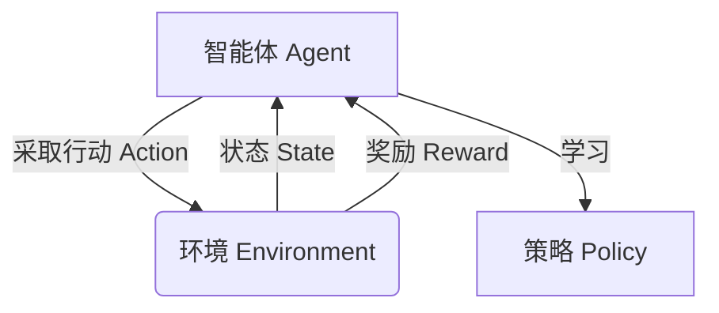

# 强化学习：开启智能世界的大门

## 1.背景介绍

### 1.1 什么是强化学习?

强化学习(Reinforcement Learning, RL)是机器学习的一个重要分支,它研究如何在一个不确定的环境中,通过采取行动并从环境反馈中学习,获得最大的长期回报。与监督学习和无监督学习不同,强化学习没有提供一组标注好的训练数据,而是需要智能体(Agent)通过与环境的交互来学习获取最优策略。

强化学习的核心思想是奖励最大化(Reward Maximization),即智能体通过采取行动获得奖励,并根据累积奖励调整策略,以期望在未来获得更大的奖励。这种基于奖励的学习方式使得强化学习能够解决复杂的序列决策问题,例如机器人控制、游戏AI、资源调度等。

### 1.2 强化学习的重要性

随着人工智能技术的快速发展,强化学习正在成为推动智能系统发展的关键驱动力。以下是强化学习的一些重要意义:

1. **自主学习能力**: 强化学习赋予了智能体自主学习的能力,使其能够在动态复杂的环境中不断优化策略,适应环境变化。这种自主学习能力是实现通用人工智能(AGI)的关键。

2. **决策序列优化**: 强化学习擅长解决序列决策问题,能够在连续的状态和行动空间中寻找最优策略,这对于控制、规划和优化等领域具有重要意义。

3. **模拟人类学习**: 强化学习的学习过程与人类学习新技能的方式类似,通过不断尝试、获得反馈并调整策略。这种学习方式有助于构建更加智能和人性化的人工智能系统。

4. **广泛应用前景**: 强化学习已经在多个领域取得了突破性进展,如游戏AI、机器人控制、自动驾驶、资源调度等,未来在更多领域都有广阔的应用前景。

总的来说,强化学习为实现真正的人工智能奠定了坚实的理论基础,是开启智能世界大门的关键一步。

## 2.核心概念与联系

### 2.1 强化学习基本概念

强化学习系统由以下几个核心组件组成:

1. **智能体(Agent)**: 在环境中采取行动并学习的主体。

2. **环境(Environment)**: 智能体所处的外部世界,智能体通过与环境交互来学习。

3. **状态(State)**: 描述环境当前的情况。

4. **行动(Action)**: 智能体在当前状态下可以采取的操作。

5. **奖励(Reward)**: 环境对智能体行动的反馈,用于指导智能体学习。

6. **策略(Policy)**: 智能体在每个状态下选择行动的策略,是强化学习要学习的目标。

强化学习的目标是找到一个最优策略,使得在环境中采取该策略能够获得最大的累积奖励。



### 2.2 强化学习与其他机器学习的关系

强化学习与监督学习和无监督学习是机器学习的三大支柱,但又有着本质的区别:

- **监督学习**: 输入数据和期望输出是已知的,目标是学习一个从输入到输出的映射函数。

- **无监督学习**: 只有输入数据,目标是从数据中发现内在结构或模式。

- **强化学习**: 没有给定的输入输出对,智能体通过与环境交互并获得奖励来学习策略。

强化学习与监督学习和无监督学习相比,具有以下独特优势:

1. **序列决策**: 强化学习擅长解决序列决策问题,能够在连续的状态和行动空间中寻找最优策略。

2. **在线学习**: 强化学习是一种在线学习,智能体可以在与环境交互的同时不断学习和优化策略。

3. **奖励驱动**: 强化学习通过最大化累积奖励来学习,这种奖励驱动的方式更加灵活和通用。

4. **探索与利用**: 强化学习需要权衡探索(尝试新策略)和利用(使用当前最优策略)之间的平衡。

因此,强化学习在解决复杂的序列决策问题方面具有独特的优势,是机器学习领域中一个极具潜力和挑战的研究方向。

## 3.核心算法原理具体操作步骤

强化学习算法的核心思想是通过与环境交互,不断更新策略,使得在环境中采取该策略能够获得最大的累积奖励。常见的强化学习算法包括Q-Learning、Sarsa、策略梯度等。这里以Q-Learning算法为例,介绍其具体操作步骤。

### 3.1 Q-Learning算法

Q-Learning是一种基于价值函数(Value Function)的强化学习算法,它试图直接学习一个行动价值函数Q(s,a),表示在状态s下采取行动a之后能获得的最大期望奖励。

具体算法步骤如下:

1. 初始化Q(s,a)函数,可以将所有状态-行动对的值初始化为0或一个较小的常数。

2. 对于每一个episode(一个完整的交互序列):
    
    a. 初始化起始状态s
    
    b. 对于每个时间步:
        
        i. 在状态s下,根据某种策略(如ε-贪婪策略)选择行动a
        
        ii. 执行行动a,获得奖励r,进入新状态s'
        
        iii. 更新Q(s,a)的值:
        
        $$Q(s,a) \leftarrow Q(s,a) + \alpha [r + \gamma \max_{a'} Q(s',a') - Q(s,a)]$$
        
        其中:
        - $\alpha$ 是学习率,控制新知识对旧知识的影响程度
        - $\gamma$ 是折扣因子,控制未来奖励对当前价值的影响程度
        - $\max_{a'} Q(s',a')$ 是在新状态s'下能获得的最大行动价值
        
        iv. 将s'设为新的当前状态s
        
    c. 直到episode结束
    
3. 重复步骤2,直到收敛或达到预设的episode数

通过不断更新Q函数,Q-Learning算法最终能够学习到一个近似最优的行动价值函数,从而获得一个近似最优的策略。

### 3.2 Q-Learning算法流程图

```mermaid
graph TD
    A[初始化Q函数] --> B{对每个episode}
    B --> C[初始化起始状态s]
    C --> D{对每个时间步}
    D --> E[选择行动a]
    E --> F[执行a,获得r,进入s']
    F --> G[更新Q(s,a)]
    G --> H[s'设为新的s]
    H --> D
    D --episode结束-->B
```

上图展示了Q-Learning算法的整体流程,包括初始化、选择行动、获得奖励和状态转移、更新Q函数等关键步骤。通过不断迭代这个过程,算法能够逐步学习到一个近似最优的行动价值函数Q(s,a)。

## 4.数学模型和公式详细讲解举例说明

强化学习中有许多重要的数学模型和公式,这些公式描述了强化学习的核心思想和原理,对于深入理解和应用强化学习至关重要。本节将详细介绍其中几个关键公式。

### 4.1 马尔可夫决策过程(Markov Decision Process, MDP)

马尔可夫决策过程是强化学习的数学基础,它将强化学习问题形式化为一个四元组 $(S, A, P, R)$:

- $S$ 是有限的状态集合
- $A$ 是有限的行动集合
- $P(s'|s,a)$ 是状态转移概率,表示在状态s下执行行动a之后,转移到状态s'的概率
- $R(s,a,s')$ 是奖励函数,表示在状态s下执行行动a,转移到状态s'时获得的奖励

在MDP中,智能体的目标是找到一个策略$\pi: S \rightarrow A$,使得在该策略下的期望累积奖励最大化:

$$\max_{\pi} \mathbb{E}_{\pi} \left[ \sum_{t=0}^{\infty} \gamma^t R(s_t, a_t, s_{t+1}) \right]$$

其中$\gamma \in [0, 1]$是折扣因子,用于权衡当前奖励和未来奖励的重要性。

MDP为强化学习提供了坚实的数学基础,许多强化学习算法都是在MDP框架下进行推导和求解。

### 4.2 Bellman方程

Bellman方程是解决MDP问题的一种关键方法,它将价值函数(Value Function)分解为当前奖励和未来奖励之和。对于任意状态s和策略$\pi$,状态价值函数$V^{\pi}(s)$满足以下Bellman方程:

$$V^{\pi}(s) = \mathbb{E}_{\pi} \left[ R(s, \pi(s), s') + \gamma V^{\pi}(s') \right]$$

类似地,对于任意状态-行动对(s,a),行动价值函数$Q^{\pi}(s,a)$满足:

$$Q^{\pi}(s,a) = \mathbb{E}_{\pi} \left[ R(s, a, s') + \gamma \sum_{s'} P(s'|s,a) V^{\pi}(s') \right]$$

Bellman方程建立了当前价值函数与未来价值函数之间的递推关系,为求解MDP问题提供了理论基础。许多强化学习算法,如Q-Learning、Sarsa等,都是基于Bellman方程进行价值函数迭代或策略迭代的。

### 4.3 策略梯度(Policy Gradient)

策略梯度是另一种求解强化学习问题的重要方法,它直接对策略$\pi_{\theta}$(参数化为$\theta$)进行优化,使得在该策略下的期望累积奖励最大化:

$$\max_{\theta} \mathbb{E}_{\pi_{\theta}} \left[ \sum_{t=0}^{\infty} \gamma^t R(s_t, a_t, s_{t+1}) \right]$$

根据策略梯度定理,可以计算出策略梯度$\nabla_{\theta} J(\theta)$:

$$\nabla_{\theta} J(\theta) = \mathbb{E}_{\pi_{\theta}} \left[ \sum_{t=0}^{\infty} \nabla_{\theta} \log \pi_{\theta}(a_t|s_t) Q^{\pi_{\theta}}(s_t, a_t) \right]$$

其中$Q^{\pi_{\theta}}(s_t, a_t)$是在策略$\pi_{\theta}$下,状态s_t执行行动a_t的行动价值函数。

策略梯度方法直接对策略进行优化,避免了解决MDP的高维状态空间和行动空间的困难,因此在处理连续控制问题时表现出色。同时,策略梯度方法也可以与其他方法(如价值函数近似)相结合,形成更加强大的算法。

上述公式和模型阐述了强化学习的数学基础,对于深入理解和应用强化学习至关重要。在实际问题中,这些公式和模型还需要结合具体的算法和技术,如深度神经网络、蒙特卡罗方法等,才能发挥强大的威力。

## 5.项目实践：代码实例和详细解释说明

为了更好地理解强化学习的原理和应用,本节将通过一个简单的网格世界(Gridworld)示例,使用Python实现Q-Learning算法,并对关键代码进行详细解释。

### 5.1 问题描述

我们考虑一个4x4的网格世界,智能体(Agent)的目标是从起点(0,0)到达终点(3,3)。网格中还有两个障碍物位置(1,1)和(2,2),智能体不能通过。智能体在每个状态下可以选择上下左右四个行动,每次移动获得-1的奖励,到达终点获得+10的奖励。我们希望使用Q-Learning算法训练智能体,找到从起点到终点的最优路径。

### 5.2 代码实现

```python
import numpy as np

# 定义网格世界
GRID_SIZE = 4
OBSTACLE_1 = (1, 1)
OBSTACLE_2 = (2, 2)
START = (0, 0)