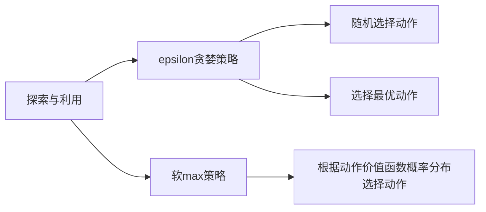
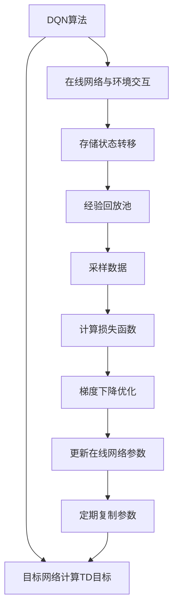

# 强化学习：探寻机器预知未来的可能性

## 1.背景介绍

### 1.1 人工智能的崛起

人工智能(Artificial Intelligence, AI)是当代科技发展的重要驱动力。近年来,AI技术在诸多领域取得了令人瞩目的成就,从语音识别、图像处理到自动驾驶,无不体现出AI的强大潜力。而在AI的多个分支中,强化学习(Reinforcement Learning, RL)凭借其独特的学习范式,为解决复杂问题提供了全新的思路。

### 1.2 强化学习的本质

强化学习是机器学习的一个重要分支,它赋予了智能体(Agent)在一个不确定的环境中学习并优化决策的能力。与监督学习和无监督学习不同,强化学习没有提供明确的输入输出对,而是通过与环境的交互,获得奖励或惩罚的反馈信号,从而学习到最优策略。

### 1.3 强化学习的应用前景

强化学习在很多领域展现出广阔的应用前景,如机器人控制、资源管理、游戏AI、金融投资等。尤其是在一些需要长期规划、连续决策的复杂场景中,强化学习能够发挥其独特优势。随着算法和计算能力的不断提升,强化学习有望帮助智能体掌握预测未来的能力,从而做出更优决策。

## 2.核心概念与联系

### 2.1 马尔可夫决策过程

马尔可夫决策过程(Markov Decision Process, MDP)是强化学习的数学基础。它描述了一个完全可观测的环境,其中智能体根据当前状态选择行为,并获得相应的奖励,同时转移到下一个状态。MDP由一组元组(S, A, P, R, γ)组成,分别表示状态集合、动作集合、状态转移概率、奖励函数和折现因子。

$$
\begin{aligned}
S &= \{s_1, s_2, \dots, s_n\} \\
A &= \{a_1, a_2, \dots, a_m\} \\
P(s' | s, a) &= \mathbb{P}[S_{t+1} = s' | S_t = s, A_t = a] \\
R(s, a, s') &= \mathbb{E}[R_{t+1} | S_t = s, A_t = a, S_{t+1} = s'] \\
\gamma &\in [0, 1)
\end{aligned}
$$

其中,$P(s' | s, a)$表示在状态$s$下执行动作$a$后,转移到状态$s'$的概率;$R(s, a, s')$表示在状态$s$下执行动作$a$,并转移到状态$s'$时获得的期望奖励;$\gamma$是折现因子,用于权衡当前奖励和未来奖励的重要性。

### 2.2 价值函数和策略

在强化学习中,我们希望找到一个最优策略$\pi^*$,使得在遵循该策略时,可以获得最大的期望回报。这个期望回报被称为价值函数(Value Function),包括状态价值函数$V^{\pi}(s)$和动作价值函数$Q^{\pi}(s, a)$。

$$
\begin{aligned}
V^{\pi}(s) &= \mathbb{E}_{\pi}\left[ \sum_{t=0}^{\infty} \gamma^t R_{t+1} | S_0 = s \right] \\
Q^{\pi}(s, a) &= \mathbb{E}_{\pi}\left[ \sum_{t=0}^{\infty} \gamma^t R_{t+1} | S_0 = s, A_0 = a \right]
\end{aligned}
$$

状态价值函数$V^{\pi}(s)$表示在状态$s$下,遵循策略$\pi$所能获得的期望总奖励;动作价值函数$Q^{\pi}(s, a)$则表示在状态$s$下执行动作$a$,之后遵循策略$\pi$所能获得的期望总奖励。

最优策略$\pi^*$对应的价值函数$V^*(s)$和$Q^*(s, a)$分别被称为最优状态价值函数和最优动作价值函数,它们满足下列贝尔曼方程:

$$
\begin{aligned}
V^*(s) &= \max_a Q^*(s, a) \\
Q^*(s, a) &= \mathbb{E}_{s' \sim P(\cdot | s, a)}\left[ R(s, a, s') + \gamma \max_{a'} Q^*(s', a') \right]
\end{aligned}
$$

通过求解这些方程,我们就可以找到最优策略$\pi^*$。

### 2.3 探索与利用的权衡

在强化学习中,智能体需要权衡探索(Exploration)和利用(Exploitation)之间的关系。探索意味着尝试新的行为,以发现更好的策略;而利用则是根据已有的知识选择当前最优的行为。过度探索可能会浪费资源,而过度利用则可能陷入局部最优。因此,设计一个合理的探索策略对于强化学习算法的性能至关重要。

常见的探索策略包括$\epsilon$-贪婪($\epsilon$-greedy)、软max(Softmax)等。其中,$\epsilon$-贪婪策略在一定概率$\epsilon$下随机选择动作,否则选择当前最优动作;而软max策略则根据动作价值函数的大小,按照一定概率分布选择动作。

## 3.核心算法原理具体操作步骤

强化学习算法可以分为基于价值函数的算法和基于策略的算法两大类。前者旨在直接估计价值函数,再由价值函数导出最优策略;后者则直接对策略进行参数化,并通过策略梯度方法优化参数。

### 3.1 基于价值函数的算法

#### 3.1.1 时序差分算法

时序差分(Temporal Difference, TD)算法是一种重要的基于价值函数的强化学习算法,它通过估计状态价值函数$V(s)$或动作价值函数$Q(s, a)$来学习最优策略。TD算法的核心思想是利用时序差分误差(TD error)来更新价值函数估计。

对于状态价值函数$V(s)$,TD误差定义为:

$$
\delta_t = R_{t+1} + \gamma V(S_{t+1}) - V(S_t)
$$

我们可以使用TD误差对$V(s)$进行迭代更新:

$$
V(S_t) \leftarrow V(S_t) + \alpha \delta_t
$$

其中,$\alpha$是学习率,控制更新步长的大小。

对于动作价值函数$Q(s, a)$,TD误差和更新规则类似:

$$
\begin{aligned}
\delta_t &= R_{t+1} + \gamma \max_{a'} Q(S_{t+1}, a') - Q(S_t, A_t) \\
Q(S_t, A_t) &\leftarrow Q(S_t, A_t) + \alpha \delta_t
\end{aligned}
$$

TD算法的一个著名变体是Q-Learning算法,它直接对动作价值函数$Q(s, a)$进行估计和更新,无需访问状态价值函数$V(s)$。Q-Learning算法的更新规则如下:

$$
Q(S_t, A_t) \leftarrow Q(S_t, A_t) + \alpha \left[ R_{t+1} + \gamma \max_{a'} Q(S_{t+1}, a') - Q(S_t, A_t) \right]
$$

Q-Learning算法在离散状态和动作空间中表现出色,但在连续空间中会受到维数灾难的影响。为了解决这个问题,我们可以使用函数逼近的方法,将价值函数$V(s)$或$Q(s, a)$用神经网络等函数拟合器来近似。

#### 3.1.2 深度Q网络

深度Q网络(Deep Q-Network, DQN)是结合Q-Learning和深度神经网络的算法,它可以在高维观测空间中学习控制策略。DQN算法的核心思想是使用一个深度神经网络$Q(s, a; \theta)$来拟合动作价值函数$Q(s, a)$,其中$\theta$是网络的参数。

在训练过程中,DQN算法会维护两个神经网络:一个是在线网络(online network)用于与环境交互和收集数据,另一个是目标网络(target network)用于计算TD目标。目标网络的参数会定期复制自在线网络,但更新频率较低,这样可以增加训练的稳定性。

DQN算法的损失函数定义为:

$$
L(\theta) = \mathbb{E}_{(s, a, r, s') \sim D}\left[ \left( r + \gamma \max_{a'} Q(s', a'; \theta^-) - Q(s, a; \theta) \right)^2 \right]
$$

其中,$D$是经验回放池(experience replay buffer),用于存储过去的状态转移;$\theta^-$是目标网络的参数;$\theta$是在线网络的参数,需要通过梯度下降方法进行优化。

为了提高探索效率和算法稳定性,DQN算法还引入了经验回放(experience replay)和$\epsilon$-贪婪探索策略。前者可以打破数据之间的相关性,后者则在探索和利用之间寻求平衡。

#### 3.1.3 策略迭代与价值迭代

除了基于TD误差的算法,强化学习还有另一类基于动态规划的算法,包括策略迭代(Policy Iteration)和价值迭代(Value Iteration)。这些算法适用于完全可观测的MDP环境,并且需要事先知道环境的转移概率和奖励函数。

策略迭代算法包含两个阶段:策略评估和策略改善。在策略评估阶段,我们计算当前策略$\pi$对应的状态价值函数$V^{\pi}(s)$;在策略改善阶段,我们根据$V^{\pi}(s)$构造一个新的更优策略$\pi'$。这两个阶段交替进行,直到收敛到最优策略$\pi^*$。

价值迭代算法则是直接对贝尔曼最优性方程进行迭代求解,得到最优状态价值函数$V^*(s)$,再由$V^*(s)$导出最优策略$\pi^*$。价值迭代的更新规则如下:

$$
V_{k+1}(s) = \max_a \mathbb{E}_{s' \sim P(\cdot | s, a)}\left[ R(s, a, s') + \gamma V_k(s') \right]
$$

其中,$V_k(s)$是第$k$次迭代时的状态价值函数估计。

### 3.2 基于策略的算法

#### 3.2.1 策略梯度算法

策略梯度(Policy Gradient)算法是一种直接对策略进行参数化,并通过梯度上升的方法优化策略参数的算法。假设策略$\pi_{\theta}(a|s)$由参数$\theta$参数化,我们希望最大化该策略的期望回报:

$$
J(\theta) = \mathbb{E}_{\pi_{\theta}}\left[ \sum_{t=0}^{\infty} \gamma^t R_t \right]
$$

根据策略梯度定理,我们可以计算$J(\theta)$关于$\theta$的梯度:

$$
\nabla_{\theta} J(\theta) = \mathbb{E}_{\pi_{\theta}}\left[ \sum_{t=0}^{\infty} \nabla_{\theta} \log \pi_{\theta}(A_t | S_t) Q^{\pi_{\theta}}(S_t, A_t) \right]
$$

然后,我们可以通过梯度上升的方法更新策略参数$\theta$:

$$
\theta \leftarrow \theta + \alpha \nabla_{\theta} J(\theta)
$$

其中,$\alpha$是学习率。

在实际应用中,我们通常无法精确计算期望值,而是使用采样的方式估计梯度。一种常见的方法是使用蒙特卡罗估计:

$$
\nabla_{\theta} J(\theta) \approx \frac{1}{N} \sum_{i=1}^N \sum_{t=0}^{T_