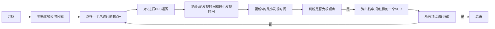

# 强连通分量算法的文档编写规范

## 1.背景介绍

### 1.1 什么是强连通分量

在图论中,强连通分量(Strongly Connected Components, SCC)是无向图或有向图中的一个重要概念。对于有向图G=(V,E)而言,如果从顶点u可以到达顶点v,且从v也可以到达u,那么称u和v是强连通的。一个极大的强连通子图被称为强连通分量。

强连通分量具有以下特点:

- 强连通分量内的任意两个顶点都是强连通的
- 如果将一个强连通分量缩点,图仍然保持强连通性质
- 一个有向图可能包含多个强连通分量

### 1.2 强连通分量的重要性

强连通分量在图论和算法设计中扮演着重要角色,有着广泛的应用:

- 编译器中的循环检测
- 网络可达性分析
- 系统模块划分
- 任务调度和并行计算
- 社交网络分析等

因此,高效地计算强连通分量对于解决许多实际问题至关重要。

## 2.核心概念与联系

### 2.1 有向图和无向图

有向图(Directed Graph)是一种图形结构,其中边具有方向性。无向图(Undirected Graph)则是边没有方向的图。强连通分量算法主要应用于有向图。

### 2.2 深度优先搜索(DFS)

深度优先搜索是一种遍历和搜索图的基础算法。大多数强连通分量算法都基于DFS,如Tarjan算法和Kosaraju算法。

### 2.3 拓扑排序

拓扑排序是对有向无环图(DAG)中所有顶点进行线性排序的过程。它与强连通分量有一定联系,因为强连通分量可以缩点后形成一个DAG。

## 3.核心算法原理具体操作步骤

目前,计算强连通分量的经典算法有Tarjan算法和Kosaraju算法。这两种算法的时间复杂度都是O(V+E),其中V是顶点数,E是边数。

### 3.1 Tarjan算法

Tarjan算法是一种基于深度优先搜索的在线算法,可以在单次遍历中计算出所有强连通分量。算法的核心思想是维护一个栈,并利用时间戳来确定顶点之间的可达性关系。算法步骤如下:

1. 初始化栈和时间戳
2. 对每个未访问的顶点执行DFS遍历
3. 在DFS过程中,记录每个顶点的发现时间和最小发现时间
4. 当遇到一个顶点的邻接点的最小发现时间小于该顶点的发现时间时,更新该顶点的最小发现时间
5. 如果遇到根顶点(最小发现时间等于发现时间),将栈中该顶点及其可达顶点全部弹出,即找到一个强连通分量
6. 重复步骤2-5,直到所有顶点都被访问过



### 3.2 Kosaraju算法

Kosaraju算法是一种基于两次深度优先搜索的离线算法。算法步骤如下:

1. 从任意顶点开始,对图进行一次DFS遍历,按照"完成时间"的逆序对所有顶点进行排序
2. 利用第一步得到的逆序,从每个未访问的顶点开始,对图的转置(Transpose Graph)进行DFS遍历
3. 在第二步的DFS过程中,遍历到的所有顶点都属于同一个强连通分量

```mermaid
graph LR
    A[开始] --> B[对图进行第一次DFS遍历]
    B --> C[按"完成时间"逆序排列顶点]
    C --> D[构造图的转置]
    D --> E[对每个未访问的顶点进行DFS遍历]
    E --> F[得到一个SCC]
    F --> G[所有顶点访问完?]
    G --否--> E
    G --是--> H[结束]
```

## 4.数学模型和公式详细讲解举例说明

强连通分量算法的数学模型可以用图论中的一些概念和公式来描述。

### 4.1 图的表示

一个有向图G=(V,E)可以用邻接矩阵或邻接表来表示,其中:

- V是顶点集合,|V|=n
- E是边的集合,|E|=m

邻接矩阵A是一个n×n的矩阵,当存在一条从顶点i到顶点j的边时,A[i][j]=1,否则为0。

邻接表是一个长度为n的数组,每个元素是一个链表,存储着与该顶点相邻的顶点。

### 4.2 强连通性定义

对于有向图G=(V,E),如果对于任意两个顶点u,v∈V,都存在一条从u到v和从v到u的路径,那么称G是强连通的。

数学上,我们可以定义一个关系R在V上:

$$R=\{(u,v)|u,v\in V, \exists 路径从u到v\}$$

如果R是等价关系,那么G就是强连通的。等价关系需要满足以下三个条件:

- 自反性:∀u∈V,(u,u)∈R
- 对称性:∀u,v∈V,(u,v)∈R⇔(v,u)∈R
- 传递性:∀u,v,w∈V,(u,v)∈R∧(v,w)∈R⇒(u,w)∈R

### 4.3 强连通分量的数目

设G=(V,E)是一个有向图,n=|V|,m=|E|。G中强连通分量的数目记为k,满足:

$$1 \leq k \leq n$$

当k=1时,图G是强连通的;当k=n时,每个顶点自身就是一个强连通分量。

### 4.4 时间戳和最小发现时间

在Tarjan算法中,我们为每个顶点维护两个时间戳:

- 发现时间(discovery time):记录顶点被发现(进入递归栈)的时间戳
- 最小发现时间(low value):记录该顶点及其可达顶点的最小发现时间

令d[u]和low[u]分别表示顶点u的发现时间和最小发现时间。对于当前DFS递归中的顶点u,有:

$$low[u] = min\{low[u], low[v]|(u,v)\in E\}$$

如果存在一条回路,使得u可以回到自身,那么low[u]=d[u]。

## 5.项目实践:代码实例和详细解释说明

下面是使用Python实现Tarjan算法和Kosaraju算法的代码示例,并对关键部分进行了详细解释。

### 5.1 Tarjan算法实现

```python
from collections import defaultdict

class Graph:
    def __init__(self, vertices):
        self.graph = defaultdict(list)
        self.vertices = vertices
        self.time = 0

    def add_edge(self, u, v):
        self.graph[u].append(v)

    def tarjan(self):
        self.stack = []
        self.disc = {}
        self.low = {}
        self.onstack = defaultdict(bool)
        self.scc = []

        for v in self.vertices:
            if v not in self.disc:
                self.dfs(v)

        return self.scc

    def dfs(self, u):
        self.disc[u] = self.low[u] = self.time
        self.time += 1
        self.stack.append(u)
        self.onstack[u] = True

        for v in self.graph[u]:
            if v not in self.disc:
                self.dfs(v)
                self.low[u] = min(self.low[u], self.low[v])
            elif self.onstack[v]:
                self.low[u] = min(self.low[u], self.disc[v])

        if self.low[u] == self.disc[u]:
            scc = []
            while True:
                v = self.stack.pop()
                self.onstack[v] = False
                scc.append(v)
                if v == u:
                    break
            self.scc.append(scc)

# 使用示例
vertices = [1, 2, 3, 4, 5, 6, 7, 8]
g = Graph(vertices)
g.add_edge(1, 2)
g.add_edge(2, 3)
g.add_edge(3, 1)
g.add_edge(3, 4)
g.add_edge(4, 5)
g.add_edge(5, 6)
g.add_edge(6, 4)
g.add_edge(7, 8)

scc = g.tarjan()
print("强连通分量:")
for component in scc:
    print(component)
```

代码解释:

1. 使用Python的defaultdict数据结构来表示图的邻接表
2. tarjan()函数是算法的入口,初始化所需的数据结构
3. dfs(u)函数是算法的核心递归部分,用于深度优先遍历
4. 在dfs过程中,记录每个顶点的发现时间disc[u]和最小发现时间low[u]
5. 当遇到一个顶点u的最小发现时间等于发现时间时,说明找到了一个根顶点,将栈中该顶点及其可达顶点全部弹出,得到一个强连通分量
6. 重复dfs,直到所有顶点都被访问过,最终得到所有强连通分量

### 5.2 Kosaraju算法实现

```python
from collections import defaultdict

class Graph:
    def __init__(self, vertices):
        self.graph = defaultdict(list)
        self.vertices = vertices

    def add_edge(self, u, v):
        self.graph[u].append(v)

    def transpose(self):
        g = Graph(self.vertices)

        for u in self.graph:
            for v in self.graph[u]:
                g.graph[v].append(u)

        return g

    def dfs(self, v, visited, stack):
        visited.add(v)

        for u in self.graph[v]:
            if u not in visited:
                self.dfs(u, visited, stack)

        stack.append(v)

    def fill_order(self, stack):
        order = []
        visited = set()

        for v in self.vertices:
            if v not in visited:
                self.dfs(v, visited, stack)

        while stack:
            order.append(stack.pop())

        return order

    def kosaraju(self):
        stack = []
        order = self.fill_order(stack)
        transpose = self.transpose()
        scc = []

        visited = set()
        for v in order:
            if v not in visited:
                component = []
                transpose.dfs(v, visited, component)
                scc.append(component)

        return scc

# 使用示例
vertices = [1, 2, 3, 4, 5, 6, 7, 8]
g = Graph(vertices)
g.add_edge(1, 2)
g.add_edge(2, 3)
g.add_edge(3, 1)
g.add_edge(3, 4)
g.add_edge(4, 5)
g.add_edge(5, 6)
g.add_edge(6, 4)
g.add_edge(7, 8)

scc = g.kosaraju()
print("强连通分量:")
for component in scc:
    print(component)
```

代码解释:

1. 使用Python的defaultdict数据结构来表示图的邻接表
2. transpose()函数用于构造图的转置
3. dfs(v, visited, stack)函数是标准的深度优先搜索函数,用于遍历和记录顶点访问顺序
4. fill_order(stack)函数对图进行第一次DFS遍历,按照"完成时间"的逆序将顶点存入栈中
5. kosaraju()函数是算法的入口,首先获取顶点的逆序,然后对图的转置进行DFS遍历,得到所有强连通分量
6. 在第二次DFS过程中,每次遍历到的所有顶点都属于同一个强连通分量

## 6.实际应用场景

强连通分量算法在许多实际应用场景中扮演着重要角色,例如:

### 6.1 编译器中的循环检测

在编译器设计中,需要检测代码中是否存在无限循环。这可以通过构建控制流图(Control Flow Graph),并在图中寻找强连通分量来实现。如果一个强连通分量中包含了循环语句,那么它就是一个可能导致无限循环的代码区域。

### 6.2 网络可达性分析

在计算机网络中,我们经常需要分析两个节点之间是否存在连