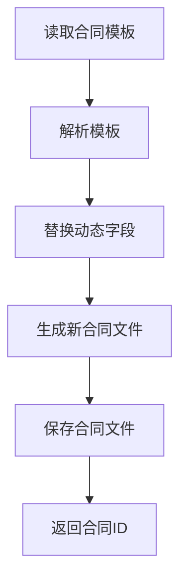
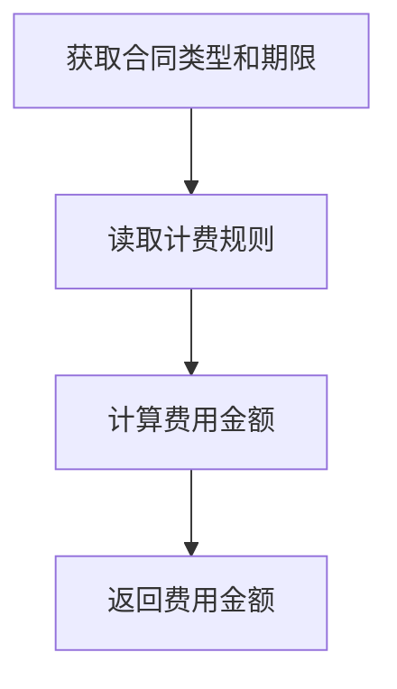
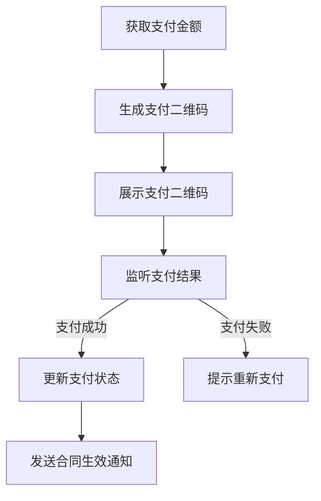

# 微信小程序市场商户租赁合同系统

## 1.背景介绍

随着移动互联网和电子商务的飞速发展,微信小程序作为一种全新的移动应用程序形式,为商家和消费者提供了一个高效便捷的交易平台。其中,商户租赁合同管理是小程序市场的一个关键环节,涉及到商家入驻审核、合同签订、费用缴纳等多个流程。传统的线下纸质合同管理模式已经无法满足当前高效、便捷的业务需求,因此构建一个微信小程序商户租赁合同系统就显得尤为重要。

## 2.核心概念与联系

微信小程序商户租赁合同系统主要涉及以下几个核心概念:

1. **商户(Merchant)**: 指在小程序市场上入驻的商家,需要签订租赁合同并缴纳相应费用。
2. **合同(Contract)**: 指商户与小程序平台之间签订的租赁协议,约定双方的权利义务。
3. **合同模板(Contract Template)**: 事先定义好的合同文本模板,方便快速生成新合同。
4. **费用(Fee)**: 商户需要支付的租赁费用,可以是固定费用或是按一定比例计算。
5. **支付(Payment)**: 商户缴纳租赁费用的行为及相关流程。

这些核心概念相互关联,构成了整个合同管理系统的基础。商户根据自身需求选择合适的合同模板,生成新合同并完成支付,从而获得在小程序市场上经营的资格。

## 3.核心算法原理具体操作步骤

微信小程序商户租赁合同系统的核心算法原理主要包括以下几个方面:

### 3.1 合同生成算法

合同生成算法的主要作用是根据预定义的合同模板和商户提供的信息,快速生成新的合同文本。算法的具体步骤如下:

1. 从合同模板库中读取指定的模板文件
2. 解析模板文件,识别需要替换的动态字段
3. 根据商户提供的信息,替换模板中的动态字段
4. 生成新的合同文本文件,保存到合同文件库中
5. 返回新生成的合同ID,供后续操作使用



该算法的关键在于高效识别和替换模板中的动态字段,可以采用正则表达式或模板引擎等技术来实现。

### 3.2 费用计算算法

费用计算算法的作用是根据商户选择的合同类型和期限,计算出需要缴纳的租赁费用。算法步骤如下:

1. 获取商户选择的合同类型和期限
2. 从费用计算规则库中读取对应的计费规则
3. 根据计费规则,计算出具体的费用金额
4. 返回计算出的费用金额



计费规则可以是固定金额,也可以是基于合同期限、商户类型等因素的动态计算公式。算法需要能够正确解析和执行各种计费规则。

### 3.3 支付流程算法

支付流程算法负责引导商户完成支付操作,并更新相关的支付状态。算法步骤如下:

1. 获取商户需要支付的金额
2. 调用微信支付API,生成支付二维码
3. 展示支付二维码,等待商户扫码支付
4. 监听支付结果通知,更新合同的支付状态
5. 如果支付成功,发送合同生效通知;如果支付失败,提示重新支付



该算法需要对接微信支付API,并正确处理支付结果通知,保证支付状态的实时更新和正确性。

## 4.数学模型和公式详细讲解举例说明

在微信小程序商户租赁合同系统中,可能需要使用一些数学模型和公式来计算费用或评估风险等。以下是一些可能的应用场景:

### 4.1 动态计费模型

对于某些特殊的合同类型,可能需要采用动态计费模型,根据合同期限、商户类型等因素动态计算租赁费用。一种可能的计费公式如下:

$$
费用 = 基础费用 + 期限系数 \times 合同期限 + 商户类型系数 \times 商户类型分值
$$

其中:

- 基础费用: 固定的基础租赁费用
- 期限系数: 根据合同期限的长短确定的系数,期限越长系数越高
- 合同期限: 商户选择的合同期限,单位为月
- 商户类型系数: 根据商户类型确定的系数,对于高风险类型的商户,系数更高
- 商户类型分值: 根据商户类型评估出的分值,分值越高代表风险越大

通过这种公式,系统可以根据不同的商户情况,计算出合理的租赁费用。

### 4.2 风险评估模型

对于一些高风险的商户类型,例如彩票、游戏等,系统可以使用风险评估模型,根据商户的历史数据和行业数据,评估其入驻的风险程度。一种可能的评估公式如下:

$$
风险分数 = \sum_{i=1}^{n}w_i \times x_i
$$

其中:

- $n$: 评估指标的个数
- $w_i$: 第$i$个评估指标的权重
- $x_i$: 第$i$个评估指标的分数

评估指标可以包括商户的历史违规记录、行业投诉率、经营年限等,每个指标都有一定的权重,最终将所有指标的加权分数相加,得到总的风险分数。

根据风险分数的高低,系统可以决定是否接受该商户入驻,或者要求其缴纳更高的租赁费用作为风控保证金。

### 4.3 合同期限优化模型

对于合同期限的选择,商户和平台都希望能够达成一个相对合理的期限,即既能满足商户的需求,又能控制平台的风险。我们可以建立一个合同期限优化模型,在给定的约束条件下,求解最优的合同期限。

假设:

- 商户的期望合同期限为$T_m$
- 平台的最大风险容忍期限为$T_p$
- 合同期限$T$的收益函数为$R(T)$,收益随期限增加而增加
- 合同期限$T$的风险函数为$S(T)$,风险随期限增加而增加

则优化目标为:

$$
\max_{T} R(T) - \lambda S(T)
$$
$$
\text{s.t.} \quad T_m \le T \le T_p
$$

其中$\lambda$是一个权重系数,用于平衡收益和风险。通过求解这个优化问题,我们可以得到一个最优的合同期限$T^*$,使得收益和风险达到最佳平衡。

这些数学模型和公式为微信小程序商户租赁合同系统提供了理论支撑,有助于实现精细化的费用计算、风险控制和决策优化,从而提高系统的运营效率和盈利能力。

## 5.项目实践:代码实例和详细解释说明

为了更好地理解微信小程序商户租赁合同系统的实现,我们提供了一些核心代码示例,并对其进行详细解释。

### 5.1 合同生成模块

合同生成模块负责根据模板和商户信息生成新的合同文本。以下是一个使用 Python 和 Jinja2 模板引擎实现的示例:

```python
from jinja2 import Environment, FileSystemLoader

# 加载合同模板
env = Environment(loader=FileSystemLoader('templates'))
template = env.get_template('contract_template.txt')

# 准备商户信息
merchant_info = {
    'name': '张三商户',
    'type': '服装',
    'period': 12,
    'start_date': '2023-06-01'
}

# 渲染合同模板
contract_text = template.render(merchant_info)

# 保存生成的合同文件
with open(f"contracts/{merchant_info['name']}.txt", 'w', encoding='utf-8') as f:
    f.write(contract_text)
```

在这个示例中,我们首先加载了预定义的合同模板文件 `contract_template.txt`。然后,我们准备了一个包含商户信息的字典 `merchant_info`。接下来,我们使用 Jinja2 的 `render` 方法,将商户信息渲染到模板中,生成新的合同文本。最后,我们将生成的合同文本保存到一个新文件中。

模板文件 `contract_template.txt` 的内容可能如下所示:

```jinja
合同编号: {{ contract_id }}

甲方: 微信小程序平台
乙方: {{ name }}
合同类型: {{ type }} 商户租赁合同
合同期限: {{ period }} 个月
生效日期: {{ start_date }}

... 其他合同条款 ...
```

在模板中,我们使用双花括号 `{{ }}` 来标识需要替换的动态字段。Jinja2 会自动将这些字段替换为对应的商户信息值。

### 5.2 费用计算模块

费用计算模块根据合同类型和期限,计算出商户需要支付的租赁费用。以下是一个使用 Python 实现的示例:

```python
# 定义计费规则
fee_rules = {
    '服装': {
        'base_fee': 1000,
        'period_coeff': 50,
        'type_coeff': 1.0
    },
    '彩票': {
        'base_fee': 5000,
        'period_coeff': 100,
        'type_coeff': 2.0
    },
    # 其他商户类型的计费规则...
}

def calculate_fee(merchant_type, period):
    """计算租赁费用"""
    rule = fee_rules.get(merchant_type)
    if not rule:
        return None

    base_fee = rule['base_fee']
    period_coeff = rule['period_coeff']
    type_coeff = rule['type_coeff']

    fee = base_fee + period_coeff * period * type_coeff
    return fee

# 示例使用
merchant_type = '服装'
period = 12
fee = calculate_fee(merchant_type, period)
print(f'租赁费用为: {fee} 元')
```

在这个示例中,我们首先定义了一个 `fee_rules` 字典,存储不同商户类型的计费规则。每种规则包括基础费用、期限系数和商户类型系数。

接下来,我们定义了一个 `calculate_fee` 函数,根据传入的商户类型和期限,查找对应的计费规则,并计算出最终的租赁费用。

在使用时,我们传入商户类型 `'服装'` 和期限 `12` 个月,函数会计算出对应的租赁费用,并打印出结果。

### 5.3 支付流程模块

支付流程模块负责引导商户完成支付操作,并更新合同的支付状态。以下是一个使用 Python 和 Flask 框架实现的示例:

```python
from flask import Flask, render_template, request
import weixin_pay

app = Flask(__name__)

# 模拟合同数据
contracts = {
    '001': {
        'merchant': '张三商户',
        'fee': 12000,
        'paid': False
    }
}

@app.route('/pay/<contract_id>', methods=['GET', 'POST'])
def pay(contract_id):
    contract = contracts.get(contract_id)
    if not contract:
        return '合同不存在'

    if request.method == 'POST':
        # 处理支付结果通知
        result = weixin_pay.process_notification(request.data)
        if result.trade_state == 'SUCCESS':
            contract['paid'] = True
            return '支付成功'
        else:
            return '支付失败'

    # 生成支付二维码
    qrcode_url = weixin_pay.create_qrcode(contract['fee'])
    return render_template('pay.html', qrcode_url=qrcode_url)

if __name__ == '__main__':
    app.run()
```

在这个示例中,我们使用 Flask 框架创建了一个简单的