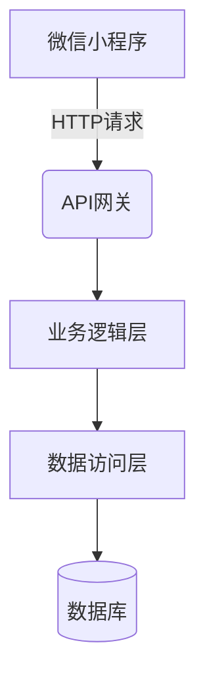

# 微信小程序的在线点餐订餐系统

## 1.背景介绍

随着移动互联网和智能终端的快速发展,线上订餐服务逐渐成为餐饮行业的一个新兴趋势。传统的线下点餐模式存在诸多痛点,例如需要排长队、菜单更新滞后、无法远程下单等,给顾客带来了诸多不便。为了解决这些问题,餐饮商家纷纷开始拥抱移动互联网,推出线上点餐平台。

微信小程序作为一种全新的移动应用形态,具有无需安装、极速体验的优势,非常适合作为在线点餐订餐系统的载体。通过小程序,用户可以随时随地浏览菜品信息、下单点餐、付款结算,商家也可以高效管理订单、更新菜单等,极大提升了用户体验和运营效率。

## 2.核心概念与联系

### 2.1 微信小程序

微信小程序是一种全新的连接用户与服务的方式,可以在微信内被便捷地获取和传播,同时具有出色的体验。它是一种不需要下载安装就可以使用的小型程序,可以有效拓展微信服务的场景。

小程序的核心是渲染层和逻辑层分离,前者使用Web技术渲染,后者使用JavaScript逻辑控制,二者通过系统层的数据通信完成交互。这种架构使得小程序具有良好的性能表现和开发体验。

### 2.2 在线点餐系统

在线点餐系统是指通过互联网或移动端应用程序实现菜品浏览、下单、支付和订单管理等功能的一体化解决方案。它主要包括以下几个核心模块:

- **菜品管理**:维护菜品信息、分类、价格等数据
- **订单管理**:接收和处理用户下单请求,管理订单状态
- **支付系统**:对接第三方支付渠道,实现在线支付
- **后厨系统**:接收并执行订单,控制菜品生产流程

通过将这些模块集成到微信小程序中,可以为用户提供无缝的点餐体验,同时也为餐饮商家带来高效的运营管理方式。

### 2.3 系统架构

微信小程序的在线点餐订餐系统通常采用前端(小程序)、后端(服务器)、数据库的经典三层架构,各层之间通过API接口进行交互。



其中:

- **微信小程序**:提供用户界面,实现菜品浏览、下单、支付等功能
- **API网关**:统一接收和分发前端请求,实现鉴权、限流等功能  
- **业务逻辑层**:处理具体的业务逻辑,如订单管理、菜品管理等
- **数据访问层**:负责对数据库的增删改查操作
- **数据库**:存储菜品信息、订单数据等核心数据

## 3.核心算法原理具体操作步骤  

### 3.1 菜品推荐算法

为了提高用户体验和销售额,在线点餐系统通常会采用个性化推荐算法,根据用户的历史订单、口味偏好等数据,推荐感兴趣的菜品。常用的推荐算法包括:

1. **协同过滤算法(Collaborative Filtering)**

   根据用户之间的相似度,推荐与目标用户有相似口味的其他用户喜欢的菜品。算法流程如下:

   ```mermaid
   graph TD
       A[获取用户历史订单数据] --> B[计算用户相似度矩阵]
       B --> C[根据相似度推荐菜品]
   ```

2. **基于内容的推荐(Content-based)**

   根据菜品的属性(如分类、口味等)与用户的历史偏好,推荐相似的菜品。算法流程:

   ```mermaid
   graph TD
       A[获取用户历史订单和菜品属性] --> B[计算用户偏好]
       B --> C[根据偏好推荐相似菜品]
   ```

3. **组合算法**

   结合上述两种算法的优点,综合考虑用户的历史偏好和其他用户的口味,给出更加个性化的推荐结果。

### 3.2 智能分单算法

对于餐饮商家来说,高效分配和处理订单是提高运营效率的关键。在线点餐系统可以采用智能分单算法,根据订单量、菜品制作时间等因素,自动将订单分配给不同厨师或工作台,实现订单的均衡分配和高效处理。

常用的智能分单算法包括:

1. **贪心算法**

   按照订单到达的时间顺序,依次将订单分配给当前最空闲的厨师或工作台。算法简单高效,但在订单量较大时,可能会导致部分厨师过载。

2. **动态规划算法**  

   将订单分配问题建模为一个多阶段决策过程,通过动态规划求解最优分配方案。该算法考虑了订单制作时间、厨师效率等因素,可以获得全局最优解,但计算复杂度较高。

3. **基于规则的算法**

   根据预设的规则(如菜品类型、厨师专长等),将订单分配给合适的厨师或工作台。该算法易于实现和调整,但需要人工设置合理的规则。

### 3.3 路径规划算法

对于外卖配送场景,如何安排最优的配送路线是提高配送效率的关键。在线点餐系统可以采用路径规划算法,根据订单地址、路况等信息,计算出最优的配送路线。

常用的路径规划算法包括:

1. **Dijkstra算法**

   一种计算单源最短路径的经典算法,可以求解从配送中心到每个配送地址的最短路径。时间复杂度为O(n^2)。

2. **A*算法**  

   一种启发式搜索算法,在Dijkstra算法的基础上,引入了启发函数(heuristic)来估计剩余路径长度,从而减少搜索空间,提高计算效率。

3. **蚁群算法**

   模拟蚁群觅食行为的一种启发式优化算法。通过释放和跟随信息素,蚂蚁可以逐步找到最优路径。适用于动态路网和多目标场景。

这些算法均需要路网数据作为输入,可以通过地图API或道路数据库获取。根据具体场景的约束条件(如车辆数量、时间窗口等),选择合适的算法,从而优化配送路线,提高配送效率。

## 4.数学模型和公式详细讲解举例说明

### 4.1 协同过滤推荐算法数学模型

协同过滤算法的核心是计算用户之间的相似度,并根据相似度对用户进行推荐。常用的相似度计算方法是**余弦相似度**,计算公式如下:

$$
sim(u,v)=\frac{\sum\limits_{i\in I}r_{ui}r_{vi}}{\sqrt{\sum\limits_{i\in I}r_{ui}^2}\sqrt{\sum\limits_{i\in I}r_{vi}^2}}
$$

其中:
- $u$和$v$分别表示两个用户
- $I$表示两个用户都评过分的菜品集合
- $r_{ui}$和$r_{vi}$分别表示用户$u$和$v$对菜品$i$的评分

余弦相似度的取值范围为$[0,1]$,值越大表示两个用户的口味越相似。

在计算出所有用户之间的相似度矩阵后,对于目标用户$u$,可以根据其他用户$v$的相似度$sim(u,v)$和$v$的历史评分$r_{vi}$,预测$u$对菜品$i$的兴趣程度:

$$
p_{ui}=\overline{r_u}+\frac{\sum\limits_{v\in U}sim(u,v)(r_{vi}-\overline{r_v})}{\sum\limits_{v\in U}sim(u,v)}
$$

其中:
- $p_{ui}$表示对用户$u$对菜品$i$的兴趣预测值
- $\overline{r_u}$和$\overline{r_v}$分别表示用户$u$和$v$的平均评分
- $U$表示与用户$u$有评分记录的用户集合

根据预测值从高到低对菜品进行排序,即可获得个性化的推荐列表。

### 4.2 动态规划求解智能分单问题

智能分单可以建模为一个多阶段决策过程,使用动态规划求解最优分配方案。假设有$n$个订单需要分配给$m$个厨师,订单$i$的制作时间为$t_i$,厨师$j$的效率为$e_j$。定义$dp(i,j)$为前$i$个订单分配给前$j$个厨师的最短完成时间,则状态转移方程为:

$$
dp(i,j)=\min\limits_{1\leq k\leq j}\{dp(i-1,k-1)+\frac{t_i}{e_k}\}
$$

其中$\frac{t_i}{e_k}$表示将订单$i$分配给第$k$个厨师的制作时间。通过填充$dp$表格,可以获得所有订单分配给所有厨师的最短完成时间$dp(n,m)$,同时可以回溯得到具体的最优分配方案。

该算法的时间复杂度为$O(nm^2)$,适用于订单量较小的场景。对于大规模订单,可以考虑采用近似算法或并行计算的方式提高效率。

### 4.3 蚁群算法求解配送路径规划问题

蚁群算法是一种基于群体智能的启发式优化算法,可以用于求解配送路径规划问题。算法的基本思路是:

1. 初始化$m$只蚂蚁,随机放置在$n$个城市(配送地点)中的任意一个城市
2. 每只蚂蚁按照一定的状态转移规则,构建出一条行走路径(配送路线)
3. 根据路径长度和路径上的信息素浓度,计算每条路径的适应度
4. 根据适应度,更新路径上的信息素浓度
5. 重复步骤2-4,直到达到终止条件(如最大迭代次数)

蚂蚁$k$从城市$i$转移到城市$j$的概率公式为:

$$
p_{ij}^k=\begin{cases}
\frac{[\tau_{ij}]^\alpha[\eta_{ij}]^\beta}{\sum\limits_{l\in J_i^k}[\tau_{il}]^\alpha[\eta_{il}]^\beta}, & j\in J_i^k\\
0, & j\notin J_i^k
\end{cases}
$$

其中:
- $\tau_{ij}$表示边$(i,j)$上的信息素浓度,值越大,蚂蚁选择该路径的概率越高
- $\eta_{ij}=\frac{1}{d_{ij}}$表示启发因子,$d_{ij}$为边$(i,j)$的长度
- $\alpha$和$\beta$分别为信息素浓度和启发因子的相对重要程度
- $J_i^k$表示蚂蚁$k$当前所在城市$i$的可选择城市集合

通过不断迭代,算法可以收敛到一条相对最优的配送路径。蚁群算法具有分布计算、正反馈、灵活构造路径等特点,适合求解动态、复杂的路径规划问题。

## 5.项目实践:代码实例和详细解释说明

为了更好地理解在线点餐订餐系统的实现,我们将通过一个基于Python的简单示例项目,演示系统的核心功能和代码实现。

### 5.1 项目结构

```
online_ordering/
├── app.py             # 入口文件
├── models/            # 数据模型
│   ├── __init__.py
│   ├── dish.py        # 菜品模型
│   ├── order.py       # 订单模型
│   └── user.py        # 用户模型
├── utils/             # 工具模块
│   ├── __init__.py
│   ├── database.py    # 数据库工具
│   └── recommender.py # 推荐算法
└── templates/         # 模板文件
    ├── index.html     # 主页模板
    ├── menu.html      # 菜单模板
    └── order.html     # 订单模板