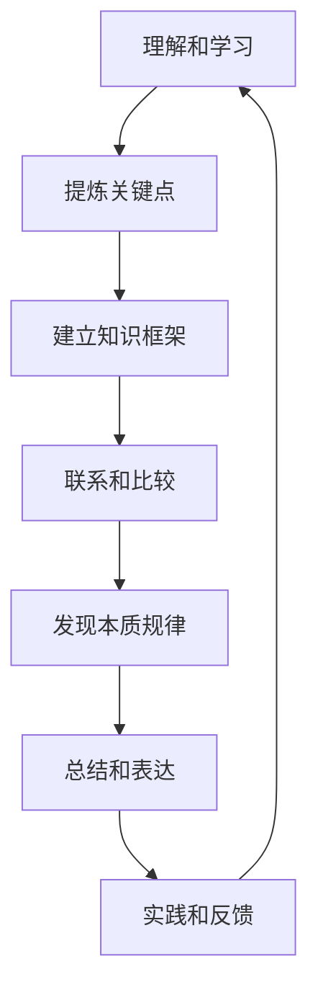

# 怎样善于总结和挖掘事物本质的能力

## 1.背景介绍

在当今信息爆炸的时代,我们每天都会接收大量的信息和数据。然而,真正能从这些信息中提炼出有价值的见解和洞察力,并把握事物的本质,是一项非常重要且具有挑战性的能力。无论是在学习、工作还是生活中,善于总结和挖掘事物本质都能让我们事半功倍,高效解决问题。

## 2.核心概念与联系

### 2.1 总结的本质

总结的本质是对大量信息进行筛选、压缩和提炼,从而得出简洁、明了的核心内容。一个好的总结应当抓住事物的关键点,去除多余的细节,并用清晰的语言表达出来。

### 2.2 挖掘事物本质

挖掘事物本质是指透过现象看本质,洞察事物的内在规律和根本原因。它需要我们具备分析和概括的能力,能够从表面现象中提炼出深层次的本质特征。

### 2.3 总结与本质挖掘的关系

总结和挖掘事物本质是相辅相成的。一方面,良好的总结有助于我们把握事物的核心,为深入挖掘本质奠定基础;另一方面,洞悉事物本质也有助于我们对信息进行高质量的总结。

## 3.核心算法原理具体操作步骤

培养总结和挖掘事物本质的能力,需要遵循一些基本原则和步骤:



1. **理解和学习**: 首先要对待总结和挖掘本质的对象有充分的理解和学习,掌握相关的基础知识。
2. **提炼关键点**: 从大量的信息中提炼出关键点和核心内容,剔除无关的细节。
3. **建立知识框架**: 将提炼出的关键点按照一定的逻辑关系组织起来,形成一个完整的知识框架。
4. **联系和比较**: 将新的知识与已有的知识进行联系和比较,发现它们之间的异同点。
5. **发现本质规律**: 通过对比和思考,发现事物背后的本质规律和根本原因。
6. **总结和表达**: 用简洁、清晰的语言对所发现的本质进行总结和表达。
7. **实践和反馈**: 将总结和发现应用到实践中,并根据实践的反馈不断完善和优化。

## 4.数学模型和公式详细讲解举例说明

在总结和挖掘事物本质的过程中,我们可以借助一些数学模型和公式来量化和分析信息,从而更好地把握事物的本质特征。

### 4.1 信息熵(Information Entropy)

信息熵是信息论中的一个重要概念,它用来度量信息的无序程度或不确定性。对于一个事件集合 $X = \{x_1, x_2, \ldots, x_n\}$,其信息熵可以用下式表示:

$$H(X) = -\sum_{i=1}^{n}P(x_i)\log_2 P(x_i)$$

其中,$ P(x_i) $表示事件 $x_i$ 发生的概率。信息熵越大,表明事件的不确定性越高,需要更多的信息来描述它。

在总结和挖掘事物本质时,我们可以利用信息熵来衡量一个事物的复杂程度。复杂程度高的事物,其信息熵也会较大,需要更多的努力来总结和挖掘其本质。

### 4.2 主成分分析(Principal Component Analysis, PCA)

主成分分析是一种常用的降维技术,它通过线性变换将高维数据投影到一个低维空间,从而达到降维和数据压缩的目的。在总结和挖掘事物本质时,我们可以将高维的原始数据经过 PCA 变换,提取出最能够反映数据本质特征的几个主成分,从而简化问题并聚焦于核心内容。

设有一个 $n$ 维数据集 $X = \{x_1, x_2, \ldots, x_m\}$,其协方差矩阵为 $\Sigma$,则 PCA 的目标是找到一组正交基 $\{v_1, v_2, \ldots, v_n\}$,使得:

$$\sum_{i=1}^{n}\lambda_i = \mathrm{tr}(\Sigma)$$
$$\lambda_1 \geq \lambda_2 \geq \cdots \geq \lambda_n \geq 0$$

其中,$ \lambda_i $是 $\Sigma$ 的特征值,$ v_i $是对应的特征向量。我们可以选取前 $k$ 个最大的特征值及其对应的特征向量,将原始数据投影到由这 $k$ 个特征向量张成的低维空间中,从而达到降维和数据压缩的目的。

## 5.项目实践:代码实例和详细解释说明

为了更好地理解如何应用上述原理和方法来总结和挖掘事物本质,我们以一个文本数据集为例,展示相关的代码实现和详细说明。

假设我们有一个包含多篇新闻文章的文本数据集,我们希望从中总结出每篇文章的核心内容,并挖掘出不同文章之间的本质联系。

### 5.1 数据预处理

首先,我们需要对原始文本数据进行预处理,包括分词、去停用词、词干提取等步骤,将文本转换为向量形式。

```python
import re
import nltk
from nltk.corpus import stopwords

# 分词和去停用词
def preprocess_text(text):
    # 去除非字母数字字符
    text = re.sub(r'[^a-zA-Z0-9\s]', '', text)
    # 转换为小写
    text = text.lower()
    # 分词
    tokens = nltk.word_tokenize(text)
    # 去停用词
    stop_words = set(stopwords.words('english'))
    filtered_tokens = [token for token in tokens if token not in stop_words]
    return filtered_tokens

# 对整个数据集进行预处理
processed_data = [preprocess_text(doc) for doc in raw_data]
```

### 5.2 特征提取和向量化

接下来,我们需要将预处理后的文本转换为向量形式,以便进行后续的分析和建模。这里我们使用 TF-IDF 作为特征,它能够反映一个词在文档中的重要程度。

```python
from sklearn.feature_extraction.text import TfidfVectorizer

# 创建 TF-IDF 向量化器
vectorizer = TfidfVectorizer()

# 将文本转换为 TF-IDF 矩阵
tfidf_matrix = vectorizer.fit_transform(processed_data)
```

### 5.3 主题建模

为了总结每篇文章的核心内容,我们可以使用主题建模算法,如 LDA (Latent Dirichlet Allocation)。LDA 能够从文本数据中自动发现潜在的主题,每个主题由一组相关词语组成,可以用来概括文章的主要内容。

```python
from sklearn.decomposition import LatentDirichletAllocation

# 创建 LDA 模型
lda = LatentDirichletAllocation(n_components=10, random_state=42)

# 拟合 LDA 模型
lda.fit(tfidf_matrix)

# 输出每篇文章的主题分布
for doc_idx, doc in enumerate(processed_data):
    topic_dist = lda.transform(vectorizer.transform([' '.join(doc)]))[0]
    sorted_topics = topic_dist.argsort()[::-1]
    print(f"Document {doc_idx}:")
    for topic_idx in sorted_topics[:3]:
        print(f"  Topic {topic_idx}: {', '.join(vectorizer.get_feature_names_out()[np.argsort(lda.components_[topic_idx])[::-1][:10]])}")
```

上述代码将为每篇文章输出其前三个主要主题,以及每个主题中的前 10 个关键词。这有助于我们快速总结每篇文章的核心内容。

### 5.4 主成分分析

为了挖掘不同文章之间的本质联系,我们可以使用主成分分析 (PCA) 将高维的 TF-IDF 矩阵投影到一个低维空间中,从而可视化和分析文章之间的相似性。

```python
from sklearn.decomposition import PCA

# 创建 PCA 模型
pca = PCA(n_components=2)

# 将 TF-IDF 矩阵投影到二维空间
X_pca = pca.fit_transform(tfidf_matrix.toarray())

# 可视化投影结果
import matplotlib.pyplot as plt
plt.figure(figsize=(10, 8))
plt.scatter(X_pca[:, 0], X_pca[:, 1])
for i, doc in enumerate(processed_data):
    plt.annotate(str(i), (X_pca[i, 0], X_pca[i, 1]))
plt.show()
```

上述代码将 TF-IDF 矩阵投影到二维空间,并在图像上标注每篇文章的索引。我们可以观察投影结果,发现相似的文章会聚集在一起,而不同主题的文章则会分布在不同的区域。这有助于我们发现文章之间的本质联系,并进一步探索它们的异同点。

通过上述代码实例,我们展示了如何利用自然语言处理和机器学习技术,来总结文本数据的核心内容,并挖掘不同文本之间的本质联系。这些方法和技术同样可以应用于其他领域的数据分析和知识发现任务。

## 6.实际应用场景

总结和挖掘事物本质的能力在许多领域都有广泛的应用,包括但不限于:

1. **学习和教育**: 帮助学生总结课程知识的核心内容,提高学习效率;教师可以根据学生的知识框架调整教学方式。

2. **科研工作**: 研究人员需要从大量的文献和数据中提炼出关键信息,发现新的研究方向和突破口。

3. **商业决策**: 企业管理者需要从海量的市场数据中总结出有价值的见解,做出正确的商业决策。

4. **新闻媒体**: 记者需要从复杂的事件中挖掘出核心问题,并以清晰的方式向读者传达信息。

5. **法律诉讼**: 律师需要从大量的证据材料中总结出关键点,为案件辩护做好准备。

6. **软件开发**: 程序员需要从复杂的系统需求中提炼出核心功能,设计出合理的软件架构。

总之,无论在何种领域,善于总结和挖掘事物本质都是一项非常宝贵的能力,它能够帮助我们高效地处理信息,提高工作效率和决策质量。

## 7.工具和资源推荐

为了提高总结和挖掘事物本质的能力,我们可以借助一些工具和资源:

1. **思维导图工具**: 如 XMind、MindManager 等,可以帮助我们将信息以可视化的方式组织起来,更好地把握知识框架。

2. **文本分析工具**: 如 NLTK、Gensim 等 Python 库,提供了丰富的自然语言处理功能,可以用于文本数据的预处理、主题建模等任务。

3. **数据可视化工具**: 如 Matplotlib、Seaborn 等,可以将高维数据投影到低维空间进行可视化,帮助我们发现数据的本质特征。

4. **在线学习资源**: 如 Coursera、edX 等平台上的相关课程,可以系统地学习总结和挖掘本质的理论和方法。

5. **专业书籍和文章**: 如《如何有效阅读一本书》、《学会提问》等,提供了总结和挖掘本质的实用技巧和案例分析。

6. **实践和反馈**: 多加实践,并及时获取反馈,是提高总结和挖掘本质能力的关键。可以尝试总结自己阅读过的书籍或文章,并与他人讨论和交流。

## 8.总结:未来发展趋势与挑战

随着信息技术的不断发展,我们面临着越来越多的信息和数据。因此,善于总结和挖掘事物本质的能力将变得越来越重要。未来,这一能力的发展趋势和挑战可能包括:

1. **大数据时代的挑战**: 如何从海量的结构化和非结构化数据中