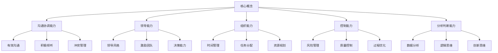
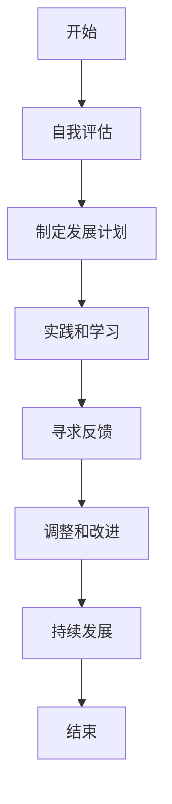
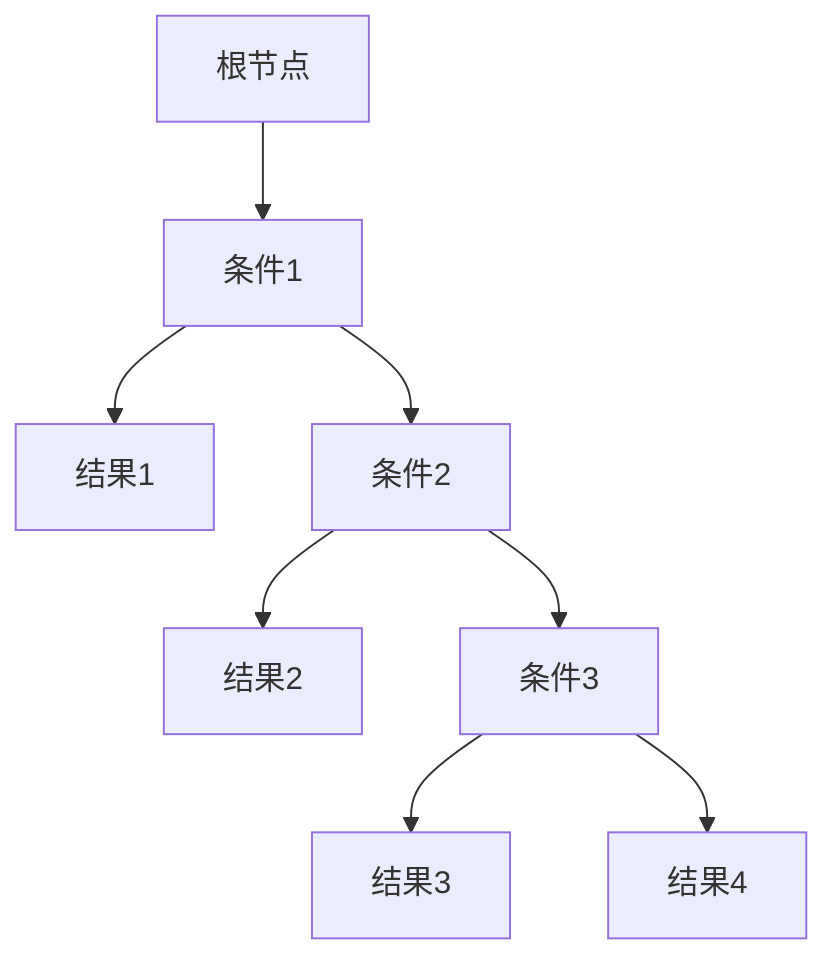

# 怎样培养优秀的沟通协调能力、领导能力、组织能力、控制能力、分析判断能力、组织能力

## 1. 背景介绍

在当今快节奏的商业环境中，拥有出色的软技能已经成为职业发展的关键因素。无论是在团队合作还是个人职业生涯发展中,良好的沟通协调、领导、组织、控制、分析判断等能力都扮演着至关重要的角色。掌握这些技能不仅有助于提高工作效率,还能增强个人的影响力和领导力,为未来的职业发展铺平道路。

### 1.1 软技能的重要性

软技能通常被定义为与人际交往、情商管理、解决问题和领导力相关的能力。与硬技能(如编程、数据分析等)不同,软技能更侧重于个人的行为、态度和人际交往方式。在当今的工作环境中,软技能已经成为雇主评估潜在候选人的重要标准之一。

研究表明,优秀的软技能不仅能提高工作效率,还能增强团队凝聚力、促进有效沟通,并为个人职业发展创造更多机会。因此,培养和提高软技能对于个人和组织的长期发展都至关重要。

### 1.2 为什么需要培养这些软技能?

在当今快节奏的商业环境中,拥有出色的软技能可以带来以下好处:

1. **提高工作效率**: 良好的沟通协调能力有助于团队成员之间的无缝协作,从而提高工作效率。同时,优秀的领导能力和组织能力也能确保项目按时高质量地完成。

2. **增强影响力和领导力**: 出色的沟通技巧和人际交往能力可以增强个人的影响力,使其在团队中发挥更大的作用。同时,良好的领导能力也是晋升和职业发展的关键因素。

3. **促进创新和解决问题**: 优秀的分析判断能力和创新思维有助于发现问题的根源,并提出创新的解决方案。这对于企业的持续发展至关重要。

4. **提高团队凝聚力**: 良好的沟通协调和组织能力能够促进团队成员之间的理解和信任,从而增强团队凝聚力,提高工作效率。

5. **适应不断变化的环境**: 在当今瞬息万变的商业环境中,拥有出色的软技能可以帮助个人和组织更好地适应变化,应对新的挑战。

综上所述,培养和提高这些软技能不仅对个人的职业发展至关重要,也是组织保持竞争力和创新能力的关键因素。

## 2. 核心概念与联系

在培养沟通协调、领导、组织、控制、分析判断等软技能时,需要掌握以下几个核心概念及其相互关系:

### 2.1 沟通协调能力

沟通协调能力是指个人在与他人交流时,能够清晰、有效地传达信息,并协调各方利益的能力。它包括以下几个方面:

- **有效沟通**: 能够使用恰当的语言和方式,清晰地表达自己的想法和观点。
- **积极倾听**: 能够专注地倾听他人的观点,理解他们的需求和关注点。
- **冲突管理**: 能够识别和解决团队内部或与外部利益相关者之间的冲突。

良好的沟通协调能力有助于建立信任和理解,促进团队合作,并确保项目的顺利进行。

### 2.2 领导能力

领导能力是指个人在团队或组织中发挥引导和影响力的能力。它包括以下几个方面:

- **领导风格**: 能够根据情况采用适当的领导风格,如授权型、民主型或指导型领导。
- **激励团队**: 能够激发团队成员的积极性和创造力,促进团队的高效运作。
- **决策能力**: 能够根据现有信息做出明智的决策,并承担相应的责任。

优秀的领导能力不仅有助于团队的发展,也是个人职业发展的关键因素。

### 2.3 组织能力

组织能力是指个人有效地规划、协调和管理资源的能力。它包括以下几个方面:

- **时间管理**: 能够合理安排时间,按时完成任务。
- **任务分配**: 能够根据团队成员的能力和工作量,合理分配任务。
- **资源规划**: 能够有效地规划和利用可用资源,确保项目的顺利进行。

良好的组织能力有助于提高工作效率,确保项目按时高质量地完成。

### 2.4 控制能力

控制能力是指个人对项目或过程进行监控和调整的能力。它包括以下几个方面:

- **风险管理**: 能够识别潜在风险,并采取适当的措施予以控制和缓解。
- **质量控制**: 能够制定和执行质量标准,确保产品或服务的质量符合要求。
- **过程优化**: 能够持续改进工作流程,提高效率和质量。

出色的控制能力有助于降低风险,确保项目按计划进行,并不断优化流程。

### 2.5 分析判断能力

分析判断能力是指个人收集、处理和解释信息,并做出明智决策的能力。它包括以下几个方面:

- **数据分析**: 能够收集和处理相关数据,从中发现有价值的信息和模式。
- **逻辑思维**: 能够按照一定的逻辑顺序思考问题,并得出合理的结论。
- **创新思维**: 能够以新颖和创造性的方式思考问题,提出创新的解决方案。

优秀的分析判断能力有助于发现问题的根源,并提出有效的解决方案,对于个人和组织的发展都至关重要。

## 3. 核心算法原理具体操作步骤

培养优秀的沟通协调、领导、组织、控制和分析判断能力需要一个持续的过程,包括自我评估、制定计划、实践和反馈等步骤。以下是一个通用的算法流程:

### 3.1 自我评估

自我评估是培养软技能的第一步。在这个阶段,你需要诚实地评估自己在沟通协调、领导、组织、控制和分析判断等方面的现有能力。你可以使用以下方法进行自我评估:

- 填写自评问卷或测试
- 寻求同事或上级的反馈
- 回顾过去的工作表现和经历

通过自我评估,你可以清楚地了解自己的优势和需要改进的领域,为制定发展计划奠定基础。

### 3.2 制定发展计划

根据自我评估的结果,你需要制定一个详细的发展计划,包括具体的目标、行动步骤和时间表。在制定计划时,你可以考虑以下几个方面:

- 确定优先发展的技能领域
- 设置可衡量和可实现的目标
- 列出具体的行动步骤和资源需求
- 制定时间表和里程碑

一个良好的发展计划不仅能够指导你的学习和实践,还能够帮助你跟踪进度并及时做出调整。

### 3.3 实践和学习

实践是培养软技能的关键环节。在这个阶段,你需要通过各种方式来实践和锻炼你的软技能,例如:

- 参与团队项目,练习沟通协调和领导能力
- 参加培训课程或研讨会,学习相关理论和技巧
- 寻找mentors或导师,从他们的经验中学习
- 阅读相关书籍和资料,不断充实自己的知识

在实践过程中,你需要保持开放的心态,积极寻求反馈和改进的机会。

### 3.4 寻求反馈

反馈是帮助你持续改进的关键。在实践过程中,你应该主动寻求来自同事、上级、mentors或培训师的反馈。反馈可以帮助你:

- 了解自己的表现和进步
- 发现需要改进的领域
- 获得宝贵的建议和指导

同时,你也应该学会积极倾听和接受反馈,并将其作为改进的契机。

### 3.5 调整和改进

根据所获得的反馈,你需要对自己的发展计划和实践方式进行调整和改进。这可能包括:

- 修改发展目标和优先次序
- 尝试新的学习方法和资源
- 寻求更多实践机会
- 改变工作习惯和行为模式

调整和改进是一个持续的过程,需要你保持开放的心态和坚持不懈的态度。

### 3.6 持续发展

培养优秀的软技能是一个漫长的过程,需要持续的努力和投入。即使你已经达到了一定的水平,也不应该止步不前。你应该:

- 继续寻求新的挑战和机会
- 保持学习的热情和好奇心
- 与他人分享你的经验和见解
- 适应不断变化的环境和需求

只有通过持续的发展,你才能真正成为一个拥有出色软技能的人才。

## 4. 数学模型和公式详细讲解举例说明

虽然软技能主要涉及人际交往和管理能力,但一些数学模型和公式也可以帮助我们更好地理解和培养这些技能。以下是一些常见的数学模型和公式,以及它们在软技能培养中的应用。

### 4.1 时间管理模型

时间管理是组织能力的重要组成部分。一个常见的时间管理模型是"重要紧急矩阵"(Eisenhower Matrix),它将任务分为四个象限:

$$
\begin{array}{c|c}
\textbf{重要且紧急} & \textbf{不重要但紧急} \\
\hline
\textbf{重要但不紧急} & \textbf{不重要且不紧急}
\end{array}
$$

根据这个矩阵,我们应该优先处理"重要且紧急"的任务,然后是"重要但不紧急"的任务。"不重要但紧急"的任务应该尽量委派或简化,而"不重要且不紧急"的任务可以暂时搁置或删除。

通过有效地利用这个矩阵,我们可以更好地管理时间,提高工作效率。

### 4.2 决策树模型

决策树是一种常见的分析判断工具,它可以帮助我们根据一系列规则和条件做出决策。决策树的基本结构如下:

在这个例子中,根节点代表需要做出的决策,每个条件节点代表一个影响因素,而叶节点代表相应的决策结果。

通过构建决策树,我们可以清晰地看到不同条件下的决策路径,从而做出更加明智的决策。

### 4.3 冲突管理模型

冲突是团队合作中不可避免的,良好的冲突管理能力有助于化解矛盾,促进团队和谐。一种常见的冲突管理模型是"托马斯-基尔曼冲突模式"(Thomas-Kilmann Conflict Mode Instrument),它将