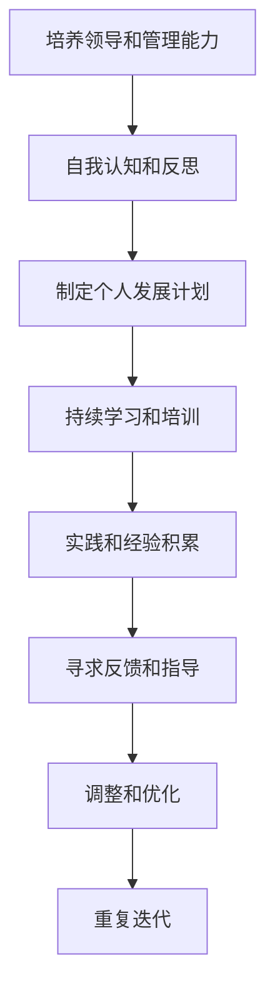

# 怎样培养出色的领导和管理能力

## 1.背景介绍

在当今瞬息万变的商业环境中,拥有出色的领导和管理能力已成为组织取得成功的关键因素之一。无论是初创公司还是跨国企业,都渴望拥有能够激励团队、制定战略方向并推动创新的领导者。然而,培养这种能力绝非一蹴而就,需要长期的努力和不懈的学习。

领导力和管理能力虽然有所区别,但两者往往相辅相成。领导力侧重于塑造愿景、激励团队和推动变革,而管理能力则着重于规划、组织和控制资源以实现目标。优秀的领导者不仅需要具备远见卓识,还必须掌握有效的管理技巧,才能将愿景转化为现实。

## 2.核心概念与联系

### 2.1 领导力的核心要素

出色的领导力通常包括以下几个核心要素:

1. **远见卓识**:能够预见未来趋势,制定前瞻性的战略方向。
2. **激励能力**:能够激发团队的热情和动力,引导他们朝着共同目标努力。
3. **决策力**:在复杂和不确定的环境中,能够做出明智的决策。
4. **沟通技巧**:能够清晰地传达愿景和期望,并倾听他人的意见和反馈。
5. **创新思维**:勇于挑战现状,推动组织不断创新和进步。

### 2.2 管理能力的核心要素

而管理能力则侧重于以下几个方面:

1. **规划能力**:能够制定详细的行动计划,合理分配资源。
2. **组织协调**:能够有效地组织和协调团队,确保工作高效顺利进行。
3. **控制和监督**:对工作进度和质量进行持续的监控和调整。
4. **解决问题**:能够识别和解决工作中遇到的各种问题和挑战。
5. **培养人才**:重视团队成员的成长和发展,提供指导和反馈。

领导力和管理能力虽然有所区别,但两者密切相关,相互影响。优秀的领导者需要具备出色的管理技能,而出色的管理者也需要领导力的支撑。只有将两者有机结合,才能真正发挥组织的最大潜力。

## 3.核心算法原理具体操作步骤

培养出色的领导和管理能力并非一蹴而就,需要系统的学习和持续的实践。以下是一些核心的原理和具体的操作步骤:



### 3.1 自我认知和反思

首先,要通过自我认知和反思,了解自身的长处和短板。可以通过以下方式:

1. 进行个人品质评估,识别自身的优势和需要改进的领域。
2. 寻求他人的反馈,了解别人对你的领导和管理风格的看法。
3. 反思过去的经历,总结成功和失败的原因。

### 3.2 制定个人发展计划

根据自我评估的结果,制定个人发展计划,明确需要提升的技能和知识领域。发展计划应该包括以下几个方面:

1. 学习目标:确定需要掌握的领导和管理理论、技能等。
2. 学习方式:如培训课程、在线学习、指导等。
3. 实践机会:寻找实践和应用所学知识的机会。
4. 时间安排:设置合理的学习进度和阶段性目标。

### 3.3 持续学习和培训

通过多种形式的学习和培训,不断提升领导和管理能力。可以采取以下方式:

1. 参加领导力培训课程,掌握相关理论和实践技巧。
2. 学习管理工具和方法,如项目管理、绩效管理等。
3. 阅读相关书籍和文章,了解最新的管理思想和趋势。
4. 观摩优秀领导者的实践,学习他们的做事方式。

### 3.4 实践和经验积累

理论和培训固然重要,但真正的领导和管理能力需要通过实践来锻炼和积累经验。可以采取以下措施:

1. 主动承担领导角色,组建和管理团队。
2. 参与实际项目的管理,运用所学知识解决实际问题。
3. 寻求挑战性的工作机会,接受更大的责任和挑战。
4. 反思实践过程中的经验教训,不断完善自己的方法。

### 3.5 寻求反馈和指导

在发展过程中,及时寻求他人的反馈和指导至关重要。可以通过以下方式:

1. 寻找导师或经验丰富的领导者,向他们请教和学习。
2. 组建学习小组,相互分享经验和提供建议。
3. 积极参与领导力发展项目,获得专业的反馈和指导。
4. 虚心接受他人的批评和建议,并加以改进。

### 3.6 调整和优化

根据实践中的经验和他人的反馈,不断调整和优化自己的领导和管理方式。要保持开放的心态,勇于尝试新的方法和策略。同时,也要坚持自己的原则和价值观,形成独特的领导风格。

### 3.7 重复迭代

领导和管理能力的培养是一个持续的过程,需要不断重复上述步骤,形成良性循环。随着经验的积累和能力的提高,可以不断提升自己的领导和管理水平,应对更加复杂的挑战。

## 4.数学模型和公式详细讲解举例说明

在领导和管理领域,也有一些数学模型和公式可以帮助我们更好地理解和优化相关流程。以下是一些常见的模型和公式:

### 4.1 队列理论

队列理论是一种数学模型,用于描述和优化服务系统中的等待过程。在管理领域,它可以应用于优化工作流程、资源分配等场景。

假设服务请求以平均到达率 $\lambda$ 到达,服务时间服从参数为 $\mu$ 的指数分布,那么系统的利用率 $\rho$ 可以表示为:

$$\rho = \frac{\lambda}{\mu}$$

当 $\rho < 1$ 时,队列长度的期望值为:

$$L_q = \frac{\rho^2}{1-\rho}$$

而系统中的平均等待时间为:

$$W_q = \frac{L_q}{\lambda}$$

通过调整服务率 $\mu$ 或控制到达率 $\lambda$,可以优化队列长度和等待时间,提高系统的效率。

### 4.2 决策树模型

决策树是一种常用的决策支持工具,可以帮助领导者在复杂情况下做出明智的决策。它将决策过程表示为一棵树状结构,每个节点代表一个决策点,边代表不同的选择。

假设有 $n$ 个决策点,每个决策点有 $m_i$ 个选择,其中 $i=1,2,...,n$。每个选择都有相应的成本或收益 $c_{ij}$,其中 $j=1,2,...,m_i$。那么,最优决策路径的期望值可以表示为:

$$\max_{j_1,j_2,...,j_n} \sum_{i=1}^n \sum_{j=1}^{m_i} p(j_i|j_1,...,j_{i-1})c_{ij}$$

其中 $p(j_i|j_1,...,j_{i-1})$ 表示在之前选择 $j_1,...,j_{i-1}$ 的情况下,选择 $j_i$ 的概率。

通过构建决策树模型,领导者可以清晰地看到每个决策点的选择及其潜在结果,从而做出更加明智的决策。

### 4.3 绩效管理模型

绩效管理是管理者的一项重要职责,它需要合理设置绩效目标、评估员工的工作表现,并给予相应的反馈和奖惩。一种常见的绩效管理模型是平衡记分卡(Balanced Scorecard)。

平衡记分卡将组织的绩效目标分为四个维度:财务、客户、内部流程、学习与成长。每个维度都有相应的关键绩效指标(KPI),用于衡量目标的实现程度。

假设有 $m$ 个关键绩效指标,每个指标的权重为 $w_i$,其中 $\sum_{i=1}^m w_i = 1$。员工在每个指标上的得分为 $s_i$,那么该员工的综合绩效评分可以表示为:

$$S = \sum_{i=1}^m w_i s_i$$

通过对比目标值和实际得分,管理者可以及时发现问题并采取相应的措施,如提供培训、调整绩效目标等,从而不断优化绩效管理流程。

以上只是数学模型在领导和管理领域的一些应用示例。在实际工作中,领导者和管理者还可以根据具体情况,选择合适的模型和工具,以更好地支持决策和优化流程。

## 5.项目实践:代码实例和详细解释说明

为了更好地理解和应用领导力和管理能力,我们可以通过一个实际项目来进行实践。以下是一个基于 Python 的简单项目管理系统的代码示例,它包含了一些基本的项目管理功能,如任务分配、进度跟踪和资源管理等。

```python
class Project:
    def __init__(self, name, description, deadline):
        self.name = name
        self.description = description
        self.deadline = deadline
        self.tasks = []
        self.resources = []
        self.team = []

    def add_task(self, task):
        self.tasks.append(task)

    def add_resource(self, resource):
        self.resources.append(resource)

    def assign_team_member(self, member):
        self.team.append(member)

    def track_progress(self):
        total_tasks = len(self.tasks)
        completed_tasks = sum(task.is_completed for task in self.tasks)
        progress = (completed_tasks / total_tasks) * 100
        print(f"Project '{self.name}' progress: {progress:.2f}%")

    def display_info(self):
        print(f"Project Name: {self.name}")
        print(f"Description: {self.description}")
        print(f"Deadline: {self.deadline}")
        print("Tasks:")
        for task in self.tasks:
            print(f"- {task.name} (Completed: {task.is_completed})")
        print("Resources:")
        for resource in self.resources:
            print(f"- {resource}")
        print("Team Members:")
        for member in self.team:
            print(f"- {member.name}")

class Task:
    def __init__(self, name, description, assigned_to=None):
        self.name = name
        self.description = description
        self.assigned_to = assigned_to
        self.is_completed = False

    def mark_as_completed(self):
        self.is_completed = True

class Resource:
    def __init__(self, name, description):
        self.name = name
        self.description = description

    def __str__(self):
        return self.name

class TeamMember:
    def __init__(self, name, role):
        self.name = name
        self.role = role

# 示例用法
project = Project("新产品开发", "开发一款革命性的新产品", "2024-06-30")

# 添加任务
task1 = Task("需求分析", "收集用户需求并进行分析")
task2 = Task("设计", "设计产品的功能和界面")
task3 = Task("开发", "编写代码并进行测试")
task4 = Task("测试", "进行全面的测试和调试")
project.add_task(task1)
project.add_task(task2)
project.add_task(task3)
project.add_task(task4)

# 添加资源
resource1 = Resource("开发工具", "用于编写和测试代码的工具")
resource2 = Resource("设计工具", "用于设计产品界面的工具")
project.add_resource(resource1)
project.add_resource(resource2)

# 分配团队成员
member1 = TeamMember("Alice", "项目经理")
member2 = TeamMember("Bob", "开发工程师")
member3 = TeamMember("Charlie", "设计师")
project.assign_team_member(member1)
project.assign_team_member(member2)
project.assign_team_member(member3)

# 分配任务
task1.assigned_to = member1
task2.assigned_to = member3
task