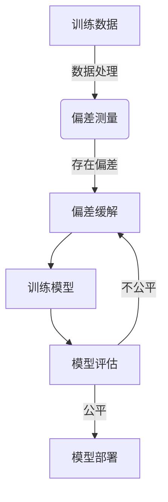

# 情感分析与公平性：如何避免算法歧视

## 1.背景介绍

### 1.1 情感分析的重要性

在当今数字时代,情感分析(Sentiment Analysis)已经成为一项关键技术。它通过自然语言处理和机器学习算法自动检测、提取和量化文本中的情感信息,广泛应用于社交媒体监测、客户服务、品牌声誉管理等领域。准确把握用户情感对企业制定营销策略、改善产品和服务至关重要。

### 1.2 算法偏差与歧视的风险

然而,训练情感分析模型所使用的数据集可能存在偏差,导致模型对某些群体的情感判断产生系统性偏差,从而加剧了社会中已有的偏见和不公平待遇。例如,一些模型可能对女性的负面情绪更加敏感,而低估男性的负面情绪;或者对非裔美国人的愤怒情绪判断过于严格。这种算法偏差会加剧现有的社会不平等,损害弱势群体的利益。

### 1.3 公平性的重要性

因此,在情感分析系统中解决算法偏差、确保公平性就显得尤为重要。公平的情感分析系统应当对所有群体的情感表达给予同等的重视和尊重,避免因种族、性别、年龄等因素而产生不当的歧视。这不仅有利于企业获得更加准确的用户情感反馈,也有助于构建一个更加包容、公正的社会。

## 2.核心概念与联系

### 2.1 情感分析

情感分析(Sentiment Analysis)是自然语言处理(NLP)的一个分支,旨在自动检测、提取和量化文本中的主观信息,如观点、情绪、情感等。常见的情感分析任务包括:

- 情感极性分类(判断正面、负面或中性情感)
- 细粒度情感分类(区分具体情感类别如高兴、愤怒等)
- 情感强度回归(预测情感的强度程度)

### 2.2 算法公平性

算法公平性(Algorithmic Fairness)是指算法系统在做出决策时,对不同的群体保持公平和无偏差。常见的公平性度量包括:

- 群体公平(Group Fairness):不同群体的正面结果率相等
- 个体公平(Individual Fairness):相似的个体得到相似的结果
- 因果公平(Causal Fairness):结果与敏感属性无因果关系

### 2.3 偏差缓解

偏差缓解(Bias Mitigation)是通过各种策略减少算法系统中的偏差,提高公平性。主要方法包括:

- 数据处理:重采样、数据增广等方式改善训练数据
- 算法层面:添加正则化项、对抗训练等改进模型
- 后处理:校准模型输出结果以减少偏差

### 2.4 公平情感分析

公平情感分析(Fair Sentiment Analysis)的目标是构建情感分析系统,使其对不同群体的情感表达保持无偏差和公平,避免算法歧视。这需要在情感分析模型的训练数据、模型结构和评估指标等多个环节中考虑公平性。

## 3.核心算法原理具体操作步骤

### 3.1 公平情感分析流程

实现公平情感分析的一般流程包括:



1. 收集并分析训练数据,测量其中是否存在偏差
2. 如果存在偏差,则采用数据处理、算法改进等方法进行偏差缓解
3. 使用缓解偏差后的数据训练情感分析模型
4. 在测试集上评估模型的公平性,如果不够公平则返回步骤2继续优化
5. 部署满足公平性要求的情感分析模型

### 3.2 偏差测量

常用的偏差测量方法包括:

- 统计率差异(Statistical Rate Difference)
- 等等分数(Equal Opportunity Difference) 
- 平均绝对差异(Average Absolute Difference)

以统计率差异为例,公式如下:

$$
\text{StatisticalRateDifference} = \left|\frac{TP_1}{TP_1+FN_1} - \frac{TP_2}{TP_2+FN_2}\right|
$$

其中 $TP_i$、$FN_i$ 分别表示第 $i$ 个群体的真正例数和假负例数。差值越大,说明两个群体之间的偏差越严重。

### 3.3 数据处理方法

常见的数据处理方法包括:

- 重采样:过采样少数群体样本,欠采样多数群体样本
- 数据增广:通过翻译、同义改写等方式扩充少数群体数据
- 实例权重:为不同群体的样本赋予不同权重
- 特征处理:移除或降低与敏感属性相关的特征重要性

### 3.4 算法改进方法 

在算法层面,可以通过以下方法缓解偏差:

- 正则化:在损失函数中添加公平性正则项,惩罚不公平的解
- 对抗训练:训练一个对抗网络去最大化模型的不公平程度,使主模型学习更加公平的表示
- 元学习:在元训练阶段显式优化公平性,使模型在各种任务上保持公平
- 注意力机制:设计群体无关的注意力机制,减少对敏感属性的关注

### 3.5 后处理方法

在模型训练完成后,还可以通过后处理方法进一步缓解偏差:

- 概率校准:校准模型输出的概率分数,使不同群体的阳性率相等
- 结果排序:对结果进行重新排序,确保不同群体的正面结果比例相等
- 二次采样:从模型输出中进行二次采样,实现期望的群体分布

## 4.数学模型和公式详细讲解举例说明

### 4.1 文本表示

情感分析模型的输入通常是文本序列,需要先将其转换为数值向量表示。常用的文本表示方法有:

- One-hot编码:将每个词编码为词典大小的0/1向量
- Word Embedding:将每个词映射为低维连续的词向量,如Word2Vec、GloVe等
- 预训练语言模型:使用BERT、GPT等模型提取上下文化的词/句向量表示

### 4.2 情感分类模型

给定文本 $\boldsymbol{x}$ 的表示向量 $\boldsymbol{h}$,情感分类可以建模为:

$$
P(y|\boldsymbol{x}) = \text{softmax}(\boldsymbol{W}\boldsymbol{h} + \boldsymbol{b})
$$

其中 $\boldsymbol{W}$、$\boldsymbol{b}$ 为可学习参数, $y$ 为情感类别。

对于二分类问题,交叉熵损失函数为:

$$
\mathcal{L}(\boldsymbol{\theta}) = -\frac{1}{N}\sum_{i=1}^N \left[y_i\log P(y_i|\boldsymbol{x}_i;\boldsymbol{\theta}) + (1-y_i)\log(1-P(y_i|\boldsymbol{x}_i;\boldsymbol{\theta}))\right]
$$

其中 $\boldsymbol{\theta}$ 为所有可学习参数。

### 4.3 公平性正则化

为了提高模型的公平性,可以在损失函数中添加公平性正则项:

$$
\tilde{\mathcal{L}}(\boldsymbol{\theta}) = \mathcal{L}(\boldsymbol{\theta}) + \lambda \Omega(\boldsymbol{\theta})
$$

其中 $\Omega(\boldsymbol{\theta})$ 为公平性度量函数, $\lambda$ 为正则化系数。

以群体公平为例,可定义正则项为:

$$
\Omega(\boldsymbol{\theta}) = \left|\frac{1}{N_1}\sum_{i\in \mathcal{G}_1}P(y_i=1|\boldsymbol{x}_i;\boldsymbol{\theta}) - \frac{1}{N_2}\sum_{i\in \mathcal{G}_2}P(y_i=1|\boldsymbol{x}_i;\boldsymbol{\theta})\right|
$$

其中 $\mathcal{G}_1$、$\mathcal{G}_2$ 为两个不同的群体,目标是使它们的正例率相等。

### 4.4 对抗训练

对抗训练的思路是同时训练两个模型:

- 主模型 $P(y|\boldsymbol{x};\boldsymbol{\theta}_p)$: 进行情感分类预测
- 对抗模型 $Q(g|\boldsymbol{h};\boldsymbol{\theta}_q)$: 预测隐藏表示 $\boldsymbol{h}$ 对应的群体 $g$

目标是最大化对抗模型的损失,使主模型学习到群体无关的表示:

$$
\begin{aligned}
\min_{\boldsymbol{\theta}_p}\max_{\boldsymbol{\theta}_q} \quad &\mathbb{E}_{\boldsymbol{x},y}\left[\mathcal{L}(P(y|\boldsymbol{x};\boldsymbol{\theta}_p), y)\right] \\
&- \lambda\mathbb{E}_{\boldsymbol{x},g}\left[\log Q(g|\boldsymbol{h};\boldsymbol{\theta}_q)\right]
\end{aligned}
$$

其中 $\lambda$ 为权重系数,控制对抗强度。

## 5.项目实践:代码实例和详细解释说明

以下是一个使用PyTorch实现的公平情感分类模型示例,包含数据处理、模型定义和训练三个部分。

### 5.1 数据处理

```python
import torch
from torchtext import data, datasets

# 定义文本和标签字段
TEXT = data.Field(tokenize='spacy', 
                  tokenizer_language='en', 
                  batch_first=True)
LABEL = data.LabelField(dtype=torch.float)

# 加载IMDB数据集
train_data, test_data = datasets.IMDB.splits(TEXT, LABEL)

# 构建词表
TEXT.build_vocab(train_data, max_size=25000, vectors="glove.6B.100d")
LABEL.build_vocab(train_data)

# 批量迭代器
batch_size = 64
train_iterator, test_iterator = data.BucketIterator.splits(
    (train_data, test_data), 
    batch_size=batch_size,
    sort_key=lambda x: len(x.text),
    device=device)
```

该部分定义了文本和标签字段,加载了IMDB情感分类数据集,构建了词表并使用GloVe词向量,最后创建了批量迭代器。

### 5.2 模型定义

```python
import torch.nn as nn
import torch.nn.functional as F

class SentimentClassifier(nn.Module):
    def __init__(self, vocab_size, embedding_dim, hidden_dim, output_dim, n_layers, 
                 bidirectional, dropout, pad_idx):
        
        super().__init__()
        
        self.embedding = nn.Embedding(vocab_size, embedding_dim, padding_idx=pad_idx)
        self.rnn = nn.LSTM(embedding_dim, 
                           hidden_dim,
                           num_layers=n_layers,
                           bidirectional=bidirectional,
                           dropout=dropout)
        self.fc = nn.Linear(hidden_dim * 2, output_dim)
        self.dropout = nn.Dropout(dropout)
        
    def forward(self, text):

        embedded = self.dropout(self.embedding(text))
        output, (hidden, cell) = self.rnn(embedded)
        hidden = torch.cat((hidden[-2,:,:], hidden[-1,:,:]), dim=1)
        dense_outputs=self.fc(hidden)

        preds = torch.sigmoid(dense_outputs)

        return preds
```

该部分定义了一个基于LSTM的情感分类模型,包含Embedding层、LSTM层和全连接层。前向传播时,输入文本先通过Embedding层获得词向量表示,然后经过LSTM编码,最后通过全连接层输出情感分类概率。

### 5.3 模型训练

```python
import torch.optim as optim
from adversarialUtils import AdversarialLossModule

# 初始化模型
model = SentimentClassifier(len(TEXT.vocab), 100, 256, 1, 2, True, 0.5, TEXT.vocab.stoi[TEXT.pad_token])
optimizer = optim.Adam(model.parameters())
criterion = nn.BCELoss()
adversary = AdversarialLossModule(model.embedding, TEXT.vocab.stoi['male'], TEXT.vocab.stoi['female'], 0.1)

model = model.to(device)
criterion = criterion.to(device)
adversary = adversary.to(device)

# 训练循环
for epoch in range(N_EPOCHS):
    train_loss = 0
    for batch in train