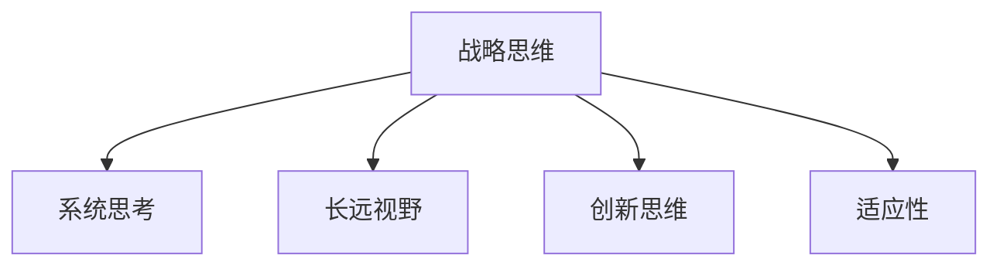
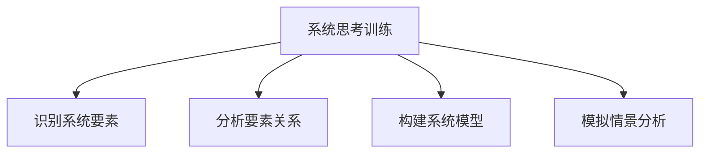
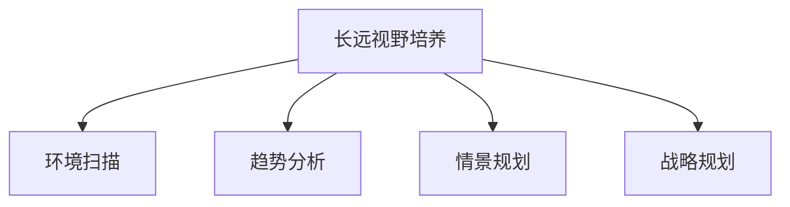
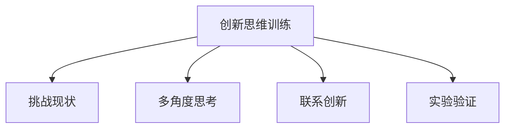
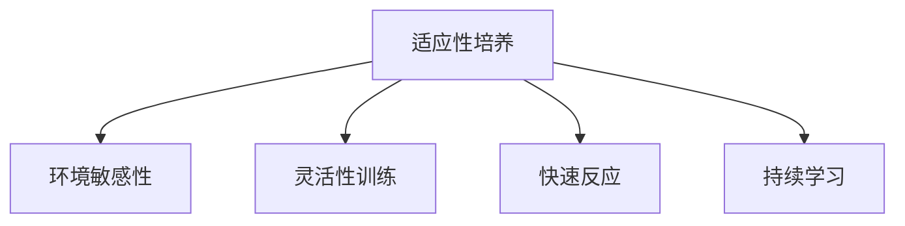

# 战略思维能力培养：具有战略思维、解决问题能力和持续适应变化的能力

## 1.背景介绍

### 1.1 战略思维的重要性

在当今瞬息万变的商业环境中，拥有战略思维能力对于个人和组织的成功至关重要。战略思维是一种认知能力,它能帮助我们洞察问题的本质,预测未来的发展趋势,制定长期规划,并做出明智的决策。

战略思维不仅能够帮助领导者制定有效的战略规划,还能够促进员工的创新思维和解决问题的能力。具有战略思维的个人和团队能够更好地适应不断变化的环境,抓住新的机遇,并有效地应对挑战。

### 1.2 战略思维的挑战

然而,培养战略思维并非一蹴而就。它需要我们突破传统的思维模式,拥抱系统性思考,并具备洞察力、创新力和适应力。以下是一些常见的挑战:

1. 狭隘的思维模式
2. 短视和短期导向
3. 对复杂性和不确定性的恐惧
4. 缺乏系统思考能力
5. 固步自封和僵化思维

### 1.3 培养战略思维的必要性

面对这些挑战,培养战略思维能力变得至关重要。它不仅能帮助个人在职业生涯中取得成功,还能促进组织的长期发展和可持续竞争力。通过有效的战略思维培训和实践,我们可以提高洞察力、创新力和适应力,从而更好地应对不确定性和复杂性。

## 2.核心概念与联系

### 2.1 战略思维的核心要素

战略思维包含以下几个核心要素:

1. **系统思考**:能够从整体出发,洞察事物之间的相互关系和影响。
2. **长远视野**:具备前瞻性思维,能够预测未来趋势并做出相应规划。
3. **创新思维**:勇于挑战现状,寻求新的解决方案和机遇。
4. **适应性**:能够灵活应对变化,及时调整策略。



### 2.2 战略思维与解决问题能力的关系

战略思维与解决问题能力密切相关。具有战略思维的个人能够从宏观角度审视问题,洞悉问题的根源,并制定长远的解决方案。同时,他们还能够预测潜在的风险和机遇,从而做出更加明智的决策。

解决问题的过程需要系统思考、创新思维和适应性,这些正是战略思维的核心要素。因此,培养战略思维能力有助于提高解决问题的效率和质量。

### 2.3 战略思维与持续适应变化的能力

在瞬息万变的环境中,持续适应变化的能力至关重要。战略思维能够帮助我们预测未来的变化趋势,并制定相应的应对策略。同时,创新思维和适应性使我们能够灵活应对变化,及时调整战略方向。

战略思维还能够促进组织的学习能力和文化建设,从而提高整体的适应能力。通过培养员工的战略思维,组织能够更好地应对不确定性和复杂性,保持持续竞争力。

## 3.核心算法原理具体操作步骤

培养战略思维是一个循序渐进的过程,需要持之以恒的努力和实践。以下是一些核心的算法原理和具体操作步骤:

### 3.1 系统思考训练

1. **识别系统要素**:列出系统中的各个要素,包括人员、流程、技术等。
2. **分析要素关系**:研究各要素之间的相互关系和影响。
3. **构建系统模型**:基于要素关系,构建系统模型,可视化展示整个系统。
4. **模拟情景分析**:模拟不同情景下系统的运行情况,分析影响因素。



### 3.2 长远视野培养

1. **环境扫描**:持续关注行业动态、技术趋势和市场变化。
2. **趋势分析**:分析各种趋势的驱动力和影响,预测未来发展方向。
3. **情景规划**:构建多种可能的未来情景,制定相应的应对策略。
4. **战略规划**:基于长远视野,制定组织的战略目标和发展路线图。



### 3.3 创新思维训练

1. **挑战现状**:质疑现有的做事方式,寻找改进空间。
2. **多角度思考**:从不同角度审视问题,发现新的见解。
3. **联系创新**:将不同领域的知识和经验进行融合,产生新的想法。
4. **实验验证**:通过快速原型和小规模实验,验证创新想法的可行性。



### 3.4 适应性培养

1. **环境敏感性**:及时感知环境变化,识别新的机遇和威胁。
2. **灵活性训练**:培养思维的灵活性,接受新的观点和做法。
3. **快速反应**:建立快速反应机制,及时调整策略和行动方案。
4. **持续学习**:保持学习的热情,不断更新知识和技能。



## 4.数学模型和公式详细讲解举例说明

在培养战略思维的过程中,我们可以借助一些数学模型和公式来量化和优化决策过程。以下是一些常见的模型和公式:

### 4.1 决策树模型

决策树是一种常用的决策支持工具,它将决策过程可视化,有助于我们更好地理解问题并做出明智的选择。决策树的构建过程如下:

1. 确定决策目标
2. 列出所有可能的选择
3. 识别影响因素
4. 计算每个选择的期望值
5. 选择期望值最大的选择

我们可以使用以下公式计算每个选择的期望值:

$$E(x) = \sum_{i=1}^{n} p_i x_i$$

其中,$$E(x)$$表示选择$$x$$的期望值,$$p_i$$表示结果$$i$$发生的概率,$$x_i$$表示结果$$i$$的收益或损失。

### 4.2 博弈论模型

在战略决策中,我们常常需要考虑竞争对手的行为。博弈论模型可以帮助我们分析竞争情况下的最优策略。

假设我们有两个参与者A和B,他们分别有策略集$$S_A$$和$$S_B$$。我们可以构建一个收益矩阵$$R$$,其中$$R(s_A, s_B)$$表示A采取策略$$s_A$$时,B采取策略$$s_B$$时的收益。

我们的目标是找到一组纳什均衡策略$$s_A^*$$和$$s_B^*$$,使得:

$$R(s_A^*, s_B^*) \geq R(s_A, s_B^*), \forall s_A \in S_A$$
$$R(s_A^*, s_B^*) \geq R(s_A^*, s_B), \forall s_B \in S_B$$

这意味着在纳什均衡时,任何一方单方面改变策略都无法获得更高的收益。

### 4.3 优化模型

在制定战略规划时,我们常常需要在多个目标之间进行权衡和优化。线性规划是一种常用的优化模型,它可以帮助我们找到在给定约束条件下最优的解决方案。

假设我们有目标函数:

$$\max z = c_1x_1 + c_2x_2 + \cdots + c_nx_n$$

subject to:

$$a_{11}x_1 + a_{12}x_2 + \cdots + a_{1n}x_n \leq b_1$$
$$a_{21}x_1 + a_{22}x_2 + \cdots + a_{2n}x_n \leq b_2$$
$$\vdots$$
$$a_{m1}x_1 + a_{m2}x_2 + \cdots + a_{mn}x_n \leq b_m$$

其中,$$x_i$$表示决策变量,$$c_i$$表示目标函数系数,$$a_{ij}$$和$$b_i$$表示约束条件。

我们可以使用简单形式法或者内点法等算法求解线性规划问题,找到最优解$$x_1^*, x_2^*, \cdots, x_n^*$$。

这些数学模型和公式为我们提供了量化和优化决策过程的工具,有助于我们做出更加明智的战略选择。

## 5.项目实践:代码实例和详细解释说明

为了更好地理解和应用战略思维,我们可以通过一些实际项目来进行实践。以下是一个基于Python的决策树实现示例:

```python
import numpy as np

class DecisionNode:
    def __init__(self, feature_index=None, threshold=None, value=None, true_branch=None, false_branch=None):
        self.feature_index = feature_index
        self.threshold = threshold
        self.value = value
        self.true_branch = true_branch
        self.false_branch = false_branch

class DecisionTree:
    def __init__(self, max_depth=None):
        self.max_depth = max_depth

    def fit(self, X, y):
        self.root = self._build_tree(X, y)

    def _build_tree(self, X, y, depth=0):
        num_samples, num_features = np.shape(X)
        num_labels = len(np.unique(y))

        if num_labels == 1 or (self.max_depth is not None and depth >= self.max_depth):
            return DecisionNode(value=np.mean(y))

        best_feature, best_threshold = self._best_criteria(X, y)
        true_branch_idx = np.nonzero(X[:, best_feature] >= best_threshold)[0]
        false_branch_idx = np.nonzero(X[:, best_feature] < best_threshold)[0]

        true_branch = self._build_tree(X[true_branch_idx, :], y[true_branch_idx], depth + 1)
        false_branch = self._build_tree(X[false_branch_idx, :], y[false_branch_idx], depth + 1)

        return DecisionNode(best_feature, best_threshold, None, true_branch, false_branch)

    def _best_criteria(self, X, y):
        best_gain = 0
        best_feature = None
        best_threshold = None

        for feature_index in range(np.shape(X)[1]):
            X_feature = X[:, feature_index]
            thresholds = np.unique(X_feature)

            for threshold in thresholds:
                gain = self._information_gain(y, X_feature, threshold)

                if gain > best_gain:
                    best_gain = gain
                    best_feature = feature_index
                    best_threshold = threshold

        return best_feature, best_threshold

    def _information_gain(self, y, X_feature, threshold):
        parent_entropy = self._entropy(y)

        true_branch_idx = np.nonzero(X_feature >= threshold)[0]
        false_branch_idx = np.nonzero(X_feature < threshold)[0]

        if len(true_branch_idx) == 0 or len(false_branch_idx) == 0:
            return 0

        true_branch_entropy = self._entropy(y[true_branch_idx])
        false_branch_entropy = self._entropy(y[false_branch_idx])

        true_branch_ratio = len(true_branch_idx) / len(y)
        false_branch_ratio = len(false_branch_idx) / len(y)

        child_entropy = true_branch_ratio * true_branch_entropy + false_branch_ratio * false_branch_entropy

        information_gain = parent_entropy - child_entropy
        return information_gain

    def _entropy(self, y):
        _, counts = np.unique(y, return_counts=True)
        probabilities = counts / len(y)
        entropy = sum(-p * np.log2(p) for p in probabilities if p > 0)
        return entropy
```

这个示例实现了一个基本的决策树算法,可以用于分类和回归任务。它包含了构建决策树、计算信息增益和熵的核心函数。

使用决策树可以帮