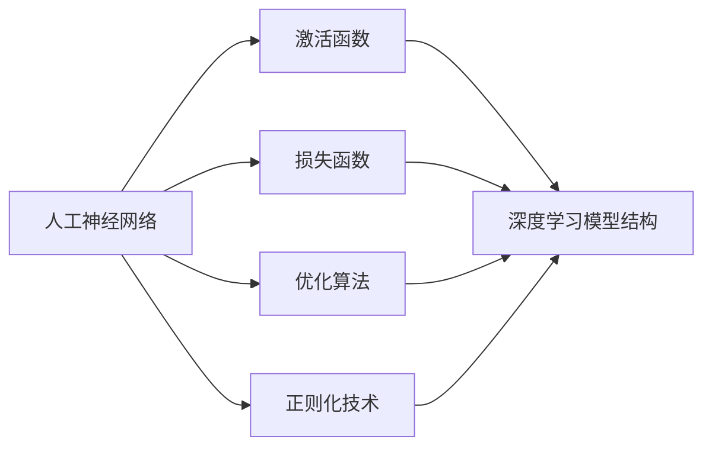

# 探秘深度学习:打造顶尖模型的不二法门

## 一、深度学习的背景介绍
### 1.1 人工智能的发展历程
#### 1.1.1 早期的人工智能
#### 1.1.2 机器学习的兴起 
#### 1.1.3 深度学习的崛起
### 1.2 深度学习的定义与特点
#### 1.2.1 深度学习的定义
#### 1.2.2 深度学习的核心特点
#### 1.2.3 深度学习与传统机器学习的区别
### 1.3 深度学习的应用领域
#### 1.3.1 计算机视觉
#### 1.3.2 自然语言处理
#### 1.3.3 语音识别
#### 1.3.4 其他应用领域

## 二、深度学习的核心概念与联系
### 2.1 人工神经网络
#### 2.1.1 生物神经元与人工神经元
#### 2.1.2 感知机
#### 2.1.3 多层感知机(MLP)
### 2.2 激活函数
#### 2.2.1 Sigmoid函数
#### 2.2.2 Tanh函数
#### 2.2.3 ReLU函数
### 2.3 损失函数
#### 2.3.1 均方误差损失(MSE)
#### 2.3.2 交叉熵损失(Cross-entropy)
#### 2.3.3 其他常用损失函数
### 2.4 优化算法
#### 2.4.1 梯度下降法
#### 2.4.2 随机梯度下降法(SGD)
#### 2.4.3 自适应学习率优化算法(AdaGrad、RMSProp、Adam)
### 2.5 正则化技术
#### 2.5.1 L1正则化
#### 2.5.2 L2正则化
#### 2.5.3 Dropout
### 2.6 深度学习模型结构
#### 2.6.1 前馈神经网络(FNN)
#### 2.6.2 卷积神经网络(CNN) 
#### 2.6.3 循环神经网络(RNN)
#### 2.6.4 长短期记忆网络(LSTM)



## 三、深度学习的核心算法原理与操作步骤
### 3.1 反向传播算法(Backpropagation)
#### 3.1.1 反向传播算法的基本原理
#### 3.1.2 反向传播算法的推导过程
#### 3.1.3 反向传播算法的实现步骤
### 3.2 卷积神经网络(CNN)的核心操作
#### 3.2.1 卷积操作
#### 3.2.2 池化操作
#### 3.2.3 CNN的前向传播与反向传播
### 3.3 循环神经网络(RNN)的核心操作
#### 3.3.1 RNN的基本结构
#### 3.3.2 RNN的前向传播与反向传播
#### 3.3.3 梯度消失与梯度爆炸问题
### 3.4 长短期记忆网络(LSTM)的核心操作
#### 3.4.1 LSTM的基本结构
#### 3.4.2 LSTM的前向传播与反向传播
#### 3.4.3 LSTM对梯度消失问题的改进

## 四、深度学习的数学模型与公式详解
### 4.1 前馈神经网络(FNN)的数学模型
#### 4.1.1 单个神经元的数学模型
$$ z = \sum_{i=1}^{n} w_i x_i + b $$
$$ a = \sigma(z) $$
其中，$w_i$为权重，$x_i$为输入，$b$为偏置，$\sigma$为激活函数。
#### 4.1.2 多层感知机(MLP)的数学模型
$$ \mathbf{z}^{(l)} = \mathbf{W}^{(l)} \mathbf{a}^{(l-1)} + \mathbf{b}^{(l)} $$
$$ \mathbf{a}^{(l)} = \sigma(\mathbf{z}^{(l)}) $$
其中，$\mathbf{W}^{(l)}$为第$l$层的权重矩阵，$\mathbf{b}^{(l)}$为第$l$层的偏置向量，$\mathbf{a}^{(l-1)}$为第$l-1$层的激活值向量，$\sigma$为激活函数。
### 4.2 卷积神经网络(CNN)的数学模型
#### 4.2.1 卷积操作的数学模型
$$ \mathbf{Z} = \mathbf{X} * \mathbf{W} + \mathbf{b} $$
其中，$\mathbf{X}$为输入特征图，$\mathbf{W}$为卷积核，$\mathbf{b}$为偏置，$*$为卷积操作。
#### 4.2.2 池化操作的数学模型
$$ a_{i,j} = \max_{(m,n) \in R_{i,j}} z_{m,n} $$
其中，$a_{i,j}$为池化后的输出，$R_{i,j}$为池化区域，$z_{m,n}$为池化区域内的元素。
### 4.3 循环神经网络(RNN)的数学模型
#### 4.3.1 基本RNN的数学模型
$$ \mathbf{h}_t = \sigma(\mathbf{W}_{hx} \mathbf{x}_t + \mathbf{W}_{hh} \mathbf{h}_{t-1} + \mathbf{b}_h) $$
$$ \mathbf{y}_t = \mathbf{W}_{yh} \mathbf{h}_t + \mathbf{b}_y $$
其中，$\mathbf{h}_t$为$t$时刻的隐藏状态，$\mathbf{x}_t$为$t$时刻的输入，$\mathbf{W}_{hx}$、$\mathbf{W}_{hh}$、$\mathbf{W}_{yh}$为权重矩阵，$\mathbf{b}_h$、$\mathbf{b}_y$为偏置向量，$\sigma$为激活函数。
#### 4.3.2 LSTM的数学模型
$$ \mathbf{f}_t = \sigma(\mathbf{W}_f \cdot [\mathbf{h}_{t-1}, \mathbf{x}_t] + \mathbf{b}_f) $$
$$ \mathbf{i}_t = \sigma(\mathbf{W}_i \cdot [\mathbf{h}_{t-1}, \mathbf{x}_t] + \mathbf{b}_i) $$
$$ \mathbf{o}_t = \sigma(\mathbf{W}_o \cdot [\mathbf{h}_{t-1}, \mathbf{x}_t] + \mathbf{b}_o) $$
$$ \tilde{\mathbf{C}}_t = \tanh(\mathbf{W}_C \cdot [\mathbf{h}_{t-1}, \mathbf{x}_t] + \mathbf{b}_C) $$
$$ \mathbf{C}_t = \mathbf{f}_t * \mathbf{C}_{t-1} + \mathbf{i}_t * \tilde{\mathbf{C}}_t $$
$$ \mathbf{h}_t = \mathbf{o}_t * \tanh(\mathbf{C}_t) $$
其中，$\mathbf{f}_t$、$\mathbf{i}_t$、$\mathbf{o}_t$分别为遗忘门、输入门和输出门，$\tilde{\mathbf{C}}_t$为候选记忆细胞，$\mathbf{C}_t$为记忆细胞，$\mathbf{h}_t$为隐藏状态，$\mathbf{W}_f$、$\mathbf{W}_i$、$\mathbf{W}_o$、$\mathbf{W}_C$为权重矩阵，$\mathbf{b}_f$、$\mathbf{b}_i$、$\mathbf{b}_o$、$\mathbf{b}_C$为偏置向量，$\sigma$为sigmoid激活函数，$\tanh$为双曲正切激活函数，$*$为逐元素乘法。

## 五、深度学习项目实践：代码实例与详解
### 5.1 基于Keras的手写数字识别
#### 5.1.1 数据集准备
```python
from keras.datasets import mnist

(x_train, y_train), (x_test, y_test) = mnist.load_data()
x_train = x_train.reshape((60000, 28, 28, 1)) / 255.0
x_test = x_test.reshape((10000, 28, 28, 1)) / 255.0
y_train = keras.utils.to_categorical(y_train)
y_test = keras.utils.to_categorical(y_test)
```
#### 5.1.2 构建CNN模型
```python
from keras.models import Sequential
from keras.layers import Conv2D, MaxPooling2D, Flatten, Dense

model = Sequential()
model.add(Conv2D(32, (3, 3), activation='relu', input_shape=(28, 28, 1)))
model.add(MaxPooling2D((2, 2)))
model.add(Conv2D(64, (3, 3), activation='relu'))
model.add(MaxPooling2D((2, 2)))
model.add(Conv2D(64, (3, 3), activation='relu'))
model.add(Flatten())
model.add(Dense(64, activation='relu'))
model.add(Dense(10, activation='softmax'))
```
#### 5.1.3 模型训练与评估
```python
model.compile(optimizer='adam', loss='categorical_crossentropy', metrics=['accuracy'])
model.fit(x_train, y_train, epochs=5, batch_size=64, validation_data=(x_test, y_test))
```
### 5.2 基于PyTorch的情感分类
#### 5.2.1 数据集准备
```python
import torch
from torchtext import data

TEXT = data.Field(tokenize='spacy', lower=True)
LABEL = data.LabelField(dtype=torch.float)

train_data, test_data = data.TabularDataset.splits(
    path='data', train='train.csv', test='test.csv', format='csv',
    fields=[('text', TEXT), ('label', LABEL)], skip_header=True
)

TEXT.build_vocab(train_data, max_size=10000, vectors="glove.6B.100d")
LABEL.build_vocab(train_data)

train_iterator, test_iterator = data.BucketIterator.splits(
    (train_data, test_data), batch_size=64, device=device
)
```
#### 5.2.2 构建LSTM模型
```python
import torch.nn as nn

class RNN(nn.Module):
    def __init__(self, vocab_size, embedding_dim, hidden_dim, output_dim):
        super().__init__()
        self.embedding = nn.Embedding(vocab_size, embedding_dim)
        self.rnn = nn.LSTM(embedding_dim, hidden_dim, num_layers=2, 
                           bidirectional=True, dropout=0.5)
        self.fc = nn.Linear(hidden_dim * 2, output_dim)
        
    def forward(self, text):
        embedded = self.embedding(text)
        output, _ = self.rnn(embedded)
        return self.fc(output[-1])
        
INPUT_DIM = len(TEXT.vocab)
EMBEDDING_DIM = 100
HIDDEN_DIM = 256
OUTPUT_DIM = 1

model = RNN(INPUT_DIM, EMBEDDING_DIM, HIDDEN_DIM, OUTPUT_DIM)
```
#### 5.2.3 模型训练与评估
```python
import torch.optim as optim

optimizer = optim.Adam(model.parameters())
criterion = nn.BCEWithLogitsLoss()

def train(model, iterator, optimizer, criterion):
    epoch_loss = 0
    epoch_acc = 0
    model.train()
    for batch in iterator:
        optimizer.zero_grad()
        predictions = model(batch.text).squeeze(1)
        loss = criterion(predictions, batch.label)
        acc = binary_accuracy(predictions, batch.label)
        loss.backward()
        optimizer.step()
        epoch_loss += loss.item()
        epoch_acc += acc.item()
    return epoch_loss / len(iterator), epoch_acc / len(iterator)

def evaluate(model, iterator, criterion):
    epoch_loss = 0
    epoch_acc = 0
    model.eval()
    with torch.no_grad():
        for batch in iterator:
            predictions = model(batch.text).squeeze(1)
            loss = criterion(predictions, batch.label)
            acc = binary_accuracy(predictions, batch.label)
            epoch_loss += loss.item()
            epoch_acc += acc.item()
    return epoch_loss / len(iterator), epoch_acc / len(iterator)

N_EPOCHS = 5
for epoch in range(N_EPOCHS):
    train_loss, train_acc = train(model, train_iterator, optimizer, criterion)
    valid_loss, valid_acc = evaluate(model, test_iterator, criterion)
    print(f'Epoch: {epoch+1:02}, Train Loss: {train_loss:.3f}, Train Acc: {train_acc*100:.2f}%, Val. Loss: {valid_loss:.3f}, Val. Acc: {valid_acc*100:.2f}%')
```

## 六、深度学习的实际应用场景
### 6.1 计算机视觉
#### 6.1.1 图像分类
#### 6.1.2 目标检测
#### 6.1.3 语义分割
#### 6.1.4 人脸识别
### 6.2 自然语言处理
#### 6.2.1 文本分类
#### 6.2.2 情