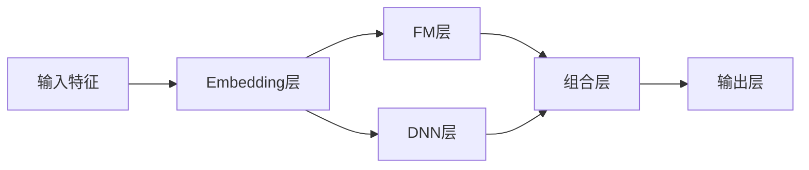
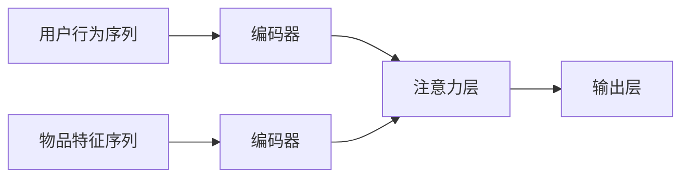

# 推荐系统与用户画像原理与代码实战案例讲解

## 1.背景介绍

### 1.1 推荐系统的重要性

在当今信息过载的时代,推荐系统已经无处不在,它们为我们精准匹配感兴趣的内容,提高了获取有价值信息的效率。无论是电商网站的商品推荐、视频网站的个性化推荐、新闻资讯的订阅推送,还是社交媒体的好友推荐,推荐系统都发挥着重要作用。

推荐系统的核心目标是为用户提供最合适的信息或商品,满足他们的个性化需求。通过分析用户的历史行为数据、偏好等,推荐系统能够预测用户的潜在兴趣,从海量信息中智能挖掘出最匹配的内容。这不仅提升了用户体验,也为企业带来了更多的商业价值。

### 1.2 用户画像在推荐系统中的作用

用户画像是推荐系统的基石。准确描述用户特征对于做出精准推荐至关重要。用户画像通过对用户数据的分析和挖掘,构建用户的全方位画像,包括人口统计学特征、兴趣爱好、行为习惯等多个维度,从而全面刻画用户的独特个性。

结合用户画像,推荐系统能够更好地理解用户的需求偏好,为其推荐最匹配的内容或商品。同时,用户画像还能够支持用户群细分,实现更精准的个性化营销策略。

## 2.核心概念与联系  

### 2.1 推荐系统的分类

根据推荐对象和推荐方式的不同,推荐系统可分为以下几种:

1. **协同过滤推荐**(Collaborative Filtering)
    - 基于用户的协同过滤:根据目标用户与其他相似用户的历史行为,推荐相似用户喜欢的物品
    - 基于物品的协同过滤:根据目标物品与其他相似物品的历史数据,推荐与目标物品相似的其他物品
2. **内容推荐**(Content-based)
    - 根据物品内容特征与用户兴趣的匹配程度进行推荐
3. **混合推荐**(Hybrid)
    - 综合协同过滤和内容推荐的优点,结合两种方法进行推荐
4. **上下文推荐**(Context-aware)
    - 融合用户、物品信息,以及时间、地点等上下文信息进行推荐

### 2.2 用户画像的构建

用户画像的构建通常包括以下几个步骤:

1. **数据采集**
    - 收集用户的人口统计学数据、浏览记录、购买记录、评论等原始数据
2. **数据预处理**
    - 对原始数据进行清洗、规范化、去重等处理
3. **特征工程**
    - 从原始数据中提取用户的各种特征,如年龄、性别、地理位置、兴趣爱好等
4. **用户画像构建**
    - 基于提取的特征,构建用户全方位的画像模型
5. **用户群细分**
    - 根据画像特征对用户进行分群,实现精准营销

用户画像与推荐系统的核心算法紧密结合,为算法提供了用户需求的先验知识,从而提高了推荐的准确性和个性化程度。

### 2.3 推荐系统与用户画像的关系

推荐系统和用户画像相辅相成、密不可分:

- 用户画像为推荐系统提供了用户需求的先验知识,是推荐算法的重要输入
- 推荐系统的反馈数据(如点击、购买等)为用户画像提供了新的数据源,用于不断更新和完善用户画像
- 二者共同努力为用户提供个性化、高效的推荐体验

推荐系统与用户画像的交互关系如下图所示:

## 3.核心算法原理具体操作步骤

在推荐系统中,常用的核心算法有以下几种:

### 3.1 协同过滤算法

协同过滤算法是推荐系统中最常用和最成熟的算法,根据用户对物品的历史评分数据,发现用户之间或物品之间的相似性,从而进行推荐。主要分为以下两种:

#### 3.1.1 基于用户的协同过滤

**原理**:基于用户的协同过滤算法的核心思想是,如果两个用户在过去对很多物品的评分都非常相似,那么他们对其他未评分物品的评分也应该相似,因此可以根据相似用户的评分来预测目标用户对未评分物品的评分,并推荐评分较高的物品。

**步骤**:

1. 计算任意两个用户之间的相似度
2. 找到与目标用户最相似的 K 个用户,作为最近邻用户
3. 对目标用户未评分的物品,根据最近邻用户的评分,预测目标用户的评分
4. 推荐预测评分较高的物品给目标用户

相似度计算常用的方法有:欧几里得距离、皮尔逊相关系数、余弦相似度等。

#### 3.1.2 基于物品的协同过滤

**原理**:基于物品的协同过滤算法的核心思想是,如果两个物品被很多相同的用户给予了相似的评分,那么这两个物品就是相似的,因此可以根据目标物品与其他物品的相似度,以及用户对其他物品的评分,预测目标物品的评分,并推荐评分较高的物品。

**步骤**:

1. 计算任意两个物品之间的相似度
2. 对目标用户已评分的物品,找到与之最相似的 K 个物品
3. 根据目标用户对相似物品的评分,预测目标物品的评分
4. 推荐预测评分较高的物品给目标用户

相似度计算方法同基于用户的算法。

协同过滤算法的优点是可以给出很好的推荐结果,缺点是对于新用户或新物品,由于缺乏历史数据而难以进行准确推荐(冷启动问题)。

### 3.2 基于内容的推荐算法

**原理**:基于内容的推荐算法是根据物品内容特征与用户兴趣的相似度进行推荐。具体来说,通过分析用户历史行为数据,构建用户的兴趣模型;同时提取物品的内容特征,计算物品特征与用户兴趣模型的相似度,将相似度较高的物品推荐给用户。

**步骤**:

1. 构建用户兴趣模型
    - 从用户历史行为数据中提取特征,构建用户兴趣模型
2. 提取物品内容特征
    - 对物品内容(如文本、图像等)进行特征提取
3. 计算相似度
    - 计算物品特征与用户兴趣模型的相似度(如余弦相似度)
4. 推荐相似物品
    - 将相似度较高的物品推荐给用户

基于内容的推荐算法的优点是能够给出较合理的推荐解释,缺点是难以发现用户的新兴趣爱好。

### 3.3 矩阵分解算法

矩阵分解是协同过滤算法的一种改进和发展,它将用户对物品的评分数据构建成一个稀疏矩阵,通过矩阵分解的方法将该矩阵分解为两个低维稠密矩阵的乘积,从而学习到用户和物品的隐语义特征向量,并基于这些特征向量进行评分预测和推荐。

**原理**:设用户-物品评分矩阵为 $R_{m\times n}$,将其分解为两个低维矩阵 $P_{m\times k}$ 和 $Q_{k\times n}$ 的乘积:

$$R_{m\times n} \approx P_{m\times k}Q_{k\times n}^T$$

其中 $P$ 表示用户的隐语义特征矩阵, $Q$ 表示物品的隐语义特征矩阵, $k$ 是隐语义特征的维度。通过优化损失函数,学习 $P$ 和 $Q$ 的值,从而获得用户和物品的隐语义特征向量。

**步骤**:

1. 构建用户-物品评分矩阵 $R$
2. 初始化 $P$ 和 $Q$ 的值
3. 使用优化算法(如随机梯度下降)优化损失函数,学习 $P$ 和 $Q$
4. 对于目标用户 $u$ 和物品 $i$,预测评分为 $\hat{r}_{ui} = p_u^Tq_i$
5. 推荐评分较高的物品给用户

常用的矩阵分解算法有:基于正则化的矩阵分解、基于概率矩阵分解、SVD++等。矩阵分解算法能够很好地解决协同过滤算法的冷启动问题,并且具有可扩展性强、精度高等优点。

### 3.4 深度学习推荐算法

近年来,深度学习技术在推荐系统领域得到了广泛应用,相比传统的协同过滤和矩阵分解算法,深度学习算法能够更好地挖掘用户和物品的隐含特征,提高推荐的准确性。常用的深度学习推荐算法有:

#### 3.4.1 基于因子分解机的神经网络

**原理**:基于因子分解机的神经网络(Neural Factorization Machines,NFM)将传统的因子分解机与神经网络相结合,利用神经网络的强大特征学习能力,来学习特征之间的高阶组合关系,从而提高预测精度。

**网络结构**:

NFM 网络包括三个主要部分:Embedding 层、FM 层和 DNN 层。通过 FM 层学习二阶特征组合,通过 DNN 层学习高阶特征组合,最后将两部分特征组合在一起进行预测。

#### 3.4.2 基于注意力机制的推荐模型

**原理**:基于注意力机制的推荐模型借鉴了自然语言处理中的注意力机制,通过构建用户行为序列和物品特征序列,并使用注意力机制捕捉用户对物品特征的不同关注程度,从而进行更精准的推荐。

**网络结构**:

该模型通过编码器将用户行为序列和物品特征序列编码为向量表示,然后使用注意力机制捕捉用户对物品特征的关注程度,最后根据注意力权重对物品特征进行加权求和,得到最终的用户兴趣表示,用于预测和推荐。

深度学习推荐算法的优点是能够自动学习复杂的特征交互关系,提高推荐的准确性。但也存在需要大量训练数据、模型复杂度高、可解释性差等缺点。

## 4.数学模型和公式详细讲解举例说明

在推荐系统中,常用的数学模型和公式包括:

### 4.1 相似度计算

相似度计算是推荐系统算法的基础,用于衡量两个用户或两个物品之间的相似程度。常用的相似度计算方法有:

#### 4.1.1 欧几里得距离

欧几里得距离用于计算两个向量之间的距离,距离越小,相似度越高。对于两个向量 $\vec{x}$ 和 $\vec{y}$,欧几里得距离定义为:

$$d(\vec{x},\vec{y})=\sqrt{\sum_{i=1}^{n}(x_i-y_i)^2}$$

其中 $n$ 是向量的维度。

#### 4.1.2 皮尔逊相关系数

皮尔逊相关系数用于计算两个变量之间的线性相关程度,相关系数越接近 1 或 -1