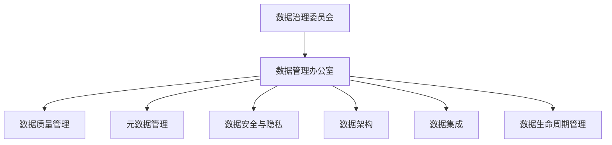

# 数据治理：原理与代码实例讲解

## 1. 背景介绍
### 1.1 数据治理的重要性
在当今数据驱动的世界中,企业和组织面临着海量数据的挑战。如何有效地管理、利用和保护这些数据资产,已成为一个关键问题。数据治理应运而生,它为数据管理提供了一个全面的框架,确保数据的质量、安全性、可访问性和合规性。

### 1.2 数据治理的目标
数据治理的主要目标包括:
- 提高数据质量,确保数据的准确性、完整性和一致性
- 加强数据安全,保护敏感数据不被未经授权的访问
- 优化数据访问,使数据易于发现和使用
- 确保合规性,遵守相关法规和标准
- 支持业务决策,为决策提供可靠的数据支持

### 1.3 数据治理的挑战
实施数据治理面临诸多挑战,例如:
- 缺乏高层支持和资源投入
- 数据孤岛和不一致性
- 数据质量问题
- 数据安全风险
- 缺乏数据治理意识和技能
- 治理流程和工具不成熟

## 2. 核心概念与联系
### 2.1 数据治理的定义
数据治理是一套管理数据资产的过程、政策、标准、角色和责任,旨在最大化数据价值,最小化数据风险。

### 2.2 数据治理的核心要素
数据治理的核心要素包括:
- 数据质量管理:确保数据准确、完整、一致
- 元数据管理:描述数据的属性、含义和关系
- 数据安全与隐私:保护数据免受未授权访问和泄露
- 数据架构:定义数据的逻辑和物理结构
- 数据集成:整合不同来源的数据
- 数据生命周期管理:管理数据从创建到归档的全过程

### 2.3 数据治理与数据管理的关系
数据治理为数据管理提供指导和监督。数据管理侧重于执行层面,而数据治理侧重于战略和政策层面。二者相辅相成,共同促进数据价值最大化。

### 2.4 数据治理框架
一个典型的数据治理框架包括以下组件:
- 数据治理委员会:负责制定数据战略和政策
- 数据管理办公室:协调和监督数据管理活动
- 数据管理流程:定义数据管理的具体步骤和规范
- 数据治理工具:支持数据治理活动的软件工具



## 3. 核心算法原理具体操作步骤
### 3.1 数据质量评估算法
数据质量评估是识别和量化数据质量问题的过程。常用的数据质量评估算法包括:
1. 完整性检查:识别缺失值和空值
2. 有效性检查:验证数据是否符合预定义的规则和格式
3. 一致性检查:检测数据在不同系统或时间点上的一致性
4. 准确性检查:将数据与可信的参考源进行比对
5. 及时性检查:评估数据的更新频率和延迟

### 3.2 数据去重算法
数据去重旨在识别和消除数据集中的重复记录。常用的数据去重算法有:
1. 基于规则的去重:根据预定义的规则(如字段组合)识别重复
2. 基于机器学习的去重:使用机器学习模型(如聚类、分类)识别重复
3. 基于图的去重:将数据建模为图,通过连通子图识别重复

### 3.3 数据标准化算法
数据标准化将不同格式和表示的数据转换为统一的格式。常见的标准化算法包括:
1. Z-score标准化:将数据转换为均值为0、标准差为1的分布
2. Min-Max标准化:将数据缩放到[0,1]区间内
3. 小数定标标准化:通过移动小数点位置来标准化数据

### 3.4 数据脱敏算法
数据脱敏是保护敏感数据隐私的关键技术。常用的数据脱敏算法有:
1. 数据加密:使用加密算法(如AES、RSA)对敏感数据进行加密
2. 数据掩码:用随机字符替换部分敏感信息(如手机号、身份证号)
3. 数据交换:用等价的虚拟标识符替换真实标识符
4. 数据聚合:对敏感数据进行汇总和分组,隐藏个体信息

## 4. 数学模型和公式详细讲解举例说明
### 4.1 数据质量评分模型
数据质量评分模型量化数据集的整体质量水平。一个简单的加权平均模型如下:

$$
DQ\_Score = \sum_{i=1}^{n} w_i \times q_i
$$

其中,$DQ\_Score$表示数据质量总分,$w_i$表示第$i$个质量维度的权重,$q_i$表示第$i$个质量维度的得分,$n$表示质量维度的数量。

例如,考虑三个质量维度:完整性、准确性和及时性,权重分别为0.4、0.4、0.2。若完整性得分为0.9,准确性得分为0.8,及时性得分为0.7,则总体质量得分为:

$$
DQ\_Score = 0.4 \times 0.9 + 0.4 \times 0.8 + 0.2 \times 0.7 = 0.82
$$

### 4.2 数据去重的Jaccard相似度
Jaccard相似度衡量两个集合的重叠程度,常用于文本去重。其计算公式为:

$$
J(A,B) = \frac{|A \cap B|}{|A \cup B|} = \frac{|A \cap B|}{|A| + |B| - |A \cap B|}
$$

其中,$A$和$B$是两个集合,$|A \cap B|$表示它们的交集大小,$|A \cup B|$表示它们的并集大小。

例如,对于两个文本"data quality assessment"和"data quality evaluation",它们的词集合分别为$A=${"data", "quality", "assessment"}和$B=${"data", "quality", "evaluation"}。则它们的Jaccard相似度为:

$$
J(A,B) = \frac{|\{"data", "quality"\}|}{|\{"data", "quality", "assessment", "evaluation"\}|} = \frac{2}{4} = 0.5
$$

### 4.3 数据标准化的Z-score公式
Z-score标准化将数据转换为均值为0、标准差为1的分布。其计算公式为:

$$
z = \frac{x - \mu}{\sigma}
$$

其中,$x$表示原始数据值,$\mu$表示数据的均值,$\sigma$表示数据的标准差。

例如,对于数据集${3, 6, 9, 12, 15}$,其均值$\mu=9$,标准差$\sigma=4.47$。将每个数据点转换为Z-score:

$$
z_1 = \frac{3 - 9}{4.47} = -1.34 \\
z_2 = \frac{6 - 9}{4.47} = -0.67 \\
z_3 = \frac{9 - 9}{4.47} = 0 \\
z_4 = \frac{12 - 9}{4.47} = 0.67 \\
z_5 = \frac{15 - 9}{4.47} = 1.34
$$

转换后的数据集为${-1.34, -0.67, 0, 0.67, 1.34}$,均值为0,标准差为1。

## 5. 项目实践:代码实例和详细解释说明
下面以Python为例,演示数据治理的常见任务。

### 5.1 数据质量评估
使用pandas库对数据集进行质量评估:

```python
import pandas as pd

# 加载数据集
df = pd.read_csv('data.csv')

# 完整性检查
missing = df.isnull().sum()
print("Missing values:")
print(missing)

# 有效性检查
invalid = df[~df['age'].between(0, 120)].shape[0]
print(f"Invalid age values: {invalid}")

# 一致性检查
inconsistent = df.groupby('user_id')['email'].nunique()
inconsistent = inconsistent[inconsistent > 1].shape[0] 
print(f"Inconsistent email values: {inconsistent}")
```

代码解释:
- 使用`pd.read_csv()`加载CSV格式的数据集
- 使用`df.isnull().sum()`统计每列的缺失值数量
- 使用`df[~df['age'].between(0, 120)].shape[0]`统计年龄不在0到120之间的无效值数量
- 使用`df.groupby('user_id')['email'].nunique()`统计每个用户对应的不同邮箱数量,从而发现数据不一致问题

### 5.2 数据去重
使用pandas库对数据集进行去重:

```python
import pandas as pd

# 加载数据集
df = pd.read_csv('data.csv')

# 基于规则的去重
deduped_df = df.drop_duplicates(subset=['name', 'email'])
print(f"Removed {df.shape[0] - deduped_df.shape[0]} duplicates")

# 基于机器学习的去重
from sklearn.cluster import DBSCAN

X = df[['name', 'email', 'age']].values
dbscan = DBSCAN(eps=0.5, min_samples=2).fit(X) 
df['cluster'] = dbscan.labels_

deduped_df = df.groupby('cluster').first().reset_index(drop=True)
print(f"Removed {df.shape[0] - deduped_df.shape[0]} duplicates")
```

代码解释:
- 使用`df.drop_duplicates()`基于指定列删除重复记录
- 使用DBSCAN聚类算法对数据进行聚类,将每个簇内的记录视为重复
- 使用`df.groupby('cluster').first()`保留每个簇的第一条记录,实现去重

### 5.3 数据标准化
使用scikit-learn库对数据进行标准化:

```python
from sklearn.preprocessing import StandardScaler, MinMaxScaler

# Z-score标准化
scaler = StandardScaler()
scaled_data = scaler.fit_transform(data)

# Min-Max标准化
scaler = MinMaxScaler()
scaled_data = scaler.fit_transform(data)
```

代码解释:
- 使用`StandardScaler`进行Z-score标准化,将数据转换为均值为0、标准差为1的分布
- 使用`MinMaxScaler`进行Min-Max标准化,将数据缩放到[0,1]区间内

### 5.4 数据脱敏
使用Faker库生成虚拟数据,实现数据脱敏:

```python
from faker import Faker

fake = Faker()

# 生成虚拟姓名
fake_name = fake.name()

# 生成虚拟邮箱
fake_email = fake.email()

# 生成虚拟手机号
fake_phone = fake.phone_number()

# 生成虚拟地址
fake_address = fake.address()
```

代码解释:
- 使用Faker库生成逼真的虚拟数据,如姓名、邮箱、手机号、地址等
- 将真实的敏感数据替换为生成的虚拟数据,实现数据脱敏

## 6. 实际应用场景
数据治理在各行各业中都有广泛应用,以下是一些典型场景:

### 6.1 金融行业
- 客户数据管理:确保客户信息的准确性、完整性和一致性,支持客户分析和营销活动
- 风险管理:识别和评估数据质量风险,如错误交易数据、不合规数据等,防范金融风险
- 反洗钱:通过数据治理实现可疑交易监测、客户尽职调查等,遵守反洗钱法规

### 6.2 医疗行业
- 电子病历管理:规范和统一电子病历数据,提高医疗数据的互操作性和质量
- 临床试验数据管理:确保临床试验数据的完整性、准确性和可追溯性,满足法规要求
- 医疗隐私保护:脱敏患者数据,保护患者隐私,遵守HIPAA等隐私法规

### 6.3 零售行业
- 商品数据管理:标准化商品属性和分类,支持商品推荐和搜索引擎优化
- 客户数据管理:整合线上线下客户数据,实现全渠道客户视图,支持精准营销
- 供应链数据管理:提高供应链数