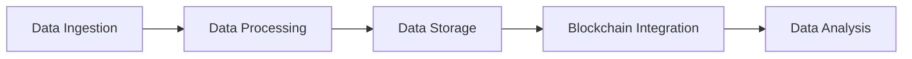

# Data Lakes and Blockchain: Ensuring Data Security

## 1. Background Introduction

In the rapidly evolving digital landscape, data has become the lifeblood of modern businesses. The exponential growth of data, driven by the proliferation of IoT devices, social media, and digital transactions, has necessitated the development of efficient and scalable data management solutions. Two such solutions, data lakes and blockchain, have emerged as key players in the data management arena. This article delves into the intricacies of these technologies, focusing on their interplay and the critical role of data security in their successful implementation.

### 1.1 Data Lakes: A Revolutionary Approach to Data Management

A data lake is a large, scalable, and flexible repository that allows for the storage of structured, semi-structured, and unstructured data in its native format. Unlike traditional data warehouses, data lakes do not impose strict schema requirements, enabling them to accommodate a wide variety of data types and sources. This flexibility makes data lakes an ideal choice for businesses seeking to harness the power of big data analytics.

### 1.2 Blockchain: Decentralized, Secure, and Transparent

Blockchain, on the other hand, is a distributed ledger technology that enables secure, transparent, and tamper-proof data transactions. By design, blockchain eliminates the need for intermediaries, reducing costs and increasing efficiency. Its decentralized nature also makes it highly resistant to data manipulation and fraud, making it an attractive solution for various industries, including finance, supply chain, and healthcare.

## 2. Core Concepts and Connections

### 2.1 The Intersection of Data Lakes and Blockchain

The convergence of data lakes and blockchain presents an exciting opportunity to create a secure, scalable, and flexible data management ecosystem. By integrating blockchain technology into data lakes, businesses can ensure data integrity, traceability, and security, while still benefiting from the flexibility and scalability offered by data lakes.

### 2.2 Key Components of a Data Lake and Blockchain Integration

- **Data Ingestion**: Data is ingested into the data lake from various sources, such as IoT devices, applications, and databases.
- **Data Processing**: The data is processed and transformed to make it suitable for analysis. This may involve cleaning, normalization, and aggregation.
- **Data Storage**: The processed data is stored in the data lake in its native format.
- **Blockchain Integration**: A blockchain layer is added to the data lake, enabling secure, transparent, and tamper-proof data transactions.
- **Data Analysis**: Data is analyzed using various big data analytics tools to derive insights and make informed decisions.



## 3. Core Algorithm Principles and Specific Operational Steps

### 3.1 Data Ingestion and Processing

Data ingestion and processing involve several steps, including data collection, data cleaning, data transformation, and data integration. These steps ensure that the data is accurate, consistent, and ready for analysis.

### 3.2 Blockchain Integration

Blockchain integration involves several key steps:

- **Data Hashing**: Data is hashed to create a unique, fixed-length representation of the data.
- **Block Creation**: Hashed data is grouped into blocks, along with a timestamp and a reference to the previous block.
- **Block Verification**: Blocks are verified by nodes in the network using cryptographic algorithms.
- **Blockchain Consensus**: Nodes in the network reach consensus on the validity of the blocks, ensuring data integrity and security.

## 4. Detailed Explanation and Examples of Mathematical Models and Formulas

### 4.1 Data Hashing Algorithms

Data hashing algorithms, such as SHA-256 and RIPEMD-160, are used to create a fixed-length representation of the data. These algorithms work by mapping the data to a specific range of values, ensuring that the resulting hash is unique and difficult to reverse-engineer.

### 4.2 Cryptographic Algorithms

Cryptographic algorithms, such as RSA and Elliptic Curve Cryptography (ECC), are used to secure data transactions in blockchain networks. These algorithms enable secure communication, digital signatures, and data encryption.

## 5. Project Practice: Code Examples and Detailed Explanations

### 5.1 Data Ingestion and Processing

Here's a simple example of data ingestion and processing using Apache Kafka and Apache Spark:

```python
from pyspark.sql import SparkSession
from pyspark.sql.functions import *

# Create a SparkSession
spark = SparkSession.builder.appName(\"Data Ingestion and Processing\").getOrCreate()

# Read data from Kafka
df = spark \\
    .readStream \\
    .format(\"kafka\") \\
    .option(\"kafka.bootstrap.servers\", \"localhost:9092\") \\
    .option(\"subscribe\", \"my-topic\") \\
    .load()

# Process and transform the data
processed_df = df \\
    .selectExpr(\"CAST(value AS STRING) as data\") \\
    .withWatermark(\"timestamp\", \"10 minutes\") \\
    .groupBy(window(lit(current_timestamp()), \"10 minutes\", \"1 minute\")) \\
    .agg(avg(\"data\"))

# Write the processed data to a sink (e.g., a data lake)
query = processed_df \\
    .writeStream \\
    .format(\"parquet\") \\
    .outputMode(\"complete\") \\
    .option(\"checkpointLocation\", \"/tmp/checkpoint\") \\
    .start(\"/path/to/data-lake\")

# Start the query and monitor the data stream
query.awaitTermination()
```

### 5.2 Blockchain Integration

Here's a simple example of blockchain integration using Hyperledger Fabric:

```javascript
const fs = require('fs');
const path = require('path');
const { FileSystemWallet, Gateway } = require('fabric-network');
const { FileSystemFileSystem } = require('fabric-network/lib/file-system');

// Load the network configuration
const ccpPath = path.resolve(__dirname, '..', '..', 'network', 'connection.json');
const ccpJSON = fs.readFileSync(ccpPath, 'utf8');
const ccp = JSON.parse(ccpJSON);

// Create a new gateway
const gateway = new Gateway();
await gateway.connect(ccp, {
    wallet: new FileSystemWallet('../wallet'),
    discovery: { enabled: true, asLocalhost: true }
});

// Get the contract instance
const contract = gateway.getContract('my-contract');

// Create a new transaction
const transaction = await contract.createTransaction('CreateAsset', {
    'ID': 'asset1',
    'owner': 'User1',
    'assetType': 'my-asset-type',
    'assetDescription': 'A sample asset'
});

// Submit the transaction to the network
const result = await gateway.getNetwork().sendTransaction(transaction);

// Disconnect from the network
await gateway.disconnect();
```

## 6. Practical Application Scenarios

### 6.1 Supply Chain Management

By integrating data lakes and blockchain, businesses can create a transparent and secure supply chain management system. This system can track the movement of goods, ensure authenticity, and prevent counterfeit products from entering the market.

### 6.2 Healthcare Data Management

In the healthcare sector, data lakes and blockchain can be used to create a secure, scalable, and flexible data management system. This system can store and manage patient data, ensuring privacy, security, and compliance with data protection regulations.

## 7. Tools and Resources Recommendations

- **Data Lakes**: Apache Hadoop, Apache Spark, Google BigQuery, Amazon Redshift
- **Blockchain**: Hyperledger Fabric, Ethereum, Corda, MultiChain
- **Big Data Analytics Tools**: Apache Hive, Apache Pig, Apache HBase, Apache Flink, Apache Storm

## 8. Summary: Future Development Trends and Challenges

The integration of data lakes and blockchain presents a promising future for data management. However, several challenges must be addressed, including scalability, interoperability, and regulatory compliance. As these technologies continue to evolve, we can expect to see innovative solutions that address these challenges and unlock new opportunities for businesses.

## 9. Appendix: Frequently Asked Questions and Answers

**Q1: What is the difference between a data lake and a data warehouse?**

A1: A data lake is a large, scalable, and flexible repository that allows for the storage of structured, semi-structured, and unstructured data in its native format. A data warehouse, on the other hand, is a structured repository that stores data in a predefined schema, optimized for querying and analysis.

**Q2: How does blockchain ensure data security?**

A2: Blockchain ensures data security through its decentralized nature, cryptographic algorithms, and consensus mechanisms. These features make it highly resistant to data manipulation and fraud.

**Q3: What are some practical application scenarios for the integration of data lakes and blockchain?**

A3: Some practical application scenarios include supply chain management, healthcare data management, and financial transactions.

**Q4: What tools and resources are recommended for implementing data lakes and blockchain?**

A4: Recommended tools and resources include Apache Hadoop, Apache Spark, Hyperledger Fabric, Ethereum, and Apache Hive.

**Q5: What are the future development trends and challenges for the integration of data lakes and blockchain?**

A5: Future development trends include increased scalability, improved interoperability, and enhanced regulatory compliance. Challenges include addressing the technical complexities of these technologies and ensuring their adoption by businesses.

## Author: Zen and the Art of Computer Programming