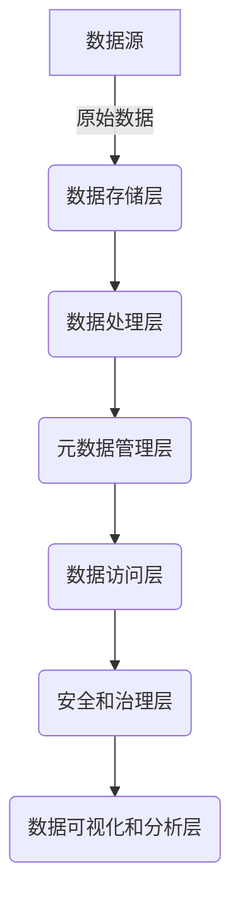

# 数据湖与量子计算未来展望

## 1. 背景介绍

### 1.1 数据时代的到来

我们正生活在一个被数据主导的时代。从个人社交媒体到企业运营,从科学研究到政府决策,海量的数据正在被不断产生、传输和处理。这种数据爆炸式增长对现有的数据存储、管理和分析系统提出了前所未有的挑战。

### 1.2 传统数据仓库的局限性

传统的数据仓库系统主要是为结构化数据而设计的,并且需要预先定义数据模式。然而,当前的数据不仅包括结构化数据,还包括半结构化和非结构化数据,如文本、图像、视频等。这种多样化的数据类型使得传统数据仓库系统难以有效管理和分析。

### 1.3 数据湖的兴起

为了应对这一挑战,数据湖(Data Lake)的概念应运而生。数据湖是一种能够存储各种类型数据的集中式存储库,可以在需要时对数据进行处理和分析。与传统数据仓库不同,数据湖不需要预先定义数据模式,可以灵活地适应不断变化的数据格式和需求。

### 1.4 量子计算的崛起

与此同时,量子计算的发展正在为数据处理和分析带来革命性的变化。量子计算机利用量子力学原理,可以比经典计算机更快地解决某些复杂的计算问题。尤其是在大数据分析、优化、机器学习等领域,量子计算有望带来巨大的性能提升。

## 2. 核心概念与联系

### 2.1 数据湖

数据湖是一种用于存储各种类型数据的集中式存储库。它能够容纳结构化、半结构化和非结构化数据,而无需预先定义数据模式。数据湖的核心思想是"存储一切,再决定如何处理"。

数据湖通常建立在分布式文件系统之上,如Hadoop分布式文件系统(HDFS)或对象存储系统。它们提供了高度的可扩展性、容错能力和低成本存储。

### 2.2 量子计算

量子计算是一种利用量子力学原理进行计算的新型计算范式。与经典计算机基于二进制位(0或1)不同,量子计算机使用量子比特(量子态的叠加)进行计算。这使得量子计算机在解决某些复杂问题时具有巨大的计算优势。

量子计算的核心概念包括量子叠加、量子纠缠和量子并行性。这些概念使量子计算机能够同时处理多个状态,从而在特定问题上实现指数级的加速。

### 2.3 数据湖与量子计算的联系

数据湖和量子计算看似毫不相干,但它们之间存在着密切的联系。随着数据量的不断增长,对高性能计算和分析的需求也在不断增加。量子计算在处理大规模数据集、优化问题、机器学习等领域具有巨大的潜力。

通过将量子计算与数据湖相结合,我们可以充分利用量子计算的优势,加速数据处理和分析过程。例如,在机器学习领域,量子计算可以加速训练过程,提高模型的准确性和效率。在优化问题中,量子计算可以帮助我们更快地找到最优解。

未来,数据湖和量子计算的融合将为我们带来前所未有的数据处理和分析能力,推动科学研究、商业决策和社会发展向前迈进。

## 3. 核心算法原理具体操作步骤

### 3.1 数据湖架构

数据湖的核心架构通常包括以下几个主要组件:

1. **数据存储层**: 用于存储各种类型的原始数据,通常采用分布式文件系统或对象存储系统。常见的选择包括HDFS、Amazon S3、Azure Data Lake Storage等。

2. **数据处理层**: 用于对存储在数据湖中的原始数据进行处理和转换,以便后续分析和应用。常见的处理引擎包括Apache Spark、Apache Flink、Apache Hive等。

3. **元数据管理层**: 用于管理和维护数据湖中数据的元数据,包括数据的来源、格式、结构等信息。常见的元数据管理工具包括Apache Atlas、Cloudera Navigator等。

4. **数据访问层**: 提供统一的接口,允许不同的应用程序和工具访问和查询数据湖中的数据。常见的访问方式包括SQL查询、NoSQL查询、数据API等。

5. **安全和治理层**: 确保数据湖中的数据安全、合规和可审计。包括数据加密、访问控制、数据lineage跟踪等功能。

6. **数据可视化和分析层**: 提供各种可视化和分析工具,用于探索和分析数据湖中的数据,如Tableau、Power BI、Apache Zeppelin等。

下面是数据湖架构的Mermaid流程图:



### 3.2 量子计算算法

量子计算算法是指在量子计算机上运行的算法,利用量子力学原理来解决特定的计算问题。一些著名的量子计算算法包括:

1. **量子傅里叶变换(QFT)**: 用于快速计算离散傅里叶变换,是许多其他量子算法的基础。

2. **Shor算法**: 用于快速分解大整数的因数,可以有效破解基于大素数困难性的加密系统,如RSA加密。

3. **Grover算法**: 用于在无序数据集中快速搜索目标项,比经典算法快sqrt(N)倍。

4. **HHL算法**: 用于快速求解线性方程组,在机器学习和优化问题中有广泛应用。

5. **量子蒙特卡罗算法**: 用于模拟量子系统的动力学行为,在量子化学、材料科学等领域有重要应用。

6. **量子机器学习算法**: 包括量子支持向量机、量子核主成分分析等,可以加速机器学习模型的训练和推理过程。

这些量子算法利用量子计算机的量子并行性、量子叠加和量子纠缠等特性,在某些问题上比经典算法有指数级的加速。然而,由于量子计算机的硬件限制,目前只有少数简单的量子算法可以在实际量子计算机上运行,大多数算法仍处于理论研究阶段。

## 4. 数学模型和公式详细讲解举例说明

### 4.1 量子计算的数学模型

量子计算的数学基础是量子力学,其核心是描述量子态的量子态矢量和量子态的演化。

一个量子态可以用一个复数向量来表示,称为量子态矢量:

$$
|\psi\rangle = \begin{bmatrix}
\alpha_1 \\
\alpha_2 \\
\vdots \\
\alpha_n
\end{bmatrix}
$$

其中,每个 $\alpha_i$ 是一个复数,代表该量子态在对应基态的振幅。量子态矢量必须满足归一化条件:

$$
\sum_{i=1}^n |\alpha_i|^2 = 1
$$

量子态的演化由薛定谔方程描述:

$$
i\hbar \frac{\partial}{\partial t}|\psi(t)\rangle = H|\psi(t)\rangle
$$

其中 $\hbar$ 是普朗克常数, $H$ 是哈密顿量(能量算符)。这个方程描述了量子态在时间演化过程中的变化规律。

### 4.2 量子并行性

量子并行性是量子计算的一个关键特性,它允许量子计算机同时处理多个量子态的叠加。对于一个 $n$ 量子比特的量子计算机,其量子态可以表示为:

$$
|\psi\rangle = \sum_{x=0}^{2^n-1} \alpha_x|x\rangle
$$

其中, $|x\rangle$ 是 $n$ 量子比特的基态之一,对应于经典计算机的一个 $n$ 位二进制数。通过对这个量子态进行操作,量子计算机实际上是在同时处理所有 $2^n$ 个基态的叠加。这种并行性使得量子计算机在某些问题上具有指数级的加速。

例如,在搜索无序数据集中的目标项时,经典算法需要检查 $N$ 个项目,时间复杂度为 $O(N)$。而 Grover 算法利用量子并行性,只需要 $O(\sqrt{N})$ 的时间复杂度即可找到目标项。

### 4.3 量子傅里叶变换

量子傅里叶变换(QFT)是量子计算中一个非常重要的子程序,它是许多量子算法的基础。QFT可以高效地计算离散傅里叶变换(DFT),而 DFT 在信号处理、数据压缩等领域有广泛应用。

对于一个 $n$ 量子比特的量子态 $|x\rangle$,QFT 将它变换为:

$$
\text{QFT}|x\rangle = \frac{1}{\sqrt{2^n}}\sum_{y=0}^{2^n-1}e^{2\pi ixy/2^n}|y\rangle
$$

这个变换的时间复杂度是 $O(n^2)$,而经典算法计算 DFT 的时间复杂度是 $O(n2^n)$。因此,QFT 在处理大规模 DFT 时具有指数级的加速。

QFT 是 Shor 算法(用于快速分解大整数)和相位估计算法(用于求解线性方程组)等著名量子算法的关键子程序。

通过上述数学模型和公式,我们可以看到量子计算利用了量子力学的基本原理,具有经典计算无法企及的并行性和计算能力。这为解决一些困难的计算问题提供了新的途径。

## 5. 项目实践:代码实例和详细解释说明

虽然实际的通用量子计算机尚未问世,但我们可以使用量子计算模拟器来体验和学习量子算法。这里我们将使用 Qiskit 量子计算模拟器,演示一个简单的量子线路和量子算法。

### 5.1 安装 Qiskit

Qiskit 是 IBM 开发的开源量子计算框架,提供了量子线路构建、模拟和执行的工具。我们可以使用 Python 的包管理器 pip 来安装 Qiskit:

```bash
pip install qiskit
```

### 5.2 构建量子线路

首先,我们导入所需的模块:

```python
from qiskit import QuantumCircuit, execute, Aer
from qiskit.visualization import plot_bloch_multivector
```

然后,我们构建一个简单的量子线路,包含一个量子比特和一些量子门操作:

```python
# 创建一个量子线路,包含一个量子比特
qc = QuantumCircuit(1)

# 对量子比特应用 Hadamard 门
qc.h(0)

# 对量子比特应用 X 门
qc.x(0)

# 绘制量子线路
qc.draw()
```

这个量子线路首先对量子比特应用 Hadamard 门,将它置于叠加态。然后,应用 X 门对量子态进行翻转。我们可以使用 `qc.draw()` 函数来可视化这个量子线路。

### 5.3 模拟和测量

接下来,我们使用 Qiskit 提供的模拟器来执行这个量子线路,并测量量子态:

```python
# 使用模拟器执行量子线路
backend = Aer.get_backend('statevector_simulator')
job = execute(qc, backend)
result = job.result()
statevec = result.get_statevector()

# 打印量子态矢量
print(f"Statevector: {statevec}")

# 可视化量子态在 Bloch 球上的表示
plot_bloch_multivector(statevec)
```

在这个示例中,我们使用了 `statevector_simulator` 模拟器,它可以返回量子态的完整矢量表示。我们打印出量子态矢量,并使用 `plot_bloch_multivector` 函数将量子态在 Bloch 球上进行可视化。

通过这个简单的示例,我们可以看到如何使用 Qis