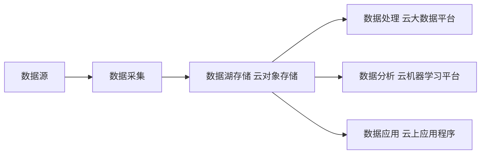

# 数据湖在云计算中的应用

## 1. 背景介绍
### 1.1 数据湖的兴起
### 1.2 云计算的发展
### 1.3 数据湖与云计算的结合

## 2. 核心概念与联系
### 2.1 数据湖的定义与特点
#### 2.1.1 数据湖的定义
数据湖（Data Lake）是一种存储海量原始数据的集中式存储库，它能够存储结构化、半结构化和非结构化的数据。与传统的数据仓库不同，数据湖存储的是未经处理的原始数据，而不是预先定义好schema的结构化数据。

数据湖的主要目标是提供一个统一的数据存储平台，能够满足组织内部不同部门和业务系统对数据的需求。通过将所有数据集中存储在数据湖中，可以避免数据孤岛问题，实现数据的共享和复用，同时也为后续的数据分析、挖掘和机器学习提供了数据基础。

#### 2.1.2 数据湖的特点
- 海量存储：数据湖能够存储PB级别的海量数据，满足企业不断增长的数据存储需求。
- 多种数据类型：数据湖支持存储结构化、半结构化和非结构化的多种数据类型，包括日志、文本、图像、音视频等。
- 原始数据存储：数据湖存储的是未经处理的原始数据，保留了数据的原貌，便于后续的数据处理和分析。
- 低成本：相比传统的数据仓库，数据湖采用廉价的存储介质和分布式存储架构，大幅降低了存储成本。
- 灵活性：数据湖提供了灵活的数据访问和处理方式，用户可以根据需求对数据进行探索和分析。

### 2.2 云计算的特点与优势
#### 2.2.1 云计算的特点
- 按需自助服务：用户可以根据需要，自助获取云资源，如计算、存储和网络等。
- 广泛的网络访问：云服务可以通过网络访问，支持多种终端设备。
- 资源池化：云计算将IT资源整合成共享的资源池，动态分配给用户。
- 快速弹性：云计算可以快速、灵活地扩展或缩减资源，满足业务需求变化。
- 可计量服务：云计算采用按使用量计费的方式，用户只需为实际使用的资源付费。

#### 2.2.2 云计算的优势
- 成本节约：通过云计算，企业可以减少硬件投入和运维成本，实现IT资源的弹性扩展。
- 敏捷性：云计算提供了快速部署、灵活扩展的能力，加快了应用交付速度。
- 可靠性：云服务商通过多副本、容灾备份等技术手段，保障云服务的高可用性。
- 安全性：云计算提供了多层次的安全防护措施，如身份认证、访问控制、数据加密等。
- 便捷性：用户可以通过网络随时随地访问云服务，实现移动办公和远程协作。

### 2.3 数据湖与云计算的协同
数据湖和云计算的结合，能够充分发挥两者的优势，实现数据存储、处理和分析的高效协同。

一方面，云计算提供了海量的存储和计算资源，为数据湖的构建和运行提供了基础设施支持。数据湖可以利用云存储服务（如对象存储）来存储海量的原始数据，利用云计算服务（如大数据处理平台）对数据进行处理和分析。

另一方面，数据湖为云计算提供了丰富的数据资源，使得云上的各种数据分析和应用能够高效地访问和利用数据。数据湖中的数据可以通过数据管道、API等方式供云上的应用程序调用，实现数据驱动的业务创新。

下图展示了数据湖与云计算的协同架构：

## 3. 核心算法原理具体操作步骤

### 3.1 数据采集与接入
#### 3.1.1 数据采集
数据湖的第一步是进行数据采集，将各种来源的原始数据导入到数据湖中。数据采集可以通过以下几种方式进行：

1. 批量导入：将已有的历史数据文件（如日志文件、数据库导出文件等）通过批处理的方式导入到数据湖。
2. 实时采集：通过日志收集器、消息队列等工具，实时采集应用程序产生的日志、事件等数据，并将其传输到数据湖。
3. API集成：通过提供的API接口，让外部系统和应用程序将数据直接写入数据湖。

#### 3.1.2 数据接入
采集到的原始数据需要进行接入处理，以便于后续的存储和分析。数据接入主要包括以下步骤：

1. 数据清洗：对采集到的原始数据进行初步的清洗，剔除无效、重复或不完整的数据。
2. 数据转换：将异构数据源的数据转换为统一的格式，如JSON、Parquet等。
3. 元数据提取：从原始数据中提取关键的元数据信息，如数据源、时间戳、格式等，并将其存储到元数据管理系统中。
4. 数据分区：根据数据的特征对其进行分区，如按时间、业务类型等维度进行分区，以优化后续的查询和分析性能。

### 3.2 数据存储与管理
#### 3.2.1 数据存储
数据湖采用分层存储的架构，将数据按照不同的存储层次进行组织和管理。通常分为以下三个层次：

1. 原始数据层（Raw Data Layer）：存储未经处理的原始数据，保留数据的原貌。
2. 细化数据层（Refined Data Layer）：存储经过清洗、转换后的结构化或半结构化数据，便于后续的分析和应用。
3. 应用数据层（Application Data Layer）：存储经过聚合、计算后的结果数据，供上层应用程序直接使用。

不同存储层次可以采用不同的存储介质和格式，如对象存储用于存储原始数据，分布式文件系统（如HDFS）用于存储细化数据，NoSQL数据库用于存储应用数据。

#### 3.2.2 元数据管理
数据湖中的元数据管理是非常重要的，它记录了数据的来源、格式、结构、血缘关系等关键信息，方便用户快速查找和理解数据。

常见的元数据管理工具有Apache Atlas、AWS Glue Data Catalog等，它们提供了以下功能：

1. 元数据采集：自动采集不同数据源的元数据信息，并将其存储到统一的元数据管理系统中。
2. 元数据检索：提供基于关键字、标签等方式的元数据检索功能，帮助用户快速找到所需数据。
3. 数据血缘：记录数据的来源和转换过程，方便追踪数据的流向和变化。
4. 数据治理：对元数据进行分类、标注和管理，支持数据质量检查、安全审计等数据治理功能。

### 3.3 数据处理与分析
#### 3.3.1 数据处理
对数据湖中的原始数据进行处理和转换，是数据分析的前提。常见的数据处理方式包括：

1. ETL（Extract-Transform-Load）：将原始数据抽取到细化数据层，进行清洗、转换和加载处理，生成结构化的数据。
2. ELT（Extract-Load-Transform）：将原始数据直接加载到数据湖，再进行转换处理，这种方式更加灵活，适合处理大规模数据。

数据处理可以使用批处理或流处理的方式进行，常用的工具有Apache Spark、Flink、Hive等。

#### 3.3.2 数据分析
数据湖提供了丰富的数据分析能力，支持多种分析方式：

1. SQL分析：通过SQL方式对结构化数据进行查询和分析，可使用Presto、Athena等交互式查询引擎。
2. 机器学习：使用数据湖中的数据进行机器学习模型的训练和预测，常用的工具有TensorFlow、PyTorch等。
3. 商业智能（BI）：将数据湖中的数据导入BI工具（如Tableau、PowerBI），进行可视化分析和报表展示。
4. 数据挖掘：使用数据挖掘算法对数据进行探索和发现，找出隐藏的模式和规律。

## 4. 数学模型和公式详细讲解举例说明

### 4.1 数据分布模型
在数据湖中，原始数据通常呈现出长尾分布（Long Tail Distribution）的特点，即大部分数据访问频率较低，而少部分热点数据访问频率较高。

长尾分布可以用幂律分布（Power Law Distribution）来描述，其概率密度函数为：

$$f(x) = Cx^{-\alpha}, x \geq x_{min}$$

其中，$C$是归一化常数，$\alpha$是幂律指数，$x_{min}$是最小值。

例如，对于一个数据湖中的文件访问频率分布，假设$\alpha=2$，$x_{min}=1$，则归一化常数$C$为：

$$C = (\alpha-1)x_{min}^{\alpha-1} = 1$$

那么，文件访问频率的概率密度函数为：

$$f(x) = x^{-2}, x \geq 1$$

这意味着，访问频率为$x$的文件的概率与$x$的平方成反比。

### 4.2 数据压缩模型
数据湖中的原始数据通常体量巨大，为了节省存储空间，需要对数据进行压缩。常用的数据压缩算法有：

1. Gzip压缩：基于Deflate算法，压缩比较高，但压缩和解压速度较慢。
2. Snappy压缩：压缩比较低，但压缩和解压速度非常快，适合对实时数据进行压缩。
3. LZO压缩：压缩比和速度介于Gzip和Snappy之间，支持分块压缩和解压。

以Gzip压缩为例，其压缩过程可以分为以下几个步骤：

1. 字符串匹配：使用LZ77算法，找出数据中重复的字符串，并用距离-长度对（distance-length pair）来表示。
2. 哈夫曼编码：根据字符串出现的频率，构建最优的哈夫曼编码树，对字符进行变长编码。

假设有一个字符串"ABBCCCDDDDEEEEE"，经过LZ77算法处理后，得到以下距离-长度对：

- (0, 1) 表示'A'
- (0, 1) 表示'B'
- (1, 1) 表示'B'
- (0, 1) 表示'C'
- (1, 3) 表示'CCC'
- (0, 1) 表示'D'
- (1, 4) 表示'DDDD'
- (0, 1) 表示'E'
- (1, 5) 表示'EEEEE'

然后，对这些距离-长度对和字符进行哈夫曼编码，得到最终的压缩结果。

### 4.3 数据分桶模型
在数据湖中，为了优化查询性能，可以对数据进行分桶（Bucketing）存储。数据分桶是指将数据按照某个或某些列的值进行划分，将具有相同值的数据放入同一个桶中。

假设有一张用户行为日志表，包含用户ID、行为类型、时间戳等字段，可以按照用户ID进行分桶，具体步骤如下：

1. 确定分桶的列，这里选择用户ID列。
2. 确定分桶的数量，假设为1000个桶。
3. 对每条数据的用户ID进行哈希计算，得到一个哈希值。
4. 将哈希值对桶的数量取模，得到该数据所属的桶编号。
5. 将数据写入对应的桶中。

假设有一条用户行为日志数据，用户ID为"user123"，行为类型为"click"，时间戳为"2022-01-01 12:00:00"，分桶过程如下：

1. 对用户ID进行