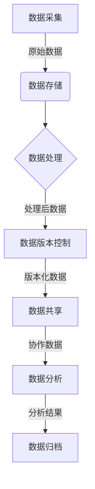

# 数据版本控制与数据管理原理与代码实战案例讲解

## 1.背景介绍

在现代软件开发过程中,数据是非常宝贵的资源。随着数据量的不断增长和数据类型的多样化,有效地管理和控制数据版本变得至关重要。数据版本控制(Data Version Control,DVC)和数据管理是确保数据完整性、可追溯性和协作效率的关键环节。

数据版本控制允许我们跟踪数据的变化历史,比较不同版本之间的差异,并在必要时回滚到以前的状态。这对于数据分析、机器学习和科学研究等领域都是不可或缺的。同时,数据管理则关注数据的整个生命周期,包括数据采集、存储、处理、共享和归档等方面。

本文将深入探讨数据版本控制和数据管理的原理和实践,为读者提供全面的理解和实用的技术指导。

## 2.核心概念与联系

### 2.1 数据版本控制(DVC)

数据版本控制(DVC)是一种跟踪和管理数据变化的系统,它允许用户记录数据的历史快照,比较不同版本之间的差异,并在必要时回滚到以前的状态。DVC的核心概念包括:

- **版本(Version)**: 数据在某个时间点的状态快照。
- **提交(Commit)**: 将数据的当前状态保存为一个新版本的操作。
- **分支(Branch)**: 独立的数据线路,允许在不影响主线版本的情况下进行实验和开发。
- **合并(Merge)**: 将不同分支的更改合并到一个版本中的操作。
- **冲突(Conflict)**: 当多个用户同时修改同一部分数据时,需要手动解决冲突。

### 2.2 数据管理

数据管理是一个更广泛的概念,涵盖了数据的整个生命周期,包括:

- **数据采集**: 从各种来源收集和整理数据。
- **数据存储**: 将数据存储在适当的位置和格式中,以便于访问和处理。
- **数据处理**: 对原始数据进行清理、转换和enrichment,以满足特定需求。
- **数据共享**: 在团队或组织内部安全地共享和协作数据。
- **数据归档**: 长期保存和存储历史数据,以备将来参考和分析。

数据版本控制是数据管理的一个重要组成部分,它确保了数据的可追溯性和一致性,从而支持数据管理的其他方面。

### 2.3 核心概念关系

数据版本控制和数据管理是密切相关的概念,它们共同构建了一个完整的数据生命周期管理系统。下图展示了它们之间的关系:

## 3.核心算法原理具体操作步骤

### 3.1 数据版本控制算法

数据版本控制系统通常采用以下核心算法来实现版本管理:

#### 3.1.1 差异算法

差异算法用于比较两个版本之间的差异,它通常包括以下步骤:

1. **分块(Chunking)**: 将两个版本的数据分割成多个块或记录。
2. **指纹计算(Fingerprinting)**: 为每个块计算一个唯一的指纹或哈希值。
3. **差异计算(Diffing)**: 比较两个版本的块指纹,找出不同的块。
4. **差异编码(Delta Encoding)**: 将发现的差异编码成一个紧凑的表示形式。

常用的差异算法包括:

- **Git 差异算法**: 基于内容寻址和压缩包技术。
- **Rsync 算法**: 基于滚动校验和和滑动窗口技术。
- **BSDiff/BSDiff4 算法**: 基于字节级别的差异计算。

#### 3.1.2 合并算法

合并算法用于将不同分支的更改合并到一个版本中,它通常包括以下步骤:

1. **三向合并(Three-way Merge)**: 将基线版本、源版本和目标版本进行比较和合并。
2. **冲突检测(Conflict Detection)**: 识别无法自动合并的冲突区域。
3. **冲突解决(Conflict Resolution)**: 手动或自动解决冲突。
4. **合并提交(Merge Commit)**: 创建一个新的合并版本,包含所有更改。

常用的合并算法包括:

- **Git 合并算法**: 基于三向合并和内容寻址技术。
- **KDiff3 合并算法**: 基于行级别的三向合并。
- **Semantic Merge 算法**: 基于结构化数据的语义合并。

### 3.2 数据管理算法

数据管理涉及多个方面,每个方面都有相应的算法和技术:

#### 3.2.1 数据采集算法

- **Web 爬虫算法**: 用于从网站采集数据。
- **流式数据处理算法**: 用于实时处理和采集流式数据。
- **传感器数据采集算法**: 用于从物联网设备采集数据。

#### 3.2.2 数据存储算法

- **索引算法**: 用于高效查找和访问存储的数据。
- **压缩算法**: 用于减小数据存储空间。
- **分布式存储算法**: 用于在多个节点上存储和访问数据。

#### 3.2.3 数据处理算法

- **数据清理算法**: 用于识别和处理异常值、缺失值等问题。
- **数据转换算法**: 用于将数据转换为所需的格式或结构。
- **数据enrichment算法**: 用于从其他数据源添加额外的信息。

#### 3.2.4 数据共享算法

- **访问控制算法**: 用于管理对数据的访问权限。
- **数据版本化算法**: 用于跟踪和管理数据的变化历史。
- **元数据管理算法**: 用于管理和查询数据的元信息。

#### 3.2.5 数据归档算法

- **数据压缩算法**: 用于减小归档数据的存储空间。
- **数据索引算法**: 用于快速查找和访问归档数据。
- **数据生命周期管理算法**: 用于管理数据的保留期限和删除策略。

## 4.数学模型和公式详细讲解举例说明

在数据版本控制和数据管理领域,有许多数学模型和公式用于描述和优化相关算法和系统。下面将介绍一些常见的数学模型和公式。

### 4.1 差异编码模型

差异编码是数据版本控制中的一个关键技术,它旨在以紧凑的形式表示两个版本之间的差异。常见的差异编码模型包括:

#### 4.1.1 Levenshtein 距离

Levenshtein 距离是一种用于测量两个字符串之间差异的度量,它被广泛应用于版本控制系统中的差异计算。Levenshtein 距离的定义如下:

$$
lev_{a,b}(i,j) = \begin{cases}
\max(i,j) & \text{if } \min(i,j)=0 \\
\min \begin{cases}
lev_{a,b}(i-1,j)+1 \\
lev_{a,b}(i,j-1)+1 \\
lev_{a,b}(i-1,j-1)+1_{(a_i \neq b_j)}
\end{cases} & \text{otherwise}
\end{cases}
$$

其中 $a$ 和 $b$ 分别表示两个字符串,而 $lev_{a,b}(i,j)$ 表示将 $a$ 的前 $i$ 个字符转换为 $b$ 的前 $j$ 个字符所需的最小编辑距离。

#### 4.1.2 Rsync 滚动校验和

Rsync 算法使用滚动校验和技术来快速比较两个文件的相似性,从而加速差异计算过程。滚动校验和的计算公式如下:

$$
S_n = (S_{n-1} - b_0 \times 2^{32-M} + b_n) \bmod 2^{32}
$$

其中 $S_n$ 表示第 $n$ 个滚动校验和值,而 $b_i$ 表示数据块中第 $i$ 个字节的值。通过这种方式,可以在 $O(1)$ 的时间内计算出下一个校验和值,而不需要重新计算整个数据块。

### 4.2 数据压缩模型

数据压缩是数据存储和传输中的一个重要技术,它可以减小数据的占用空间,从而提高效率。常见的数据压缩模型包括:

#### 4.2.1 熵编码

熵编码是一种无损数据压缩算法,它根据数据的统计特性为每个符号分配不同长度的编码,从而达到压缩的目的。熵编码的理论基础是信息熵,其公式如下:

$$
H(X) = -\sum_{i=1}^{n} P(x_i) \log_2 P(x_i)
$$

其中 $X$ 是一个离散随机变量,取值为 $\{x_1, x_2, \dots, x_n\}$,而 $P(x_i)$ 表示 $x_i$ 的概率。熵 $H(X)$ 表示了对于给定的概率分布,编码一个符号所需的平均比特数。

常见的熵编码算法包括:

- **霍夫曼编码(Huffman Coding)**: 基于符号频率构建前缀码树。
- **算术编码(Arithmetic Coding)**: 基于符号概率将整个消息映射到一个数值区间。

#### 4.2.2 字典编码

字典编码是一种无损数据压缩算法,它通过维护一个字典来替换重复出现的数据模式。常见的字典编码算法包括:

- **LZ77**: 使用滑动窗口技术查找重复模式。
- **LZ78**: 基于字典树(Trie)的字典编码算法。
- **LZW**: 一种广泛使用的字典编码算法,具有较高的压缩率和速度。

### 4.3 数据索引模型

数据索引是提高数据查询和访问效率的关键技术,常见的数据索引模型包括:

#### 4.3.1 B-Tree 索引

B-Tree 是一种平衡多路查找树,它被广泛应用于关系型数据库和文件系统中。B-Tree 的结构可以用以下递归定义描述:

- 每个节点最多有 $m$ 个子节点。
- 除根节点和叶子节点外,每个节点至少有 $\lceil m/2 \rceil$ 个子节点。
- 所有叶子节点位于同一层级,并包含指向记录的指针。
- 每个非叶子节点包含 $n$ 个键值 $k_1, k_2, \dots, k_n$,其中 $k_i < k_{i+1}$。

B-Tree 的查找、插入和删除操作的时间复杂度都是 $O(\log_m N)$,其中 $N$ 是树中节点的总数。

#### 4.3.2 位图索引

位图索引是一种用于快速查找和过滤数据的索引技术。它将每个distinct值映射为一个位向量,其中每个位表示该值在相应的行或列中是否出现。位图索引的优点是查询速度快,但是对于高基数列存在空间开销较大的问题。

位图索引的基本操作包括:

- **按位与(AND)**: 用于组合多个条件。
- **按位或(OR)**: 用于合并多个位图。
- **按位取反(NOT)**: 用于求补集。

通过这些位操作,可以高效地执行数据过滤和聚合查询。

### 4.4 数据分布式存储模型

在大数据时代,数据量呈指数级增长,单机存储和计算能力已经无法满足需求。分布式存储系统通过将数据分散存储在多个节点上,从而提高了存储容量和并行处理能力。常见的分布式存储模型包括:

#### 4.4.1 一致性哈希

一致性哈希是一种分布式哈希算法,它可以在节点发生变化时,只需重新映射受影响的数据,而不需要重新映射整个数据集。一致性哈希的基本思想是将节点和数据都映射到同一个哈希环上,然后根据顺时针方