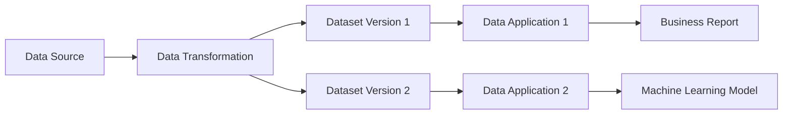
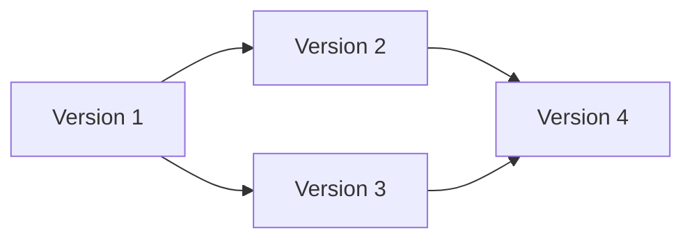
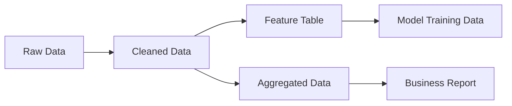
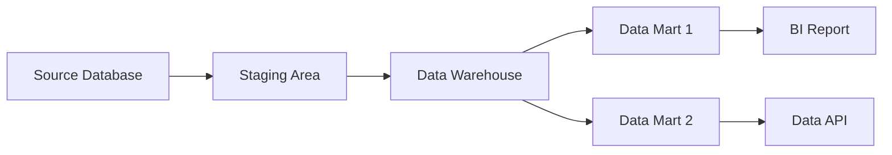

# 数据版本管理与数据谱系原理与代码实战案例讲解

## 1. 背景介绍
### 1.1 数据版本管理的重要性
在当今数据驱动的世界中,数据已经成为企业最宝贵的资产之一。随着数据量的不断增长和数据复杂性的提高,如何有效地管理和追踪数据变化变得至关重要。数据版本管理(Data Version Control,DVC)应运而生,它为数据提供了类似于代码版本控制的功能,使得数据的变更历史可追溯、可重现。

### 1.2 数据谱系的价值
与数据版本管理密切相关的另一个概念是数据谱系(Data Lineage)。数据谱系描述了数据从起源到当前状态的完整演变过程,记录了数据的来源、转换和影响。通过数据谱系,我们可以了解数据的"家族树",追踪数据的血缘关系,并在出现问题时快速定位根源。

### 1.3 本文的目标与结构
本文将深入探讨数据版本管理与数据谱系的原理,并结合实际的代码案例进行讲解。我们将从核心概念入手,揭示它们之间的内在联系,然后介绍实现这些功能的关键算法和数学模型。通过项目实践,我们将展示如何使用现有的工具和框架来构建数据版本管理与谱系追踪系统。最后,我们将总结这一领域的发展趋势与面临的挑战,并提供一些常见问题的解答。

## 2. 核心概念与联系
### 2.1 数据版本管理的核心概念
- 数据集(Dataset):一组相关的数据文件,通常以目录或压缩包的形式存在。
- 版本(Version):数据集的一个快照,代表数据在某个时间点的状态。
- 提交(Commit):将更改后的数据集保存为一个新版本的操作。
- 分支(Branch):从某个版本创建的独立开发线,可以进行独立的修改而不影响主线。
- 合并(Merge):将一个分支的更改合并到另一个分支或主线上。
- 标签(Tag):为某个版本添加一个易记的别名,通常用于标记重要的里程碑。

### 2.2 数据谱系的核心概念
- 数据源(Data Source):数据的起源,可以是原始数据库、文件或外部数据接口等。
- 数据转换(Data Transformation):对数据进行加工、清洗、集成等操作,生成新的数据集。
- 数据血缘(Data Lineage):描述数据从源头到当前状态的完整演变过程和依赖关系。
- 影响分析(Impact Analysis):评估某个数据变化对下游数据和应用的影响范围。

### 2.3 数据版本管理与谱系之间的联系
数据版本管理与数据谱系是相辅相成的两个方面。版本管理为谱系分析提供了数据演变的时间维度,记录了每个版本的元数据和变更内容。而谱系信息则为版本管理提供了数据依赖关系的空间维度,描述了不同数据之间的因果关联。将两者结合,就能构建一个全面的数据管理体系。

下图展示了数据版本管理与谱系追踪的整体架构:



## 3. 核心算法原理具体操作步骤
### 3.1 数据版本管理算法
数据版本管理的核心是如何高效地存储和追踪数据集的变更。常见的算法包括:

1. 快照(Snapshot):直接保存数据集的完整副本,优点是恢复速度快,缺点是存储空间占用大。
2. 增量(Delta):只保存数据集相对于上一版本的变化部分,节省存储空间,但恢复时需要应用所有的增量。
3. 混合(Hybrid):结合快照和增量,定期保存完整快照,中间使用增量,兼顾存储和恢复效率。

以增量算法为例,其基本步骤如下:

1. 计算当前数据集与上一版本的差异(diff)。
2. 将差异部分编码为增量(delta),通常使用二进制格式以节省空间。
3. 将增量与版本元数据一起保存到版本库中。
4. 恢复时,从最近的快照开始,依次应用增量,直到达到目标版本。

### 3.2 数据谱系追踪算法
数据谱系追踪的关键是构建数据血缘图(Lineage Graph),记录数据集之间的依赖关系。常用的算法有:

1. 基于日志的追踪:分析系统日志,提取数据访问和转换操作,重建血缘关系。
2. 基于代码的静态分析:通过静态代码分析,识别数据流和控制流,推断数据依赖。
3. 基于注解的显式声明:在代码中显式添加谱系注解,描述输入输出数据集的关系。

以基于代码静态分析为例,其基本步骤如下:

1. 将源代码解析为抽象语法树(AST)。
2. 遍历AST,识别出数据访问和转换操作,构建数据流图(DFG)。
3. 在DFG的基础上,进一步分析控制流,得到程序依赖图(PDG)。
4. 从PDG中提取数据依赖关系,构建数据血缘图。
5. 对血缘图进行分析,计算数据影响范围,支持溯源和影响分析查询。

## 4. 数学模型和公式详细讲解举例说明
### 4.1 数据版本管理的数学模型
我们可以使用有向无环图(DAG)来建模数据版本之间的演化关系。设$G=(V,E)$表示一个数据版本 DAG,其中:

- $V=\{v_1,v_2,...,v_n\}$是版本节点的集合,每个节点代表一个数据版本。
- $E=\{e_1,e_2,...,e_m\}$是有向边的集合,每条边$e_i=(v_j,v_k)$代表$v_j$是$v_k$的父版本。

例如,下图展示了一个简单的数据版本 DAG:



在这个 DAG 中,版本1是版本2和版本3的父版本,版本4由版本2和版本3合并而来。

### 4.2 数据谱系的数学模型
数据谱系可以用有向图(DG)来建模,图中的节点表示数据集,边表示数据之间的依赖关系。形式化地,设$G=(V,E)$表示一个数据谱系图,其中:

- $V=\{v_1,v_2,...,v_n\}$是数据集节点的集合。
- $E=\{e_1,e_2,...,e_m\}$是有向边的集合,每条边$e_i=(v_j,v_k)$代表数据集$v_j$依赖于$v_k$。

例如,下图展示了一个简单的数据谱系图:



在这个谱系图中,原始数据经过清洗后产生了两个新的数据集,分别用于特征提取和数据聚合,最终生成模型训练数据和业务报表。

通过谱系图,我们可以计算数据影响范围。例如,如果原始数据发生变化,我们可以通过遍历图的可达节点来确定所有受影响的下游数据集。设$I(v)$表示节点$v$的影响集合,则有:

$$
I(v) = \{v\} \cup \bigcup_{(v,u)\in E} I(u)
$$

即节点 v 的影响集合包括 v 本身,以及所有从 v 可达的节点的影响集合的并集。

## 5. 项目实践：代码实例和详细解释说明
下面我们通过一个简单的 Python 项目来演示如何实现数据版本管理和谱系追踪。我们将使用 DVC(Data Version Control)工具来管理数据版本,使用 PyDeequ 库来进行数据谱系分析。

### 5.1 数据版本管理实例
首先,我们创建一个示例数据集:

```python
# data.csv
id,name,age,city
1,Alice,25,New York
2,Bob,30,London
3,Charlie,35,Paris
```

然后,初始化 DVC 仓库并添加数据集:

```bash
$ dvc init
$ dvc add data.csv
$ git add data.csv.dvc .gitignore
$ git commit -m "Add initial data"
```

接下来,我们对数据进行一些修改:

```python
# data.csv
id,name,age,city,country
1,Alice,25,New York,USA
2,Bob,30,London,UK
3,Charlie,35,Paris,France
4,David,40,Berlin,Germany
```

提交更改到 DVC:

```bash
$ dvc add data.csv
$ git add data.csv.dvc
$ git commit -m "Update data"
```

现在,我们可以使用 DVC 命令来查看数据版本历史:

```bash
$ dvc diff
$ dvc checkout <version>
```

### 5.2 数据谱系追踪实例
我们使用 PyDeequ 库来分析数据谱系。首先,定义数据转换流程:

```python
from pyspark.sql import SparkSession
from pydeequ.analyzers import *

spark = SparkSession.builder \
    .config("spark.jars.packages", pydeequ.deequ_maven_coord) \
    .getOrCreate()

data = spark.read.csv("data.csv", header=True)
cleaned_data = data.dropna()
aggregated_data = cleaned_data.groupBy("country").count()
```

然后,使用 PyDeequ 进行数据谱系分析:

```python
from pydeequ.suggestions import *
from pydeequ.checks import *
from pydeequ.verification import *

suggestions = ConstraintSuggestionRunner(spark) \
    .onData(data) \
    .addConstraintRule(DEFAULT()) \
    .run()

constraints = [
    AnalysisBasedConstraint("id", "IS NOT NULL", lambda x: x == 1.0),
    AnalysisBasedConstraint("name", "IS NOT NULL", lambda x: x == 1.0),
]

check_result = VerificationSuite(spark) \
    .onData(data) \
    .addCheck(Check(spark, CheckLevel.Error, "Review Check") \
        .addConstraint(constraints[0]) \
        .addConstraint(constraints[1])) \
    .run()

lineage = [
    {"name": "data", "parent": []},
    {"name": "cleaned_data", "parent": ["data"]},
    {"name": "aggregated_data", "parent": ["cleaned_data"]},
]
```

最后,我们可以输出数据谱系信息:

```python
print("Data Lineage:")
for item in lineage:
    print(f"{item['name']} <- {item['parent']}")
```

输出结果:

```
Data Lineage:
data <- []
cleaned_data <- ['data']
aggregated_data <- ['cleaned_data']
```

通过以上步骤,我们实现了对数据集的版本管理,并使用 PyDeequ 库分析了数据谱系关系。在实际项目中,我们可以根据具体需求选择合适的工具和库,构建完整的数据版本控制与谱系追踪系统。

## 6. 实际应用场景
数据版本管理与谱系追踪在许多实际场景中都有广泛应用,例如:

1. 机器学习模型开发:管理训练数据集的版本,追踪特征工程和数据预处理的谱系,方便复现和优化模型。
2. 数据仓库与 ETL:管理数据仓库中表的版本,记录 ETL 作业的数据依赖关系,助力数据治理和质量监控。
3. 数据分析与 BI:追踪数据指标的计算过程,溯源报表数据的来源,提高分析结果的可信度。
4. 数据共享与发布:管理对外发布数据的版本,明确数据产品的生产流程,确保数据的一致性。

下面是一个数据仓库应用的示例架构:



在这个架构中,原始数据从源数据库进入暂存区,然后加载到数据仓库。数据