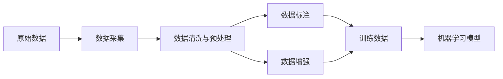

# 数据采集与标注原理与代码实战案例讲解

## 1. 背景介绍

### 1.1 数据采集与标注的重要性

在当今大数据和人工智能时代,海量数据的采集和高质量标注对于训练高性能的机器学习模型至关重要。数据是人工智能的燃料,没有高质量的训练数据,再先进的算法也无法发挥作用。因此,数据采集与标注已经成为人工智能领域一个重要的基础性工作。

### 1.2 数据采集与标注面临的挑战

然而,数据采集与标注并非易事。首先,我们需要针对不同的任务采集多样化的数据,如文本、图像、视频、音频等,这对数据采集提出了很高的要求。其次,原始数据通常含有大量噪声,需要进行清洗和预处理。再次,数据标注需要大量的人力,非常耗时耗力。最后,标注数据的质量很大程度上取决于标注人员的业务能力,需要反复迭代和质检。

### 1.3 本文的主要内容

本文将全面阐述数据采集与标注的原理,介绍主流的数据采集与标注工具和平台,并通过代码实战案例讲解数据采集与标注的具体流程。通过本文,读者可以系统地掌握数据采集与标注的理论知识和实践技能,为从事人工智能相关工作打下坚实基础。

## 2. 核心概念与联系

### 2.1 数据采集

数据采集是指从各种渠道和来源获取原始数据的过程。常见的数据采集方式包括:
- 网络爬虫:通过编写爬虫程序自动抓取网页数据
- 传感器:通过各种物联网传感器实时采集环境数据
- 用户日志:记录用户的各种行为日志数据
- 开放数据集:获取公开发布的数据集,如 Kaggle 
- 众包:利用众包平台发布任务,由众多工人完成数据采集

### 2.2 数据标注 

数据标注是指为原始数据添加标签的过程,告诉机器学习模型每个数据实例的正确答案。常见的数据标注任务包括:
- 分类:为实例打上类别标签,如情感分类、垃圾邮件识别等
- 检测:标注实例中感兴趣对象的位置,如目标检测、语义分割等  
- 关系抽取:标注实例中实体之间的关系,如知识图谱构建
- 文本 span:标注文本中的关键 span,如命名实体、观点词等
- 结构化信息:将非结构化数据转化为结构化形式,如对话状态跟踪

### 2.3 数据清洗与预处理

原始采集得到的数据通常含有大量噪声,需要进行清洗和预处理,例如:
- 去重:剔除重复的数据实例
- 去噪:过滤掉质量低下的数据,如模糊图片、错别字文本等
- 脱敏:移除隐私数据,如身份证号、手机号等
- 数据变换:对原始数据进行格式转换、归一化、特征提取等

### 2.4 数据增强

数据增强是指对已有数据进行变换,生成新的数据实例,从而扩充训练集。常见的数据增强方法有:
- 图像:平移、旋转、缩放、翻转、添加噪声等
- 文本:同义词替换、随机插入、随机交换、回译等
- 音频:变速、变调、加入背景噪音等

数据增强可以有效缓解训练数据不足的问题,提升模型的泛化性能。

### 2.5 主要概念之间的联系

下图展示了数据采集、标注、清洗、增强等概念之间的关系:

从上图可见,原始数据经过采集、清洗预处理后,可以进行标注直接得到训练数据,也可以先进行数据增强扩充数据再标注。最终,高质量的训练数据用于训练机器学习模型。

## 3. 核心算法原理与操作步骤

### 3.1 数据采集常用技术

#### 3.1.1 网络爬虫

网络爬虫通过模拟浏览器请求,自动抓取网页数据。实现一个爬虫需要以下几个步骤:

1. 确定要抓取的网页 URL
2. 发送 HTTP 请求,获取网页内容
3. 解析网页,提取所需数据
4. 数据清洗、去重,存入数据库
5. 迭代第1-4步,直到抓取完所有网页

爬虫的核心是解析网页内容,常用的方法有:
- 正则表达式匹配
- Xpath 或 CSS 选择器定位
- 自动化解析库如 Beautiful Soup

此外,还要注意爬虫的速度限制、IP 代理、Javascript 渲染等问题。

#### 3.1.2 传感器数据采集

传感器数据采集需要完成传感器设备的连接、数据读取、解析、存储等步骤。常见的传感器接口协议有:
- 串口通信:RS232、RS485、TTL 等
- 总线通信:I2C、SPI、1-Wire 等
- 无线通信:WIFI、蓝牙、Zigbee、NB-IoT 等

传感器返回的数据一般为二进制或字符串格式,需要根据协议解析为可读的数值。

#### 3.1.3 日志数据采集

日志数据记录了用户的各种行为,如点击、浏览、搜索等,是数据分析和挖掘的重要来源。采集日志数据需要:
1. 确定需要记录的用户行为
2. 在代码中埋点,记录日志
3. 日志传输到服务器
4. 日志解析、清洗、存储、分析

日志数据量通常很大,需要注意采集和传输的效率问题。常用的日志采集工具有 Flume、Logstash、Filebeat 等。

### 3.2 数据标注方法

#### 3.2.1 手工标注

手工标注是指由人工阅读数据,按照标注规范为每个数据实例打标签。手工标注的过程一般为:
1. 确定标注任务和规范
2. 标注人员学习规范,进行试标注 
3. 对试标注结果进行审核,给出反馈
4. 标注人员根据反馈修改标注
5. 迭代第2-4步,直到试标注质量合格
6. 开始正式标注,定期抽检
7. 标注完成,进行质量验收

手工标注的优点是可以处理复杂的标注任务,标注质量有保证。缺点是耗时耗力,成本较高。

#### 3.2.2 众包标注

众包标注是指利用众包平台,将标注任务分发给大量在线工人完成。众包标注的步骤与手工标注类似,但需要额外注意:
1. 合理设置任务奖励,吸引足够的工人参与
2. 设置质量控制机制,剔除不合格的工人
3. 多人冗余标注,通过投票等方式整合结果

常用的众包平台有 Amazon Mechanical Turk、FigureEight 等。众包可以显著提高标注效率,但质量控制是关键。

#### 3.2.3 主动学习

主动学习是一种减少标注量的方法。其基本思路是:
1. 用少量标注数据训练初始模型
2. 用模型对未标注数据预测,挑选置信度最低的实例
3. 人工标注这些实例,加入训练集
4. 重新训练模型,迭代第2-4步

主动学习每次挑选最有价值的实例让人工标注,从而以最小的标注代价训练高质量模型。

### 3.3 数据清洗与预处理

#### 3.3.1 数据去重

数据去重需要检测数据集中的重复实例。常用方法有:
- 基于哈希:将数据映射到哈希值,利用哈希表检测重复
- 基于相似度:计算数据实例之间的相似度,设置阈值去重

实际去重时,要根据数据类型设计合适的哈希或相似度函数。

#### 3.3.2 数据去噪

数据噪声会影响模型训练效果,需要识别并过滤。常见噪声有:
- 图像:模糊、尺寸过小、无关内容
- 文本:乱码、错别字、特殊字符、不相关文本
- 音频:电流声、环境噪音、断句不清

去噪一般采用规则或模型相结合的方式:
1. 人工观察噪声数据的特点,设计过滤规则
2. 用过滤规则初步去除明显噪声 
3. 再用预训练模型如分类器识别剩余噪声

#### 3.3.3 数据脱敏

某些数据可能含有隐私信息,需要进行数据脱敏。常用方法有:
- 数据屏蔽:用 * 号替换部分敏感内容,如手机号、身份证号
- 数据加密:用密码学算法加密数据
- 数据替换:用虚拟数据替代真实隐私数据

#### 3.3.4 数据变换

为了便于模型训练,通常需要对数据进行变换处理,例如:
- 归一化:将数据缩放到固定区间如 [0,1]
- 标准化:将数据变换成均值为0、方差为1的分布
- 离散化:将连续数值特征映射成离散的区间
- 特征提取:从原始数据中提取出更有判别力的特征

### 3.4 数据增强技术

#### 3.4.1 图像数据增强

常见的图像数据增强方法有:
- 几何变换:平移、旋转、缩放、翻转、裁剪
- 颜色变换:亮度、对比度、饱和度、色相
- 噪声添加:高斯噪声、椒盐噪声
- 混合增强:Mixup、Cutmix 

可以使用 OpenCV、PIL 等图像处理库实现。

#### 3.4.2 文本数据增强

常见的文本数据增强方法有:
- 词替换:用同义词替换句中的词
- 词插入:在句中随机位置插入词
- 词交换:交换句中两个词的位置
- 回译增强:将文本翻译成另一语言,再翻译回来

可以利用 WordNet、BERT 等实现。

#### 3.4.3 音频数据增强 

常见的音频数据增强方法有:
- 变速:改变音频速度
- 变调:升高或降低音调
- 噪声添加:加入背景噪音
- 混响:添加混响效果

可以使用 Librosa、pyDub 等音频处理库。

## 4. 数学模型与公式详解

### 4.1 文本相似度

在数据去重、搜索、推荐等任务中,需要计算两段文本的相似度。常用的文本相似度模型有:

#### 4.1.1 Jaccard 相似度

Jaccard 相似度的定义为两个集合的交集大小除以并集大小:

$$
J(A,B) = \frac{|A \cap B|}{|A \cup B|} = \frac{|A \cap B|}{|A| + |B| - |A \cap B|}
$$

其中 $A$ 和 $B$ 是两个文本的词集合。

例如,对于两个文本:

- $A$ = "我爱北京天安门"
- $B$ = "我爱你中国"

它们的词集合为:
- $A$ = {我,爱,北京,天安门}
- $B$ = {我,爱,你,中国}  

则 Jaccard 相似度为:

$$
J(A,B) = \frac{|\{我,爱\}|}{|\{我,爱,北京,天安门,你,中国\}|} = \frac{2}{6} = 0.33
$$

#### 4.1.2 余弦相似度

余弦相似度计算两个向量的夹角余弦值:

$$
\cos(\theta) = \frac{\mathbf{A} \cdot \mathbf{B}}{\|\mathbf{A}\| \|\mathbf{B}\|} = \frac{\sum_{i=1}^n A_i B_i}{\sqrt{\sum_{i=1}^n A_i^2} \sqrt{\sum_{i