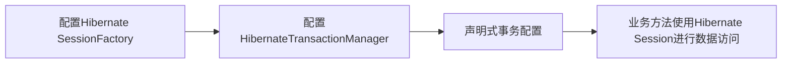

# 整合Spring和Hibernate事务管理

## 1. 背景介绍

### 1.1 事务管理的重要性

在企业级应用开发中,事务管理是一个非常重要的话题。事务是指一组操作要么全部执行成功,要么全部执行失败。这种原子性对于保证数据的一致性和完整性至关重要。在Java企业级开发中,事务管理通常由Spring框架和ORM(对象关系映射)框架如Hibernate来实现。

### 1.2 Spring与Hibernate的整合优势

Spring是一个功能强大的依赖注入框架,提供了全面的事务管理支持。Hibernate是一个流行的ORM框架,负责对象和关系数据库之间的映射。将Spring和Hibernate整合在一起,可以充分发挥两者的优势,实现灵活、高效、可靠的事务管理。

### 1.3 本文的目标和结构

本文将深入探讨如何整合Spring和Hibernate进行事务管理。我们将从事务管理的核心概念出发,详细讲解Spring事务管理和Hibernate事务管理的原理和使用方法。然后,我们将通过代码实例演示如何在实际项目中整合两者。最后,我们将讨论这种整合方案的应用场景、优势和挑战。

## 2. 核心概念与联系

### 2.1 事务的ACID特性

事务管理的目标是保证事务的ACID特性:

- 原子性(Atomicity):事务中的所有操作要么全部成功,要么全部失败。
- 一致性(Consistency):事务执行前后,数据必须保持一致的状态。
- 隔离性(Isolation):并发执行的事务之间不应互相干扰。
- 持久性(Durability):事务提交后,其结果应该被持久化到数据库中。

### 2.2 Spring的事务管理抽象

Spring提供了一个事务管理的抽象层,主要由以下几个核心接口组成:

- PlatformTransactionManager:事务管理器的顶层接口,定义了事务的提交、回滚等基本操作。
- TransactionDefinition:封装事务的定义信息,如传播行为、隔离级别、超时时间等。
- TransactionStatus:封装事务的运行状态,如是否是新事务、是否已完成等。

通过这些抽象接口,Spring可以与不同的底层事务实现(如JDBC、Hibernate、JPA等)进行整合,提供统一的事务管理方式。

### 2.3 Hibernate的事务管理

Hibernate提供了自己的事务管理机制,核心接口是Session。每个Session都与一个事务关联,可以通过Session的getTransaction()方法获取事务对象,然后调用commit()、rollback()等方法来管理事务。

### 2.4 Spring与Hibernate事务管理的整合

为了将Hibernate的事务管理集成到Spring中,Spring提供了HibernateTransactionManager类,它实现了PlatformTransactionManager接口,将Hibernate的Session和Transaction与Spring的事务抽象进行了适配。这样,我们就可以在Spring中使用声明式事务或编程式事务来管理Hibernate的事务了。

## 3. 核心原理和操作步骤

### 3.1 Spring事务管理的核心原理

Spring事务管理的核心原理是通过AOP(面向切面编程)来实现的。具体来说,就是在目标方法执行前后插入事务管理的逻辑,从而实现声明式事务。Spring的事务管理主要有以下几个步骤:

1. 在目标方法执行前,Spring会创建或加入一个事务,并将其绑定到当前线程。
2. 如果目标方法执行成功,Spring会在方法返回前提交事务。
3. 如果目标方法抛出异常,Spring会捕获异常,并根据异常类型决定是否回滚事务。
4. 在目标方法执行完毕后,Spring会释放事务资源,并解除事务与当前线程的绑定。

### 3.2 Hibernate事务管理的核心原理

Hibernate的事务管理是基于JDBC事务来实现的。当我们在Hibernate中开启一个事务时,实际上是在底层的JDBC Connection上开启了一个事务。Hibernate的Session对象会跟踪当前的事务状态,并在适当的时候提交或回滚事务。

### 3.3 整合Spring和Hibernate事务管理的步骤

要在Spring中整合Hibernate的事务管理,主要有以下几个步骤:

1. 配置Hibernate的SessionFactory,并将其注入到Spring容器中。
2. 配置HibernateTransactionManager,将SessionFactory注入到其中。
3. 在业务方法上添加@Transactional注解,或在XML配置文件中使用<tx:advice>声明事务属性。
4. 在业务方法中使用Hibernate的Session进行数据访问操作。

下面是一个简单的Mermaid流程图,展示了整合Spring和Hibernate事务管理的核心步骤:



## 4. 数学模型和公式详解

### 4.1 事务的隔离级别

事务的隔离级别决定了并发事务之间的相互影响程度。SQL标准定义了四种隔离级别:

1. 读未提交(Read Uncommitted):一个事务可以读取另一个未提交事务的修改。
2. 读已提交(Read Committed):一个事务只能读取另一个已提交事务的修改。
3. 可重复读(Repeatable Read):在同一个事务中,多次读取同一数据返回的结果是一致的。
4. 串行化(Serializable):事务串行执行,避免了并发事务的所有问题,但性能最低。

不同的隔离级别在并发性和一致性之间进行了不同的权衡。隔离级别越高,并发性能就越低,但数据一致性就越高。

### 4.2 事务的传播行为

事务的传播行为决定了如何处理方法调用链中的事务边界。Spring定义了7种传播行为:

1. REQUIRED:如果当前没有事务,就新建一个事务;如果已经存在一个事务,就加入到这个事务中。
2. SUPPORTS:如果当前已经存在一个事务,就加入到这个事务中;如果当前没有事务,就以非事务方式执行。
3. MANDATORY:如果当前已经存在一个事务,就加入到这个事务中;如果当前没有事务,就抛出异常。
4. REQUIRES_NEW:创建一个新的事务,如果当前存在事务,就把当前事务挂起。
5. NOT_SUPPORTED:以非事务方式执行,如果当前存在事务,就把当前事务挂起。
6. NEVER:以非事务方式执行,如果当前存在事务,则抛出异常。
7. NESTED:如果当前存在事务,则在嵌套事务内执行;如果当前没有事务,则执行与REQUIRED类似的操作。

### 4.3 Hibernate的缓存机制

Hibernate使用缓存来提高性能,减少对数据库的访问。Hibernate有两级缓存:

1. 一级缓存:也叫做Session缓存,它是默认开启的。每个Session都有自己的一级缓存,存储当前Session加载或修改过的对象。
2. 二级缓存:也叫做SessionFactory缓存,它是可选的。二级缓存是全局的,所有Session共享一个二级缓存。常用的二级缓存实现有EhCache、Redis等。

一级缓存的生命周期与Session相同,而二级缓存的生命周期与SessionFactory相同。在事务管理中,我们需要特别注意缓存与事务的一致性问题。

## 5. 项目实践:代码实例和详解

下面我们通过一个具体的代码实例,来演示如何在Spring中整合Hibernate的事务管理。

### 5.1 配置Hibernate的SessionFactory

首先,我们需要配置Hibernate的SessionFactory,并将其注入到Spring容器中:

```xml
<bean id="sessionFactory" class="org.springframework.orm.hibernate5.LocalSessionFactoryBean">
    <property name="dataSource" ref="dataSource"/>
    <property name="packagesToScan" value="com.example.entity"/>
    <property name="hibernateProperties">
        <props>
            <prop key="hibernate.dialect">org.hibernate.dialect.MySQL5Dialect</prop>
            <prop key="hibernate.show_sql">true</prop>
            <prop key="hibernate.hbm2ddl.auto">update</prop>
        </props>
    </property>
</bean>
```

这里我们配置了数据源、实体类所在的包、Hibernate方言等属性。

### 5.2 配置HibernateTransactionManager

然后,我们需要配置HibernateTransactionManager,将SessionFactory注入其中:

```xml
<bean id="transactionManager" class="org.springframework.orm.hibernate5.HibernateTransactionManager">
    <property name="sessionFactory" ref="sessionFactory"/>
</bean>
```

HibernateTransactionManager实现了Spring的PlatformTransactionManager接口,用于管理Hibernate的事务。

### 5.3 声明式事务配置

接下来,我们可以使用声明式事务来管理业务方法。最简单的方式是在方法上添加@Transactional注解:

```java
@Service
public class UserServiceImpl implements UserService {

    @Autowired
    private SessionFactory sessionFactory;

    @Override
    @Transactional
    public void saveUser(User user) {
        Session session = sessionFactory.getCurrentSession();
        session.save(user);
    }
}
```

这里的@Transactional注解表示saveUser方法需要在事务中执行。Spring会在方法执行前开启事务,在方法执行成功后提交事务,在方法抛出异常时回滚事务。

我们也可以在XML配置文件中使用<tx:advice>来声明事务属性:

```xml
<tx:advice id="txAdvice" transaction-manager="transactionManager">
    <tx:attributes>
        <tx:method name="save*" propagation="REQUIRED"/>
        <tx:method name="update*" propagation="REQUIRED"/>
        <tx:method name="delete*" propagation="REQUIRED"/>
        <tx:method name="get*" read-only="true"/>
        <tx:method name="*" propagation="SUPPORTS" read-only="true"/>
    </tx:attributes>
</tx:advice>

<aop:config>
    <aop:pointcut id="serviceOperation" expression="execution(* com.example.service.*.*(..))"/>
    <aop:advisor advice-ref="txAdvice" pointcut-ref="serviceOperation"/>
</aop:config>
```

这里我们定义了一个事务通知txAdvice,指定了不同方法的事务属性。然后使用AOP将这个事务通知应用到服务层的所有方法上。

### 5.4 在业务方法中使用Hibernate的Session

最后,我们可以在业务方法中使用Hibernate的Session进行数据访问操作:

```java
@Override
@Transactional
public User getUserById(Long id) {
    Session session = sessionFactory.getCurrentSession();
    return session.get(User.class, id);
}
```

在事务方法中,我们通过sessionFactory.getCurrentSession()获取当前的Session对象,然后调用Session的方法进行数据访问。Spring会确保在整个事务过程中,我们始终使用的是同一个Session对象。

## 6. 实际应用场景

Spring与Hibernate的事务管理整合广泛应用于各种企业级Java应用中,特别是那些需要高性能、高可靠性事务管理的系统,如:

1. 电商系统:订单管理、库存管理、支付流程等都需要事务支持。
2. 金融系统:账户管理、交易记录、风险控制等核心业务必须保证事务的ACID特性。
3. 物流系统:订单履约、库存同步、运输调度等环节需要事务来保证数据一致性。
4. 医疗系统:病历管理、药品管理、费用结算等关键流程需要事务来确保数据准确性。

总之,只要是需要保证数据一致性和完整性的业务场景,都可以使用Spring+Hibernate的事务管理方案。这种方案不仅功能强大,而且使用简单,开发人员无需关注底层的事务实现细节,只需专注于业务逻辑的开发即可。

## 7. 工具和资源推荐

要深入学习Spring与Hibernate的事务管理,以下是一些有用的工具和资源:

1. 官方文档:Spring的事务管理文档和Hibernate的事务管理文档是最权威的学习资源。
2. 书籍:《Spring实战》、《Hibernate实战》等经典书籍对事务管理有深入的讲解。
3. 教程:网上有很多优秀的Spring和Hibernate教程,如慕课网、尚硅谷等。
4. 开源项目:研究一些使用了Spring+Hibernate事务管理的开源项目,如Spring Pet Clinic、Spring Boot例子等,可以帮助我们快速上手。
5. 开发工具:使用IntelliJ IDEA、Eclipse等IDE可以方便地进行Spring和Hibernate的开发和调试。

## 8. 总结:未来发展