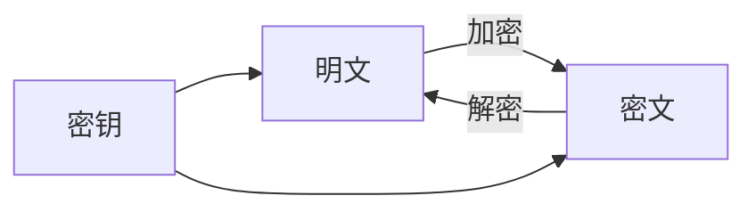

## 1.背景介绍

随着互联网的高速发展，大量的信息在网络中传播，如何保证信息的安全性，防止信息被非法窃取，已经成为了当前亟待解决的问题。文件加解密就是其中的一种有效方法。本文将详细介绍文件加解密系统的设计与实现。

## 2.核心概念与联系

在深入讲解之前，我们首先需要理解几个核心概念：

- **加密**：是指将明文（原始信息）按照一定的算法转换成密文的过程，其目的是为了防止非授权用户获取信息。

- **解密**：是指将密文按照同一算法转换回明文的过程，使得授权用户能够获取原始信息。

- **密钥**：在加密和解密过程中使用的一串特定的数据。密钥的安全性对整个加密解密过程的安全性至关重要。

- **对称加密**：加密和解密使用同一个密钥的加密算法。

- **非对称加密**：加密和解密使用不同密钥的加密算法，通常一个作为公开的公钥，另一个作为私有的私钥。

这些概念之间的联系可以通过下面的Mermaid流程图进行展示：



## 3.核心算法原理具体操作步骤

在文件加解密系统中，我们通常会使用到AES（高级加密标准）算法。AES算法是一种对称加密算法，它能够提供强大的安全性，同时也能够保证加密和解密的效率。

一个基本的AES加密过程包括以下步骤：

1. **密钥扩展**：对原始的密钥进行处理，生成一系列的轮密钥。

2. **初始轮**：使用轮密钥对明文进行一次初步加密。

3. **重复轮**：进行多次的加密处理，每一轮都会使用一个新的轮密钥。

4. **最终轮**：进行最后一次的加密处理，得到最终的密文。

在这个过程中，每一轮的加密处理都包括四个步骤：SubBytes（字节替换）、ShiftRows（行移位）、MixColumns（列混淆）和AddRoundKey（轮密钥加）。

解密过程与加密过程大致相反，只是每个步骤使用的是加密过程中对应步骤的逆操作。

## 4.数学模型和公式详细讲解举例说明

在AES算法中，我们使用的是有限域上的运算。有限域，也叫伽罗华域，是一种只有有限个元素的域。在AES中，我们使用的是$GF(2^8)$，也就是包含256个元素的有限域。

在有限域$GF(2^8)$上，我们可以定义加法和乘法运算。这两种运算都可以通过异或运算来实现，具体的公式如下：

- **加法**：$a + b = a \oplus b$

- **乘法**：$a \cdot b = a \odot b$

在AES算法中，我们还需要使用到一种叫做S盒的结构。S盒是一种非线性变换，它可以增加加密算法的安全性。S盒的构造过程包括两个步骤：找到元素的乘法逆元，然后进行仿射变换。

## 5.项目实践：代码实例和详细解释说明

下面我们来看一个简单的文件加解密的Python代码实例。在这个例子中，我们使用的是PyCrypto库，它提供了AES算法的实现。

```python
from Crypto.Cipher import AES
from Crypto.Util.Padding import pad, unpad
from Crypto.Random import get_random_bytes

# 加密函数
def encrypt_file(file_name, key):
    cipher = AES.new(key, AES.MODE_CBC)
    with open(file_name, 'rb') as f:
        data = f.read()
    ciphertext = cipher.encrypt(pad(data, AES.block_size))
    with open(file_name + '.enc', 'wb') as f:
        f.write(cipher.iv)
        f.write(ciphertext)

# 解密函数
def decrypt_file(file_name, key):
    with open(file_name, 'rb') as f:
        iv = f.read(16)
        ciphertext = f.read()
    cipher = AES.new(key, AES.MODE_CBC, iv=iv)
    data = unpad(cipher.decrypt(ciphertext), AES.block_size)
    with open(file_name.replace('.enc', ''), 'wb') as f:
        f.write(data)

# 生成一个随机的密钥
key = get_random_bytes(16)

# 对文件进行加密
encrypt_file('test.txt', key)

# 对文件进行解密
decrypt_file('test.txt.enc', key)
```

这段代码首先定义了一个加密函数和一个解密函数。在加密函数中，我们创建了一个新的AES加密器，然后读取文件的内容，对内容进行加密，最后将加密后的内容写入一个新的文件。解密函数的过程与此相反。

在主程序中，我们生成了一个随机的密钥，然后使用这个密钥对文件进行加密和解密。

## 6.实际应用场景

文件加解密系统在实际生活中有广泛的应用，例如：

- **云存储服务**：如Google Drive、Dropbox等，用户的文件在上传到云端之前，会先进行加密，保证数据在传输过程中的安全性。

- **电子邮件系统**：为了保护邮件内容的隐私，邮件在发送过程中会进行加密，只有收件人才能解密邮件。

- **即时通讯软件**：如WhatsApp、Signal等，用户的消息在发送过程中会进行加密，保证只有接收者才能查看消息内容。

## 7.工具和资源推荐

在进行文件加解密的开发过程中，有一些工具和资源是非常有用的：

- **PyCrypto**：这是一个Python的加密库，提供了多种加密算法的实现，包括AES、DES、RSA等。

- **OpenSSL**：这是一个强大的安全套接字层密码库，包含了丰富的加密工具。

- **Cryptography.io**：这是一个Python的加密库，提供了密码学的基本构造以及多种加密算法。

## 8.总结：未来发展趋势与挑战

随着量子计算的发展，传统的加密算法可能会面临被破解的风险。因此，未来的加密算法需要能够抵抗量子攻击。同时，随着云计算和大数据的发展，如何在保证数据安全的同时，实现数据的高效处理，也是未来需要解决的问题。

## 9.附录：常见问题与解答

1. **问：为什么需要文件加解密？**

答：文件加解密可以保护信息的安全，防止信息被非法窃取。特别是在互联网传输过程中，加密可以有效防止信息被窃取。

2. **问：什么是对称加密和非对称加密？**

答：对称加密是指加密和解密使用同一个密钥的加密算法，非对称加密是指加密和解密使用不同密钥的加密算法。通常，非对称加密的安全性更高，但是效率较低。

3. **问：AES算法的安全性如何？**

答：AES算法是目前广泛使用的一种加密算法，其安全性非常高。AES算法使用的密钥长度可以达到256位，即使使用目前最快的计算机，也需要上亿年的时间才能破解。

作者：禅与计算机程序设计艺术 / Zen and the Art of Computer Programming